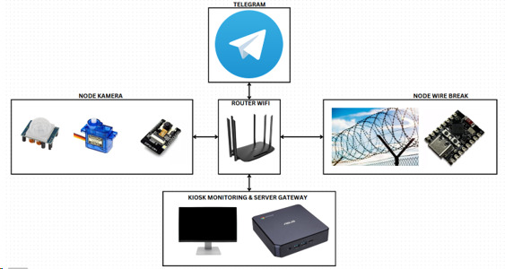
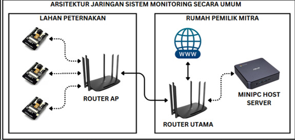
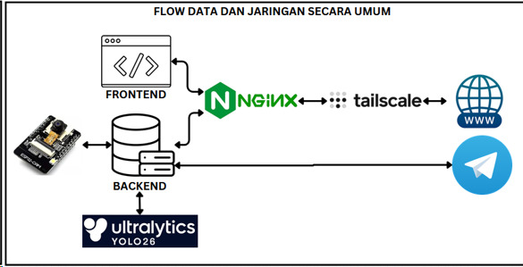
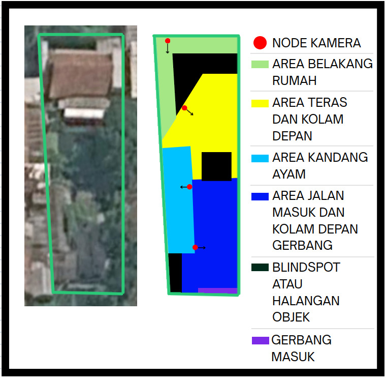
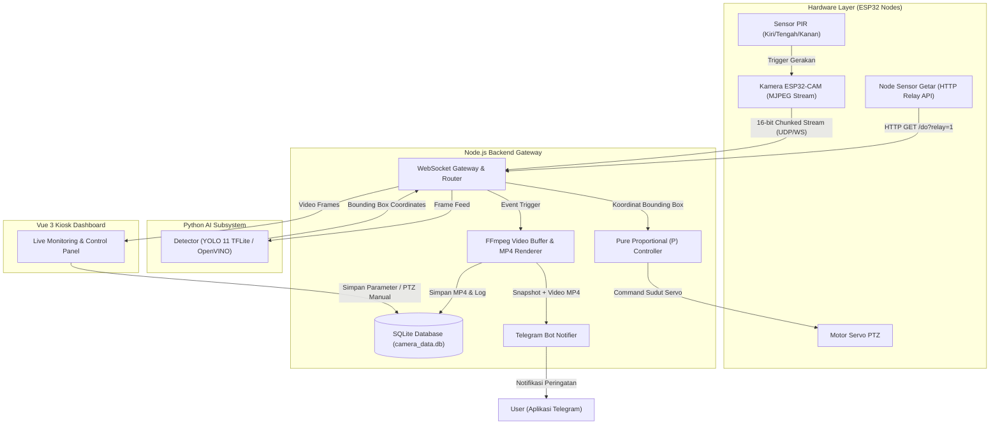
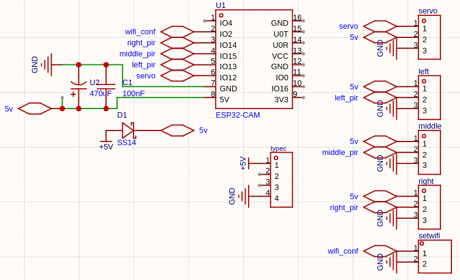
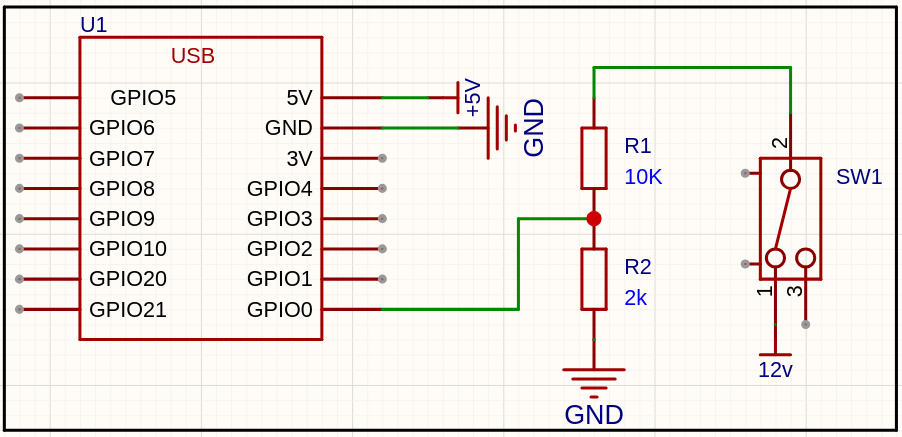
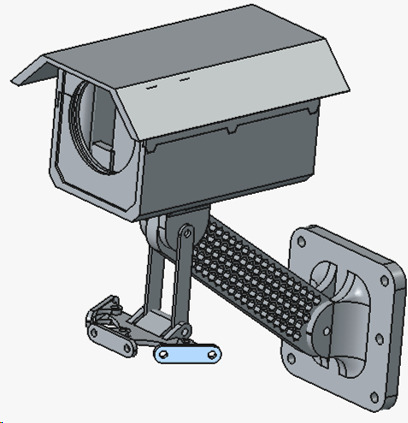

# Sistem Monitoring Keamanan & Bounding Box AI Berbasis ESP32-CAM & Sensor Getar

Sistem monitoring keamanan pintar berbasis IoT yang mengintegrasikan kamera **ESP32-CAM**, sensor gerak PIR multi-arah, **Node Sensor Getar (Vibration Sensor Node)** dengan kontrol relay HTTP, motor servo pemutar kamera otomatis, kecerdasan buatan (**AI YOLO 11**) untuk deteksi dan pelacakan manusia (*Object Tracking* berbasis *Proportional Controller*), penyimpanan terpusat **SQLite Database**, serta bot Telegram untuk notifikasi instan berupa foto snapshot dan rekaman video MP4 secara *real-time*.

---

## 📋 Daftar Isi
1. [Fitur Utama](#fitur-utama)
   * [Pelacakan Gerakan Otomatis (PIR)](#1-pelacakan-gerakan-otomatis-pir-triggered-servo-rotation)
   * [Node Sensor Getar & HTTP Relay API](#2-node-sensor-getar--http-relay-control-api)
   * [Deteksi Manusia YOLO 11 & P-Controller](#3-deteksi-manusia-yolo-11--pure-proportional-object-tracking)
   * [Mode Sapuan Servo (Sweep & Auto-Return)](#4-mode-sapuan-servo-servo-sweep--auto-return)
   * [Protokol Streaming Biner 16-Bit](#5-protokol-streaming-biner-16-bit--dynamic-chunking)
   * [Penyimpanan Terpusat SQLite Database](#6-penyimpanan-terpusat-sqlite-database-camera_datadb)
   * [Panel Kontrol Kiosk UI Modern](#7-panel-kontrol-kiosk-ui-modern)
   * [Integrasi Bot Telegram & Alert Log](#8-integrasi-bot-telegram--alert-log)
2. [Arsitektur Sistem](#arsitektur-sistem)
3. [Alur Kerja Deteksi Keamanan & Flowchart](#alur-kerja-deteksi-keamanan)
4. [Setup Hardware & Perkabelan](#setup-hardware-perkabelan)
5. [Panduan Instalasi Aplikasi (Server-Side)](#panduan-instalasi-aplikasi)
   * [Instalasi pada Linux (Ubuntu, Linux Mint, Debian)](#1-instalasi-pada-linux-ubuntu-linux-mint--debian-based)
   * [Instalasi pada Windows (Windows 10 / 11)](#2-instalasi-pada-windows-windows-10--11)
6. [Panduan Pengoperasian & Konfigurasi](#panduan-pengoperasian-konfigurasi)
7. [Demo & Tampilan Antarmuka](#demo-tampilan-antarmuka)

---

<a id="fitur-utama"></a>
## ⚡ Fitur Utama

### 1. Pelacakan Gerakan Otomatis (PIR-Triggered Servo Rotation)
* Menggunakan 3 sensor PIR (Kiri, Tengah, Kanan) pada ESP32-CAM untuk mendeteksi pergerakan di area sekitar secara presisi.
* Kamera berputar (menggunakan Motor Servo) mengarah ke posisi sensor PIR yang aktif, dengan pengiriman status WebSocket yang ditunda hingga gerakan servo selesai mencapai sudut target.

### 2. Node Sensor Getar & HTTP Relay Control API
* Mengintegrasikan node independen **Sensor Getar** (`vibration_sensor_client.ino`) berbasis ESP32/ESP8266.
* Menyediakan API HTTP Server pada Port 80 untuk mengontrol relay eksternal (`GET /do?relay=1` untuk ON dan `GET /do?relay=0` untuk OFF).
* Menggunakan pinout *Active-Low* (GND) untuk pemicuan relay yang aman dan stabil.

### 3. Deteksi Manusia YOLO 11 & Pure Proportional Object Tracking
* **Model YOLO 11 (`best.tflite`)**: Inferensi cepat dengan dukungan akelerasi **OpenVINO (Intel iGPU)** serta *fallback* CPU.
* **Pure Proportional (P) Controller**: Algoritma pelacakan objek di [objectFollower.js](file:///home/afandi/Desktop/projectTaGateway/backendAndTelegramBot/src/services/objectFollower.js) menggunakan pengontrol proporsional yang ringan, bebas *state*, dan *jitter-free* ($K_p = 45$, *deadband* $0.10$). Motor servo merespons posisi *bounding box* manusia secara halus untuk menjaga posisi subjek di tengah bidang pandang kamera.

### 4. Mode Sapuan Servo (Servo Sweep & Auto-Return)
* **Pilihan Mode Servo**: Mode *Sweep* (penyapuan berkala) atau *Auto-Return* (kembali ke sudut default).
* **Hitung Mundur Cerdas**: Penjadwalan hitung mundur ditampilkan di Kiosk UI (`nextTimerTime`). Sapuan otomatis ditangguhkan secara instan jika PIR atau AI mendeteksi manusia, dan berlanjut secara otomatis saat area kembali aman.
* Kecepatan sapuan diatur halus di firmware ESP32-CAM (250ms per derajat).

### 5. Protokol Streaming Biner 16-Bit & Dynamic Chunking
* Transmisi frame biner menggunakan paket header 16-bit Big-Endian (total 6 byte header + payload chunk).
* **Penyesuaian Chunk Dinamis**: ESP32-CAM mengevaluasi sinyal Wi-Fi (RSSI) secara *real-time*. Jika RSSI < -55dBm, ukuran paket chunk diturunkan secara otomatis dari 1024 byte menjadi 512 byte untuk mencegah kemacetan paket data.

### 6. Penyimpanan Terpusat SQLite Database (`camera_data.db`)
* Menggantikan file konfigurasi JSON lama dengan **SQLite Database** terintegrasi.
* Menyimpan profil konfigurasi hardware kamera/servo per alamat MAC (`device_configs`) dengan fitur *auto-migration schema* dan *fallback default values*, serta menyimpan riwayat log kejadian (*event log*).

### 7. Panel Kontrol Kiosk UI Modern
* Antarmuka web modern (Vue 3 + Tailwind CSS) dengan **Modal Pengaturan Bertab** (*Hardware Settings* dan *PTZ & Sweep Settings*).
* Penamaan kamera berbasis alamat MAC, pengukur FPS murni *client-side* (tersimpan di *LocalStorage*), indikator kesehatan *bandwidth*, dan kontainer video rasio 4:3 yang responsif untuk tampilan *mobile*.

### 8. Integrasi Bot Telegram & Alert Log
* Mengirimkan peringatan instan ke pengguna Telegram terautentikasi.
* Notifikasi memuat **Foto Snapshot Resolusi Tinggi (FHD)** berisikan *bounding box* hasil deteksi AI, beserta **Video MP4** rekaman kejadian yang di-render secara *asynchronous* menggunakan FFmpeg.

---

<a id="arsitektur-sistem"></a>
## 🏗 Arsitektur Sistem

Sistem ini terdiri dari komponen-komponen terintegrasi yang saling berkomunikasi melalui protokol jaringan berlatensi rendah:

```
+---------------------+         WebSocket (16-bit Chunks)        +----------------------+
|  ESP32-CAM Client   |----------------------------------------->|                      |
| (PIR 3x, Servo PTZ) |<-----------------------------------------|                      |
+---------------------+            Config & Commands             |    Node.js Server    |
                                                                 |    (Backend Gateway) |
+---------------------+           HTTP GET /do?relay=1/0         |                      |
| Node Sensor Getar   |----------------------------------------->|                      |
| (Relay Control API) |                                          +----------------------+
+---------------------+                                            |   ^            |
                                                      TCP Binary   |   |            | WebSocket
                                                      Frame Stream v   |            v & HTTP
                                                            +--------------+   +--------------------+
                                                            |  Python AI   |   | Vue 3 Kiosk UI     |
                                                            | (YOLO 11)    |   | Dashboard Frontend |
                                                            +--------------+   +--------------------+
                                                                                    |
                                                                                    v
                                                                          +--------------------+
                                                                          | SQLite Database    |
                                                                          | (camera_data.db)   |
                                                                          +--------------------+
```

### Visualisasi Arsitektur & Topologi Sistem

| Diagram Blok Keseluruhan | Desain Arsitektur Jaringan |
| :---: | :---: |
|  |  |
| *Gambar 3.16: Diagram Blok Keseluruhan Sistem* | *Gambar 3.17: Desain Arsitektur Jaringan* |

| Desain Aliran Data (Dataflow) | Denah Pantauan Kamera |
| :---: | :---: |
|  |  |
| *Gambar 3.18: Desain Aliran Data dan Integrasi Sistem* | *Gambar 3.10: Denah Pantauan Kamera* |

---

<a id="alur-kerja-deteksi-keamanan"></a>
## 🔄 Alur Kerja Deteksi Keamanan & Flowchart

### Flowchart Sistem Utama (Mermaid)



### Penjelasan Alur Kerja

1. **Deteksi Gerakan Awalan**:
   * Sensor PIR mendeteksi pergerakan di area Kiri, Tengah, atau Kanan $\rightarrow$ Servo memutar kamera ke sudut sensor terkait.
   * Atau **Node Sensor Getar** menerima getaran fisik $\rightarrow$ Memicu relai dan memancarkan request HTTP ke backend gateway.
2. **Pengiriman Stream & Inferensi AI**:
   * ESP32-CAM mengirimkan paket frame biner melalui protokol WebSocket 16-bit.
   * Backend Node.js meneruskan frame ke **Python AI Subsystem** (YOLO 11).
3. **Pelacakan Objek (Object Tracking)**:
   * Jika manusia terdeteksi, koordinat *bounding box* dikirim ke `objectFollower.js`.
   * **P-Controller** menghitung `deltaAngle = offset * Kp` dan menggerakkan servo untuk menjaga manusia tepat di tengah layar.
4. **Perekaman Video & Notifikasi Telegram**:
   * Backend mengumpulkan frame ke *rolling buffer*. Saat objek menghilang, FFmpeg me-render video MP4 secara *asynchronous*.
   * Notifikasi memuat foto snapshot resolusi tinggi dan rekaman MP4 dikirimkan ke Telegram pengguna serta dicatat pada database SQLite `camera_data.db`.

---

<a id="setup-hardware-perkabelan"></a>
## 🔌 Setup Hardware & Perkabelan

### 1. Pinout ESP32-CAM (AI-Thinker)
| Komponen | Pin Komponen | Pin ESP32-CAM | Deskripsi |
| :--- | :--- | :--- | :--- |
| **PIR Sensor (Kiri)** | OUT / Data | GPIO 13 | Input sinyal gerakan sisi kiri |
| **PIR Sensor (Tengah)** | OUT / Data | GPIO 15 | Input sinyal gerakan sisi tengah |
| **PIR Sensor (Kanan)** | OUT / Data | GPIO 14 | Input sinyal gerakan sisi kanan |
| **Motor Servo** | PWM / Control | GPIO 12 | Sinyal PWM pemutar motor servo |
| **Flash LED** | Onboard LED | GPIO 4 | Lampu sorot flash (Kontrol PWM/LEDC) |

### 2. Pinout Node Sensor Getar (Vibration Sensor Node)
| Komponen | Pin Komponen | Pin ESP32/ESP8266 | Deskripsi |
| :--- | :--- | :--- | :--- |
| **Sensor Getar** | OUT / Data | GPIO 4 (D2) | Sinyal input getaran |
| **Modul Relay** | IN / Signal | GPIO 1 (TX) | Kontrol relay active-low (`LOW` = ON, `HIGH` = OFF) |
| **HTTP API Server** | Port 80 | WebServer.h | Endpoint URL `/do?relay=1` atau `/do?relay=0` |

> [!IMPORTANT]
> **Power Supply Note**: Motor servo dan modul relay memerlukan arus yang stabil. Gunakan **Power Supply Eksternal 5V (Minimal 2A)**. Hubungkan jalur **GND Power Supply Eksternal** dengan **GND ESP32-CAM / Node Sensor** (*Common Ground*).

### 3. Konfigurasi Arduino IDE
1. Buka Arduino IDE dan buka file sketch:
   * Kamera: `camera_client_ws/camera_client_ws.ino` (atau `camera_client_ws_deploy.ino` untuk versi deploy tanpa log serial berlebihan).
   * Node Getar: `vibration_sensor_client/vibration_sensor_client.ino`.
2. Pengaturan Board untuk ESP32-CAM:
   * Board: **AI Thinker ESP32-CAM**
   * PSRAM: **Enabled** (Wajib aktif)
   * Partition Scheme: **Huge APP (3MB No OTA/1MB SPIFFS)**
3. Ubah kredensial Wi-Fi (`ssid` dan `password`) pada sketch.
4. *Compile* dan *Upload* program.

### 4. Skematik Rangkaian & Desain Hardware Node

| Skematik Node Kamera (ESP32-CAM) | Skematik Node Sensor Getar |
| :---: | :---: |
|  |  |
| *Gambar 3.1: Skematik Rangkaian Node Kamera (ESP32-CAM)* | *Gambar 3.9: Skematik Rangkaian Node Sensor Getar* |

<br>

| Desain Enclosure Weatherproof Node Kamera |
| :---: |
|  |
| *Gambar 3.2: Desain Enclosure Tahan Cuaca Node Kamera* |

### 5. Dokumentasi Fisik & Realisasi PCB Hardware

| Tampak Depan PCB Custom | Tampak Belakang PCB Custom |
| :---: | :---: |
|  |  |
| *Tampak Depan PCB Custom Node Kamera* | *Tampak Belakang PCB Custom Node Kamera* |

| Tampilan PCB Terpasang ESP32-CAM | Node Kamera Terpasang di Casing Enclosure |
| :---: | :---: |
|  |  |
| *Tampilan PCB Terpasang Modul ESP32-CAM* | *Node Kamera & PCB Terpasang di Casing Enclosure* |

<br>

| Instalasi Sensor Getaran di Pagar Area Lahan |
| :---: |
|  |
| *Tampak Instalasi Sensor Getaran pada Pagar Area Pemantauan* |

---

<a id="panduan-instalasi-aplikasi"></a>
## 💻 Panduan Instalasi Aplikasi (Server-Side)

Sistem ini mendukung pengoperasian pada lingkungan **Linux (Ubuntu, Linux Mint, Debian, & OS berbasis Debian/Ubuntu)** serta **Windows (10 / 11)**.

---

### 1. Instalasi pada Linux (Ubuntu, Linux Mint, & Debian-Based)

#### Langkah 1: Instalasi Paket Prasyarat Sistem
Buka Terminal dan jalankan perintah berikut untuk meng-install Node.js, Python, FFmpeg, dan Git:

```bash
# Update paket repository
sudo apt update && sudo apt upgrade -y

# Install Git, Curl, FFmpeg, dan Python3
sudo apt install -y git curl ffmpeg python3 python3-pip python3-venv

# Install Node.js (v18.x LTS via NodeSource)
curl -fsSL https://deb.nodesource.com/setup_18.x | sudo -E bash -
sudo apt install -y nodejs

# Verifikasi instalasi
node -v
npm -v
python3 --version
ffmpeg -version
```

#### Langkah 2: Kloning Repositori
```bash
git clone https://github.com/afandihrp/Sistem-Monitoring-Lahan-berbasis-ESP32CAM-relatif-murah.git
cd projectTaGateway
```

#### Langkah 3: Setup Node.js Backend & Bot Telegram
```bash
cd backendAndTelegramBot
npm install

# Buat file .env di folder backendAndTelegramBot/
echo "TELEGRAM_BOT_TOKEN=8105737525:AAH..." > .env
echo "TELEGRAM_AUTH_PASSWORD=password_anda" >> .env

# Jalankan Backend Server
npm run dev
```
*(Backend beroperasi pada port 3000 dan secara otomatis menginisialisasi SQLite database `camera_data.db`)*

#### Langkah 4: Setup Python AI Detector (YOLO 11)
Buka tab/jendela Terminal baru:
```bash
cd projectTaGateway/human_detection
python3 -m venv pc_env
source pc_env/bin/activate
pip install -r requirements.txt

# Pastikan file model YOLO 11 'best.tflite' ada di folder ini, lalu jalankan:
./start.sh
```

#### Langkah 5: Setup Vue 3 Kiosk UI (Frontend)
Buka tab/jendela Terminal baru:
```bash
cd projectTaGateway/cameraKiosk
npm install
npm run dev
```
*(Akses dasbor melalui browser di `http://localhost:5173`)*

#### Langkah 6: Setup Nginx Reverse Proxy (Opsional / Direkomendasikan)
Menggunakan konfigurasi [nginx.conf](file:///home/afandi/Desktop/projectTaGateway/nginx.conf) untuk memetakan Kiosk UI (Port 5173) dan WebSocket API Backend (Port 3000) di bawah Port HTTP standar (Port 80):

```bash
# Install Nginx
sudo apt install -y nginx

# Menyalin file nginx.conf dari repositori proyek
sudo cp projectTaGateway/nginx.conf /etc/nginx/sites-available/projectTaGateway.conf

# Mengaktifkan situs & menghapus situs default (opsional)
sudo ln -s /etc/nginx/sites-available/projectTaGateway.conf /etc/nginx/sites-enabled/
sudo rm -f /etc/nginx/sites-enabled/default

# Uji konfigurasi & restart Nginx
sudo nginx -t
sudo systemctl restart nginx
```
*(Aplikasi kini dapat diakses langsung via browser di `http://localhost` tanpa perlu mengetik nomor port)*

---

### 2. Instalasi pada Windows (Windows 10 / 11)

#### Langkah 1: Instalasi Prasyarat Sistem
1. **Node.js**: Unduh installer **Node.js LTS (v18 atau v20)** dari [nodejs.org](https://nodejs.org/) dan jalankan instalasi.
2. **Python**: Unduh installer **Python 3.9+** dari [python.org](https://www.python.org/).
   * ⚠️ **PENTING**: Centang opsi **"Add python.exe to PATH"** sebelum menekan tombol *Install Now*.
3. **Git**: Unduh installer **Git for Windows** dari [git-scm.com](https://git-scm.com/).
4. **FFmpeg**:
   * **Via Winget (Command Prompt)**: Buka cmd sebagai Administrator dan jalankan `winget install FFmpeg`.
   * **Via Manual**: Unduh *build zip* dari [gyan.dev/ffmpeg/builds/](https://www.gyan.dev/ffmpeg/builds/), ekstrak, dan tambahkan direktori `bin` ke Environment Variables `PATH`.

#### Langkah 2: Kloning Repositori
Buka Command Prompt (cmd) atau PowerShell:
```cmd
git clone https://github.com/afandihrp/Sistem-Monitoring-Lahan-berbasis-ESP32CAM-relatif-murah.git
cd projectTaGateway
```

#### Langkah 3: Setup Node.js Backend & Bot Telegram
```cmd
cd backendAndTelegramBot
npm install

:: Buat file .env
echo TELEGRAM_BOT_TOKEN=8105737525:AAH... > .env
echo TELEGRAM_AUTH_PASSWORD=password_anda >> .env

:: Jalankan Backend Server
npm run dev
```

#### Langkah 4: Setup Python AI Detector (YOLO 11)
Buka jendela Command Prompt (cmd) baru:
```cmd
cd projectTaGateway\human_detection
python -m venv pc_env
pc_env\Scripts\activate
pip install -r requirements.txt

:: Jalankan Server AI Detector pada Windows
python app.py
```

#### Langkah 5: Setup Vue 3 Kiosk UI (Frontend)
Buka jendela Command Prompt (cmd) baru:
```cmd
cd projectTaGateway\cameraKiosk
npm install
npm run dev
```
*(Akses dasbor melalui browser di `http://localhost:5173`)*

#### Langkah 6: Setup Nginx Reverse Proxy (Opsional / Direkomendasikan)
1. Unduh **Nginx for Windows** zip dari [nginx.org/en/download.html](https://nginx.org/en/download.html) dan ekstrak (misalnya ke `C:\nginx`).
2. Salin file `nginx.conf` dari folder proyek `projectTaGateway\nginx.conf` dan timpa (*overwrite*) file `C:\nginx\conf\nginx.conf`.
3. Jalankan Nginx via Command Prompt (cmd):
   ```cmd
   cd C:\nginx
   start nginx
   ```
4. Perintah pengelolaan Nginx di Windows (cmd):
   ```cmd
   :: Reload konfigurasi Nginx setelah perubahan
   nginx -s reload

   :: Mematikan Nginx
   nginx -s stop
   ```
*(Aplikasi kini dapat diakses langsung via browser di `http://localhost` tanpa perlu mengetik nomor port)*

---

<a id="panduan-pengoperasian-konfigurasi"></a>
## ⚙️ Panduan Pengoperasian & Konfigurasi

### 1. Modal Pengaturan Kamera & Servo (Kiosk UI)
* Klik ikon **Settings** di atas layar feed streaming untuk membuka modal pengaturan terpadu.
* **Tab Hardware**: Mengatur Brightness, Contrast, Saturation, AWB, AEC, Special Effects, serta penamaan kamera berbasis MAC address.
* **Tab PTZ & Sweep**: 
  * Mode Servo: Pilih antara **Sweep Mode** (sapuan otomatis) atau **Auto Return Mode**.
  * Servo Timer: Pilih interval waktu (misal 15s, 30s, atau Off).
  * Default Servo Angle: Menentukan sudut diam standar kamera (misal 90°).

### 2. Pengujian Relay Node Sensor Getar
* Gunakan file pengujian REST Client `vibration_sensor_client/test.rest` atau perintah `curl` untuk menguji relay:
  ```bash
  # Menyalahkan Relay (ON)
  curl "http://<IP_NODE_GETAR>/do?relay=1"

  # Mematikan Relay (OFF)
  curl "http://<IP_NODE_GETAR>/do?relay=0"
  ```

---

<a id="demo-tampilan-antarmuka"></a>
## 📸 Demo & Tampilan Antarmuka

### 1. Antarmuka Kiosk UI & Dashboard Pemantauan

| Halaman Login Kiosk UI |
| :---: |
|  |
| *Halaman Autentikasi Pengguna (Login Page)* |

| Dashboard Pemantauan Desktop (Desktop View) | Dashboard Pemantauan Mobile (Mobile View) |
| :---: | :---: |
|  |  |
| *Dashboard Pemantauan Utama Kiosk UI (Desktop View)* | *Dashboard Pemantauan Utama Kiosk UI (Mobile View)* |

### 2. Deteksi Manusia AI & Bounding Box Overlay

| Hasil Snapshot Deteksi Manusia dengan Bounding Box (YOLO 11) |
| :---: |
|  |
| *Hasil Snapshot Foto Resolusi Tinggi dengan Overlay Bounding Box Merah Tipis (1px) Hasil Inferensi YOLO 11* |
