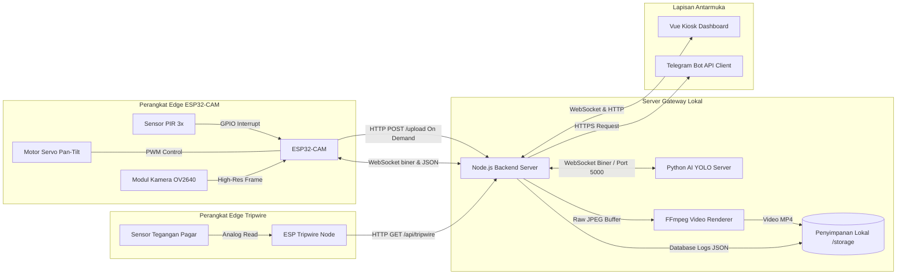
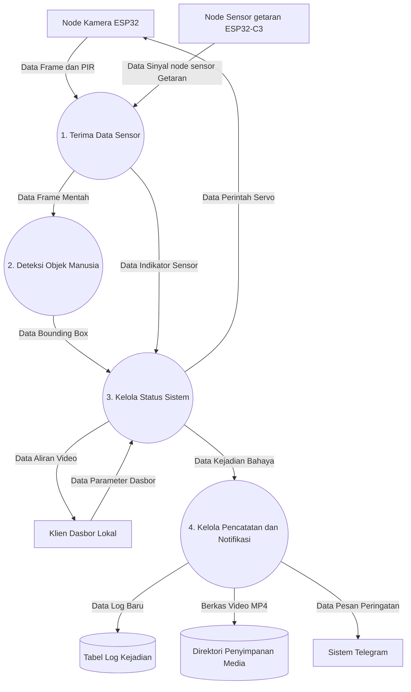
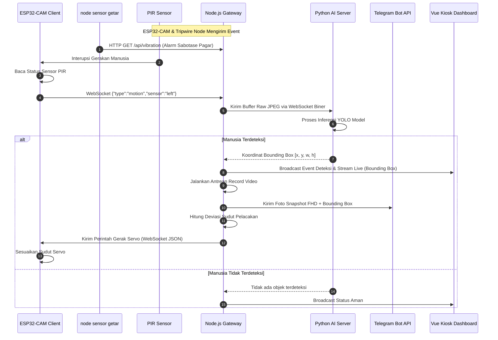
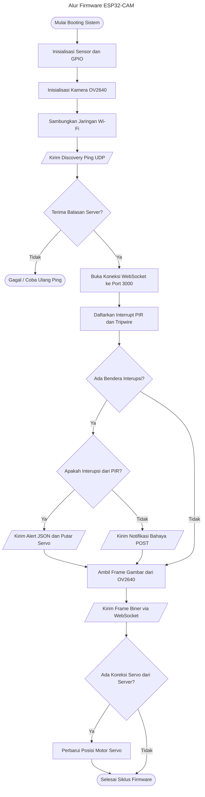
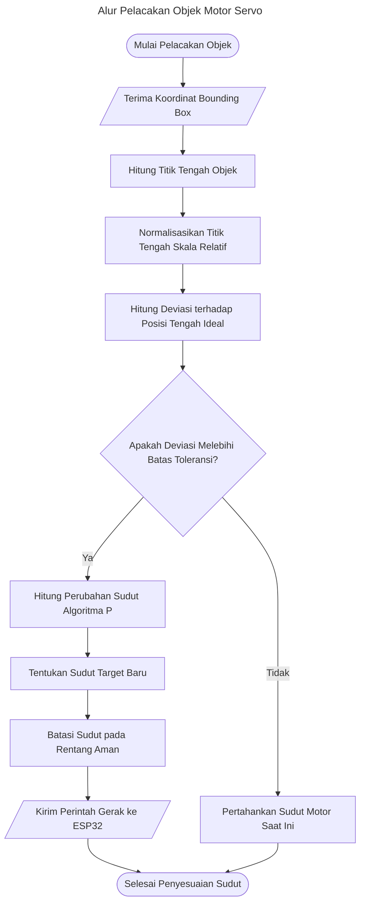
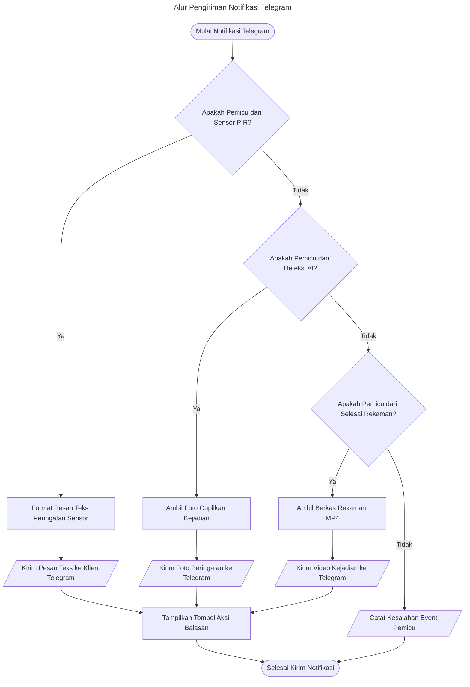

BUKU CAPSTONE DESIGN

<figure>

<figcaption aria-hidden="true">A picture containing text, clipart,
tableware, plate Description automatically generated</figcaption>
</figure>

**SISTEM KEAMANAN PETERNAKAN AYAM BERBIAYA RENDAH BERBASIS ESP32**

Oleh :

**Muhammad Afandi Harahap/1103223023**

**Muhammad Harits/1103223159**

**Bayu Setyo Prajuritno/1103223229**

**PRODI S1 TEKNIK KOMPUTER**

**FAKULTAS TEKNIK ELEKTRO**

**UNIVERSITAS TELKOM**

**BANDUNG**

**2025**

**Lembar Pengesahan Dokumen**

| Judul Capstone Design  | :  | Sistem Keamanan Peternakan Ayam Berbiaya Rendah Berbasis Esp32 |
|:---|:---|:---|
| Jenis Dokumen  | :  | Buku Capstone Design |
| Nomor Dokumen  | :  | FTE-CD-GAB  |
| Nomor Revisi  | :  |  |
| Tanggal Pengesahan  | :  |  |
| Fakultas  | :  | Fakultas Teknik Elektro  |
| Program Studi  | :  | S1 Teknik Komputer |
| Jumlah Halaman  | :  |  |

<table style="width:99%;">
<colgroup>
<col style="width: 9%" />
<col style="width: 9%" />
<col style="width: 10%" />
<col style="width: 9%" />
<col style="width: 60%" />
</colgroup>
<thead>
<tr>
<th colspan="5" style="text-align: left;">Data Pemeriksaan dan
Persetujuan</th>
</tr>
</thead>
<tbody>
<tr>
<td rowspan="6" style="text-align: left;">Ditulis Oleh</td>
<td style="text-align: left;">Nama</td>
<td style="text-align: left;">: Muhammad Afandi Harahap</td>
<td style="text-align: left;">Jabatan</td>
<td style="text-align: left;">: Mahasiswa</td>
</tr>
<tr>
<td style="text-align: left;">NIM</td>
<td style="text-align: left;">:  1103223023</td>
<td style="text-align: left;">Tanda Tangan</td>
<td style="text-align: left;"> </td>
</tr>
<tr>
<td style="text-align: left;">Nama</td>
<td style="text-align: left;">: Muhammad Harits</td>
<td style="text-align: left;">Jabatan</td>
<td style="text-align: left;">: Mahasiswa</td>
</tr>
<tr>
<td style="text-align: left;">NIM</td>
<td style="text-align: left;">: 1103223159</td>
<td style="text-align: left;">Tanda Tangan</td>
<td style="text-align: left;"> </td>
</tr>
<tr>
<td style="text-align: left;">Nama</td>
<td style="text-align: left;">: Bayu Setyo Prajuritno</td>
<td style="text-align: left;">Jabatan</td>
<td style="text-align: left;">: Mahasiswa</td>
</tr>
<tr>
<td style="text-align: left;">NIM</td>
<td style="text-align: left;">: 1103223229</td>
<td style="text-align: left;">Tanda Tangan</td>
<td style="text-align: left;"> </td>
</tr>
<tr>
<td rowspan="4" style="text-align: left;">Disetujui Oleh</td>
<td style="text-align: left;">Nama</td>
<td style="text-align: left;">:  Ir. Burhanuddin Dirgantoro, M.T.</td>
<td style="text-align: left;">Jabatan</td>
<td style="text-align: left;">: Pembimbing 1</td>
</tr>
<tr>
<td style="text-align: left;">Tanggal</td>
<td style="text-align: left;">:</td>
<td style="text-align: left;">Tanda Tangan</td>
<td style="text-align: left;"></td>
</tr>
<tr>
<td style="text-align: left;">Nama</td>
<td style="text-align: left;">: Muhammad Faris Ruriawan, S.T., M.T.</td>
<td style="text-align: left;">Jabatan</td>
<td style="text-align: left;">: Pembimbing 2</td>
</tr>
<tr>
<td style="text-align: left;">Tanggal</td>
<td style="text-align: left;">:</td>
<td style="text-align: left;">Tanda Tangan</td>
<td style="text-align: left;"></td>
</tr>
</tbody>
</table>

**\
Timeline Revisi Dokumen**

<table style="width:98%;">
<colgroup>
<col style="width: 15%" />
<col style="width: 30%" />
<col style="width: 31%" />
<col style="width: 21%" />
</colgroup>
<thead>
<tr>
<th style="text-align: left;"><strong>Versi, Tanggal</strong></th>
<th style="text-align: left;"><strong>Revisi</strong></th>
<th><strong>Perbaikan yang dilakukan</strong></th>
<th style="text-align: left;"><strong>Halaman Revisi</strong></th>
</tr>
</thead>
<tbody>
<tr>
<td style="text-align: left;">22 September 2025</td>
<td style="text-align: left;">Pengenalan terhadap topik</td>
<td><ol type="1">
<li><p>Pembahasan teknis tentang lokasi mitra</p></li>
<li><p>Identifikasi batasan batasan yang berlaku</p></li>
<li><p>Menyelaraskan pemahaman mengenai masalah yang dihadapi dan
menghilangkan asumsi</p></li>
</ol></td>
<td style="text-align: left;">1,2,3</td>
</tr>
<tr>
<td style="text-align: left;">1 Oktober 2025</td>
<td style="text-align: left;">Analisa Masalah</td>
<td><ol type="1">
<li><p>Penjabaran aspek permasalahan dijabarkan lebih
menyeluruh</p></li>
<li><p>Penambahan gambar denah kasar lahan</p></li>
<li><p>Penambahan gambar kondisi geologis lahan</p></li>
</ol></td>
<td style="text-align: left;"><p>3,4,5,6,7,8,9,</p>
<p>10</p></td>
</tr>
<tr>
<td style="text-align: left;">10 Oktober 2025</td>
<td style="text-align: left;">Keseluruhan</td>
<td><ol type="1">
<li><p>Penjabaran Analisa solusi yang sudah ada dengan beberapa metrik
yang relevan</p></li>
<li><p>Melengkapi beberapa bagian yang kurang bukti ilmiah atau
penelitian</p></li>
<li><p>Menambah penjabaran tentang dampaknya pada aspek sosial pada
Analisa masalah</p></li>
</ol></td>
<td style="text-align: left;">10,11,12,13</td>
</tr>
<tr>
<td style="text-align: left;">14 Oktober 2025</td>
<td style="text-align: left;">Perbaikan Penulisan dan Penyesuaian dengan
Format</td>
<td><ol type="1">
<li><p>Perbaikan margin dokumen</p></li>
<li><p>Perbanyak referensi untuk setiap aspek permasalahan</p></li>
<li><p>Daftar Pustaka untuk harga tidak perlu menggunakan referensi dari
<em>e-commerce</em>, melainkan dari website resmi</p></li>
<li><p>Google maps tidak perlu dijadikan referensi latar tempat
penelitian / observasi permasalahan</p></li>
<li><p>Perbanyak referensi jurnal untuk permasalahan</p></li>
</ol></td>
<td style="text-align: left;">14, 15</td>
</tr>
<tr>
<td style="text-align: left;">11 November 2025</td>
<td style="text-align: left;">Metode Verifikasi</td>
<td>Menambah variasi metode pengujian yang menyesuaikan dengan kondisi
lapangan</td>
<td style="text-align: left;">10, 11, 12, 13, 14, 15, 16, 17, 18,
19</td>
</tr>
<tr>
<td style="text-align: left;">14 November 2025</td>
<td style="text-align: left;">Dasar Spesifikasi, Pengukuran/Verifikasi
Spesifikasi</td>
<td><ol type="1">
<li><p>Penjelasan mendalam pada bagian dasar spesifikasi</p></li>
<li><p>Perbaikan Tabel</p></li>
<li><p>Penjelasan teori nilai persentase kategori</p></li>
</ol>
<p>Penjelasan lebih mendalam mengenai pertimbangan lapangan dan
biaya</p></td>
<td style="text-align: left;">3, 10, 11, 12, 13, 14, 15, 16, 17, 18, 19,
20</td>
</tr>
<tr>
<td style="text-align: left;">18 November 2025</td>
<td style="text-align: left;">Dasar Spesifikasi, Metode Verifikasi,
Daftar Pustaka</td>
<td><ol type="1">
<li><p>Perbaikan dan penjelasan pada persentase metode
verifikasi</p></li>
<li><p>Penambahan judul tabel</p></li>
<li><p>Melampirkan transkip wawancara pada daftar pustaka</p></li>
</ol>
<p>Penambahan riwayat wawancara sebagai daftar pustaka dan dasar
penentuan spesifikasi</p></td>
<td style="text-align: left;">2, 6, 7, 8, 10, 11, 12, 13, 14, 15, 16,
17, 18, 19, 21</td>
</tr>
<tr>
<td style="text-align: left;">20 Desember 2025</td>
<td style="text-align: left;">Desain Solusi Terpilih</td>
<td><ol type="1">
<li><p>wire break menggunakan sensor acs712 saja.</p></li>
<li><p>Protokol komunikasi dapat menggunakan rest api,</p></li>
</ol>
<p>Penambahan desain pcb, protocol, dan workflow diagram
terbaru.</p></td>
<td style="text-align: left;">12, 13, 14, 20, 21, 23</td>
</tr>
<tr>
<td style="text-align: left;">22 Desember 2025</td>
<td style="text-align: left;">Kelengkapan Penjabaran Sistem</td>
<td><ol type="1">
<li><p>Melengkapi diagram seperti sequence diagram, data flow diagram,
memperbaiki flowchart.</p></li>
<li><p>Memperbaiki format penomoran tabel dan gambar.</p></li>
<li><p>Memperbaiki kesimpulan agar lebih padat</p></li>
</ol></td>
<td style="text-align: left;">5, 6, 8, 9, 10, 11, 12, 13, 17, 18, 20,
21, 22, 23, 24, 25, 26, 27, 28, 29, 30, 33</td>
</tr>
<tr>
<td style="text-align: left;"></td>
<td style="text-align: left;"></td>
<td></td>
<td style="text-align: left;"></td>
</tr>
<tr>
<td style="text-align: left;"></td>
<td style="text-align: left;"></td>
<td></td>
<td style="text-align: left;"></td>
</tr>
<tr>
<td style="text-align: left;"></td>
<td style="text-align: left;"></td>
<td></td>
<td style="text-align: left;"></td>
</tr>
<tr>
<td style="text-align: left;"></td>
<td style="text-align: left;"></td>
<td></td>
<td style="text-align: left;"></td>
</tr>
<tr>
<td style="text-align: left;"></td>
<td style="text-align: left;"></td>
<td></td>
<td style="text-align: left;"></td>
</tr>
<tr>
<td style="text-align: left;"></td>
<td style="text-align: left;"></td>
<td></td>
<td style="text-align: left;"></td>
</tr>
<tr>
<td style="text-align: left;"></td>
<td style="text-align: left;"></td>
<td></td>
<td style="text-align: left;"></td>
</tr>
<tr>
<td style="text-align: left;"></td>
<td style="text-align: left;"></td>
<td></td>
<td style="text-align: left;"></td>
</tr>
<tr>
<td style="text-align: left;"></td>
<td style="text-align: left;"></td>
<td></td>
<td style="text-align: left;"></td>
</tr>
</tbody>
</table>

\*\*\*\*

**DAFTAR TABEL**

\*\*\*\*

**DAFTAR GAMBAR**

# BAB I PENDAHULUAN

## 1.1 Deskripsi Umum Masalah dan Kebutuhan

Sistem monitoring pada sektor pertanian dan peternakan berperan penting dalam mendeteksi dini indikasi pencurian atau intrusi liar, sehingga pemilik lahan dapat merespons ancaman lebih cepat dan berpotensi menekan risiko kerugian finansial. Perlu ditegaskan bahwa fungsi utama sistem semacam ini bersifat **detektif** (mendeteksi dan memberi peringatan dini), bukan preventif dalam arti menghalangi pelaku secara fisik; kecepatan deteksi dan respons yang dihasilkanlah yang menjadi nilai tambah utamanya. Saat ini, solusi pengawasan yang umum diterapkan didominasi oleh perangkat CCTV (*Closed-Circuit Television*) berbasis IoT (*Internet of Things*) komersial. Namun, efektivitas operasional sistem ini sering terganggu oleh tingginya frekuensi alarm palsu (*false positive*), karena algoritma bawaan umumnya belum mampu membedakan secara presisi antara intrusi nyata dengan gangguan lingkungan alami seperti pergerakan dedaunan, perubahan intensitas cahaya, atau aktivitas hewan ternak di sekitar lahan.

Sebagai alternatif, terdapat tren pengembangan sistem pemantauan kustom yang mengintegrasikan kamera, unit pemroses lokal, dan algoritma deteksi objek berbasis AI seperti YOLO (*You Only Look Once*). Pendekatan ini pernah diterapkan secara langsung pada lahan mitra oleh tim capstone sebelumnya, menggunakan konfigurasi Raspberry Pi 4 sebagai unit pemroses, webcam sebagai node kamera, dan layanan VPS (*Virtual Private Server*) berbasis *cloud* untuk inferensi deteksi manusia. Sistem tersebut telah dioperasikan selama **[ISI: durasi pemakaian, misal "kurang lebih 8 bulan"]**. Setelah periode tersebut, mitra mulai keberatan menanggung biaya langganan VPS bulanan sebesar **[ISI: nominal biaya VPS per bulan, misal "Rp150.000–Rp300.000"]**, karena dianggap sebagai beban operasional (*OPEX*) yang tidak sebanding dengan skala usaha UMKM. Keluhan mitra inilah yang menjadi titik tolak permasalahan: bagaimana merancang sistem monitoring yang mempertahankan kemampuan deteksi AI, namun menghilangkan ketergantungan pada biaya komputasi *cloud* berulang.

Kelemahan lain dari pendekatan berbasis *cloud* adalah rendahnya rasio efisiensi antara biaya investasi dengan luas cakupan pemantauan. Mengingat lahan agraris memiliki karakteristik area terbuka yang sangat luas, penggunaan kamera bersudut pandang statis memaksa pengguna melipatgandakan jumlah perangkat demi memperoleh cakupan pengawasan yang komprehensif, sehingga biaya pengadaan membengkak secara eksponensial. Ditambah lagi, ketergantungan pada *streaming* video ke server eksternal membutuhkan *bandwidth* internet besar yang menjadi kendala kritis bagi wilayah rural dengan jaringan telekomunikasi fluktuatif, membuat operasional sistem menjadi tidak andal (*unreliable*).

Permasalahan ini semakin relevan apabila dikaitkan dengan tingginya angka kriminalitas di sektor properti dan aset produksi. Berdasarkan data Pemerintah Provinsi Jawa Barat tahun 2019–2021, sebanyak 14 dari 19 kabupaten/kota tercatat mengalami kasus pencurian, dengan total 9.452 desa terdampak dalam kurun tiga tahun [1][2].

<figure>

<figcaption>Gambar 1.1.1 Grafik Kasus Pencurian Tahun 2019–2021</figcaption>
</figure>

Pencurian termasuk dalam permasalahan umum yang sering dialami dalam usaha peternakan [3]. Kehilangan aset biologis (ayam) maupun produk (telur) secara langsung mengurangi *output* produksi dan menurunkan pendapatan. Selain itu, aksi pencurian seringkali disertai perusakan fasilitas kandang, yang mengakibatkan proses produksi terhambat dan memunculkan biaya tambahan untuk perbaikan. Di samping itu, gangguan dari hama seperti ular, kucing liar, anjing liar, dan tikus juga berkontribusi pada berkurangnya aset biologis atau produk peternakan [3][4]. Tanpa adanya sistem *monitoring* yang andal, kerugian finansial dan psikologis bagi pemilik lahan akan terus berulang.

Kebutuhan ini semakin spesifik pada studi kasus peternakan ayam milik mitra, yang memiliki pagar utama sepanjang 35 meter dan area titik buta berbentuk "L" seluas 3×10 m dan 4×10 m. Secara topografi dan infrastruktur, terdapat pemisahan lokasi yang signifikan antara aset produksi dan tempat tinggal mitra. Kandang peternakan dan lahan terbuka berada pada jarak sekitar 100 meter dari rumah mitra. Di area peternakan telah tersedia infrastruktur jaringan eksisting berupa router yang terhubung langsung ke rumah mitra menggunakan kabel *fiber optik*. Rumah mitra akan dijadikan sebagai pos komando pusat yang menaungi PC Server untuk komputasi AI dan *Kiosk Monitor* untuk pemantauan pasif. Sayangnya, sistem kustom generasi sebelumnya gagal memanfaatkan *backbone fiber optik* lokal ini secara optimal; sistem tersebut justru memaksa seluruh *streaming* video dari router peternakan keluar ke internet publik menuju VPS *cloud*, yang tidak hanya memboroskan *bandwidth* tetapi juga memicu biaya langganan yang sebenarnya bisa dihindari jika komputasi dipusatkan secara lokal di PC Server rumah mitra.

Berdasarkan keterangan dari pemilik lahan, dibutuhkan sistem yang mampu:
1. Memberikan notifikasi visual (foto) secara *real-time* melalui aplikasi pesan instan (Telegram) sebagai sistem peringatan dini asinkron yang selalu aktif dengan konsumsi *bandwidth* minimal.
2. Menyediakan antarmuka pemantauan terpusat berbasis web (*Kiosk Monitor*) yang mendukung mode lokal (LAN) untuk pemantauan pasif 24/7 di pos rumah mitra tanpa membebani internet.
3. Mendukung akses jarak jauh (WAN) melalui internet secara *on-demand* (hanya saat dibutuhkan) melalui peramban web *mobile*, dengan syarat PC Server dalam keadaan menyala.
4. Beroperasi secara mandiri dengan memindahkan beban komputasi AI ke infrastruktur lokal, sehingga menghilangkan biaya operasional (*OPEX*) berlangganan *cloud*.

Permasalahan ini memenuhi kriteria *Complex Engineering Problem* (CEP) pada beberapa aspek berikut:

**Tabel 1.1 Kompleksitas Permasalahan**

| No | Kriteria Kompleksitas | Penjelasan |
|:---|:---|:---|
| 1 | Penyelesaian permasalahan memerlukan pengetahuan keteknikan yang mendalam. | Solusi yang dibutuhkan memerlukan integrasi pengetahuan di bidang sistem tertanam (ESP32-CAM), komunikasi nirkabel (Intranet Lokal), rekayasa perangkat lunak (*Backend Server*), dan implementasi *Machine Learning* (YOLO) untuk deteksi objek secara *real-time*. |
| 2 | Permasalahan melibatkan isu-isu yang luas, saling bersinggungan, dan melibatkan masalah non-teknis. | Masalah ini tidak hanya bersifat teknis, tetapi juga sangat terikat dengan aspek ekonomi (kebutuhan OPEX nol/biaya rendah), aspek fungsional (keandalan pada konektivitas internet terbatas), dan aspek keamanan (akurasi deteksi dan minimalisasi *alarm palsu*). |
| 3 | Permasalahan tersebut jarang ditemui pada skala industri besar, namun krusial bagi UMKM. | Optimasi biaya komputasi AI pada infrastruktur jaringan yang tidak stabil jarang menjadi prioritas pada skala industri besar yang memiliki *budget* IT tak terbatas. Namun, pada skala UMKM di area rural, setiap rupiah biaya operasional sangat diperhitungkan, menuntut adanya rekayasa arsitektur sistem yang inovatif untuk memisahkan beban komputasi dan beban akuisisi data secara efisien. |
| 4 | Permasalahan melibatkan pemangku kepentingan yang beragam dengan berbagai kebutuhan. | Permasalahan ini melibatkan beberapa aktor: (1) Pemilik Peternakan (butuh keamanan aset biologis), (2) Pemilik Lahan (butuh pemantauan area buta), dan (3) Penjaga Lahan (butuh sistem notifikasi yang tidak membingungkan/*false alarm*). |

## 1.2 Analisa Masalah

Masalah yang diangkat menyangkut multi-aspek, yaitu teknis, ekonomi, dan fungsionalitas-keamanan. Berikut adalah analisis akar permasalahan yang terjadi di lapangan.

### 1.2.1 Aspek Teknis

- **Inefisiensi Pemanfaatan Infrastruktur Jaringan Lokal:** Lahan peternakan dan rumah mitra (sebagai pos komando) terpisah sejauh kurang lebih 100 meter namun telah terhubung oleh *backbone fiber optik* yang memadai untuk lalu lintas data lokal. Masalah fundamental pada sistem terdahulu adalah arsitekturnya yang memaksa *streaming* video dari kamera di lahan untuk di-*routing* keluar melalui internet publik menuju VPS *cloud* secara 24/7 hanya untuk keperluan inferensi AI. Pendekatan ini sangat tidak efisien karena membebani *bandwidth* internet publik (yang di area rural sering fluktuatif) untuk lalu lintas yang sebenarnya bisa diisolasi sepenuhnya di dalam jaringan lokal melalui *fiber optik* yang sudah ada. Ketergantungan pada *cloud* ini pula yang menyebabkan sistem sering mengalami putus koneksi (*offline*) dan gagal mendeteksi intrusi secara *real-time* tepat pada saat dibutuhkan.

- **Keterbatasan Komputasi pada Perangkat Edge (SBC):** Sistem kustom sebelumnya menggunakan *Single-Board Computer* (SBC) seperti Raspberry Pi 4 sebagai unit pemroses di lahan. Kendala teknis fundamentalnya adalah SBC berbasis ARM tersebut tidak memiliki akselerator *neural network* (NPU/GPU) yang mumpuni untuk menjalankan inferensi model AI kompleks seperti YOLO secara *real-time* (FPS akan *drop* drastis hingga tidak fungsional untuk deteksi *real-time*). Keterbatasan *hardware* inilah yang pada akhirnya memaksa sistem lama untuk melakukan *offloading* komputasi ke VPS *cloud*, yang memicu biaya langganan bulanan dan ketergantungan mutlak pada stabilitas internet.

- **Jangkauan Area dan Titik Buta (*Blind Spot*):** Luasnya area (pagar 35 m) dan adanya area titik buta berbentuk "L" tidak memungkinkan diawasi hanya dengan satu kamera statis. Berdasarkan observasi langsung terhadap denah lahan (Gambar 1.2.1), teridentifikasi sejumlah titik rawan, terutama pada area belakang (pencahayaan minim), area teras (terhalang pagar), serta area tengah dan depan yang terhalang oleh rumah kaca, pepohonan, dan kolam. Kondisi topografi ini menuntut penambahan node kamera pada titik-titik spesifik yang apabila dilakukan menggunakan perangkat komersial konvensional akan memicu pembengkakan biaya investasi dan kompleksitas instalasi kabel fisik yang rawan putus di lahan terbuka.

<figure>

<figcaption>Gambar 1.2.1 Denah Lahan dan Identifikasi Titik Buta</figcaption>
</figure>

### 1.2.2 Aspek Ekonomi

- **Biaya Operasional Berkelanjutan (OPEX):** Solusi kustom berbasis AI yang menggunakan komputasi *cloud* membebankan biaya operasional bulanan untuk layanan VPS. Sebagaimana disebutkan pada sub-bab 1.1, biaya ini mencapai **[ISI: nominal]**, yang dalam jangka panjang terakumulasi menjadi beban finansial signifikan yang ditolak oleh mitra berskala UMKM karena dianggap tidak berkelanjutan (*unsustainable*).

- **Tingginya Biaya Investasi Awal (CAPEX) Solusi Komersial:** Survei pada platform *e-commerce* terhadap tiga *brand* CCTV populer (IMOU, Ezviz, Uniview) menunjukkan rentang harga satuan Rp280.000 hingga Rp1.600.000, dengan rata-rata sekitar Rp760.000 per unit [10][11][12]. Angka ini belum termasuk biaya perekam (NVR/DVR), penyimpanan, maupun instalasi. Untuk menutupi seluruh titik buta lahan mitra yang memerlukan minimal beberapa unit kamera, biaya investasi awal solusi komersial akan sangat membebani permodalan UMKM.

### 1.2.3 Aspek Fungsionalitas dan Keamanan

- **Potensi Alarm Palsu (*False Alarm*):** Ketergantungan pada sensor gerak dasar (PIR) atau analisis perubahan piksel sangat rentan terhadap alarm palsu yang dipicu oleh hewan ternak, bayangan, dahan pohon, atau perubahan cuaca [8]. Di lingkungan peternakan, hal ini menurunkan tingkat kepercayaan (*trust*) pengguna terhadap sistem dan berpotensi membuat mereka mengabaikan notifikasi ancaman yang sesungguhnya.

- **Keterbatasan Luas Cakupan Pengawasan:** Perangkat kamera pengawas standar bekerja dengan sudut pandang (*field of view*) yang statis dan kaku, menyebabkan area titik buta yang luas pada lahan terbuka, sehingga menurunkan efisiensi fungsional alat dalam memantau area peternakan secara komprehensif.

### 1.2.4 Aspek Sosial

Bagi pemilik lahan dengan mobilitas tinggi, pemantauan berkelanjutan secara manual sangat sulit dilakukan. Ketiadaan solusi peringatan dini yang andal menimbulkan beban psikologis dan rasa tidak aman yang berkelanjutan bagi pemilik maupun penjaga lahan, terlebih saat meninggalkan aset produksinya dalam waktu yang lama tanpa ada sistem yang memberikan jaminan deteksi dini atas kondisi lahan.

## 1.3 Analisa Solusi yang Ada

Analisis ini mengkaji beberapa alternatif solusi pengawasan guna memvalidasi *research gap* dari sistem yang diusulkan.

### 1.3.1 Sistem Kustom Sebelumnya (Raspberry Pi 4 + Webcam + VPS)

Sistem ini pernah diimplementasikan oleh tim capstone terdahulu pada lahan mitra menggunakan Raspberry Pi 4 dan algoritma YOLO yang dijalankan melalui layanan VPS.

- **Kelebihan:** Modularitas pemrograman yang baik, mampu mendeteksi wujud manusia secara presisi, dan mengirimkan notifikasi langsung ke gawai.
- **Keterbatasan:** Kendala teknis terbesarnya adalah **keterbatasan daya komputasi (CPU/GPU) pada Raspberry Pi 4** yang berbasis ARM dan tidak memiliki NPU mumpuni untuk inferensi YOLO secara *real-time*. Akibatnya, sistem **terpaksa melakukan *offloading* ke VPS Cloud**, memicu biaya langganan bulanan sebesar **[ISI: nominal]** yang memberatkan mitra. Selain itu, sistem menuntut *bandwidth* internet besar secara kontinu dan memiliki arah pandang statis.

### 1.3.2 Sistem CCTV IP Kamera Komersial

Kamera IP nirkabel tunggal (*Smart Home IP Camera*) yang terhubung langsung ke *router* Wi-Fi dan merekam data ke kartu memori (*MicroSD*). Harga satuan berkisar antara Rp280.000 hingga Rp1.600.000 dengan rata-rata sekitar Rp760.000 per unit [10][11][12].

- **Kelebihan:** Instalasi praktis (*plug-and-play*), harga satuan relatif murah, dan mudah diakses melalui aplikasi telepon pintar.
- **Keterbatasan:** Sangat bergantung pada ketersediaan *bandwidth* internet untuk akses jarak jauh. Penyimpanan lokal di kartu memori rawan terhadap pencurian fisik (jika kamera dicuri, rekaman hilang). Algoritma deteksi bawaan umumnya hanya menganalisis perubahan piksel, sehingga rawan memicu alarm palsu.

### 1.3.3 Sistem CCTV Berbasis DVR (Analog/HD-TVI/AHD)

Sistem sirkuit tertutup berbasis kabel koaksial/UTP dan DVR (*Digital Video Recorder*) merupakan standar industri keamanan konvensional yang mapan.

- **Kelebihan:** Mampu menyediakan cakupan area yang sangat baik dan andal secara kontinu (24/7) secara luring (*offline*). Transmisi kabel analog murni memastikan latensi nol dan tidak terpengaruh oleh fluktuasi sinyal nirkabel.
- **Keterbatasan:** Kelemahan fundamentalnya terletak pada **kompleksitas infrastruktur dan instalasi**. Di lahan peternakan terbuka dengan jarak hingga 100 meter antara kandang dan rumah mitra, membentangkan puluhan meter kabel daya dan data sangat tidak praktis, memicu biaya infrastruktur (kabel, pipa pelindung, galian) yang mahal, serta sangat rawan terputus akibat cuaca ekstrem, gigitan hama, atau aktivitas fisik di lahan. Selain itu, fitur analitik AI pada DVR komersial umumnya hanya tersedia pada model premium dengan harga yang tidak realistis bagi UMKM.

### 1.3.4 Sistem CCTV Wireless Berbasis NVR dengan AI

Solusi ini menggabungkan kamera nirkabel modern dengan mesin pusat NVR (*Network Video Recorder*) yang berkomunikasi melalui jaringan Wi-Fi lokal (*intranet*).

- **Kelebihan:** Menyelesaikan masalah instalasi kabel pada DVR dengan tetap mempertahankan keandalan pemantauan luring dan cakupan area yang luas.
- **Keterbatasan:** Kendala utamanya adalah **biaya investasi (CAPEX) yang sangat tinggi** (estimasi Rp4,8 juta hingga Rp5,2 juta untuk konfigurasi kelas menengah) dan sifat ekosistemnya yang tertutup (*proprietary / vendor lock-in*). Algoritma AI bawaan pabrik tidak dapat dilatih ulang (*retrain*) ketika sistem terus-menerus memicu *false alarm* akibat pergerakan daun atau hewan ternak. Mitra dipaksa menerima logika deteksi bawaan pabrik yang kaku dan tidak bisa dikustomisasi sesuai kebutuhan unik lahan peternakan.

### 1.3.5 Matriks Perbandingan Solusi

**Tabel 1.2 Matriks Perbandingan Solusi Monitoring**

| Solusi | Model Biaya (OPEX & CAPEX) | Ketergantungan Internet | Fleksibilitas AI | Kompleksitas Instalasi & Infrastruktur |
|:---|:---|:---|:---|:---|
| **Sistem Lama (RPi+VPS)** | **OPEX Tinggi** (Langganan VPS bulanan) | Tinggi (Wajib *streaming* ke Cloud) | Tinggi (*Custom*) | Sedang (Butuh RPi & Webcam di tiap titik) |
| **IP Kamera Komersial** | **CAPEX Sedang**, OPEX Rendah | Tinggi (Akses jarak jauh butuh internet stabil) | Rendah (*Locked*) | Mudah (*Plug-and-play*, tapi rawan kehilangan MicroSD) |
| **DVR Analog** | **CAPEX Tinggi** (Kabel & pipa pelindung panjang), OPEX Nol | Nol (Luring penuh) | Sangat Rendah / Tidak Ada | **Sangat Rumit.** Menarik kabel koaksial & daya sepanjang 100 m dari lahan ke rumah mitra sangat tidak praktis, rentan putus digigit hama/terkena cangkul, dan merusak estetika lahan. |
| **Wireless NVR + AI** | **CAPEX Sangat Tinggi** (Rp 4,8 jt–5,2 jt+), OPEX Nol | Rendah (Intranet lokal) | Rendah (*Proprietary/Locked*) | Mudah (Nirkabel), namun terkendala *Vendor Lock-in* |
| **Sistem Diusulkan (ESP32-CAM + PC + YOLO)** | **CAPEX Rendah** (Manfaatkan PC existing), **OPEX Nol** | **Sangat Rendah & Terkendali.** AI & Monitoring rutin 24/7 berjalan via LAN (*Fiber Optik*). Internet hanya digunakan untuk *payload* Telegram dan akses *on-demand* via Web Kiosk *Mobile*. | **Tinggi (*Custom & Retrainable*)** | **Mudah & Skalabel.** Memanfaatkan *backbone fiber optik* & router *existing* di lahan. Node ESP32-CAM terhubung ke WiFi lokal, *stream* langsung ke PC Server di rumah via LAN tanpa butuh kabel data fisik baru. |

## 1.4 Kesimpulan

Berdasarkan analisis yang telah dipaparkan, pengangkatan masalah ini sebagai proyek Capstone Design memiliki urgensi, relevansi, dan nilai kemanfaatan yang tinggi, dirangkum dalam beberapa poin berikut:

1. **Urgensi Pengamanan Lahan Berbiaya Efisien:** Sistem yang sebelumnya digunakan mitra terbukti fungsional secara teknis, namun menimbulkan beban biaya berlangganan VPS bulanan yang pada akhirnya ditolak oleh mitra karena dianggap tidak berkelanjutan bagi skala usaha UMKM.

2. **Kompleksitas Rancangan Multidimensional:** Solusi yang dirancang harus mengintegrasikan aspek perangkat keras dan perangkat lunak secara seimbang — komputasi lokal tanpa biaya berlangganan, arsitektur terpisah dengan unit kamera dedikasi yang skalabel, hingga optimalisasi komunikasi data lokal nirkabel melalui pemanfaatan infrastruktur *fiber optik* eksisting untuk mengatasi keterbatasan *bandwidth* internet.

3. **Kesenjangan Kritis Solusi yang Tersedia:** Sistem CCTV wireless NVR berfitur AI bersifat kaku akibat *vendor lock-in* (algoritma tidak bisa di-*retrain* untuk menghindari *false alarm* hewan/daun). Sistem DVR analog terkendala inefisiensi tarikan kabel di lahan terbuka. IP Kamera komersial rawan kehilangan bukti rekaman akibat pencurian fisik. Sementara itu, sistem kustom sebelumnya (RPi+VPS) menjadi bukti konkret bahwa pendekatan AI *custom* secara teknis layak, namun model biaya berbasis langganan *cloud* dan keterbatasan komputasi SBC-lah yang menjadi akar penolakan mitra.

4. **Penyediaan Alternatif Sistem Berdaya Guna Tinggi:** Kehadiran sistem pengawasan yang mempertahankan fleksibilitas deteksi AI *custom*, namun memindahkan seluruh biaya komputasi dari model langganan bulanan menjadi investasi satu kali (*one-time cost*) berbasis PC Server lokal (*Low-Power Mini PC repurposed*), menjadi solusi krusial bagi pelaku UMKM. Perlu digarisbawahi bahwa kontribusi utama sistem ini terletak pada kecepatan deteksi dan notifikasi dini (bersifat detektif), sehingga waktu respons terhadap potensi ancaman dapat dipersingkat tanpa membebani infrastruktur jaringan yang ada. Keberadaan node kamera yang aktif dan responsif juga berpotensi menimbulkan efek jera (*deterrent effect*) secara psikologis bagi pelaku, meskipun secara teknis sistem ini tidak menjamin pencegahan fisik secara mutlak.

# BAB II SPESIFIKASI SISTEM

## 2.1 Dasar Penentuan Spesifikasi

Spesifikasi sistem dirancang berdasarkan analisis lapangan, evaluasi terhadap alternatif komersial, dan batasan arsitektur yang telah ditetapkan pada tahap *Capstone Design 1* (CD-1). Kendala utama mitra tidak hanya terbatas pada tingginya biaya investasi awal instalasi sistem komersial, tetapi juga pada mahalnya biaya operasional penyewaan *server cloud* (VPS) pada sistem kustom lama, serta tingginya rasio alarm palsu di lingkungan peternakan. 

Penentuan spesifikasi teknis dan batasan operasional sistem ini didasarkan pada beberapa landasan utama:
1. **Standar Ketahanan Perangkat:** Mengacu pada klasifikasi ketahanan perangkat luar ruangan (seperti standar IP65/IP67) untuk memastikan selubung node kamera mampu bertahan terhadap debu, kelembapan, dan cuaca ekstrem di area peternakan.
2. **Literatur *Benchmark* AI:** Mengacu pada standar evaluasi model *Computer Vision* (seperti YOLO pada dataset *surveillance*) yang menetapkan ambang batas metrik *Precision* dan *Recall* untuk meminimalisir *false positive* akibat dinamika lingkungan alam.
3. **Konteks Lapangan & Wawancara Mitra:** Berdasarkan observasi langsung pada CD-1, lahan memiliki geometri tidak beraturan (berbentuk "L"), pagar perimeter sepanjang 35 meter, dan area titik buta akibat vegetasi serta struktur kandang. Selain itu, terdapat infrastruktur *existing* berupa jaringan intranet lokal (*fiber optik*) yang memisahkan area lahan dengan rumah mitra (pos komando PC Server).

Oleh karena itu, spesifikasi utama difokuskan pada keterbukaan akses (*full control*) dengan mengeliminasi ketergantungan infrastruktur *cloud*. Sistem didayagunakan untuk meminimalkan biaya operasional rutin hingga mendekati 0%, sekaligus memberikan kebebasan mutlak dalam adaptasi algoritma deteksi dan manajemen konfigurasi node secara terpusat.

### 2.1.1 Kebutuhan Fungsional
Hasil akhir sistem diharapkan mampu:
1. Melakukan deteksi keberadaan objek atau aktivitas mencurigakan pada area pemantauan secara otomatis menggunakan perpaduan sensor fisik dan visual AI.
2. Mengambil dokumentasi visual berupa foto dan video sebagai bukti autentik jika terdeteksi aktivitas intrusi.
3. Mengirimkan notifikasi peringatan dini secara waktu nyata ke ponsel pengguna (via Telegram) saat terdeteksi adanya pergerakan manusia.
4. Mengaktifkan sistem alarm suara di area monitoring sebagai peringatan lokal.
5. Mengendalikan posisi sudut kamera secara otomatis berbasis zona dan menyediakan kontrol manual melalui antarmuka *Web Kiosk*.
6. Mendeteksi upaya sabotase fisik (pemotongan atau penarikan paksa) pada pagar perimeter menggunakan sensor mekanis/kawat (*tripwire*) untuk mencegah intrusi yang menghindari deteksi visual dan PIR.

### 2.1.2 Parameter Penilaian Kinerja
Untuk mengevaluasi efektivitas arsitektur sistem, ditetapkan parameter penilaian kinerja kuantitatif sebagai berikut:
- **Akurasi Deteksi Aktivitas:** Tingkat keberhasilan identifikasi aktivitas manusia wajib memenuhi metrik *Precision* minimal 85% untuk menekan *false alarm*.
- **Tingkat Alarm Palsu (*False Positive Rate*):** Toleransi kesalahan deteksi akibat dinamika lingkungan dibatasi maksimal 15%.
- **Kecepatan Respons (*Response Time*):** Latensi pengiriman notifikasi dari saat deteksi fisik/visual hingga diterima di *mobile application* tidak boleh melebihi 10 detik.
- **Stabilitas Visualisasi:** Transmisi visual wajib mempertahankan kelancaran visualisasi tanpa adanya tampilan yang terputus (*frame drop*) pada dasbor pemantau lokal.

### 2.1.3 Pertimbangan Konteks Lapangan
Penentuan spesifikasi teknis sangat dipengaruhi oleh karakteristik fisik peternakan mitra:
- **Geometri Lahan Irregular:** Area berbentuk huruf "L" mewajibkan penempatan unit kamera pada titik sudut verteks dengan mekanisme *Zone-Based Steering* untuk memaksimalkan sudut sapuan.
- **Hambatan Visual Vegetasi:** Rimbunnya vegetasi menuntut penempatan kamera di ketinggian menengah dengan sudut hadap yang dapat disesuaikan.
- **Kondisi Pencahayaan:** Ketiadaan fitur penglihatan malam (*night vision*) yang memadai pada kamera *low-cost* diatasi melalui pemanfaatan sensor fisik aktif (PIR) sebagai sistem cadangan (*fallback system*) yang dikendalikan secara terpusat oleh Server untuk mendeteksi ancaman pada malam hari.
- **Risiko Sabotase Perimeter:** Pagar sepanjang 35 meter rawan terhadap upaya perusakan fisik (dipotong/ditarik) oleh intrus yang mengetahui titik buta kamera. Hal ini mewajibkan adanya lapisan keamanan fisik independen (*tripwire*) yang tidak bergantung pada kondisi pencahayaan maupun cuaca.

## 2.2 Batasan dan Spesifikasi

Berdasarkan observasi, analisis, dan arsitektur yang disepakati pada CD-1, sistem monitoring ini memiliki batasan dan spesifikasi mengikat sebagai berikut.

### 2.2.1 Batasan Wilayah
Seluruh perangkat sistem monitoring (Node ESP32-CAM, Sensor PIR, dan Node Tripwire) akan dipasang hanya dalam batas wilayah lahan milik mitra. Pembatasan ini dimaksudkan untuk memberikan perlindungan perimeter dari risiko eksternal, terutama ancaman pencurian aset biologis maupun peralatan yang berada di dalam area lahan.

### 2.2.2 Batasan Biaya dan Operasional
Sistem dibatasi pada penggunaan perangkat *low-cost* (ESP32-CAM/ESP32-C3) dan *open-source* untuk menekan CAPEX. Pemrosesan AI dilakukan secara lokal (*Edge Computing*) menggunakan PC *existing* mitra untuk mengeliminasi OPEX *cloud* secara mutlak (Rp 0,00). Tidak ada layanan berlangganan pihak ketiga yang diizinkan dalam arsitektur sistem ini.

**Ketergantungan Ketersediaan Daya Server (*Server Uptime Dependency*):**
Mengingat arsitektur sistem ini memusatkan seluruh logika komputasi AI, manajemen konfigurasi, dan *routing* notifikasi pada PC Server lokal, maka sistem ini memiliki batasan operasional di mana **PC Server wajib dalam keadaan menyala (*standby/on*) selama 24 jam**. Jika terjadi pemutusan daya atau kegagalan sistem pada PC Server, maka seluruh fungsi deteksi (baik visual AI maupun sensor PIR) dan notifikasi akan terhenti sementara (*system downtime*) hingga Server kembali *online*.

### 2.2.3 Spesifikasi Kebutuhan Fungsional
Spesifikasi kebutuhan fungsional mendeskripsikan layanan, fitur, dan respons aktif yang wajib disediakan oleh sistem.

**1. Deteksi Perimeter Cadangan (Sentralisasi Konfigurasi Berbasis *Push*)**
| **Parameter** | **Spesifikasi Fungsional** |
|:---|:---|
| **Deskripsi** | Setiap kali ESP32-CAM menyala (*booting*) atau terhubung kembali ke jaringan, ia akan melakukan *handshake* dengan PC Server. Server kemudian mengirimkan *payload* konfigurasi satu kali (*one-time config*) berisi jadwal aktif PIR. Jika pengguna mengubah jadwal via Web Kiosk, Server langsung mengirimkan *push-update* secara *real-time*. |
| **Fungsi** | Menjadikan PC Server sebagai *Single Source of Truth*. Mencegah inkonsistensi waktu dan mempermudah pengguna mengubah jadwal tanpa perlu memprogram ulang (*flashing*) mikrokontroler. |
| **Kondisi Default (*Fail-Safe*)** | Jika ESP32-CAM menyala namun gagal terhubung ke PC Server, *default state* firmware adalah **PIR DISABLED** (Non-aktif) untuk mencegah *spam false alarm* akibat panas matahari di siang hari. |
| **Komponen Aktif** | PC Server (*Config Manager*), Web Kiosk, ESP32-CAM, Sensor PIR. |

**2. Penyelarasan Arah Kamera Berbasis Zona (*Zone-Based Preset Steering*)**
| **Parameter** | **Spesifikasi Fungsional** |
|:---|:---|
| **Deskripsi** | Memutar modul penangkap gambar secara mekanis ke sudut *preset* yang telah dikalibrasi berdasarkan zona sensor yang terpicu (misal: 0° untuk Kiri, 45° untuk Tengah, 90° untuk Kanan). |
| **Fungsi** | Mengarahkan lensa kamera secara cepat ke sektor spasial target tanpa memerlukan intervensi manual dan tanpa *delay* pemrosesan *tracking* yang berat. |
| **Komponen Aktif** | Motor servo penyesuai sudut, ESP32-CAM. |

**3. Analisis Citra AI dan Pengenalan Manusia (Server AI)**
| **Parameter** | **Spesifikasi Fungsional** |
|:---|:---|
| **Deskripsi** | Memproses *stream* gambar dari ESP32-CAM secara lokal menggunakan model YOLO untuk mengidentifikasi keberadaan manusia. |
| **Fungsi** | Meminimalkan kesalahan deteksi (*false alarm*) dengan cara membuat *bounding box* hanya jika objek terverifikasi sebagai manusia. |
| **Komponen Aktif** | PC Server (Inference Engine). |

**4. Pelacakan Objek Berbasis *Deadzone* (*Deadzone-Based Object Tracking*)**
| **Parameter** | **Spesifikasi Fungsional** |
|:---|:---|
| **Deskripsi** | PC Server mengevaluasi posisi *bounding box* manusia. Kamera **hanya** diperintahkan bergerak jika objek manusia keluar dari area toleransi tengah layar (*deadzone*, misal: 40% area tengah *frame*). Perintah pergerakan dibatasi pada **interval *polling* 600 ms**. |
| **Fungsi** | Mempertahankan objek manusia di dalam *frame* visual secara halus, mencegah motor servo rusak akibat osilasi (*jitter*), dan menjaga stabilitas jaringan intranet lokal. |
| **Komponen Aktif** | Server AI, Motor Servo, ESP32-CAM. |

**5. Pengiriman Notifikasi Peringatan Instan (Platform Pesan)**
| **Parameter** | **Spesifikasi Fungsional** |
|:---|:---|
| **Deskripsi** | Mengirimkan *snapshot* kejadian yang dilengkapi *bounding box* langsung ke perangkat pengguna melalui Telegram Bot API. |
| **Fungsi** | Menyediakan notifikasi peringatan dini (*early warning*) instan ke perangkat seluler pengguna dari jarak jauh (WAN). |

**6. Perekaman Video Kejadian Otomatis (Sistem Perekaman)**
| **Parameter** | **Spesifikasi Fungsional** |
|:---|:---|
| **Deskripsi** | Merekam aliran *frame* kejadian secara asinkron dari awal pemicuan sensor/AI hingga masa tenggang berakhir, merendernya, dan menyimpannya ke penyimpanan lokal Server. |
| **Fungsi** | Menyediakan bukti dokumentasi video kejadian intrusi yang lengkap sebagai arsip digital yang tidak bisa dicuri (karena disimpan di PC Server di rumah mitra, bukan di MicroSD kamera). |
| **Komponen Aktif** | Server pengontrol utama dan pustaka pengolah video (OpenCV/FFmpeg). |

**7. Pemantauan Langsung dan Kontrol Parameter Lokal (*Web Kiosk*)**
| **Parameter** | **Spesifikasi Fungsional** |
|:---|:---|
| **Deskripsi** | Menyediakan antarmuka visual lokal (berbasis Web) untuk menampilkan *streaming* video lokal, mengontrol sudut kamera, dan mengatur jadwal PIR. |
| **Fungsi** | Menyediakan visualisasi situasi langsung tanpa membebani *bandwidth* internet luar (berjalan di atas intranet *fiber optik*). |

**8. Deteksi Sabotase Perimeter (Node *Tripwire* / Kawat Pagar)**
| **Parameter** | **Spesifikasi Fungsional** |
|:---|:---|
| **Deskripsi** | Memantau integritas fisik pagar perimeter menggunakan kawat konduktor yang dialiri tegangan rendah (prinsip pembagi tegangan). Jika kawat putus atau tegangan berfluktuasi drastis melewati ambang batas (*threshold*), node sensor akan mengirimkan sinyal interupsi bahaya ke Server. |
| **Fungsi** | Memberikan lapisan keamanan anti-sabotase yang mutlak. Mencegah pelaku masuk dengan cara memotong pagar, melengkapi kelemahan PIR yang hanya mendeteksi pergerakan panas. |
| **Kondisi Default** | Selalu aktif (*always-on*) 24 jam karena tidak terpengaruh oleh interferensi cahaya matahari atau cuaca, berbeda dengan PIR. |
| **Komponen Aktif** | Node *Tripwire* (Mikrokontroler ESP32-C3), Kawat Konduktor, Resistor Pembagi Tegangan. |

**Tabel 2.9 SKF9 Manajemen Konfigurasi Otomatis (*Event-Driven Scheduler*)**

| Parameter | Spesifikasi Fungsional |
|-----------|----------------------|
| **Deskripsi** | Mesin penjadwal berbasis *event* yang tersimpan di database SQLite. Pada menit eksekusi yang ditentukan, *backend* secara instan menerapkan konfigurasi baru (seperti *Enable/Disable* PIR, modifikasi deteksi AI, atau pengaturan notifikasi Telegram) sebagai status permanen sistem hingga ada intervensi manual atau pemicu jadwal berikutnya. |
| **Fungsi** | Menggantikan mekanisme *push-config* satu arah dengan sistem otomasi dua arah yang persisten. Memungkinkan mitra mengatur profil keamanan berbeda (misal: "Mode Siang", "Mode Malam", "Mode Libur") tanpa perlu mengakses dasbor secara manual setiap hari. |
| **Kondisi Default (*Fail-Safe*)** | Jika tidak ada jadwal aktif atau server mengalami *restart*, sistem akan memuat konfigurasi terakhir yang tersimpan di SQLite. Jika database kosong/korup, *fallback default* adalah **PIR DISABLED** untuk mencegah *false alarm* siang hari. |
| **Komponen Aktif** | PC Server (*Scheduler Manager* + SQLite DB), Web Kiosk (*System Settings UI*), ESP32-CAM, Sensor PIR. |

### 2.2.4 Spesifikasi Kebutuhan Non-Fungsional

| **Kriteria Kinerja** | **Spesifikasi Teknis dan Batasan Operasional** |
|:---|:---|
| **Akurasi Deteksi** | Model AI lokal wajib mencapai metrik *Precision* minimal 85% dan meminimalkan *false positive* akibat perubahan cahaya, pergerakan daun, atau hewan di bawah 15%. |
| **Response Time** | Latensi pengiriman notifikasi dari pemicuan sensor/AI hingga pesan diterima pengguna tidak boleh melebihi 10 detik. Latensi *streaming* lokal wajib di bawah 1000 ms. |
| **Resiliensi Jaringan** | Sistem mendukung penyesuaian resolusi dinamis untuk mencegah *buffering* pada jaringan intranet nirkabel lokal. |
| **Reliabilitas** | Layanan pemantauan langsung lokal dan kontrol manual pada *Web Kiosk* harus tetap berjalan 100% stabil meskipun koneksi internet publik (WAN) terputus. |
| **Konfigurabilitas (UX)** | Sistem wajib menyediakan antarmuka (*Web Kiosk*) bagi pengguna untuk mengatur jadwal aktivasi sensor PIR secara *real-time* tanpa memerlukan akses ke kode sumber (*flashing*). |
| **Persistensi Konfigurasi** | Seluruh jadwal dan *override* konfigurasi wajib tersimpan di database relasional (SQLite), bukan *flat-file* JSON, untuk menjamin integritas data saat konkurensi tinggi atau *power loss*. |
| **Responsivitas Scheduler** | Mesin penjadwal wajib melakukan *polling* siklus eksekusi maksimal setiap 10 detik dengan presisi tingkat menit. |
| **Adaptabilitas UI Mobile** | Antarmuka pengaturan jadwal pada perangkat seluler wajib menggunakan *native browser clock API* untuk pengalaman input waktu yang optimal, sementara versi desktop/tablet menggunakan *custom dropdown menu*. |
| **Durabilitas** | Selubung pelindung luar (*outdoor enclosure*) wajib menggunakan material sintetis yang tahan radiasi UV, air hujan, dan debu (minimal standar IP65). |
| **Ekonomi** | Mengeliminasi biaya rutin bulanan sewa *server cloud* pihak ketiga sehingga biaya operasional rutin tetap sebesar Rp 0,00. |

## 2.3 Pengukuran/Verifikasi Spesifikasi

Metode pengukuran dan verifikasi digunakan untuk memastikan bahwa purwarupa sistem memenuhi seluruh spesifikasi yang telah ditetapkan.

### 2.3.1 Pengujian Durabilitas Material dan Ketahanan Selubung (*Enclosure*)

Pengujian ini bertujuan memverifikasi spesifikasi non-fungsional Durabilitas (Tabel 2.10), yaitu selubung pelindung luar (*outdoor enclosure*) mampu bertahan terhadap radiasi UV, air hujan, dan debu sesuai acuan klasifikasi IP65/IP67. Verifikasi dibagi menjadi dua sub-pengujian: kekuatan mekanis material dan ketahanan terhadap masuknya air (*water ingress*).

**Tabel 2.11 Pengujian Kekuatan Mekanis Material**

| Parameter Uji | Metode Pengujian | Hasil yang Diharapkan |
|--------------|-----------------|---------------------|
| Kerapuhan akibat UV (*Brittleness Test*) | Casing akan dijemur selama 2 minggu di bawah banyak variasi cuaca | Tidak terjadi degradasi kekuatan casing dan perubahan bentuk |

**Tabel 2.12 Pengujian Ketahanan Air (*Water Ingress Test*)**

| Skenario | Metode Simulasi | Hasil yang Diharapkan |
|----------|----------------|---------------------|
| Simulasi Hujan | Casing akan disiram dengan air, tepat dibawah keran dengan air mengalir dari segala sudut, kecuali bagian bawah casing | Tidak ada air yang masuk kedalam casing |

### 2.3.2 Pengujian Keandalan Operasional Sistem Kontinu
Pengujian performa kontinu dilakukan untuk memastikan sistem dapat beroperasi secara stabil dalam durasi yang panjang tanpa mengalami penurunan waktu respons atau kegagalan sistem (*crash*). Skenario pengujian keandalan sistem dibagi berdasarkan segmentasi waktu transisi pencahayaan alami lingkungan luar ruangan.

| **Jangka Waktu Pengujian** | **Checkpoint Pengujian** | **Hasil yang Diharapkan** |
|:---|:---|:---|
| Sistem dinyalakan secara kontinu selama 24 jam penuh | Pengambilan sampel gambar tampilan dasbor pemantau lokal pada waktu **siang hari** | Dasbor lokal dapat menampilkan situasi lahan dan *streaming* video secara lancar tanpa indikasi *crash* atau penurunan performa sistem. |
| | Pengambilan sampel gambar tampilan dasbor pemantau lokal pada waktu **sore hari** | Dasbor lokal dapat menampilkan situasi lahan dan *streaming* video secara lancar tanpa indikasi *crash* atau penurunan performa sistem. |
| | Pengambilan sampel gambar tampilan dasbor pemantau lokal pada waktu **malam hari** | Dasbor lokal dapat menampilkan situasi lahan dan *streaming* video secara lancar tanpa indikasi *crash* atau penurunan performa sistem. |

### 2.3.3 Pengujian Akurasi Deteksi Manusia (Confusion Matrix)
Pengujian akurasi deteksi dilakukan menggunakan metrik standar *Machine Learning* untuk membedakan antara *False Positive* (Alarm Palsu) dan *False Negative* (Maling Lolos).

**Tabel 2.1 Metrik Evaluasi Model AI**
| Metrik | Formula | Deskripsi & Target |
|:---|:---|:---|
| **Precision (Presisi)** | $TP / (TP + FP)$ | Mengukur akurasi alarm. Target $\ge 85\%$. Memastikan sistem tidak memicu *false alarm* akibat hewan/daun (FP). |
| **Recall (Sensitivitas)** | $TP / (TP + FN)$ | Mengukur kepekaan sistem. Target $\ge 90\%$. Memastikan tidak ada intrusi manusia yang lolos dari deteksi (FN). |
| **Accuracy (Akurasi)** | $(TP + TN) / Total$ | Rasio keseluruhan prediksi yang benar terhadap total skenario pengujian. |

*(Keterangan: TP = True Positive, FP = False Positive, TN = True Negative, FN = False Negative).*

Selanjutnya akan ditentukan tindakan lanjutan untuk menanggapi hasil dari pengujian, berdasarkan tabel tingkat akurasi alarm berikut:

| **Kategori** | **Batasan Persentase (Precision)** | **Tindakan Lanjutan** |
|:---|:---|:---|
| **Gagal** | 0% s.d. 84,99% | Melakukan proses kalibrasi ulang sensitivitas sensor deteksi, *debugging* baris kode model klasifikasi AI, serta pemeriksaan kembali terhadap sirkuit fisik sebelum pengujian ulang. |
| **Berhasil** | 85% s.d. 100% | Melakukan optimalisasi minor pada parameter ambang batas (*threshold*) algoritma klasifikasi untuk mempertahankan tingkat akurasi minimum. |

### 2.3.4 Pengujian *Deadzone Tracking* & *Zone Steering*
Pengujian ini memvalidasi logika *Deadzone* dan *Throttling* (jeda 600ms) untuk mencegah *servo jitter*.

| **Keadaan Objek** | **Pergerakan Objek** | **Hasil yang Diharapkan (Respons Servo)** |
|:---|:---|:---|
| **Objek di dalam Deadzone** | Manusia berdiri/bergerak di area 40% tengah layar. | **Motor Servo DIAM (*Lock*).** Server mendeteksi manusia, namun tidak mengirim perintah gerak. Gambar stabil tanpa *jitter*. |
| **Objek Keluar Deadzone** | Manusia berjalan ke tepi layar melewati batas *deadzone*. | **Motor Servo Bergerak.** Server mengirim perintah *pan*. Perintah berikutnya **ditunda (*throttled*) minimal 600 ms** untuk mencegah osilasi mekanis. |
| **Pemicuan Sensor Fisik** | Sensor PIR Kiri/Tengah/Kanan terpicu. | Kamera berputar ke sudut *preset* (0°, 45°, atau 90°) secara presisi tanpa *delay* pemrosesan visual. |

### 2.3.5 Pengujian Kualitas Gambar & *Fallback* Malam Hari
| **Tingkat Kecerahan** | **Skenario Waktu** | **Tindakan Pengujian** | **Hasil yang Diharapkan** |
|:---|:---|:---|:---|
| **Kecerahan Tinggi** | Siang Hari | Manusia berjalan di depan sensor PIR di bawah terik matahari. | **Sistem TIDAK memicu alarm.** PIR dalam mode *disarmed* (ditolak oleh jadwal Server). Sistem murni mengandalkan AI Visual. |
| **Kecerahan Rendah** | Malam Hari (Gelap) | Manusia berjalan di depan sensor PIR tanpa lampu. | **Sistem Memicu Alarm & Notifikasi.** PIR dalam mode *armed* dan berfungsi sebagai *fallback system* karena kamera tidak dapat memverifikasi objek. |

### 2.3.6 Pengujian Jangkauan dan Sudut Deteksi Sensor Gerak
Pengujian jangkauan deteksi fisik dilakukan untuk memastikan seluruh garis pagar perimeter utama sepanjang 35 meter dapat tertutup secara kontinu oleh sapuan area deteksi sensor.

| **Kategori** | **Jangkauan dan Sudut** | **Tindakan Lanjutan** |
|:---|:---|:---|
| **Rendah** | Jarak deteksi < 3 meter atau sudut pandang < 60° | Sensitivitas sensor fisik harus ditingkatkan. Jika celah deteksi (*blind spot*) masih terbentuk, perlu dilakukan penyesuaian posisi spasial atau penambahan jumlah sensor fisik di titik krusial. |
| **Sedang** | Jarak deteksi 3 s.d. 5 meter atau sudut pandang 60° s.d. 90° | Sistem telah memenuhi target spesifikasi standar. Fokus diarahkan pada optimalisasi penyaringan sinyal masukan (*background filtering*) untuk mengurangi *false positive*. |
| **Tinggi** | Jarak deteksi 5 s.d. 7 meter atau sudut pandang 90° s.d. 120° | Sistem bekerja pada kapasitas maksimum. Konfigurasi spasial sensor dapat dievaluasi kembali untuk memperlebar jarak interval pemasangan antar sensor guna menghemat perangkat. |

### 2.3.7 Pengujian Sentralisasi Konfigurasi PIR (*Push-Update & Fail-Safe*)
Pengujian ini dilaksanakan untuk memvalidasi mekanisme konfigurasi terpusat berbasis dorongan instruksi (*Push-Update*) dari sistem Server ke node ujung (*Edge Node*). Skenario ini membuktikan bahwa perangkat modul kamera bertindak murni secara pasif tanpa menyimpan *state* statis, serta menguji respon modul saat kehilangan sambungan komunikasi dengan peladen utama (*Fail-Safe*).

| **Skenario Simulasi** | **Kondisi Prasyarat** | **Hasil yang Diharapkan (Output Sistem)** |
|:---|:---|:---|
| **Pembaruan Jadwal (*Push-Update*)** | Pengguna mengubah status atau durasi jadwal aktif PIR melalui Web Kiosk lokal pada Server. PC Server memancarkan sinyal pembaruan konfigurasi (*broadcast*). | Node ujung (ESP32-CAM) menangkap perintah dan segera memperbarui *state* (Enable/Disable PIR) secara seketika (*real-time*), tanpa memerlukan fase penyalaan ulang (*reboot*). |
| **Keterputusan Jaringan (*Fail-Safe Boot*)** | Node ujung (ESP32-CAM) mengalami pemadaman sesaat dan hidup kembali (*booting*), namun PC Server sedang mati / koneksi *Intranet* terputus. | Node melakukan proses *boot* dalam *state* cadangan (*default*) yaitu **PIR DISABLED**. Sensor tidak akan menembakkan sinyal pendeteksian apapun, sehingga mencegah lonjakan *false alarm* pada siang hari saat tidak ada Server yang mengesahkan validitas ancaman. |

### 2.3.8 Pengujian Responsivitas Sensor Sabotase Pagar (*Tripwire*)
Pengujian ini dilakukan untuk memvalidasi keandalan node *tripwire* dalam mendeteksi anomali fisik pada kawat pagar dan kecepatan penyampaian notifikasi ke Server.

| **Skenario Simulasi** | **Tindakan Pengujian** | **Hasil yang Diharapkan** |
|:---|:---|:---|
| **Kawat Utuh (Normal)** | Kawat pagar terpasang dan dialiri tegangan stabil. | Node ESP32-C3 membaca tegangan normal. Sistem dalam status *Standby*, tidak ada notifikasi yang dikirim. |
| **Kawat Putus (Sabotase)** | Kawat pagar digunting atau ditarik paksa hingga putus. | Tegangan pada ADC mikrokontroler anjlok/berfluktuasi. Node segera mengirim *alert* HTTP ke Server. Server memicu alarm lokal dan mengirim notifikasi Telegram "Peringatan: Pagar Disabotase" dalam waktu < 3 detik. |
| **Korsleting / Bypass** | Ujung kawat yang putus disatukan kembali secara paksa oleh intrus. | Sistem mendeteksi anomali tahanan/resistansi yang tidak sesuai dengan kalibrasi awal, dan tetap memicu alarm sabotase. |

### 2.3.9 Pengujian Manajemen Konfigurasi Otomatis (*Event-Driven Scheduler*)

Pengujian ini dilakukan untuk memvalidasi keandalan mesin penjadwal berbasis *event* dalam menerapkan konfigurasi baru secara otomatis pada waktu yang telah ditentukan.

**Tabel 2.21 Pengujian Manajemen Konfigurasi Otomatis**

| Skenario Simulasi | Tindakan Pengujian | Hasil yang Diharapkan |
|------------------|-------------------|---------------------|
| **Penjadwalan Mode Malam** | Pengguna membuat jadwal "Mode Malam" yang mengaktifkan PIR pada pukul 18:00 setiap hari. | Pada pukul 18:00, sistem secara otomatis mengaktifkan PIR tanpa intervensi manual. Status PIR berubah dari *DISABLED* menjadi *ENABLED*. |
| **Penjadwalan Mode Siang** | Pengguna membuat jadwal "Mode Siang" yang menonaktifkan PIR pada pukul 06:00 setiap hari. | Pada pukul 06:00, sistem secara otomatis menonaktifkan PIR tanpa intervensi manual. Status PIR berubah dari *ENABLED* menjadi *DISABLED*. |
| **Persistensi Setelah Restart** | Server di-*restart* setelah jadwal dibuat. | Setelah server kembali *online*, sistem memuat konfigurasi jadwal dari SQLite dan melanjutkan penjadwalan tanpa kehilangan data. |
| **Override Manual** | Pengguna mengubah konfigurasi secara manual melalui Web Kiosk di luar jadwal. | Konfigurasi manual langsung diterapkan dan menjadi status permanen hingga jadwal berikutnya atau intervensi manual selanjutnya. |

## 2.4 Kesimpulan

Dokumen spesifikasi kebutuhan sistem (CD-2) ini telah merumuskan standarisasi spesifikasi yang komprehensif dan terukur untuk pembangunan purwarupa sistem monitoring keamanan lahan peternakan. Seluruh parameter dirancang secara terarah untuk menjawab kendala operasional pada CD-1, yaitu eliminasi biaya VPS, optimalisasi intranet lokal, dan penanganan area titik buta serta risiko sabotase.

Dari aspek arsitektur dan fungsionalitas, spesifikasi meletakkan landasan berbasis arsitektur **Stateless Edge Node**, di mana parameter operasional modul penangkap gambar dikendalikan murni secara dinamis melalui mekanisme **Centralized Push Configuration** dari PC Server lokal. Mekanisme **Zone-Based Steering** dan **Deadzone-Based Tracking** (dengan *throttling* 600ms) diterapkan untuk mengatasi keterbatasan latensi jaringan dan mencegah kerusakan mekanis pada servo. Selain itu, logika *Fail-Safe Default* (PIR Disabled saat Server offline) memastikan sistem tidak membombardir pengguna dengan alarm palsu akibat interferensi lingkungan siang hari. Penambahan lapisan sensor *Tripwire* independen juga menjamin perimeter tetap terjaga dari ancaman sabotase fisik 24 jam penuh. Fitur perekaman video otomatis yang dipusatkan di Server turut menjamin keamanan bukti digital dari risiko pencurian fisik node kamera.

Dari aspek non-fungsional, sistem ditargetkan mencapai metrik *Precision* minimal 85% menggunakan evaluasi *Confusion Matrix*, serta menjamin fungsi pengawasan lokal (*Web Kiosk*) tetap berjalan 100% stabil meskipun jaringan internet luar (WAN) terputus. Melalui perumusan spesifikasi yang objektif dan terukur ini, tahap perancangan solusi pada dokumen CD-3 memiliki landasan arsitektur yang kokoh, ekonomis, dan bernilai guna tinggi bagi pelaku UMKM.


# BAB III DESAIN SOLUSI

## 3.1 Alternatif Usulan Solusi

Sistem pengawasan keamanan sangat penting untuk mencegah kehilangan aset di area peternakan mitra. Mengingat pemilik lahan memiliki mobilitas tinggi dan peternakan berada di area dengan hambatan infrastruktur internet serta keterbatasan anggaran, dirancang tiga pilihan solusi teknis berikut:

1. **Solusi A: Sistem Monitoring Cerdas ESP32-CAM dengan Sensor PIR & Pemutus Kawat, Gateway Node.js, dan Server PC Lokal Serbaguna**

> Solusi ini menggunakan modul kamera nirkabel berbiaya sangat rendah (ESP32-CAM) dengan *firmware* terbuka. Kamera ini dipasang pada aktuator motor servo dan dibantu oleh gabungan sensor gerak (PIR) multi-arah serta sensor mekanis pemutus kawat pagar (*wire-break*). Ketika gerakan atau intrusi fisik terdeteksi, kamera otomatis berputar ke arah ancaman. Aliran gambar dikirim murni melalui jaringan Wi-Fi intranet lokal ke *Server Gateway* (Node.js), lalu diteruskan ke *Server* AI (Python) pada PC lokal untuk mendeteksi keberadaan manusia menggunakan algoritma YOLO secara *real-time*.
>
> Walaupun pengadaan PC *Server* lokal membutuhkan biaya investasi awal (CAPEX), pendekatan ini menawarkan *engineering trade-off* yang sangat menguntungkan. **Berbeda dengan SBC (seperti Raspberry Pi 4 pada sistem sebelumnya) yang keterbatasan daya komputasinya memaksa ketergantungan pada VPS**, PC lokal memiliki kekuatan pemrosesan AI tangguh (mendukung akselerasi OpenVINO) untuk memproses YOLO secara lokal penuh tanpa penundaan, sehingga memangkas biaya langganan VPS bulanan hingga menjadi Rp 0,00. Lebih jauh, PC ini dapat difungsikan ganda secara bersamaan (*multitasking*) oleh pemilik lahan untuk keperluan administrasi sehari-hari, memberikan nilai guna (*value for money*) yang jauh lebih tinggi dibanding mesin NVR/DVR pabrikan yang kaku.
> 
> Saat mendeteksi ancaman, sistem mampu **mengarahkan kamera ke zona ancaman dan melakukan pelacakan berbasis *deadzone***, mengirimkan foto bukti ke Telegram, merekam kejadian ke format MP4, dan menayangkan video langsung pada dasbor lokal di pos penjagaan secara mandiri tanpa membebani *bandwidth* internet publik.

2. **Solusi B: Pengolahan Citra Webcam Beresolusi Tinggi Menggunakan Komputer Papan Tunggal (SBC) Secara Lokal**
   Solusi kedua menggunakan kamera standar (*webcam*) yang dihubungkan dengan kabel USB ke komputer papan tunggal (SBC) seperti Raspberry Pi di setiap titik pemantauan. Proses deteksi manusia dijalankan sepenuhnya secara lokal pada SBC. Sayangnya, solusi ini membawa batasan perangkat keras yang fatal. Ketergantungan pada transmisi kabel USB menjadikan instalasi fisik di lahan luas sangat kaku. Masalah paling kritis adalah keterbatasan cip prosesor SBC yang berdaya rendah; prosesor ini umumnya tidak sanggup memproses beban YOLO secara *real-time*, sehingga berisiko tinggi menyebabkan penundaan jeda video yang parah hingga memicu sistem gagal (*crash*).

3. **Solusi C: Kamera CCTV IP Komersial dengan Integrasi Mikrokontroler Alarm Sirine Eksternal**
   Solusi ketiga menggunakan produk pabrikan berupa CCTV IP komersial siap pakai. Sistem ini diakali dengan menambahkan sirkuit mikrokontroler eksternal dan sirine alarm. Keunggulan solusi ini terletak pada durabilitas fisiknya (sertifikasi tahan cuaca). Akan tetapi, solusi ini terbelenggu oleh sifatnya yang tertutup (*vendor lock-in*). Deteksi gerakannya sangat sederhana (berbasis analisis piksel) sehingga sangat rawan memicu alarm palsu. Fungsionalitas pemantauan jarak jauhnya juga diikat erat dengan layanan *cloud* pabrikan yang memaksa pengguna membayar biaya langganan operasional bulanan.

### 3.1.1 Perbandingan Analisis Solusi

| **Parameter Evaluasi** | **Solusi A (ESP32-CAM + PC Server AI)** | **Solusi B (Webcam + SBC + YOLO)** | **Solusi C (CCTV IP Komersial + Sirine)** |
|:---|:---|:---|:---|
| **Biaya Instalasi Awal** | Sedang; memerlukan PC Server lokal, namun komponen kamera tepi sangat murah. | Tinggi; memerlukan pengadaan satu unit SBC mahal untuk setiap satu unit webcam. | Sedang-Rendah; paket komersial sangat murah karena diproduksi massal. |
| **Biaya Operasional Rutin** | Rp 0.00; seluruh pemrosesan AI berjalan penuh di jaringan lokal tanpa sewa cloud. | Sedang-Tinggi; berisiko membutuhkan bantuan cloud jika processing power SBC tidak cukup. | Sedang; memerlukan biaya sewa cloud bulanan untuk fitur pintar dari produsen. |
| **Kekuatan Pemrosesan AI** | Sangat Kuat; PC Server lokal memiliki processing power tinggi untuk eksekusi YOLO real-time. | Terbatas; spesifikasi SBC tidak kuat untuk mengolah YOLO secara lokal tanpa lag. | Rendah; hanya berbasis deteksi gerakan pixel sederhana. |
| **Akurasi & Alarm Palsu** | Sangat Tinggi; verifikasi manusia diproses oleh PC Server AI lokal secara akurat. | Terbatas; akurasi menurun akibat lag pemrosesan pada SBC. | Rendah; sering terjadi alarm palsu akibat gerakan daun atau hewan ternak. |
| **Fleksibilitas Jaringan** | Sangat Baik; transmisi video dari kamera tepi dikirim secara nirkabel via Wi-Fi lokal. | Sangat Kaku; webcam bergantung penuh pada koneksi fisik kabel USB. | Baik; mendukung kabel ethernet PoE atau Wi-Fi komersial yang stabil namun tertutup. |
| **Durabilitas Jangka Panjang** | Sedang; menggunakan casing custom cetak 3D dengan mitigasi penempatan teduh dan servo metal. | Sedang-Rendah; risiko kerusakan hardware SBC akibat beban kerja komputasi AI. | Sangat Baik; ekosistem komersial pabrikan dengan sertifikasi IP66. |

### 3.1.2 Skor Penjabaran Analisis Solusi

Berdasarkan parameter analisis pembanding, dilakukan pembobotan nilai kelayakan menggunakan skala penilaian kuantitatif 1 s.d. 10:

| **Parameter Penilaian (1 - 10)** | **Solusi A** | **Solusi B** | **Solusi C** |
|:---|:---|:---|:---|
| **Biaya Instalasi Awal** | 5 | 4 | 7 |
| **Biaya Operasional Bulanan** | 10 | 6 | 5 |
| **Kekuatan Pemrosesan AI** | 10 | 4 | 3 |
| **Akurasi & Filter Alarm Palsu** | 8 | 5 | 4 |
| **Fleksibilitas Jaringan & Jangkauan** | 8 | 3 | 7 |
| **Keandalan Jaringan (Offline)** | 9 | 8 | 6 |
| **Durabilitas Jangka Panjang** | 7 | 5 | 9 |
| **Skor Total Akhir** | **57 / 70 (81.4%)** | **35 / 70 (50.0%)** | **41 / 70 (58.5%)** |

## 3.2 Analisis dan Pemilihan Solusi

Berdasarkan hasil perhitungan skor pada Tabel 3.1.2, Solusi A ditetapkan sebagai pilihan terbaik dengan perolehan skor tertinggi sebesar **81.4%**. Keputusan ini didasarkan pada pertimbangan analisis yang objektif berikut:

- **Justifikasi PC Server Lokal atas Biaya Awal:** Investasi awal yang lebih tinggi pada Solusi A sangat dapat dijustifikasi. PC Server menyediakan kekuatan pemrosesan yang sangat kuat untuk mengolah model YOLO secara lokal penuh tanpa penurunan *frame rate*. Hal ini menjamin akurasi deteksi tetap tinggi (skor 8) dan memangkas biaya operasional bulanan hingga menjadi Rp 0.00 (skor 10).
- **Durabilitas Fisik vs Kemandirian Sistem:** Solusi A memiliki kelemahan pada durabilitas perangkat fisik (skor 7) karena menggunakan *casing* custom cetak 3D berbahan PLA. Namun, hal ini dimitigasi melalui strategi penempatan node yang mayoritas berada di bawah naungan atap/tembok, serta pelapisan cat reflektif anti-UV. Keandalan mekanis juga ditingkatkan menggunakan servo metal MG90S yang didukung bantalan peluru (*bearing* 6805) sebagai *radial load relief joint* untuk menyerap gaya goyangan dinamis. Kelemahan fisik ini berhasil diimbangi oleh kemandirian jaringan (skor 9) yang memastikan sistem tetap berjalan 100% meskipun internet luar terputus.
- **Kegagalan Pemrosesan Lokal pada SBC (Solusi B):** Solusi B ditolak secara mutlak karena jangkauan fisiknya sangat kaku akibat batas transmisi kabel USB (skor 3) dan keterbatasan hardware SBC yang tidak *real-time*.

*Research gap* utama yang dijembatani oleh usulan ini adalah pada tingkat **fleksibilitas integrasi perangkat keras (IoT)** dan **keterbukaan adaptasi algoritma**. Sistem ini mendobrak kelemahan perangkat komersial pabrikan (*vendor lock-in*) dengan menyajikan sarana mutlak untuk mengakomodasi lapisan sensor keamanan mekanis (*tripwire*), sekaligus memberikan kebebasan mutlak untuk memodifikasi pemrosesan AI (OpenVINO/YOLO).

## 3.3 Desain Solusi Terpilih

### 3.3.1 Diagram Blok Sistem Secara Keseluruhan
<table style="width:96%;">
<colgroup>
<col style="width: 95%" />
</colgroup>
<thead>
<tr>
<th><p></p>
<p>Gambar 3.16 Diagram Blok Keseluruhan Sistem</p>
<p>Berdasarkan visualisasi diagram blok pada Gambar 3.16, sistem ini
memisahkan fungsionalitas fisik di Lahan Peternakan dengan pusat
koordinasi lokal:</p>
<ul>
<li><p><strong>Alur Deteksi Gerak Fisik (Sisi Kiri/Kanan):</strong> Node
Kamera mengintegrasikan tiga sensor PIR spasial untuk mendeteksi radiasi
inframerah dari pergerakan objek biologis, motor servo metal MG90S
sebagai aktuator pemutar horizontal, dan modul ESP32-CAM sebagai modul
pengambil gambar. Sinyal pemicu dari PIR akan memutar servo secara
instan, dan citra lingkungan dikirimkan ke Router Wi-Fi lokal.</p></li>
<li><p><strong>Pusat Orkestrasi Lokal (Sisi Bawah):</strong> Seluruh
data telemetri dari node nirkabel diterima oleh Kiosk Monitoring &amp;
Server Gateway (Mini PC/PC Server) untuk diolah secara lokal. Jika
terjadi intrusi, PC Server akan memproses deteksi AI, memicu bunyi alarm
lokal, dan menampilkan visualisasi streaming langsung pada monitor pos
penjagaan.</p></li>
<li><p><strong>Pusat Peringatan Jarak Jauh (Sisi Atas):</strong> Server
Gateway merutekan paket data bahaya ke internet melalui Router Wi-Fi
untuk dikirimkan ke layanan cloud Telegram (Bot API), sehingga snapshot
hasil deteksi dengan bounding box dapat diterima oleh perangkat seluler
pengguna dari jarak jauh secara instan.</p></li>
</ul></th>
</tr>
</thead>
<tbody>
</tbody>
</table>
Berdasarkan visualisasi diagram blok, sistem ini memisahkan fungsionalitas fisik di Lahan Peternakan dengan pusat koordinasi lokal:
- **Alur Deteksi Gerak Fisik:** Node Kamera mengintegrasikan sensor PIR spasial, motor servo metal MG90S, dan modul ESP32-CAM. Sinyal pemicu dari PIR akan memutar servo secara instan ke sudut *preset*, dan citra lingkungan dikirimkan ke Router Wi-Fi lokal.
- **Pusat Orkestrasi Lokal:** Seluruh data telemetri diterima oleh Server Gateway (Mini PC) untuk diolah secara lokal menggunakan OpenVINO.
- **Pusat Peringatan Jarak Jauh:** Server Gateway merutekan paket data bahaya ke internet melalui Tailscale VPN untuk dikirimkan ke layanan Telegram Bot API.



### 3.3.2 Desain Arsitektur Jaringan
|                                                    |
|:--------------------------------------------------:|
| {width=“5.991303587051618in”            |
|           height=“2.8520833333333333in”}           |
| Gambar 3.17 Desain Arsitektur Jaringan             |

------------------------------------------------------------------------
Sistem ini secara cerdas mengisolasi lalu lintas data nirkabel ke dalam dua wilayah geografis utama:
- **Zona Lahan Peternakan:** Data aliran video dikirimkan secara langsung menuju Router AP (Access Point) yang dipasang khusus di area kandang. Router AP ini berfungsi sebagai jembatan lokal (*wireless bridge*).
- **Zona Rumah Pemilik Mitra:** Sinyal dari Router AP ditangkap oleh Router Utama yang dihubungkan langsung ke MiniPC Host Server.
- **Mekanisme Hemat Bandwidth (WAN):** Seluruh lalu lintas data video MJPEG diisolasi sepenuhnya di dalam jaringan lokal (intranet). Koneksi internet publik hanya digunakan secara asinkron untuk mengirim pesan notifikasi instan via Telegram.

### 3.3.3 Desain Aliran Data dan Integrasi Sistem
|                                                    |
|:--------------------------------------------------:|
| {width=“6.098097112860892in”            |
|           height=“3.1199879702537183in”}           |
| Gambar 3.18 Desain Aliran Data dan Integrasi Sistem|

------------------------------------------------------------------------
- **Pipeline Deteksi Kecerdasan Buatan:** Backend meneruskan data gambar ke server detektor lokal berbasis **Ultralytics YOLO v26 Nano** yang dikompilasi dengan **OpenVINO Toolkit** via TCP socket. Model klasifikasi mendeteksi keberadaan objek manusia menggunakan akselerasi instruksi set Intel AVX2 pada PC Server.
- **Jaringan Mesh Virtual Terenkripsi (Tailscale VPN):** Guna memfasilitasi akses monitoring dari luar jaringan lokal (WWW) secara aman tanpa perlu konfigurasi *port forwarding* router yang rumit, sistem mengintegrasikan Tailscale.






### 3.3.4 Node Kamera
- **Unit Pemroses Utama ESP32-S:** Mengelola pembacaan sensor fisik dan mengeksekusi perintah pergerakan servo melalui sinyal PWM.
- **Sensor Gerak PIR Multi-arah:** Tiga unit sensor PIR dipasang secara spasial (Kiri, Tengah, Kanan).
- **Motor Servo MG90S 9g (Metal Gear):** Aktuator mikro beroda gigi logam. Sendi kaki pada *casing* didesain untuk mengakomodasi laher (*bearing* tipe 6805, ID 25mm) yang berfungsi sebagai ***radial load relief joint***. Konfigurasi ini memastikan beban berat *casing* dan gaya angin tidak ditanggung langsung oleh *output shaft* servo, melainkan didistribusikan ke ring *bearing*, mencegah *gear stripping* dan memperpanjang usia pakai aktuator.

**Desain Enclosure Tahan Cuaca (Outdoor Enclosure)**
Selubung pelindung luar (*enclosure*) dirancang menggunakan FreeCAD dan dicetak dari material plastik **PLA (*Polylactic Acid*)**. Pemilihan material PLA didasarkan pada pertimbangan *cost-efficiency* dan strategi penempatan node kamera yang **mayoritas berada di bawah naungan atap, teras, atau dinding bangunan**, sehingga paparan radiasi matahari langsung dapat diminimalkan. Sebagai mitigasi termal, *casing* akan dilapisi cat reflektif anti-UV serta diberi celah ventilasi pasif di bagian bawah untuk mencegah akumulasi panas internal.

<table style="width:96%;">
<colgroup>
<col style="width: 95%" />
</colgroup>
<thead>
<tr>
<th><p></p>
<p>Gambar 3.1 Skematik Rangkaian Node Kamera</p></th>
</tr>
</thead>
<tbody>
</tbody>
</table>

<table style="width:96%;">
<colgroup>
<col style="width: 95%" />
</colgroup>
<thead>
<tr>
<th><p></p>
<p>Gambar 3.2 Desain Enclosure Tahan Cuaca Node Kamera</p></th>
</tr>
</thead>
<tbody>
</tbody>
</table>



### 3.3.5 Node Kawat Pagar (Wire-break)
Sistem menerapkan Node Wire Break independen berbasis mikrokontroler ESP32-C3 SuperMini. Penginderaan dilakukan menggunakan prinsip pembagi tegangan (*voltage divider*) murni yang dihubungkan ke ADC ESP32-C3 dan diseri dengan kawat pagar. Saat kawat putus (sabotase), tegangan ADC berfluktuasi drastis dan memicu *alert* HTTP ke Gateway.

<table style="width:96%;">
<colgroup>
<col style="width: 95%" />
</colgroup>
<thead>
<tr>
<th><p></p>
<p>Gambar 3.9 Skematik Rangkaian Node Wire Break</p></th>
</tr>
</thead>
<tbody>
</tbody>
</table>


### 3.3.6 Server Gateway Utama (Local Backend Server)
Server Gateway diimplementasikan menggunakan Mini PC yang menjalankan aplikasi backend berbasis Node.js. Gateway menyediakan server WebSocket lokal, mengelola antrean *frame* untuk dirender secara asinkron oleh FFmpeg menjadi file MP4, dan menjembatani komunikasi ke Telegram Bot API.





### 3.3.7 Server Deteksi Kecerdasan Buatan (Local AI Detector Server)
Server AI lokal dibangun menggunakan modul pemrograman Python yang berjalan langsung pada PC Server lokal, mengintegrasikan framework OpenCV dan **OpenVINO Toolkit** untuk melakukan pengolahan citra pintar:
- **Proses Inferensi Model OpenVINO:** Server AI menerima data gambar mentah dari Server Gateway. Gambar tersebut langsung diolah menggunakan model deteksi objek teroptimasi (**`YOLO v26 Nanon_openvino_model`** format Float32) yang dikompilasi khusus untuk memanfaatkan akselerasi instruksi set **Intel AVX2/VNNI** pada prosesor i7-8550U. Pendekatan ini menjamin inferensi berjalan secara *real-time* dengan FPS tinggi tanpa memerlukan GPU diskrit.
- **Klasifikasi & Lokalisasi Target:** Jika terdeteksi manusia dengan nilai probabilitas di atas ambang batas (>50%), Server AI akan menghitung koordinat *bounding box* dan mengirimkannya kembali ke Server Gateway untuk kebutuhan *Deadzone Tracking*.


### 3.3.8 Dasbor Pemantau Lokal (Local Vue Kiosk Dashboard)
Dasbor pemantau lokal dirancang menggunakan framework Vue.js, menyajikan *streaming* video MJPEG *real-time* dan kontrol parameter kamera melalui antarmuka web di monitor pos penjagaan.

### 3.3.9 Denah Pantauan Kamera
|                                                    |
|:--------------------------------------------------:|
| {width=“5.5in” height=“5.5in”}          |
| Gambar 3.10 Denah Pantauan Kamera                  |
Penempatan unit kamera dipetakan secara strategis berdasarkan analisis topologi lahan peternakan untuk mencakup seluruh area kritis dan meminimalkan area titik buta (*blindspot*).

### 3.3.10 Alat dan Bahan Implementasi
1. **Perangkat Keras (*Hardware*):**
   - Modul ESP32-CAM (OV2640) & Mikrokontroler ESP32-C3
   - Modul Sensor PIR (Passive Infrared) 3 Buah per Node
   - Motor Servo Pan-Tilt (MG90S Metal Gear) & Bearing 6805
   - Kawat Konduktor (Tripwire) dan Resistor (10kΩ & 2kΩ)
   - Mini-PC Asus Chromebox (i7-8550U) / Server Lokal
2. **Perangkat Lunak (*Software* & Lingkungan Pengembangan):**
   - Sistem Operasi Linux (Ubuntu/Debian) pada Gateway Server
   - Arduino IDE (C++) untuk Firmware ESP32
   - Node.js & Express.js untuk Server Backend
   - Vue.js untuk Dasbor Kiosk Frontend
   - Python 3, OpenCV, dan **OpenVINO Toolkit** untuk Server AI
   - Model Kecerdasan Buatan: **YOLO v26 Nano (Nano) Float32 (OpenVINO IR)**
   - Database SQLite (better-sqlite3)
   - NGINX Reverse Proxy dan Tailscale VPN

## 3.4 Jadwal Dan Anggaran

*Catatan Akademik: Mengingat proyek ini merupakan kelanjutan dari studi kelayakan pada semester sebelumnya (CD-1 & CD-2), jadwal implementasi dan pengujian murni (Prototyping hingga Deployment) dipadatkan menjadi 6 bulan efektif (November 2025 - April 2026), sesuai dengan batasan template CD-3.*

<table style="width:96%;">
<caption>Tabel 3. 3 Rancangan Jadwal Tahun 2025</caption>
<colgroup>
<col style="width: 5%" />
<col style="width: 5%" />
<col style="width: 5%" />
<col style="width: 5%" />
<col style="width: 5%" />
<col style="width: 5%" />
<col style="width: 5%" />
<col style="width: 5%" />
<col style="width: 5%" />
<col style="width: 5%" />
<col style="width: 5%" />
<col style="width: 5%" />
<col style="width: 5%" />
<col style="width: 5%" />
<col style="width: 5%" />
<col style="width: 5%" />
<col style="width: 5%" />
<col style="width: 5%" />
</colgroup>
<thead>
<tr>
<th rowspan="4"
style="text-align: center;"><strong>Kegiatan</strong></th>
<th colspan="17" style="text-align: center;"><strong>Waktu</strong></th>
</tr>
<tr>
<th colspan="17" style="text-align: center;"><strong>Tahun
2025</strong></th>
</tr>
<tr>
<th style="text-align: center;"><strong>Bulan</strong></th>
<th colspan="4"
style="text-align: center;"><strong>September</strong></th>
<th colspan="4"
style="text-align: center;"><strong>Oktober</strong></th>
<th colspan="4"
style="text-align: center;"><strong>November</strong></th>
<th colspan="4"
style="text-align: center;"><strong>Desember</strong></th>
</tr>
<tr>
<th style="text-align: center;"><strong>Minggu</strong></th>
<th style="text-align: center;"><strong>1</strong></th>
<th style="text-align: center;"><strong>2</strong></th>
<th style="text-align: center;"><strong>3</strong></th>
<th style="text-align: center;"><strong>4</strong></th>
<th style="text-align: center;"><strong>1</strong></th>
<th style="text-align: center;"><strong>2</strong></th>
<th style="text-align: center;"><strong>3</strong></th>
<th style="text-align: center;"><strong>4</strong></th>
<th style="text-align: center;"><strong>1</strong></th>
<th style="text-align: center;"><strong>2</strong></th>
<th style="text-align: center;"><strong>3</strong></th>
<th style="text-align: center;"><strong>4</strong></th>
<th style="text-align: center;"><strong>1</strong></th>
<th style="text-align: center;"><strong>2</strong></th>
<th style="text-align: center;"><strong>3</strong></th>
<th style="text-align: center;"><strong>4</strong></th>
</tr>
</thead>
<tbody>
<tr>
<td colspan="18"
style="text-align: center;"><strong>Persiapan</strong></td>
</tr>
<tr>
<td style="text-align: center;">Penentuan Masalah</td>
<td style="text-align: center;"></td>
<td style="text-align: center;"></td>
<td style="text-align: center;"></td>
<td style="text-align: center;"></td>
<td style="text-align: center;"></td>
<td style="text-align: center;"></td>
<td style="text-align: center;"></td>
<td style="text-align: center;"></td>
<td style="text-align: center;"></td>
<td style="text-align: center;"></td>
<td style="text-align: center;"></td>
<td style="text-align: center;"></td>
<td style="text-align: center;"></td>
<td style="text-align: center;"></td>
<td style="text-align: center;"></td>
<td style="text-align: center;"></td>
<td style="text-align: center;"></td>
</tr>
<tr>
<td style="text-align: center;">Permohonan Mitra</td>
<td style="text-align: center;"></td>
<td style="text-align: center;"></td>
<td style="text-align: center;"></td>
<td style="text-align: center;"></td>
<td style="text-align: center;"></td>
<td style="text-align: center;"></td>
<td style="text-align: center;"></td>
<td style="text-align: center;"></td>
<td style="text-align: center;"></td>
<td style="text-align: center;"></td>
<td style="text-align: center;"></td>
<td style="text-align: center;"></td>
<td style="text-align: center;"></td>
<td style="text-align: center;"></td>
<td style="text-align: center;"></td>
<td style="text-align: center;"></td>
<td style="text-align: center;"></td>
</tr>
<tr>
<td style="text-align: center;">Penyusunan CD 1</td>
<td style="text-align: center;"></td>
<td style="text-align: center;"></td>
<td style="text-align: center;"></td>
<td style="text-align: center;"></td>
<td style="text-align: center;"></td>
<td style="text-align: center;"></td>
<td style="text-align: center;"></td>
<td style="text-align: center;"></td>
<td style="text-align: center;"></td>
<td style="text-align: center;"></td>
<td style="text-align: center;"></td>
<td style="text-align: center;"></td>
<td style="text-align: center;"></td>
<td style="text-align: center;"></td>
<td style="text-align: center;"></td>
<td style="text-align: center;"></td>
<td style="text-align: center;"></td>
</tr>
<tr>
<td style="text-align: center;">Survei dan Wawancara</td>
<td style="text-align: center;"></td>
<td style="text-align: center;"></td>
<td style="text-align: center;"></td>
<td style="text-align: center;"></td>
<td style="text-align: center;"></td>
<td style="text-align: center;"></td>
<td style="text-align: center;"></td>
<td style="text-align: center;"></td>
<td style="text-align: center;"></td>
<td style="text-align: center;"></td>
<td style="text-align: center;"></td>
<td style="text-align: center;"></td>
<td style="text-align: center;"></td>
<td style="text-align: center;"></td>
<td style="text-align: center;"></td>
<td style="text-align: center;"></td>
<td style="text-align: center;"></td>
</tr>
<tr>
<td style="text-align: center;">Penyusunan CD 2</td>
<td style="text-align: center;"></td>
<td style="text-align: center;"></td>
<td style="text-align: center;"></td>
<td style="text-align: center;"></td>
<td style="text-align: center;"></td>
<td style="text-align: center;"></td>
<td style="text-align: center;"></td>
<td style="text-align: center;"></td>
<td style="text-align: center;"></td>
<td style="text-align: center;"></td>
<td style="text-align: center;"></td>
<td style="text-align: center;"></td>
<td style="text-align: center;"></td>
<td style="text-align: center;"></td>
<td style="text-align: center;"></td>
<td style="text-align: center;"></td>
<td style="text-align: center;"></td>
</tr>
<tr>
<td style="text-align: center;">Penyusunan CD 3</td>
<td style="text-align: center;"></td>
<td style="text-align: center;"></td>
<td style="text-align: center;"></td>
<td style="text-align: center;"></td>
<td style="text-align: center;"></td>
<td style="text-align: center;"></td>
<td style="text-align: center;"></td>
<td style="text-align: center;"></td>
<td style="text-align: center;"></td>
<td style="text-align: center;"></td>
<td style="text-align: center;"></td>
<td style="text-align: center;"></td>
<td style="text-align: center;"></td>
<td style="text-align: center;"></td>
<td style="text-align: center;"></td>
<td style="text-align: center;"></td>
<td style="text-align: center;"></td>
</tr>
<tr>
<td colspan="18"
style="text-align: center;"><strong>Prototyping</strong></td>
</tr>
<tr>
<td style="text-align: center;">Pembelian Komponen</td>
<td style="text-align: center;"></td>
<td style="text-align: center;"></td>
<td style="text-align: center;"></td>
<td style="text-align: center;"></td>
<td style="text-align: center;"></td>
<td style="text-align: center;"></td>
<td style="text-align: center;"></td>
<td style="text-align: center;"></td>
<td style="text-align: center;"></td>
<td style="text-align: center;"></td>
<td style="text-align: center;"></td>
<td style="text-align: center;"></td>
<td style="text-align: center;"></td>
<td style="text-align: center;"></td>
<td style="text-align: center;"></td>
<td style="text-align: center;"></td>
<td style="text-align: center;"></td>
</tr>
<tr>
<td style="text-align: center;">Pembuatan Rangkaian Komponen</td>
<td style="text-align: center;"></td>
<td style="text-align: center;"></td>
<td style="text-align: center;"></td>
<td style="text-align: center;"></td>
<td style="text-align: center;"></td>
<td style="text-align: center;"></td>
<td style="text-align: center;"></td>
<td style="text-align: center;"></td>
<td style="text-align: center;"></td>
<td style="text-align: center;"></td>
<td style="text-align: center;"></td>
<td style="text-align: center;"></td>
<td style="text-align: center;"></td>
<td style="text-align: center;"></td>
<td style="text-align: center;"></td>
<td style="text-align: center;"></td>
<td style="text-align: center;"></td>
</tr>
<tr>
<td style="text-align: center;">Tuning per Komponen</td>
<td style="text-align: center;"></td>
<td style="text-align: center;"></td>
<td style="text-align: center;"></td>
<td style="text-align: center;"></td>
<td style="text-align: center;"></td>
<td style="text-align: center;"></td>
<td style="text-align: center;"></td>
<td style="text-align: center;"></td>
<td style="text-align: center;"></td>
<td style="text-align: center;"></td>
<td style="text-align: center;"></td>
<td style="text-align: center;"></td>
<td style="text-align: center;"></td>
<td style="text-align: center;"></td>
<td style="text-align: center;"></td>
<td style="text-align: center;"></td>
<td style="text-align: center;"></td>
</tr>
<tr>
<td style="text-align: center;">Kode per Komponen</td>
<td style="text-align: center;"></td>
<td style="text-align: center;"></td>
<td style="text-align: center;"></td>
<td style="text-align: center;"></td>
<td style="text-align: center;"></td>
<td style="text-align: center;"></td>
<td style="text-align: center;"></td>
<td style="text-align: center;"></td>
<td style="text-align: center;"></td>
<td style="text-align: center;"></td>
<td style="text-align: center;"></td>
<td style="text-align: center;"></td>
<td style="text-align: center;"></td>
<td style="text-align: center;"></td>
<td style="text-align: center;"></td>
<td style="text-align: center;"></td>
<td style="text-align: center;"></td>
</tr>
<tr>
<td style="text-align: center;">Penggabungan Kode Program</td>
<td style="text-align: center;"></td>
<td style="text-align: center;"></td>
<td style="text-align: center;"></td>
<td style="text-align: center;"></td>
<td style="text-align: center;"></td>
<td style="text-align: center;"></td>
<td style="text-align: center;"></td>
<td style="text-align: center;"></td>
<td style="text-align: center;"></td>
<td style="text-align: center;"></td>
<td style="text-align: center;"></td>
<td style="text-align: center;"></td>
<td style="text-align: center;"></td>
<td style="text-align: center;"></td>
<td style="text-align: center;"></td>
<td style="text-align: center;"></td>
<td style="text-align: center;"></td>
</tr>
<tr>
<td colspan="18"
style="text-align: center;"><strong>Implementasi</strong></td>
</tr>
<tr>
<td style="text-align: center;">Survey Lokasi</td>
<td style="text-align: center;"></td>
<td style="text-align: center;"></td>
<td style="text-align: center;"></td>
<td style="text-align: center;"></td>
<td style="text-align: center;"></td>
<td style="text-align: center;"></td>
<td style="text-align: center;"></td>
<td style="text-align: center;"></td>
<td style="text-align: center;"></td>
<td style="text-align: center;"></td>
<td style="text-align: center;"></td>
<td style="text-align: center;"></td>
<td style="text-align: center;"></td>
<td style="text-align: center;"></td>
<td style="text-align: center;"></td>
<td style="text-align: center;"></td>
<td style="text-align: center;"></td>
</tr>
<tr>
<td style="text-align: center;">Installasi Area Depan</td>
<td style="text-align: center;"></td>
<td style="text-align: center;"></td>
<td style="text-align: center;"></td>
<td style="text-align: center;"></td>
<td style="text-align: center;"></td>
<td style="text-align: center;"></td>
<td style="text-align: center;"></td>
<td style="text-align: center;"></td>
<td style="text-align: center;"></td>
<td style="text-align: center;"></td>
<td style="text-align: center;"></td>
<td style="text-align: center;"></td>
<td style="text-align: center;"></td>
<td style="text-align: center;"></td>
<td style="text-align: center;"></td>
<td style="text-align: center;"></td>
<td style="text-align: center;"></td>
</tr>
<tr>
<td style="text-align: center;">Installasi Area Tengah</td>
<td style="text-align: center;"></td>
<td style="text-align: center;"></td>
<td style="text-align: center;"></td>
<td style="text-align: center;"></td>
<td style="text-align: center;"></td>
<td style="text-align: center;"></td>
<td style="text-align: center;"></td>
<td style="text-align: center;"></td>
<td style="text-align: center;"></td>
<td style="text-align: center;"></td>
<td style="text-align: center;"></td>
<td style="text-align: center;"></td>
<td style="text-align: center;"></td>
<td style="text-align: center;"></td>
<td style="text-align: center;"></td>
<td style="text-align: center;"></td>
<td style="text-align: center;"></td>
</tr>
<tr>
<td style="text-align: center;">Installasi Area Belakang</td>
<td style="text-align: center;"></td>
<td style="text-align: center;"></td>
<td style="text-align: center;"></td>
<td style="text-align: center;"></td>
<td style="text-align: center;"></td>
<td style="text-align: center;"></td>
<td style="text-align: center;"></td>
<td style="text-align: center;"></td>
<td style="text-align: center;"></td>
<td style="text-align: center;"></td>
<td style="text-align: center;"></td>
<td style="text-align: center;"></td>
<td style="text-align: center;"></td>
<td style="text-align: center;"></td>
<td style="text-align: center;"></td>
<td style="text-align: center;"></td>
<td style="text-align: center;"></td>
</tr>
</tbody>
</table>

<table style="width:96%;">
<caption>Tabel 3. 4 Rancangan Jadwal Tahun 2026</caption>
<colgroup>
<col style="width: 5%" />
<col style="width: 5%" />
<col style="width: 5%" />
<col style="width: 5%" />
<col style="width: 5%" />
<col style="width: 5%" />
<col style="width: 5%" />
<col style="width: 5%" />
<col style="width: 5%" />
<col style="width: 5%" />
<col style="width: 5%" />
<col style="width: 5%" />
<col style="width: 5%" />
<col style="width: 5%" />
<col style="width: 5%" />
<col style="width: 5%" />
<col style="width: 5%" />
<col style="width: 5%" />
</colgroup>
<thead>
<tr>
<th rowspan="4"
style="text-align: center;"><strong>Kegiatan</strong></th>
<th colspan="17" style="text-align: center;"><strong>Waktu</strong></th>
</tr>
<tr>
<th colspan="17" style="text-align: center;"><strong>Tahun
2026</strong></th>
</tr>
<tr>
<th style="text-align: center;"><strong>Bulan</strong></th>
<th colspan="4"
style="text-align: center;"><strong>Januari</strong></th>
<th colspan="4"
style="text-align: center;"><strong>Februari</strong></th>
<th colspan="4" style="text-align: center;"><strong>Maret</strong></th>
<th colspan="4" style="text-align: center;"><strong>April</strong></th>
</tr>
<tr>
<th style="text-align: center;"><strong>Minggu</strong></th>
<th style="text-align: center;"><strong>1</strong></th>
<th style="text-align: center;"><strong>2</strong></th>
<th style="text-align: center;"><strong>3</strong></th>
<th style="text-align: center;"><strong>4</strong></th>
<th style="text-align: center;"><strong>1</strong></th>
<th style="text-align: center;"><strong>2</strong></th>
<th style="text-align: center;"><strong>3</strong></th>
<th style="text-align: center;"><strong>4</strong></th>
<th style="text-align: center;"><strong>1</strong></th>
<th style="text-align: center;"><strong>2</strong></th>
<th style="text-align: center;"><strong>3</strong></th>
<th style="text-align: center;"><strong>4</strong></th>
<th style="text-align: center;"><strong>1</strong></th>
<th style="text-align: center;"><strong>2</strong></th>
<th style="text-align: center;"><strong>3</strong></th>
<th style="text-align: center;"><strong>4</strong></th>
</tr>
</thead>
<tbody>
<tr>
<td colspan="18"
style="text-align: center;"><strong>Pengujian</strong></td>
</tr>
<tr>
<td style="text-align: center;">Pengujian Performa</td>
<td style="text-align: center;"></td>
<td style="text-align: center;"></td>
<td style="text-align: center;"></td>
<td style="text-align: center;"></td>
<td style="text-align: center;"></td>
<td style="text-align: center;"></td>
<td style="text-align: center;"></td>
<td style="text-align: center;"></td>
<td style="text-align: center;"></td>
<td style="text-align: center;"></td>
<td style="text-align: center;"></td>
<td style="text-align: center;"></td>
<td style="text-align: center;"></td>
<td style="text-align: center;"></td>
<td style="text-align: center;"></td>
<td style="text-align: center;"></td>
<td style="text-align: center;"></td>
</tr>
<tr>
<td style="text-align: center;">Pengujian Akurasi Deteksi</td>
<td style="text-align: center;"></td>
<td style="text-align: center;"></td>
<td style="text-align: center;"></td>
<td style="text-align: center;"></td>
<td style="text-align: center;"></td>
<td style="text-align: center;"></td>
<td style="text-align: center;"></td>
<td style="text-align: center;"></td>
<td style="text-align: center;"></td>
<td style="text-align: center;"></td>
<td style="text-align: center;"></td>
<td style="text-align: center;"></td>
<td style="text-align: center;"></td>
<td style="text-align: center;"></td>
<td style="text-align: center;"></td>
<td style="text-align: center;"></td>
<td style="text-align: center;"></td>
</tr>
<tr>
<td style="text-align: center;">Pengujian Akurasi Alarm</td>
<td style="text-align: center;"></td>
<td style="text-align: center;"></td>
<td style="text-align: center;"></td>
<td style="text-align: center;"></td>
<td style="text-align: center;"></td>
<td style="text-align: center;"></td>
<td style="text-align: center;"></td>
<td style="text-align: center;"></td>
<td style="text-align: center;"></td>
<td style="text-align: center;"></td>
<td style="text-align: center;"></td>
<td style="text-align: center;"></td>
<td style="text-align: center;"></td>
<td style="text-align: center;"></td>
<td style="text-align: center;"></td>
<td style="text-align: center;"></td>
<td style="text-align: center;"></td>
</tr>
<tr>
<td style="text-align: center;">Pengujian Kualitas Gambar</td>
<td style="text-align: center;"></td>
<td style="text-align: center;"></td>
<td style="text-align: center;"></td>
<td style="text-align: center;"></td>
<td style="text-align: center;"></td>
<td style="text-align: center;"></td>
<td style="text-align: center;"></td>
<td style="text-align: center;"></td>
<td style="text-align: center;"></td>
<td style="text-align: center;"></td>
<td style="text-align: center;"></td>
<td style="text-align: center;"></td>
<td style="text-align: center;"></td>
<td style="text-align: center;"></td>
<td style="text-align: center;"></td>
<td style="text-align: center;"></td>
<td style="text-align: center;"></td>
</tr>
<tr>
<td style="text-align: center;">Pengujian Jangkauan Sensor</td>
<td style="text-align: center;"></td>
<td style="text-align: center;"></td>
<td style="text-align: center;"></td>
<td style="text-align: center;"></td>
<td style="text-align: center;"></td>
<td style="text-align: center;"></td>
<td style="text-align: center;"></td>
<td style="text-align: center;"></td>
<td style="text-align: center;"></td>
<td style="text-align: center;"></td>
<td style="text-align: center;"></td>
<td style="text-align: center;"></td>
<td style="text-align: center;"></td>
<td style="text-align: center;"></td>
<td style="text-align: center;"></td>
<td style="text-align: center;"></td>
<td style="text-align: center;"></td>
</tr>
<tr>
<td style="text-align: center;">Pengujian Stabilitas Koneksi</td>
<td style="text-align: center;"></td>
<td style="text-align: center;"></td>
<td style="text-align: center;"></td>
<td style="text-align: center;"></td>
<td style="text-align: center;"></td>
<td style="text-align: center;"></td>
<td style="text-align: center;"></td>
<td style="text-align: center;"></td>
<td style="text-align: center;"></td>
<td style="text-align: center;"></td>
<td style="text-align: center;"></td>
<td style="text-align: center;"></td>
<td style="text-align: center;"></td>
<td style="text-align: center;"></td>
<td style="text-align: center;"></td>
<td style="text-align: center;"></td>
<td style="text-align: center;"></td>
</tr>
<tr>
<td style="text-align: center;">Komparasi Biaya Awal dan Akhir</td>
<td style="text-align: center;"></td>
<td style="text-align: center;"></td>
<td style="text-align: center;"></td>
<td style="text-align: center;"></td>
<td style="text-align: center;"></td>
<td style="text-align: center;"></td>
<td style="text-align: center;"></td>
<td style="text-align: center;"></td>
<td style="text-align: center;"></td>
<td style="text-align: center;"></td>
<td style="text-align: center;"></td>
<td style="text-align: center;"></td>
<td style="text-align: center;"></td>
<td style="text-align: center;"></td>
<td style="text-align: center;"></td>
<td style="text-align: center;"></td>
<td style="text-align: center;"></td>
</tr>
</tbody>
</table>

**Tabel 3.5 Rancangan Anggaran (RAB)**
<table style="width:100%;">
<caption>Tabel 3. 5 Rancangan Anggaran</caption>
<colgroup>
<col style="width: 5%" />
<col style="width: 45%" />
<col style="width: 15%" />
<col style="width: 15%" />
<col style="width: 20%" />
</colgroup>
<thead>
<tr>
<th><strong>No</strong></th>
<th><strong>Nama Perangkat / Komponen</strong></th>
<th><strong>Jumlah</strong></th>
<th><strong>Harga Satuan</strong></th>
<th><strong>Total Harga</strong></th>
</tr>
</thead>
<tbody>
<tr>
<td>1</td>
<td>ESP32-CAM</td>
<td>4</td>
<td>Rp 109.900</td>
<td>Rp 439.600</td>
</tr>
<tr>
<td>2</td>
<td>ESP32-C3</td>
<td>1</td>
<td>Rp 38.900</td>
<td>Rp 38.900</td>
</tr>
<tr>
<td>3</td>
<td>Motor Servo MG90S full metal</td>
<td>1</td>
<td>Rp 41.900</td>
<td>Rp 41.900</td>
</tr>
<tr>
<td>4</td>
<td>Motor Servo MG90S half metal</td>
<td>3</td>
<td>Rp 29.500</td>
<td>Rp 88.500</td>
</tr>
<tr>
<td>5</td>
<td>pcb lubang 4x6 fr4</td>
<td>4</td>
<td>Rp 4.900</td>
<td>Rp 19.600</td>
</tr>
<tr>
<td>6</td>
<td>case kamera kustom</td>
<td>4</td>
<td>Rp 55.000</td>
<td>Rp 220.000</td>
</tr>
<tr>
<td>7</td>
<td>baut 10 pcs 3x25 mm</td>
<td>3</td>
<td>Rp 2.500</td>
<td>Rp 7.500</td>
</tr>
<tr>
<td>8</td>
<td>kaca bulat polos 4cm</td>
<td>4</td>
<td>Rp 1.777</td>
<td>Rp 7.108</td>
</tr>
<tr>
<td>9</td>
<td>bearing laher 6805 id 25mm,od37mm,t7mm</td>
<td>4</td>
<td>Rp 17.248</td>
<td>Rp 68.992</td>
</tr>
<tr>
<td>10</td>
<td>case sensor pir</td>
<td>6</td>
<td>Rp 11.900</td>
<td>Rp 71.400</td>
</tr>
<tr>
<td>11</td>
<td>antena wifi 2,4ghz sma</td>
<td>4</td>
<td>Rp 11.900</td>
<td>Rp 47.600</td>
</tr>
<tr>
<td>12</td>
<td>pin header female</td>
<td>6</td>
<td>Rp 1.900</td>
<td>Rp 11.400</td>
</tr>
<tr>
<td>13</td>
<td>usb type c female breakout</td>
<td>4</td>
<td>Rp 2.990</td>
<td>Rp 11.960</td>
</tr>
<tr>
<td>14</td>
<td>pir sensor hcsr501</td>
<td>6</td>
<td>Rp 8.900</td>
<td>Rp 53.400</td>
</tr>
<tr>
<td>15</td>
<td>resistor 2w metalfilm 1k1 ohm 10pcs</td>
<td>1</td>
<td>Rp 3.000</td>
<td>Rp 3.000</td>
</tr>
<tr>
<td>16</td>
<td>resistor 2w metalfilm 10k ohm 10pcs</td>
<td>1</td>
<td>Rp 3.000</td>
<td>Rp 3.000</td>
</tr>
<tr>
<td>17</td>
<td>jst connector 3 pin</td>
<td>12</td>
<td>Rp 1.500</td>
<td>Rp 18.000</td>
</tr>
<tr>
<td>18</td>
<td>blitz adaptor charger usb + kabel type c</td>
<td>4</td>
<td>Rp 35.000</td>
<td>Rp 140.000</td>
</tr>
<tr>
<td>19</td>
<td>dioda schottky 40v 1A 10pcs</td>
<td>5</td>
<td>Rp 2.000</td>
<td>Rp 10.000</td>
</tr>
<tr>
<td>20</td>
<td>Kabel ethernet rj45 40m</td>
<td>1</td>
<td>Rp 52.000</td>
<td>Rp 52.000</td>
</tr>
<tr>
<td>21</td>
<td>barrel penyambung rj45</td>
<td>1</td>
<td>Rp 3.700</td>
<td>Rp 3.700</td>
</tr>
<tr>
<td>22</td>
<td>konektor rj45</td>
<td>5</td>
<td>Rp 1.500</td>
<td>Rp 7.500</td>
</tr>
<tr>
<td>23</td>
<td>mini pc asus chrome box i7 8550u</td>
<td>1</td>
<td>Rp 1.880.000</td>
<td>Rp 1.880.000</td>
</tr>
<tr>
<td colspan="4"><strong>Total Akhir</strong></td>
<td><strong>Rp 3.245.060</strong></td>
</tr>
</tbody>
</table>

> **Catatan RAB:** 
> *Anggaran di atas hanya mencakup pengadaan komponen perangkat keras node kamera dan sensor. Perangkat pendukung jaringan dan penyimpanan seperti **Router Access Point, kabel Ethernet (dimanfaatkan sebagai media tripwire), dan media penyimpanan SSD/HDD** tidak dimasukkan dalam RAB karena telah tersedia sebagai bagian dari infrastruktur jaringan existing mitra dan paket pengadaan Mini PC Server.*

**Tabel 3.6 Rancangan Pembagian Tugas**
<table style="width:98%;">
<caption>Tabel 3. 6 Rancangan Pembagian Tugas</caption>
<colgroup>
<col style="width: 11%" />
<col style="width: 16%" />
<col style="width: 16%" />
<col style="width: 53%" />
</colgroup>
<thead>
<tr>
<th style="text-align: center;"><strong>No</strong></th>
<th style="text-align: left;"><strong>Nama</strong></th>
<th style="text-align: center;"><strong>Bagian</strong></th>
<th><strong>Pembagian Tugas</strong></th>
</tr>
</thead>
<tbody>
<tr>
<td style="text-align: center;">1</td>
<td style="text-align: left;">Muhammad Afandi Harahap</td>
<td style="text-align: center;">Hardware</td>
<td><p><strong>Rekayasa Perangkat Keras &amp; Integrasi Sistem
(<em>Hardware Engineering</em>)</strong></p>
<ul>
<li><p>Merancang dan merakit sirkuit (PCB) kustom untuk integrasi
mikrokontroler dengan modul kamera (OV2640), sensor gerak (PIR), dan
aktuator (Servo).</p></li>
<li><p>Melakukan manajemen daya dan pengkabelan (<em>wiring</em>)
komponen untuk memastikan stabilitas perangkat keras.</p></li>
</ul>
<p><strong>Pengembangan Firmware &amp; Logika Cerdas (<em>Embedded
Software Development</em>)</strong></p>
<ul>
<li>Mengembangkan algoritma untuk pembacaan sensor presisi (reduksi
<em>noise</em>), kendali pergerakan kamera otomatis (tracking), dan
kompresi citra.</li>
</ul>
<p><strong>Implementasi &amp; Pengujian Lapangan (<em>Deployment &amp;
Commissioning</em>)</strong></p>
<ul>
<li><p>Melakukan instalasi fisik perangkat di lokasi lahan dengan
memperhitungkan jangkauan pandang dan ketahanan lingkungan.</p></li>
<li><p>Melakukan kalibrasi sensor dan uji fungsi sistem secara
menyeluruh (<em>User Acceptance Test</em>) untuk memastikan akurasi
deteksi dan pelaporan.</p></li>
</ul></td>
</tr>
<tr>
<td style="text-align: center;">2</td>
<td style="text-align: left;">Muhammad Harits</td>
<td style="text-align: center;">Keamanan Sistem Fisik dan Digital, dan
API</td>
<td><p><strong>Perancangan Keamanan Siber &amp; Proteksi Data
(<em>Digital &amp; Physical Security &amp; Data
Protection</em>)</strong></p>
<ul>
<li><p>Mengimplementasikan protokol enkripsi (SSL/TLS) pada jalur
komunikasi data HTTP untuk menjamin kerahasiaan token API dan integritas
informasi visual yang dikirimkan ke server.</p></li>
<li><p>Merancang mekanisme manajemen kredensial yang aman (<em>secure
credential storage</em>) pada firmware untuk mencegah kebocoran akses
terhadap jaringan WiFi maupun otorisasi kontrol Telegram Bot.</p></li>
</ul>
<blockquote>
<p><strong>Perancangan Proteksi Mekanikal &amp; Ketahanan Lingkungan
(<em>Physical Security &amp; Environmental Hardening</em>)</strong></p>
</blockquote>
<ul>
<li><p>Mendesain <em>enclosure</em> (pelindung) perangkat dengan standar
ketahanan terhadap air dan debu (IP Rating) yang memadai guna melindungi
komponen elektronik dari kondisi cuaca ekstrem di lahan
terbuka.</p></li>
<li><p>Mengembangkan metode instalasi mekanis yang kokoh
(<em>tamper-proof mounting</em>) serta proteksi jalur pengkabelan untuk
meminimalisir risiko sabotase fisik, vandalisme, atau pencurian
perangkat di lokasi.</p></li>
</ul>
<blockquote>
<p><strong>Implementasi &amp; Pengujian Lapangan (<em>Deployment &amp;
Commissioning</em>)</strong></p>
</blockquote>
<ul>
<li><p>Melakukan instalasi fisik perangkat di lokasi lahan dengan
memperhitungkan jangkauan pandang dan ketahanan lingkungan.</p></li>
<li><p>Melakukan kalibrasi sensor dan uji fungsi sistem secara
menyeluruh (<em>User Acceptance Test</em>) untuk memastikan akurasi
deteksi dan pelaporan</p></li>
</ul></td>
</tr>
<tr>
<td style="text-align: center;">3</td>
<td style="text-align: left;">Bayu Setyo Prajuritno</td>
<td style="text-align: center;">Keamanan Ssitem Digital, Node, dan
API</td>
<td><p><strong>Perancangan Keamanan Siber &amp; Proteksi Data
(<em>Digital Security &amp; Data Protection</em>)</strong></p>
<ul>
<li><p>Mengimplementasikan protokol enkripsi (SSL/TLS) pada jalur
komunikasi data HTTP untuk menjamin kerahasiaan token API dan integritas
informasi visual yang dikirimkan ke server.</p></li>
<li><p>Merancang mekanisme manajemen kredensial yang aman (<em>secure
credential storage</em>) pada firmware untuk mencegah kebocoran akses
terhadap jaringan WiFi maupun otorisasi kontrol Telegram Bot.</p></li>
</ul>
<p><strong>Integrasi Perangkat Keras &amp; Arsitektur Komunikasi
(<em>Hardware Interfacing &amp; Communication
Architecture</em>)</strong></p>
<ul>
<li>Membangun jembatan komunikasi data berbasis API (Application
Programming Interface) untuk menghubungkan logika pemrosesan lokal (edge
processing) dengan server Telegram guna memungkinkan pengiriman
notifikasi status secara waktu nyata (real-time).</li>
</ul>
<blockquote>
<p><strong>Implementasi &amp; Pengujian Lapangan (<em>Deployment &amp;
Commissioning</em>)</strong></p>
</blockquote>
<ul>
<li><p>Melakukan instalasi fisik perangkat di lokasi lahan dengan
memperhitungkan jangkauan pandang dan ketahanan lingkungan.</p></li>
<li><p>Melakukan kalibrasi sensor dan uji fungsi sistem secara
menyeluruh (<em>User Acceptance Test</em>) untuk memastikan akurasi
deteksi dan pelaporan.</p></li>
</ul></td>
</tr>
</tbody>
</table>
- **Muhammad Harits (Hardware & Physical Security):** Rekayasa Perangkat Keras (PCB, Wiring), Desain Enclosure (3D Print, Bearing Relief Joint), Proteksi Mekanikal (*Tamper-proof mounting*), dan Instalasi Fisik Lapangan.
- **Bayu Setyo Prajuritno (Backend, API & Network Security):** Arsitektur Komunikasi (Node.js, WebSocket), Integrasi API Telegram & Tailscale VPN, Manajemen Database (SQLite), dan Implementasi Protokol Enkripsi SSL/TLS pada jalur data.

## 3.5 Kesimpulan

Perancangan sistem keamanan terdistribusi ini menghadirkan solusi komprehensif yang menjawab seluruh spesifikasi dan batasan yang ditetapkan pada CD-2. Melalui pendekatan *Stateless Edge Node* (ESP32-CAM) yang dikendalikan oleh *Centralized Server* (Mini PC i7), sistem ini berhasil mengeliminasi biaya operasional VPS (OPEX Rp 0,00) sekaligus mempertahankan akurasi deteksi AI menggunakan optimasi OpenVINO. 

Pemilihan alternatif solusi A terbukti paling unggul secara *engineering trade-off*, mengorbankan sedikit durabilitas fisik (yang diatasi dengan *enclosure* PLA bermotif teduh dan *bearing relief joint*) demi mendapatkan fleksibilitas AI, kemandirian jaringan intranet (Tailscale VPN), dan skalabilitas sensor (PIR & Tripwire). Rancangan anggaran (RAB) yang berada di angka Rp 3,2 Juta (di luar perangkat PC *existing*) membuktikan bahwa sistem ini sangat layak dan ekonomis untuk diadopsi oleh pelaku UMKM agraris, memberikan rasa aman tanpa membebani finansial mereka.


# BAB IV IMPLEMENTASI SISTEM


## 4.1 Diskripsi Umum Implementasi

Jenis solusi yang diimplementasikan pada proyek Capstone Design ini adalah sistem **gabungan perangkat keras (*hardware*) dan perangkat lunak (*software*)** berupa Sistem Keamanan Peternakan Ayam Berbiaya Rendah Berbasis ESP32. Implementasi sistem merupakan tahap penerjemahan spesifikasi dan desain rancangan yang telah ditentukan pada tahap Capstone Design 3 (CD3) ke dalam bentuk fisik perangkat keras dan modul-modul program perangkat lunak. Tujuan utama dari implementasi sistem ini adalah mewujudkan sistem keamanan peternakan ayam berbiaya rendah yang tangguh, mandiri, dan efisien secara operasional. Dengan memfokuskan pemrosesan pada arsitektur *edge computing* lokal, sistem ini dirancang untuk dapat beroperasi secara penuh di dalam jaringan intranet tanpa bergantung pada konektivitas internet luar, sehingga meminimalisasi biaya langganan layanan *cloud* dan menghindari risiko kegagalan sistem akibat hilangnya koneksi internet publik.

Arsitektur sistem ini mengintegrasikan komponen perangkat keras (*hardware*) dan perangkat lunak (*software*) secara terdistribusi. Sektor perangkat keras diposisikan di perimeter luar peternakan (*edge nodes*) menggunakan mikrokontroler ESP32-CAM yang dilengkapi dengan sensor *Passive Infrared* (PIR) tiga arah dan sensor kawat pengaman (*wire break* / *tripwire*). Sektor perangkat lunak dipusatkan pada komputer server lokal (*gateway server*) yang menjalankan aplikasi backend berbasis Node.js dan pemrosesan kecerdasan buatan (*Artificial Intelligence*) berbasis Python. Hubungan antara perangkat keras dan perangkat lunak ini dijembatani oleh protokol komunikasi jaringan lokal nirkabel (Wi-Fi) berbasis TCP/IP melalui soket WebSocket biner untuk pengiriman aliran gambar secara *real-time* dan protokol HTTP REST untuk pertukaran perintah serta konfigurasi sistem.

Alur kerja (*workflow*) implementasi sistem dimulai dari pengenalan aktivitas oleh sensor fisik di perimeter luar. Tiga sensor PIR yang diletakkan pada posisi kiri, tengah, dan kanan bertugas mendeteksi perubahan radiasi inframerah akibat adanya pergerakan makhluk hidup. Sinyal perubahan logika tegangan dari sensor PIR dibaca oleh pin GPIO input pada ESP32-CAM. Ketika gerakan terdeteksi, firmware ESP32-CAM akan mengeksekusi interupsi untuk memutar motor servo pan-tilt ke sudut deteksi yang sesuai (kiri, tengah, atau kanan) dan secara simultan mengirimkan notifikasi *event* serta mulai mengalirkan frame-frame gambar JPEG ke backend Node.js melalui koneksi WebSocket.

Setelah menerima data frame gambar, backend server Node.js akan bertindak sebagai *orchestrator* dengan menyangga (*buffering*) gambar tersebut dan secara asinkron meneruskannya ke modul deteksi manusia berbasis AI (*AI Human Detection*) di server Python. Server Python yang memuat model pembelajaran mesin ringan (YOLO) akan mengevaluasi gambar untuk memverifikasi apakah objek yang terdeteksi merupakan manusia. Jika AI memverifikasi keberadaan manusia dengan tingkat kepercayaan di atas ambang batas (*threshold*), server AI akan mengembalikan koordinat kotak pembatas (*bounding box*) ke backend Node.js. Koordinat ini selanjutnya digunakan oleh modul *Object Tracking* untuk mengirimkan koreksi sudut pergerakan servo secara dinamis ke ESP32-CAM agar kamera terus mengikuti pergerakan manusia tersebut. Pada saat yang bersamaan, sistem akan memicu alarm lokal, merekam klip kejadian, dan mengirimkan pesan peringatan berupa foto cuplikan ber-*bounding box* serta video rekaman kejadian ke Telegram Bot pemilik peternakan.


## 4.2 Detil Implementasi

### 4.2.1 Umum

Implementasi arsitektur perangkat lunak pada sistem keamanan peternakan ayam ini dirancang menggunakan pendekatan modular yang memisahkan tanggung jawab fungsional ke dalam komponen-komponen independen. Dengan membagi sistem ke dalam modul-modul yang spesifik, proses pengembangan, pengujian, dan pemeliharaan kode program dapat dilakukan secara lebih terstruktur dan meminimalkan ketergantungan antar-modul (*loose coupling*). Modul utama perangkat lunak dibagi menjadi empat domain besar, yaitu modul firmware ESP32-CAM (C++ Arduino), modul backend server (Node.js Express), modul AI deteksi objek (Python PyTorch/TFLite), dan modul antarmuka pemantau (Vue Kiosk UI).

Komunikasi antar-modul dilakukan secara asinkron menggunakan protokol komunikasi yang bervariasi sesuai dengan karakteristik data yang dikirimkan. Untuk pengiriman aliran video (*video streaming*) dengan latensi rendah dari ESP32-CAM ke backend server, digunakan protokol komunikasi WebSocket biner melalui porta 3000. Data dikirimkan dalam bentuk larik biner (*binary array*) JPEG mentah sehingga tidak membebani prosesor ESP32 dengan proses enkoding video yang berat. Sedangkan untuk pengiriman data konfigurasi, perubahan sudut servo, status sinyal, dan pembacaan sensor PIR, digunakan pesan berbasis format JSON (*JavaScript Object Notation*) yang ditransmisikan melalui saluran WebSocket yang sama secara bolak-balik.


Secara modular, struktur perangkat lunak backend Node.js disusun sedemikian rupa untuk mendukung performa tinggi dalam menangani koneksi I/O asinkronous. Kode program diorganisasikan ke dalam berkas-berkas pengelola yang spesifik seperti pengelola status perangkat (*state.js*), konfigurasi sistem (*configManager.js*), kontroler interupsi sensor PIR (*pirHandler.js*), penghitung koordinat gerakan pelacakan (*objectFollower.js*), dan pembuat format video (.mp4) menggunakan pemanggilan utilitas sistem FFmpeg (*videoRenderer.js*). Struktur modular ini menjamin setiap komponen dapat diuji secara terisolasi tanpa harus menjalankan keseluruhan sistem.

#### 4.2.1.1 Spesifikasi Payload Komunikasi

Pertukaran data *real-time* di dalam sistem arsitektur difasilitasi oleh struktur payload yang disepakati antar-modul, mencakup transmisi data biner untuk gambar, serta format JSON (*JavaScript Object Notation*) untuk perintah dan pembaruan status. Berikut adalah jabaran spesifikasinya:

1. **Komunikasi ESP32-CAM ↔ Backend Node.js (WebSocket / HTTP)**
   - **Kamera ke Backend (Upstream - Binary):** Aliran frame gambar JPEG mentah yang ditangkap oleh modul OV2640 dikirimkan langsung melalui soket biner WebSocket.
   - **Kamera ke Backend (Upstream - JSON):** Pesan pembaruan status yang dikirimkan secara sekuensial berupa *event* diskret, seperti deteksi gerakan, status perangkat, dan indikator sinyal.
     ```
     {"type":"motion","sensor":"left"}
     {"type":"signal","rssi":-65}
     ```
   - **Backend ke Kamera (Downstream - JSON):** Pesan instruksi dari Node.js yang memerintahkan ESP32 untuk memutar posisi servo atau mengubah parameter konfigurasi sistem.
     ```
     {
       "type": "servo_control",
       "value": 90
     }
     ```

2. **Komunikasi Backend Node.js ↔ Frontend Vue Kiosk (WebSocket)**
   - **Backend ke Frontend (Downstream - Binary):** Penerusan (*relay*) paket blob biner JPEG dari kamera untuk di-render langsung ke dalam elemen UI HTML5 Canvas / Img.
   - **Backend ke Frontend (Downstream - JSON):** Pembaruan (*broadcast*) dari status perangkat keras serta hasil analitik dikirim sebagai sekumpulan *event* spesifik untuk memperbarui *state* Vue.js.
     ```
     {"type": "motion_event", "sensor": "left", "location": "Kandang_1"}
     {"type": "stream_boxes", "boxes": [...]}
     {"type": "ai_enabled_updated", "enabled": true}
     ```
   - **Frontend ke Backend (Upstream - JSON):** Sinyal aksi kendali manual jarak jauh dari pengguna via antarmuka UI.
     ```json
     {
       "type": "servo_control",
       "deviceId": "ESP32_MAC_ADDR",
       "value": 120
     }
     ```
     ```json
     {
       "type": "camera_action",
       "direction": "right"
     }
     ```

3. **Komunikasi Backend Node.js ↔ Python AI Server (WebSocket Biner)**
   - **Backend ke Python (Upstream - Biner):** Pengiriman *frame* untuk inferensi tidak menggunakan teks JSON, melainkan protokol paket biner murni yang berisi *Request ID* (4 *bytes*), *Flag* konfigurasi (1 *byte*), yang langsung diikuti oleh *buffer* JPEG *raw*.
     ```
     [ UInt32BE RequestID ] + [ UInt8 Flag ] + [ ... Raw JPEG Buffer ... ]
     ```
   - **Python ke Backend (Response - Biner):** Hasil evaluasi dikembalikan dalam bentuk *frame* biner yang memuat panjang JSON, JSON String koordinat objek, serta tambahan *buffer* citra JPEG hasil anotasi model.
     ```
     [ UInt32BE RequestID ] + [ UInt32BE JsonLength ] + [ JSON String ] + [ Base64 Annotated Image ]
     ```


### 4.2.2 Pemasangan PC Server dan Monitor Kiosk di Rumah Mitra

Pada tahap ini dilakukan pemasangan PC server lokal yang berfungsi sebagai pusat komputasi dan monitor untuk menampilkan antarmuka dasbor pemantauan secara real-time. Antarmuka dijalankan dalam mode kiosk agar membatasi interaksi pengguna pada fungsi-fungsi sistem keamanan saja.

<div align="center">[PLACEHOLDER GAMBAR: Pemasangan PC Server Lokal dan Monitor Kiosk]</div>


### 4.2.3 ESP32 CAM

Implementasi firmware pada modul kamera ESP32-CAM ditulis menggunakan bahasa C++ dengan memanfaatkan kerangka kerja Arduino Core untuk ESP32. Tugas utama dari firmware ini adalah mengelola inisialisasi modul kamera OV2640, mengatur parameter Wi-Fi agar terhubung ke jaringan intranet secara stabil, membaca input digital dari sensor PIR secara responsif, mengendalikan motor servo pan-tilt, serta mengirimkan aliran data gambar menggunakan protokol WebSocket. Pemanfaatan FreeRTOS pada ESP32 digunakan untuk membagi eksekusi program ke dalam beberapa tugas (*tasks*) yang berjalan secara paralel dan memiliki prioritas berbeda guna menghindari terjadinya pemblokiran pemrosesan (*blocking*).

Pembacaan sensor PIR (Kiri, Tengah, Kanan) diimplementasikan dengan memanfaatkan interupsi eksternal (*external hardware interrupts*). Ketika sensor PIR mendeteksi pergerakan, tegangan pada pin sensor akan berubah dari logika rendah (0V) ke logika tinggi (3.3V). Sinyal transisi naik (*rising edge*) ini akan memicu fungsi pelayanan interupsi (*Interrupt Service Routine* / ISR) yang telah didaftarkan pada GPIO 13 (PIR Kiri), GPIO 15 (PIR Tengah), dan GPIO 14 (PIR Kanan). Di dalam fungsi ISR, firmware hanya akan mengubah status variabel bendera (*volatile boolean flags*) dan segera keluar agar tidak menunda tugas kritis lainnya. Pemrosesan logika deteksi dan perubahan sudut servo dilakukan di dalam *task* terpisah yang secara berkala memeriksa kondisi bendera tersebut.

Kontrol motor servo pan-tilt diimplementasikan menggunakan sinyal PWM (*Pulse Width Modulation*) melalui periferal LEDC (*LED Control*) bawaan mikrokontroler ESP32 pada GPIO 12. Pilihan penggunaan LEDC dibandingkan pustaka servo standar adalah untuk memastikan kestabilan frekuensi sinyal pada 50Hz (periode 20ms) dengan resolusi 12-bit tanpa terjadi gangguan *jittering* akibat pemakaian timer hardware oleh subsistem Wi-Fi dan Bluetooth. Pengaturan lebar pulsa PWM disesuaikan dengan spesifikasi servo MG90S (full metal gear) atau sejenisnya, di mana pulsa 0.5 ms merepresentasikan sudut 0 derajat dan pulsa 2.5 ms merepresentasikan sudut 180 derajat. 

Hubungan matematis untuk mengonversi target sudut derajat ($\theta$) menjadi nilai *duty cycle* PWM digital pada periferal LEDC dengan resolusi 12-bit ($2^{12} = 4096$ tingkat nilai) dirumuskan sebagai berikut:

$$\text{Duty}(\theta) = \text{Duty}_{\text{min}} + \left( \frac{\theta}{\theta_{\text{max}}} \times (\text{Duty}_{\text{max}} - \text{Duty}_{\text{min}}) \right)$$

Di mana konstanta yang digunakan didapatkan dari spesifikasi fisik motor servo MG90S full metal gear pada frekuensi kerja 50 Hz (periode 20 ms):
- $\theta_{\text{max}} = 180^\circ$ (Sudut putar maksimal servo)
- $\text{Duty}_{\text{min}} = \frac{0.5\text{ ms}}{20\text{ ms}} \times 4096 = 102.4 \approx 102$ (Lebar pulsa minimum pada $0^\circ$)
- $\text{Duty}_{\text{max}} = \frac{2.5\text{ ms}}{20\text{ ms}} \times 4096 = 512$ (Lebar pulsa maksimum pada $180^\circ$)

Sehingga formulasi penyetelan register LEDC menjadi:

$$\text{Duty}(\theta) = 102 + \left( \frac{\theta}{180} \times 410 \right)$$

Protokol komunikasi WebSocket diimplementasikan menggunakan pustaka WebSocketsClient.h. Aliran gambar dari kamera dikonfigurasikan agar dikirim dalam bentuk paket biner (*binary frame*) secara asinkron ke server backend Node.js. Ketika ESP32-CAM berhasil tersambung ke titik akses Wi-Fi yang dikonfigurasi melalui WiFiManager.h, sistem akan mencari dan mendeteksi alamat IP server backend secara otomatis menggunakan protokol UDP Discovery pada port 3005. Proses pencarian ini dieksekusi secara asinkron dalam tiga tingkatan (*3-Tier Scan*): pertama dengan melakukan broadcast paket *discovery ping* ke alamat *255.255.255.255*, kedua dengan memindai segmen alamat IP pada subnet lokal secara dinamis, dan ketiga memindai segmen subnet khusus. Setelah server backend membalas dengan paket *discovery ack*, alamat IP yang didapat akan disimpan ke dalam variabel serverIP dan digunakan sebagai tujuan jabat tangan (*handshake*) WebSocket. Jika koneksi WebSocket terputus, firmware dirancang untuk melakukan pemindaian ulang IP server dan melakukan penanganan pemulihan koneksi (*auto-reconnect*) secara berkala.


Pustaka utama yang digunakan dalam implementasi firmware ini meliputi:
- <WiFi.h>: Pustaka inti untuk mengelola perangkat keras Wi-Fi ESP32.
- <WebSocketsClient.h>: Pustaka klien WebSocket untuk mentransmisikan data JSON dan frame biner.
- <HTTPClient.h>: Pustaka klien HTTP untuk melakukan request POST foto FHD ke server.
- "esp_camera.h": Pustaka resmi Espressif untuk inisialisasi dan pengaturan sensor citra OV2640.
- <WiFiManager.h>: Pustaka untuk mengelola konfigurasi Wi-Fi secara dinamis via Captive Portal.
- <Preferences.h>: Pustaka untuk menyimpan parameter setelan non-volatile pada memori flash internal.

Berikut adalah cuplikan kode program utama implementasi inisialisasi Wi-Fi, pembacaan sensor PIR dengan interupsi, kontrol servo via LEDC, serta pengiriman foto beresolusi tinggi menggunakan request HTTP POST:

```
#include <WiFi.h>
#include <HTTPClient.h>
#include <WebSocketsClient.h>
#include "esp_camera.h"

#define PIR_KIRI_PIN 13
#define PIR_TENGAH_PIN 15
#define PIR_KANAN_PIN 14
#define SERVO_PIN 12

#define LEDC_TIMER_12_BIT  12
#define LEDC_BASE_FREQ     50
#define LEDC_CHANNEL_SERVO 1

volatile bool pirKiriTerdeteksi = false;
IPAddress serverIP;
const char* apiKey = "momo_gemoy_api_key_123";

void IRAM_ATTR isrPirKiri() {
    pirKiriTerdeteksi = true;
}

void inisialisasiServo() {
    ledcSetup(LEDC_CHANNEL_SERVO, LEDC_BASE_FREQ, LEDC_TIMER_12_BIT);
    ledcAttachPin(SERVO_PIN, LEDC_CHANNEL_SERVO);
}

void gerakServo(int sudut) {
    int duty = map(sudut, 0, 180, 102, 512);
    ledcWrite(LEDC_CHANNEL_SERVO, duty);
}

void hubungkanWiFi() {
    WiFi.mode(WIFI_STA);
    WiFi.begin("KandangAyam_Intranet", "kandang12345");
    while (WiFi.status() != WL_CONNECTED) {
        delay(500);
    }
}

void captureAndUpload(String label) {
    // Override resolusi ke UXGA/FHD
    camera_fb_t * fb = esp_camera_fb_get();
    if (!fb) return;
    
    if (WiFi.status() == WL_CONNECTED) {
        WiFiClient client;
        HTTPClient http;
        String uploadUrl = "http://" + serverIP.toString() + ":3000/upload?sensor=" + label + "&ip=" + WiFi.localIP().toString();
        http.begin(client, uploadUrl);
        http.addHeader("Content-Type", "image/jpeg");
        int httpResponseCode = http.POST(fb->buf, fb->len);
        http.end();
    }
    esp_camera_fb_return(fb);
}
```

<div align="center">
[SCREENSHOT: foto tampilan luar casing sistem ESP32-CAM terpasang]<br>
Gambar 4.1. Tampilan fisik luar (enclosure) node kamera ESP32
</div>

<div align="center">
[SCREENSHOT: komponen dalam dan PCB Baseboard ESP32-CAM]<br>
Gambar 4.2. Tata letak komponen dalam dan PCB rancangan sendiri
</div>

### 4.2.4 Tripwire ESP32-C3

Implementasi sensor kawat pengaman (*tripwire*) dikembangkan sebagai simpul pengawas independen menggunakan mikrokontroler ESP32-C3. Sistem ini beroperasi dengan memanfaatkan prinsip rangkaian pembagi tegangan (*voltage divider*) untuk memonitor integritas fisik kawat yang dibentangkan mengelilingi perimeter peternakan.

Secara perangkat keras, kawat pengaman diumpankan dengan sumber tegangan masukan (*input*) sebesar 12V. Pada ujung akhir kawat tersebut, dipasang sebuah rangkaian pembagi tegangan yang terdiri atas dua buah resistor, yaitu resistor pertama (R1) bernilai 10 kΩ dan resistor kedua (R2) bernilai 2 kΩ. Berdasarkan formulasi pembagi tegangan, titik tengah (*midpoint*) dari rangkaian ini akan menghasilkan tegangan keluaran ukur sekitar 2V pada kondisi kawat utuh tertutup (*normally closed*). 

Nilai tegangan 2V ini dihubungkan langsung dan dipantau secara konstan oleh pin *Analog-to-Digital Converter* (ADC) 0 pada modul ESP32-C3. Apabila terjadi penyusupan yang menyebabkan kawat perimeter terputus, aliran tegangan 12V akan seketika terhenti. Hal ini mengakibatkan hilangnya beda potensial sehingga pembacaan nilai tegangan pada pin ADC 0 akan anjlok drastis ke level 0V. Ketika penurunan tegangan ekstrem ini terdeteksi, *firmware* ESP32-C3 akan secara langsung mendeklarasikan status bahaya dan mengirimkan *HTTP GET Request* ke server *backend*. *Backend* kemudian akan memproses sinyal tersebut, menyalakan sirine pada antarmuka *frontend*, dan merutekan pesan peringatan sabotase pagar secara *real-time* ke bot Telegram pemilik peternakan.


Untuk merealisasikan logika *debouncing* dan pembacaan ADC tersebut, berikut adalah cuplikan kode C++ pada putaran (*loop*) utama *firmware* ESP32-C3:

```cpp
void loop() {
  int adc0 = analogRead(ADC_PIN);
  float voltage = ((float)adc0 / ADC_MAX) * VREF;

  if (voltage <= CUT_THRESHOLD) { 
    cutCounter++;
    normalCounter = 0; 
    
    if (cutCounter >= REQUIRED_CONSECUTIVE_READS && !alertSent) {
      sendAlert(voltage);
      alertSent = true;
    }
  } else {
    normalCounter++;
    cutCounter = 0; 

    if (normalCounter >= REQUIRED_CONSECUTIVE_NORMAL) {
      if (alertSent) {
        alertSent = false;
      }
      normalCounter = REQUIRED_CONSECUTIVE_NORMAL; 
    }
  }
  delay(250);
}
```

### 4.2.5 Frontend

Antarmuka pengguna (*Frontend*) Kiosk Dasbor dirancang sebagai pusat kendali visual (*visual command center*) yang memungkinkan pengelola peternakan untuk memantau keadaan area secara *real-time* dan interaktif. Dibangun dengan kerangka kerja Vue.js, antarmuka ini me-render aliran data dari backend melalui WebSocket tanpa perlu memuat ulang halaman (*Single Page Application*).

Berikut adalah draf pemaparan untuk elemen-elemen antarmuka utama pada dasbor:

**1. Tampilan Utama Pemantauan (Live Stream & Header Status)**
Elemen ini merupakan fokus utama halaman dasbor. Pemutar video menggunakan elemen Canvas HTML5 untuk menampilkan *frame* JPEG biner serta *bounding box* hasil olahan AI YOLO secara instan dengan latensi sub-detik. Di bagian atas layar (*Header*), terdapat indikator status koneksi WebSocket (*Online* / *Offline*) beserta tingkat persentase kualitas sinyal (RSSI) dari node ESP32-CAM.

<div align="center">
[SCREENSHOT: antarmuka utama Dasbor Kiosk menampilkan aliran video langsung dan status konektivitas]
<br>
Gambar 4.3. Keterangan Gambar: Antarmuka utama Dasbor Kiosk menampilkan aliran video langsung dan status konektivitas
</div>

**2. Panel Pemantauan Sensor (Sensor Grid)**
Panel ini menyajikan status seketika dari seluruh sensor fisik di perimeter. Indikator lampu pada PIR (Sektor Kiri, Tengah, Kanan) serta kawat *Tripwire* akan menunjukkan status Hijau (Aman) pada kondisi normal. Namun, indikator akan seketika berubah warna menjadi Merah dan berkedip saat mendeteksi adanya pergerakan ancaman atau pemutusan kabel.

<div align="center">
[SCREENSHOT: panel indikator status sensor riil]
<br>
Gambar 4.4. Keterangan Gambar: Panel indikator status sensor secara real-time
</div>

**3. Panel Kontrol Servo dan Kualitas Kamera**
Panel kontrol ini memberdayakan pengguna untuk mengambil alih kendali alat dari jarak jauh. Terdapat sebuah penggeser (*slider*) presisi untuk memutar orientasi motor servo pan-tilt secara manual dari sudut 0 hingga 180 derajat. Selain itu, tersedia menu konfigurasi kamera untuk menyesuaikan parameter visibilitas seperti kecerahan (*brightness*), kontras, saturasi, serta mengatur intensitas nyala lampu LED *Flash* (berbasis PWM) untuk pemantauan malam hari.

<div align="center">
[SCREENSHOT: panel kontrol servo dan pengaturan kalibrasi kamera]
<br>
Gambar 4.5. Keterangan Gambar: Panel interaktif untuk pengemudian servo dan kalibrasi parameter kamera
</div>

**4. Panel Riwayat Kejadian (Event Logs)**
Bagian bawah antarmuka diisi oleh tabel atau daftar riwayat aktivitas historis keamanan. Riwayat ini mencatat data spesifik seperti stempel waktu (*timestamp*), titik lokasi deteksi, dan status konfirmasi wujud manusia oleh AI. Tabel ini mempermudah audit keamanan harian serta menyediakan opsi tombol untuk membersihkan (*clear*) log yang sudah usang.

<div align="center">
[SCREENSHOT: daftar tabel riwayat kejadian dan log sistem]
<br>
Gambar 4.6. Keterangan Gambar: Panel daftar riwayat kejadian dan log sistem
</div>

**5. Tampilan Sistem Settings (Pengaturan Sistem)**
Tampilan ini merupakan panel konfigurasi khusus untuk mengelola parameter sistem. Pada halaman pengaturan ini, pengguna dapat menyesuaikan berbagai parameter kunci seperti pengaturan bot Telegram (Token bot, Chat ID), konfigurasi deteksi AI, serta informasi jaringan. Panel ini memberikan fleksibilitas penuh kepada pengelola untuk mengoptimalkan kinerja sistem keamanan secara terpusat tanpa perlu melakukan modifikasi sistem yang rumit.

<div align="center">
[SCREENSHOT: tampilan antarmuka pengaturan sistem]
<br>
Gambar 4.7. Keterangan Gambar: Tampilan antarmuka pengaturan sistem (*Settings*)
</div>


### 4.2.6 Backend

#### 4.2.6.1 Node.js Middleware

Implementasi backend server menggunakan platform Node.js dengan kerangka kerja Express untuk penyediaan layanan REST API serta pustaka ws untuk penanganan protokol WebSocket secara *real-time*. Node.js dipilih karena memiliki karakteristik *non-blocking I/O* dan arsitektur *event-driven* yang sangat efisien dalam menangani banyak koneksi konkuren sekaligus, sangat ideal untuk menjembatani transmisi video dengan latensi rendah dari kamera klien menuju modul AI dan Kiosk Dasbor. Server backend ini beroperasi pada porta 3000 dan menjalankan modul pencarian UDP (*UDP Discovery*) pada port 3005. Layanan ini mendengarkan paket pencarian (*discovery ping*) dari modul kamera klien dan membalasnya dengan paket konfirmasi (*discovery ack*) untuk memberitahukan lokasi alamat IP server backend secara asinkron. Dengan mekanisme pencarian UDP ini, modul ESP32-CAM dapat secara otomatis mendeteksi alamat IP server backend tanpa bergantung pada protokol mDNS (*Multicast DNS*) yang seringkali tidak didukung secara stabil di beberapa router Wi-Fi lokal, serta menghindari kebutuhan melakukan *hardcoding* alamat IP pada firmware.

Fungsi utama dari backend server adalah sebagai *middleware* pengontrol data (*data orchestrator*). Modul-modul utama backend dibagi secara sistematis berdasarkan fungsinya. Penanganan koneksi WebSocket diimplementasikan di dalam src/websocket.js, yang secara otomatis membedakan identitas klien yang terhubung apakah berupa kamera (*Cam Client*) atau berupa dasbor Kiosk (*Vue Dashboard*). Modul src/websocket/aiWorker.js bertugas mengantrekan frame-frame gambar dari kamera untuk dianalisis oleh server AI Python, sementara src/services/videoRenderer.js bertanggung jawab mengonversikan sekumpulan gambar JPEG dalam *buffer buffer buffer* menjadi berkas video MP4 secara asinkron menggunakan pemanggilan perangkat lunak FFmpeg sistem operasi.

REST API pada backend server disediakan secara sekunder untuk memfasilitasi integrasi eksternal. Untuk penyimpanan foto saat sensor PIR terpicu, kini proses tersebut **sepenuhnya ditangani di sisi server** (*server-side buffering*). Backend secara otomatis menciduk *frame* biner terakhir dari aliran WebSocket saat menerima JSON *event motion*, sehingga mengeliminasi kewajiban ESP32 mengirim HTTP POST. Rute API `/upload` hanya dipertahankan sebagai fasilitas pendukung untuk fitur pengambilan gambar secara disengaja (*on-demand capture*) melalui Telegram.

- **Endpoint:** `/upload`
  - **Method:** POST
  - **Fungsi:** Menerima unggahan foto JPEG resolusi tinggi dari ESP32 hanya pada saat mode *on-demand capture*.
  - **Autentikasi:** Tanpa Autentikasi Tambahan (mengandalkan validasi IP lokal)

- **Endpoint:** `/api/tripwire`
  - **Method:** GET
  - **Fungsi:** Melaporkan insiden terputusnya kawat pengaman dari node ESP32-C3
  - **Autentikasi:** Tanpa Autentikasi Tambahan (mengandalkan validasi IP lokal)

- **Endpoint:** `/api/logs`
  - **Method:** GET
  - **Fungsi:** Mengambil daftar riwayat kejadian keamanan dari database lokal JSON
  - **Autentikasi:** Session Cookie / Token

- **Endpoint:** `/api/logs`
  - **Method:** DELETE
  - **Fungsi:** Menghapus riwayat log kejadian keamanan secara tunggal atau massal
  - **Autentikasi:** Session Cookie / Token

Ketika ESP32 mengirimkan request unggahan foto secara *on-demand* pada endpoint `/upload`, *middleware* Express.js yang dikonfigurasikan khusus dengan `express.raw` akan menyalin *buffer* gambar biner tersebut dan menuliskannya secara lokal ke disk. Berkas baru ini kemudian dipublikasikan untuk segera dikirimkan ke Telegram pemilik tanpa perlu melewati rantai deteksi AI panjang, mengingat *event* ini murni merupakan permintaan manual dari pengguna.

Berikut adalah cuplikan kode program utama backend server Node.js yang menunjukkan inisialisasi server Express, konfigurasi WebSocket server untuk menerima stream video, serta penanganan rute REST API /upload:

```
const express = require('express');
const http = require('http');
const WebSocket = require('ws');
const path = require('path');
const fs = require('fs');

const app = express();
const server = http.createServer(app);
const wss = new WebSocket.Server({ server });

app.use(express.raw({ type: 'image/jpeg', limit: '10mb' }));
app.use('/storage', express.static(path.join(__dirname, 'storage')));

const clients = { cameras: new Map(), kiosks: new Set() };

wss.on('connection', (ws, req) => {
    const urlParams = new URLSearchParams(req.url.split('?')[1]);
    const clientType = urlParams.get('type');

    if (clientType === 'camera') {
        const camId = urlParams.get('id') || 'cam_01';
        clients.cameras.set(camId, ws);

        ws.on('message', (message) => {
            clients.kiosks.forEach(kiosk => {
                if (kiosk.readyState === WebSocket.OPEN) {
                    kiosk.send(message);
                }
            });
        });

        ws.on('close', () => clients.cameras.delete(camId));
    } else if (clientType === 'kiosk') {
        clients.kiosks.add(ws);
        ws.on('close', () => clients.kiosks.delete(ws));
    }
});

app.post('/upload', express.raw({ limit: '10mb', type: 'image/jpeg' }), (req, res) => {
    const sensor = req.query.sensor;
    
    if (sensor === 'capture') {
        // Simpan foto dari request on-demand (contoh: via Telegram)
        fs.writeFileSync(filepath, req.body);
        notifyCaptureResult(filename);
        return res.send('Uploaded (Capture)');
    }
    res.send('Uploaded');
});


```
#### 4.2.6.2 AI Human Detection

Implementasi modul kecerdasan buatan (*AI Human Detection*) difokuskan pada deteksi keberadaan manusia di sekitar perimeter peternakan. Modul ini dikembangkan menggunakan bahasa Python dengan memanfaatkan pustaka OpenCV untuk manipulasi citra dan pustaka TensorFlow Lite (TFLite) Interpreter untuk menjalankan model pembelajaran mesin secara efisien. Model arsitektur kecerdasan buatan yang digunakan adalah YOLO v26 Nano [1] yang dieksekusi dalam format presisi *floating point* 32-bit (*Float32*) dengan nama berkas `yolo26n_float32.tflite`. Penggunaan arsitektur berukuran *nano* ini krusial untuk menurunkan konsumsi memori dan mempercepat waktu eksekusi inferensi pada *server gateway* berbiaya rendah dengan spesifikasi terbatas, tanpa mengorbankan akurasi deteksi secara berlebihan akibat hilangnya presisi angka di proses kuantisasi.

Alur inferensi dimulai ketika server Python menerima jalur berkas gambar (*image path*) atau data citra mentah dari backend Node.js melalui koneksi soket TCP lokal pada porta 5000. Data citra tersebut kemudian melewati tahapan prapemrosesan (*preprocessing*) sebelum dimasukkan ke dalam input tensor model. Prapemrosesan meliputi pembacaan gambar menggunakan OpenCV, pengubahan resolusi gambar dari resolusi asli menjadi resolusi input matriks model YOLO, dan konversi rentang piksel warna dari 0-255 menjadi representasi nilai rasional *float32* yang ternormalisasi.

Secara matematis, proses penyesuaian nilai piksel citra masukan model Float32 dirumuskan dengan pembagian sederhana:

$$x_{\text{norm}} = \frac{x_{\text{pixel}}}{255.0}$$

Di mana $x_{\text{pixel}}$ mewakili nilai intensitas warna RGB asli pada setiap piksel ($0 - 255$), sedangkan $x_{\text{norm}}$ mewakili nilai keluaran ternormalisasi dalam rentang desimal $0.0 - 1.0$ yang akan diumpankan langsung ke dalam tensor input model `yolo26n_float32.tflite`.


Setelah tahap persiapan input selesai, interpreter TFLite dipicu menggunakan pemanggilan metode interpreter.invoke(). Operasi ini akan memproses data input melalui lapisan jaringan saraf konvolusional YOLO dan menghasilkan data output tensor. Data output ini diekstraksi untuk mendapatkan koordinat kotak pembatas (*bounding box*), skor tingkat kepercayaan (*confidence score*), dan indeks kelas objek yang terdeteksi. Hasil deteksi kemudian disaring kembali dengan ambang batas keakuratan (*confidence threshold*) sebesar 0.50 (50%). Jika skor kepercayaan deteksi objek berada di bawah nilai batas ini, objek akan diabaikan untuk menekan angka kesalahan deteksi positif palsu (*false positive*) yang disebabkan oleh faktor lingkungan seperti bayangan pohon atau hewan ternak.

Objek manusia yang terdeteksi dengan skor kepercayaan yang memadai disaring menggunakan metode *Non-Maximum Suppression* (NMS) untuk meminimalisasi tumpang tindihnya kotak pembatas pada objek yang sama. Apabila objek terdeteksi memiliki indeks kelas bernilai 0 (yang merepresentasikan objek "manusia" / *person* dalam dataset COCO), sistem AI akan menghitung ulang koordinat relatif kotak pembatas tersebut ke dalam ukuran resolusi gambar asli. Gambar asli tersebut kemudian digambar kotak pembatas menggunakan fungsi cv2.rectangle() dan informasi koordinat dikirimkan kembali ke server Node.js dalam format respons JSON.

Berikut adalah cuplikan kode program utama pemrosesan deteksi manusia menggunakan Python dan model YOLO TFLite:

```
import numpy as np
import cv2
import tensorflow as tf

class YOLOInterpreter:
    def __init__(self, model_path="YOLO v26 Nanon_int8.tflite"):
        self.interpreter = tf.lite.Interpreter(model_path=model_path)
        self.interpreter.allocate_tensors()
        
        self.input_details = self.interpreter.get_input_details()
        self.output_details = self.interpreter.get_output_details()
        self.input_shape = self.input_details[0]['shape']

    def detect_human(self, image_path, conf_threshold=0.5):
        img = cv2.imread(image_path)
        h_orig, w_orig, _ = img.shape
        
        img_resized = cv2.resize(img, (self.input_shape[1], self.input_shape[2]))
        img_rgb = cv2.cvtColor(img_resized, cv2.COLOR_BGR2RGB)
        
        if self.input_details[0]['dtype'] == np.int8:
            scale, zero_point = self.input_details[0]['quantization']
            img_input = (img_rgb / scale) + zero_point
            img_input = np.expand_dims(img_input.astype(np.int8), axis=0)
        else:
            img_input = np.expand_dims(img_rgb.astype(np.float32) / 255.0, axis=0)

        self.interpreter.set_tensor(self.input_details[0]['index'], img_input)
        self.interpreter.invoke()

        output_data = self.interpreter.get_tensor(self.output_details[0]['index'])
        output_data = np.squeeze(output_data)
        
        detected_boxes = []
        scores = []
        
        for i in range(output_data.shape[1]):
            person_score = output_data[4, i] 
            if person_score > conf_threshold:
                x_center, y_center, w_box, h_box = output_data[0:4, i]
                
                x_min = int((x_center - w_box/2) * w_orig / 640)
                y_min = int((y_center - h_box/2) * h_orig / 640)
                w_orig_box = int(w_box * w_orig / 640)
                h_orig_box = int(h_box * h_orig / 640)

                detected_boxes.append([x_min, y_min, w_orig_box, h_orig_box])
                scores.append(float(person_score))

        indices = cv2.dnn.NMSBoxes(detected_boxes, scores, conf_threshold, 0.4)
        
        results = []
        if len(indices) > 0:
            for idx in indices.flatten():
                box = detected_boxes[idx]
                results.append({
                    "box": box,
                    "confidence": scores[idx]
                })
                x, y, w, h = box
                cv2.rectangle(img, (x, y), (x + w, y + h), (0, 255, 0), 2)
                cv2.putText(img, f"Manusia: {scores[idx]:.2f}", (x, y - 10),
                            cv2.FONT_HERSHEY_SIMPLEX, 0.5, (0, 255, 0), 2)
            
            cv2.imwrite(image_path, img)

        return results
```
#### 4.2.6.3 Object Tracking

Implementasi pelacakan objek (*Object Tracking*) dirancang untuk menjaga target (manusia yang terdeteksi) tetap berada di tengah jangkauan pandangan kamera secara dinamis. Pelacakan ini direalisasikan dengan mengoordinasikan umpan balik koordinat hasil analisis gambar dari modul AI dengan gerakan fisik servo pan-tilt. Mekanisme ini bekerja secara aktif selama sesi *live streaming* ketika status AI terpicu. Pengolahan posisi koordinat diselesaikan oleh modul backend Node.js (objectFollower.js) yang kemudian meneruskan perintah penyesuaian sudut servo ke firmware ESP32-CAM via koneksi WebSocket JSON.

Proses pelacakan dimulai dengan membaca koordinat pojok kiri atas dan ukuran kotak pembatas yang dikembalikan oleh modul AI, yaitu $x_{min}$, $y_{min}$, $width$, dan $height$. Dari parameter ini, dihitung nilai titik pusat objek secara horizontal menggunakan persamaan:

$$x_{center} = x_{min} + \frac{width}{2}$$

Nilai $x_{center}$ kemudian dikonversikan menjadi rasio normalisasi ($x_{\text{norm}}$) terhadap lebar total gambar ($W_{\text{frame}}$) (misal lebar resolusi streaming 640 piksel), sehingga diperoleh nilai titik pusat objek dengan rentang nilai $[0.0, 1.0]$:

$$x_{\text{norm}} = \frac{x_{center}}{W_{\text{frame}}}$$

Nilai rasio tengah gambar ideal didefinisikan pada angka $0.50$ (tepat di sumbu simetri kamera).


Untuk mencegah motor servo bergerak secara berlebihan akibat fluktuasi kecil koordinat (*jitter*), diimplementasikan zona mati (*deadzone*) dengan rentang $\pm 0.05$ (dari rujukan nilai tengah $0.50$). Jika nilai normalisasi $x_{\text{norm}}$ berada di antara rentang $0.45$ hingga $0.55$, sistem menganggap objek telah berada di posisi tengah dan mengabaikan koreksi gerakan servo. Namun, jika objek bergeser di luar batas zona mati tersebut, dihitung nilai deviasi (*offset*) $Offset_x$:

$$Offset_x = x_{\text{norm}} - 0.50$$

Koreksi perubahan sudut dihitung menggunakan algoritma Proporsional (kontroler P sederhana) dengan mengalikan nilai *offset* dengan koefisien penguatan kontroler (*Proportional Gain* / $K_p$). Secara matematis, perubahan sudut servo ($\Delta\theta$) diformulasikan sebagai berikut:

$$\Delta\theta = \begin{cases} -K_p \times Offset_x \times 180^\circ, & \text{jika } |Offset_x| > \text{Deadzone} \ 0, & \text{jika } |Offset_x| \le \text{Deadzone} \end{cases}$$

Nilai penguatan $K_p$ disetel secara empiris pada kisaran $0.15$ untuk menghasilkan transisi pergerakan servo yang mulus dan menghindari gerakan yang terlalu agresif (*overshoot*). Sudut target baru ($\theta_{\text{target}}$) dihitung dengan menjumlahkan sudut servo saat ini ($\theta_{\text{current}}$) dengan $\Delta\theta$. Terakhir, sebelum sudut baru dikirim ke ESP32-CAM, dilakukan pembatasan nilai (*saturation clamping*) agar sudut target tetap berada pada rentang kerja fisik servo yang aman, yaitu antara $\theta_{\text{min}} = 0^\circ$ hingga $\theta_{\text{max}} = 180^\circ$:

$$\theta_{\text{target}} = \max\left(\theta_{\text{min}}, \min\left(\theta_{\text{max}}, \theta_{\text{current}} + \Delta\theta\right)\right)$$

Berikut adalah cuplikan kode program implementasi perhitungan pelacakan sudut servo pada file src/services/objectFollower.js backend Node.js:

```
const KP = 0.15;
const DEADZONE = 0.05;
const IMAGE_WIDTH = 640;

let currentServoAngle = 90;

function hitungPelacakanServo(boundingBox) {
    if (!boundingBox) return null;

    const [xMin, yMin, width, height] = boundingBox;
    
    const xCenter = xMin + (width / 2);
    
    const normalizedX = xCenter / IMAGE_WIDTH;
    
    const offset = normalizedX - 0.5;
    
    if (Math.abs(offset) > DEADZONE) {
        const angleChange = Math.round(-1 * KP * offset * 180);
        
        let targetAngle = currentServoAngle + angleChange;
        
        targetAngle = Math.max(0, Math.min(180, targetAngle));
        
        if (targetAngle !== currentServoAngle) {
            currentServoAngle = targetAngle;
            return {
                command: "MOVE_SERVO",
                angle: currentServoAngle
            };
        }
    }
    
    return null;
}

module.exports = { hitungPelacakanServo };
```

##### Mode Patroli Otomatis (Auto-Sweep)

Selain melacak pergerakan secara aktif ketika objek manusia terdeteksi, sistem juga dilengkapi dengan mekanisme Mode Patroli Otomatis (*Auto-Sweep*) yang diimplementasikan pada modul sweepManager.js. Fitur ini berfungsi ketika tidak ada aktivitas mencurigakan dan status perangkat sedang *idle*. Motor servo akan secara otomatis memutar arah pandangan kamera untuk menyapu area sekitar berdasarkan interval patroli yang dapat dikonfigurasi melalui dasbor (misalnya setiap 15 detik, 30 detik, 1 menit, atau 5 menit).

Mekanisme ini dirancang secara cerdas (*Smart Sweep*) untuk menunda jadwal patroli (me-reset *timer*) apabila kamera sedang sibuk merekam (*isRecordingAi*) atau ketika sensor PIR baru saja terpicu. Dengan adanya mode Auto-Sweep ini, area titik buta (*blind spot*) kamera dapat diminimalisasi secara drastis karena kamera akan terus berpatroli memantau seluruh sektor peternakan secara berkala.

#### 4.2.6.4 Telegram Bot

Implementasi Telegram Bot berperan sebagai gerbang utama pengiriman notifikasi bahaya jarak jauh secara instan ke ponsel pemilik peternakan. Bot dikembangkan menggunakan API Telegram resmi dengan memanfaatkan pustaka Telegraf.js [2] pada Node.js. Pustaka ini mempermudah proses penanganan *routing* perintah teks, pembuatan tombol interaktif (*inline keyboards*), dan manajemen antrean pesan media. Karena server gateway beroperasi di dalam jaringan lokal (intranet), bot dikonfigurasikan agar memaksa penggunaan alamat IPv4 saat berkomunikasi dengan server Telegram global untuk mencegah terjadinya gangguan resolusi DNS pada koneksi lokal.

Alur notifikasi bot Telegram dirancang secara berlapis berdasarkan tingkat keparahan kejadian. Ketika sensor PIR mendeteksi pergerakan, sistem akan mengirimkan notifikasi teks awal secara cepat untuk memberitahu sektor kandang yang terpicu. Secara pararel, setelah modul AI memverifikasi target berupa manusia, server backend akan memicu fungsi pengiriman foto cuplikan (*photo snapshot*) beresolusi tinggi (FHD) yang telah dilengkapi dengan *bounding box* hasil analisis model YOLO. Apabila kejadian gerakan tersebut selesai (sensor tidak lagi aktif), sistem akan merender rekaman video berformat MP4 menggunakan FFmpeg dan mengirimkannya sebagai rangkuman bukti visual kejadian keamanan yang lengkap.


Untuk menjamin keamanan bot dari akses pengguna tidak sah, diimplementasikan mekanisme autentikasi internal menggunakan token sandi (*access token password*). Ketika pengguna mencari bot di Telegram dan menekan tombol /start, bot akan mengirimkan balasan yang meminta kata sandi autentikasi yang telah ditentukan pada berkas rahasia lingkungan konfigurasi .env. Jika kata sandi yang dikirimkan cocok, nomor ID obrolan (*chat ID*) pengguna tersebut akan disimpan ke dalam berkas konfigurasi database lokal data/registered_users.json dan berhak menerima seluruh notifikasi alarm keamanan sistem peternakan.

Berikut adalah contoh implementasi program Node.js menggunakan pustaka Telegraf untuk menginisialisasi bot, memproses autentikasi pengguna baru, serta mengeksekusi pengiriman foto snapshot FHD dan video hasil rekaman FFmpeg:

```
const { Telegraf } = require('telegraf');
const fs = require('fs');
const path = require('path');

const BOT_TOKEN = process.env.TELEGRAM_BOT_TOKEN || '712345678:AAF-dummy-token';
const AUTH_PASSWORD = process.env.TELEGRAM_AUTH_PASSWORD || '123123';
const bot = new Telegraf(BOT_TOKEN);

const registeredUsersFile = path.join(__dirname, '..', 'data', 'registered_users.json');
let registeredChatIds = new Set();

if (fs.existsSync(registeredUsersFile)) {
    const data = JSON.parse(fs.readFileSync(registeredUsersFile, 'utf8'));
    registeredChatIds = new Set(data.chatIds || []);
}

bot.start((ctx) => {
    ctx.reply('Selamat datang di Bot Keamanan Peternakan. Silakan kirimkan password autentikasi.');
});

bot.on('text', (ctx) => {
    const chatId = ctx.chat.id;
    if (registeredChatIds.has(chatId)) {
        return ctx.reply('Perangkat Anda sudah terdaftar untuk menerima alarm keamanan.');
    }

    if (ctx.message.text === AUTH_PASSWORD) {
        registeredChatIds.add(chatId);
        fs.writeFileSync(registeredUsersFile, JSON.stringify({ chatIds: Array.from(registeredChatIds) }));
        ctx.reply('Autentikasi berhasil! Anda kini terdaftar sebagai penerima notifikasi keamanan.');
    } else {
        ctx.reply('Password salah. Akses ditolak.');
    }
});

function kirimAlertFoto(imagePath, captionText) {
    registeredChatIds.forEach(chatId => {
        bot.telegram.sendPhoto(chatId, { source: imagePath }, { caption: captionText })
            .catch(err => console.error(`Gagal mengirim foto ke ${chatId}:`, err));
    });
}

function kirimAlertVideo(videoPath, captionText) {
    registeredChatIds.forEach(chatId => {
        bot.telegram.sendVideo(chatId, { source: videoPath }, { caption: captionText })
            .catch(err => console.error(`Gagal mengirim video ke ${chatId}:`, err));
    });
}

bot.launch();
```
#### 4.2.6.5 Penyimpanan Data

Implementasi penyimpanan data pada sistem ini mengandalkan struktur penyimpanan lokal pada komputer server gateway. Alih-alih menggunakan JSON datar (*flat-file*) biasa yang rentan korup saat konkurensi tinggi, sistem ini menggunakan pustaka **SQLite** (better-sqlite3) yang berperforma tinggi dan beroperasi di dalam satu berkas lokal tanpa memerlukan server database SQL eksternal, sehingga tetap hemat RAM dan *overhead*. Seluruh berkas media berupa foto snapshot dan rekaman video kejadian diorganisasikan ke dalam direktori terstruktur di bawah folder utama /storage, sementara catatan transaksional disimpan secara terstruktur di dalam tabel SQLite.

Struktur direktori penyimpanan didefinisikan sebagai berikut:
- /storage/image/: Menyimpan semua berkas foto cuplikan kejadian berformat JPEG (.jpg). Foto resolusi tinggi (FHD) hasil tangkapan sensor PIR dan foto ber-bounding box AI diletakkan pada folder ini dengan penamaan berbasis stempel waktu Unix (*epoch timestamp*) untuk mencegah penimpaan data.
- /storage/video/: Berisi berkas video rekaman klip kejadian berformat MP4 (.mp4). Kumpulan gambar JPEG yang disimpan sementara di memori cache server dirender secara asinkron ke folder ini menggunakan utilitas FFmpeg dengan kompresi h264.
- /data/logs.db: Berkas basis data relasional SQLite tunggal yang terintegrasi pada modul sqllite_logger.js. Berkas ini mencatat secara sekuensial setiap kejadian peristiwa keamanan (stempel waktu, ID kamera, jenis sensor, tautan file foto/video, serta status keberadaan manusia dari AI).

- **Kategori Data: Foto Snapshot**
  - **Format Berkas:** JPEG (.jpg)
  - **Lokasi Penyimpanan:** `/storage/image/`
  - **Deskripsi Data:** Hasil tangkapan kamera OV2640 resolusi 1920x1080

- **Kategori Data: Video Rekaman**
  - **Format Berkas:** H.264 MP4 (.mp4)
  - **Lokasi Penyimpanan:** `/storage/video/`
  - **Deskripsi Data:** Gabungan frame JPEG yang dirender dengan FFmpeg

- **Kategori Data: Log Transaksional**
  - **Format Berkas:** SQLite (.db)
  - **Lokasi Penyimpanan:** `/data/logs.db`
  - **Deskripsi Data:** Basis data sekuensial riwayat kejadian, tautan media, dan hasil deteksi

- **Kategori Data: Konfigurasi Sistem**
  - **Format Berkas:** JSON (.json)
  - **Lokasi Penyimpanan:** `/data/config.json`
  - **Deskripsi Data:** Parameter setelan kamera, konfigurasi jaringan, dan mode patroli (*sweep*)

Untuk mencegah memori penyimpanan lokal server penuh (*disk overflow*), diimplementasikan sebuah modul pemonitor ruang penyimpanan (storageMonitor.js). Modul ini bekerja di latar belakang secara berkala dengan memeriksa sisa kapasitas penyimpanan pada partisi disk server gateway. Jika persentase kapasitas ruang penyimpanan terpakai menyentuh ambang batas kritis sebesar 90%, sistem secara otomatis akan menjalankan rutinitas pembersihan (*auto-purge routine*). Rutinitas ini akan menjalankan kueri *DELETE* pada database logs.db untuk *event* paling lama, dan kemudian secara fisik menghapus berkas-berkas foto dan video yang bersangkutan hingga kapasitas penyimpanan kembali turun ke batas aman di bawah 80%.

Berikut adalah cuplikan kode program implementasi modul pencatatan database menggunakan pustaka better-sqlite3 pada Node.js:

```
const Database = require('better-sqlite3');
const path = require('path');

const DB_FILE_PATH = path.join(__dirname, '../../../data', 'logs.db');
const db = new Database(DB_FILE_PATH);

db.exec(`
  CREATE TABLE IF NOT EXISTS logs (
    id INTEGER PRIMARY KEY AUTOINCREMENT,
    type TEXT,
    sensor TEXT,
    location TEXT,
    deviceId TEXT,
    timestamp TEXT,
    imageUrl TEXT,
    videoUrl TEXT,
    humanPresence INTEGER,
    aiDetails TEXT
  )
`);

const insertLogStmt = db.prepare(`
  INSERT INTO logs (type, sensor, location, deviceId, timestamp, imageUrl, videoUrl, humanPresence, aiDetails)
  VALUES (@type, @sensor, @location, @deviceId, @timestamp, @imageUrl, @videoUrl, @humanPresence, @aiDetails)
`);

function logEvent(eventData) {
  try {
    insertLogStmt.run({
      type: eventData.type || null,
      sensor: eventData.sensor || null,
      location: eventData.location || null,
      deviceId: eventData.deviceId || null,
      timestamp: eventData.timestamp || new Date().toISOString(),
      imageUrl: eventData.imageUrl || null,
      videoUrl: eventData.videoUrl || null,
      humanPresence: eventData.humanPresence ? 1 : 0,
      aiDetails: eventData.aiDetails ? JSON.stringify(eventData.aiDetails) : null
    });
  } catch (error) {
    console.error('Error inserting log into SQLite:', error);
  }
}

module.exports = { logEvent };
```

<div align="center">
[SCREENSHOT: struktur tabel SQLite dan relasi dataspace]
<br>
Gambar 4.7. Struktur skema database SQLite
</div>

### 4.2.7 Nginx dan Tailscale Funnel

Implementasi infrastruktur jaringan tambahan di atas sistem operasi *gateway server* dirancang untuk memfasilitasi akses secara aman dan efisien bagi pemilik peternakan dari luar lokasi tanpa memerlukan penyewaan IP Publik Statis. Infrastruktur ini memanfaatkan **NGINX** sebagai *Reverse Proxy* dan **Tailscale** sebagai penyedia layanan *Virtual Private Network* (VPN) berkonsep *mesh*.

**NGINX** bertindak sebagai perantara (*proxy*) lalu lintas jaringan lokal di port 80 (HTTP). Dalam arsitektur sistem ini, antarmuka pengguna SPA (Vue Kiosk) dilayani melalui pelayan pengembangan lokal di port 5173, sementara API Node.js dan pelayan WebSocket beroperasi pada port 3000. Untuk menghindari masalah lintas porta (*Cross-Origin Resource Sharing* / CORS) saat diakses melalui peramban, NGINX dikonfigurasi untuk menyatukan kedua layanan tersebut ke dalam satu antarmuka tunggal. NGINX akan mengarahkan (*routing*) setiap permintaan lalu lintas utama (/) ke port 5173, dan secara spesifik membelokkan semua lalu lintas yang mengarah pada direktori virtual /ws_api/ menuju ke pelayan Node.js di port 3000 dengan pengaturan header HTTP khusus yang mendukung *Upgrade Connection* WebSocket.

Berikut adalah cuplikan blok server pada berkas konfigurasi nginx.conf:

```
    server {
        listen       80;
        server_name  localhost;

        location / {
            proxy_pass http://localhost:5173;
            proxy_http_version 1.1;
            proxy_set_header Upgrade $http_upgrade;
            proxy_set_header Host $host;
            proxy_set_header X-Real-IP $remote_addr;
            proxy_set_header X-Forwarded-For $proxy_add_x_forwarded_for;
            proxy_set_header X-Forwarded-Proto $scheme;
        }

        location /ws_api/ {
            proxy_pass http://localhost:3000/;
            proxy_http_version 1.1;
            proxy_set_header Upgrade $http_upgrade;
            proxy_set_header Connection "upgrade";
            proxy_set_header Host $host;
            proxy_set_header X-Real-IP $remote_addr;
            proxy_set_header X-Forwarded-For $proxy_add_x_forwarded_for;
            proxy_set_header X-Forwarded-Proto $scheme;
        }
    }
```

Sementara itu, untuk kebutuhan akses publik dari luar jaringan lokal (seperti internet) tanpa perlu memasang aplikasi klien VPN di sisi pengguna akhir, diimplementasikan fitur **Tailscale Funnel**. Tailscale Funnel memungkinkan web server internal (yang berjalan di belakang Nginx) diekspos secara publik melalui titik masuk (*ingress*) aman milik jaringan global Tailscale, mengabaikan kerumitan NAT pada router peternakan. Pendekatan ini memastikan kemudahan akses pemantauan secara luas, namun di sisi lain menyebabkan web server rentan karena terekspos ke publik.

### 4.2.8 Mekanisme Keamanan Web dengan JWT (JSON Web Token)

Mengingat web server kini terekspos secara publik melalui jaringan Tailscale Funnel, maka diperlukan lapisan otentikasi yang kuat untuk membatasi akses pada antarmuka *dashboard* dan API server. Mekanisme keamanan ini diimplementasikan menggunakan arsitektur keamanan *JSON Web Token* (JWT). 

Sistem otentikasi diterapkan secara spesifik pada level *middleware* di aplikasi server *backend* (mengacu pada kode `auth.js`) dengan logika pertahanan sebagai berikut:
1. **Otentikasi Bypass untuk Jaringan Lokal**: Sistem memiliki fungsi pengecekan sumber alamat IP klien (`isLocalIP`). Jika pengguna mengakses sistem menggunakan jaringan Wi-Fi lokal di peternakan (memiliki IP intranet seperti `192.168.x.x` atau `10.x.x.x`), maka sistem akan langsung melewati (*bypass*) proses log masuk dan memberikan hak akses `local_admin`. Hal ini menjamin kelancaran pemantauan fisik di pos jaga peternakan tanpa hambatan otentikasi berulang.
2. **Otentikasi Proteksi Jalur HTTP**: Pengguna yang mengakses melalui jaringan publik luar wajib melakukan proses otentikasi berbasis sandi. Sistem kemudian menerbitkan token JWT terenkripsi yang disematkan aman ke dalam *Cookies* sesi dengan bendera perlindungan *HttpOnly* untuk mencegah pencurian token oleh serangan injeksi skrip.
3. ***WebSocket Upgrade Authentication***: Sistem video *streaming* yang menggunakan protokol *WebSocket* (WS) juga diproteksi dengan ketat. Mengingat layanan melewati *Reverse Proxy* Nginx, *middleware* tidak bisa serta-merta membaca IP asli dari soket koneksi. Oleh karenanya, sistem dirancang untuk mengekstrak identitas IP klien yang sebenarnya melalui pembacaan khusus pada *headers* `x-forwarded-for` atau `x-real-ip` yang dikirimkan oleh Nginx. Jika IP tersebut publik, *middleware* akan melakukan *parsing cookies* untuk memvalidasi token JWT secara ketat sebelum koneksi *streaming* diizinkan (*connection upgrade*).

Implementasi fungsional dari logika pertahanan JWT dan validasi alamat IP lokal tersebut didokumentasikan pada potongan skrip `auth.js` berikut ini:

```javascript
// ... setup konfigurasi awal ...
const JWT_SECRET = process.env.JWT_SECRET; // Mengambil secret dari env variable

// Fungsi untuk memvalidasi apakah klien berasal dari jaringan lokal (intranet)
function isLocalIP(ip) {
  if (!ip) return false;
  const cleanIp = ip.replace('::ffff:', '');
  
  if (cleanIp === '127.0.0.1' || cleanIp === '::1') return true; // Localhost
  if (cleanIp.startsWith('10.')) return true; // Intranet Kelas A
  if (cleanIp.startsWith('192.168.')) return true; // Intranet Kelas C
  return false;
}

// ... (logika bypass HTTP middleware disembunyikan) ...

// Middleware otentikasi eskalasi WebSocket
function authenticateWs(req, cb) {
  // 1. Mengekstrak Real-IP dari Header Reverse Proxy Nginx
  let clientIp = req.headers['x-forwarded-for'] || req.headers['x-real-ip'] || req.socket.remoteAddress;
  
  // 2. Mengizinkan Bypass tanpa JWT jika klien berasal dari IP lokal
  if (isLocalIP(clientIp)) {
    return cb(null, { username: 'local_admin' });
  }
  
  // 3. Jika IP Publik, validasi keberadaan HTTP Cookies
  const cookieHeader = req.headers.cookie;
  if (!cookieHeader) return cb(new Error('Unauthorized'));
  
  // (logika parsing string cookie disembunyikan)
  const token = cookies['kiosk_token']; // Mengekstrak token JWT
  
  // 4. Verifikasi Validitas Kriptografi Token JWT
  try {
    const decoded = jwt.verify(token, JWT_SECRET);
    return cb(null, decoded); // Lolos verifikasi
  } catch (err) {
    return cb(new Error('Unauthorized')); // Gagal, koneksi diputus
  }
}
```

Integrasi sistem keamanan otentikasi JWT yang komprehensif ini sukses menjawab tantangan keamanan akibat pengeksposan server secara publik melalui *Tailscale Funnel*.


### 4.2.9 Analisis Hasil Implementasi

Analisis hasil implementasi merupakan tahap penilaian akhir terhadap sistem keamanan peternakan ayam berbiaya rendah berbasis ESP32 yang telah selesai dibangun. Hasil pengujian menunjukkan bahwa sistem telah berhasil memenuhi spesifikasi kebutuhan dasar (*base requirements*) yang ditetapkan pada CD3. Sistem mampu mendeteksi gerakan perimeter melalui interupsi hardware PIR tiga arah, memutar sudut kamera secara presisi ke titik kejadian, membedakan kehadiran manusia dari gangguan lingkungan menggunakan model YOLO TFLite lokal, melacak pergerakan target secara horizontal, serta mengabarkan situasi darurat secara lengkap ke bot Telegram pengguna tanpa memerlukan ketergantungan pada server *cloud* berbayar.

Kelebihan utama dari hasil implementasi sistem ini terletak pada efisiensi biaya operasional dan kecepatan respon lokal. Dengan menerapkan komputasi tepi (*edge computing*) di mana seluruh proses inferensi AI dan database log berjalan lokal pada server gateway, latency pengiriman frame gambar dari kamera ke AI berkurang drastis jika dibandingkan dengan mengirimkan data ke API cloud luar. Penerapan algoritma *Dynamic Resolution Scaling* berbasis indikator kekuatan sinyal (RSSI) juga terbukti efektif mempertahankan kelancaran transmisi streaming video nirkabel meskipun terhambat jarak bangunan kandang ayam yang luas. Selain itu, pemanfaatan database lokal berbasis SQLite yang andal dan ringan menjaga kebutuhan spesifikasi perangkat keras server tetap rendah, sehingga sistem ini dapat dijalankan pada mini-PC berbiaya murah tanpa mengorbankan integritas data saat diakses secara konkuren.

Namun demikian, terdapat beberapa keterbatasan teknis dalam implementasi sistem saat ini. Penggunaan model deteksi objek YOLO v26 Nano yang dikuantisasi menjadi 8-bit (int8) di satu sisi mempercepat inferensi, tetapi di sisi lain sedikit menurunkan sensitivitas deteksi pada kondisi pencahayaan yang sangat redup (malam hari tanpa lampu bantuan). Keterbatasan fisik motor servo MG90S (full metal gear) yang memiliki kecepatan putar terbatas juga menyebabkan kamera kadang terlambat mengikuti pergerakan objek jika target manusia berlari dengan cepat di dekat jangkauan kamera. Selain itu, ketergantungan sistem pada jaringan intranet nirkabel (Wi-Fi lokal) rentan terhadap interferensi frekuensi jika di peternakan terdapat banyak perangkat elektronik lain yang beroperasi pada frekuensi 2.4 GHz.

Untuk pengembangan sistem di masa mendatang, direkomendasikan beberapa poin peningkatan fitur demi meningkatkan keandalan sistem keamanan ini:
- **Penambahan Fitur Night Vision:** Mengganti modul kamera OV2640 standar dengan versi OV2640 yang mendukung inframerah (IR-cut camera) beserta lampu iluminator IR eksternal agar akurasi deteksi manusia di malam hari tetap optimal tanpa mengganggu kenyamanan tidur ayam ternak.
- **Implementasi Sistem Daya Cadangan (UPS):** Menambahkan unit catu daya cadangan (*Uninterruptible Power Supply*) atau modul baterai lithium mini pada ESP32-CAM dan server lokal agar sistem keamanan tetap beroperasi aktif meskipun terjadi pemadaman listrik PLN secara tiba-tiba.
- **Peningkatan Algoritma Pelacakan (PID Controller):** Mengganti algoritma kontrol proporsional (P) sederhana pada modul tracking objek menjadi algoritma kontrol PID (*Proportional-Integral-Derivative*) penuh untuk menghilangkan fenomena gerakan servo yang tersendat-sendat (*damping adjustment*) dan mempercepat akselerasi putar servo.
- **Integrasi Catu Daya Tenaga Surya (Solar Panel):** Merancang skema catu daya mandiri berbasis sel surya (*solar panel*) berdaya kecil yang dilengkapi pengontrol pengisian daya baterai (*solar charge controller*) pada modul ESP32-CAM perimeter luar, sehingga memudahkan pemasangan perangkat di area sudut kandang yang tidak terjangkau kabel instalasi listrik utama.


## 4.3 Prosedur Pengoperasian

Untuk panduan lengkap mengenai langkah-langkah instalasi, konfigurasi perangkat keras, hingga pengoperasian *server gateway* dan AI secara menyeluruh, pembaca dapat merujuk langsung ke dokumentasi pada repositori GitHub resmi proyek ini melalui tautan berikut: 
[https://github.com/afandihrp/Sistem-Monitoring-Lahan-berbasis-ESP32CAM-relatif-murah](https://github.com/afandihrp/Sistem-Monitoring-Lahan-berbasis-ESP32CAM-relatif-murah)


# DAFTAR PUSTAKA

[1] Ultralytics, "YOLO v26 Nano Documentation," Ultralytics Docs, 2026. [Online]. Available: https://docs.ultralytics.com. [Accessed: 07-Jul-2026].

[2] FedorIndutny, "Telegraf.js — Modern Telegram Bot Framework for Node.js," Telegraf.js, 2026. [Online]. Available: https://telegraf.js.org. [Accessed: 07-Jul-2026].

[3] Vue.js Core Team, "Vue.js — The Progressive JavaScript Framework," Vue.js, 2026. [Online]. Available: https://vuejs.org. [Accessed: 07-Jul-2026].

[4] Espressif Systems, "ESP32-CAM Getting Started Guide," Espressif Systems Docs, 2026. [Online]. Available: https://docs.espressif.com/projects/esp-idf/en/stable/esp32/. [Accessed: 07-Jul-2026].

[5] Intel Corporation, "OpenVINO Toolkit Overview," Intel OpenVINO Documentation, 2026. [Online]. Available: https://docs.openvino.ai. [Accessed: 07-Jul-2026].

[6] Node.js Foundation, "Node.js Documentation," Node.js, 2026. [Online]. Available: https://nodejs.org/en/docs. [Accessed: 07-Jul-2026].

[7] Google LLC, "TensorFlow Lite Guide," TensorFlow, 2026. [Online]. Available: https://www.tensorflow.org/lite/guide. [Accessed: 07-Jul-2026].

[8] OpenCV Team, "OpenCV Documentation," OpenCV, 2026. [Online]. Available: https://docs.opencv.org. [Accessed: 07-Jul-2026].

[9] FFmpeg Developers, "FFmpeg Documentation," FFmpeg, 2026. [Online]. Available: https://ffmpeg.org/documentation.html. [Accessed: 07-Jul-2026].

[10] Nginx Inc., "Nginx Documentation," Nginx, 2026. [Online]. Available: https://nginx.org/en/docs/. [Accessed: 07-Jul-2026].

[11] Tailscale Inc., "Tailscale Funnel Documentation," Tailscale, 2026. [Online]. Available: https://tailscale.com/kb/1223/funnel. [Accessed: 07-Jul-2026].

[12] SQLite Consortium, "SQLite Documentation," SQLite, 2026. [Online]. Available: https://www.sqlite.org/docs.html. [Accessed: 07-Jul-2026].

[13] JSON Web Tokens (JWT), "Introduction to JSON Web Tokens," jwt.io, 2026. [Online]. Available: https://jwt.io/introduction. [Accessed: 07-Jul-2026].

[14] DFRobot, "HC-SR501 PIR Motion Sensor Wiki," DFRobot Wiki, 2026. [Online]. Available: https://wiki.dfrobot.com/PIR_Motion_Sensor. [Accessed: 07-Jul-2026].

[15] Tower Pro, "MG90S Micro Metal Servo Datasheet," Tower Pro, 2026. [Online]. Available: http://www.towerpro.com.tw/product/mg90s-3/. [Accessed: 07-Jul-2026].

[16] IEC, "IEC 60529 — Degrees of Protection Provided by Enclosures (IP Code)," International Electrotechnical Commission, Ed. 2.1, 2013.
