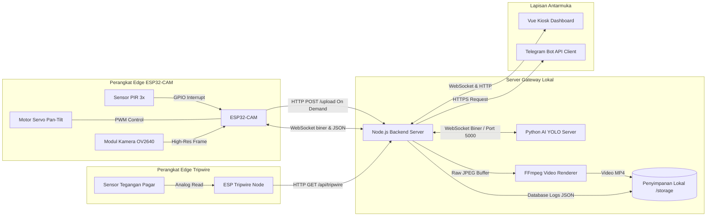
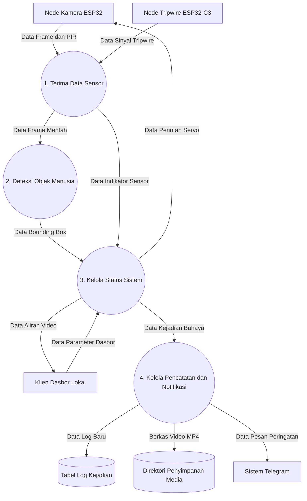
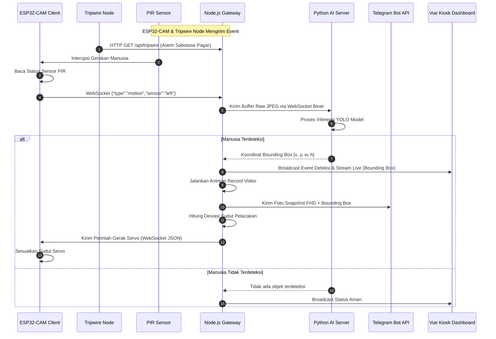
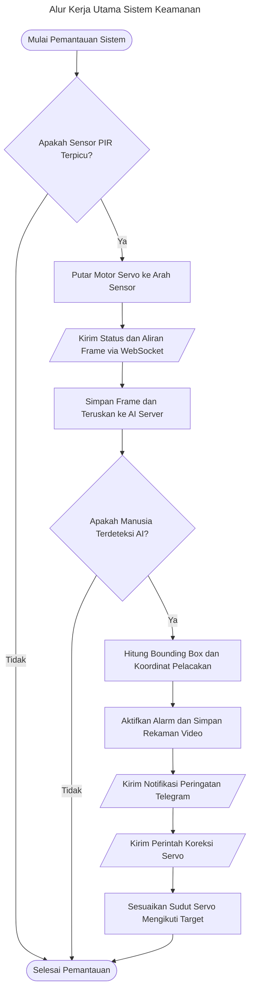
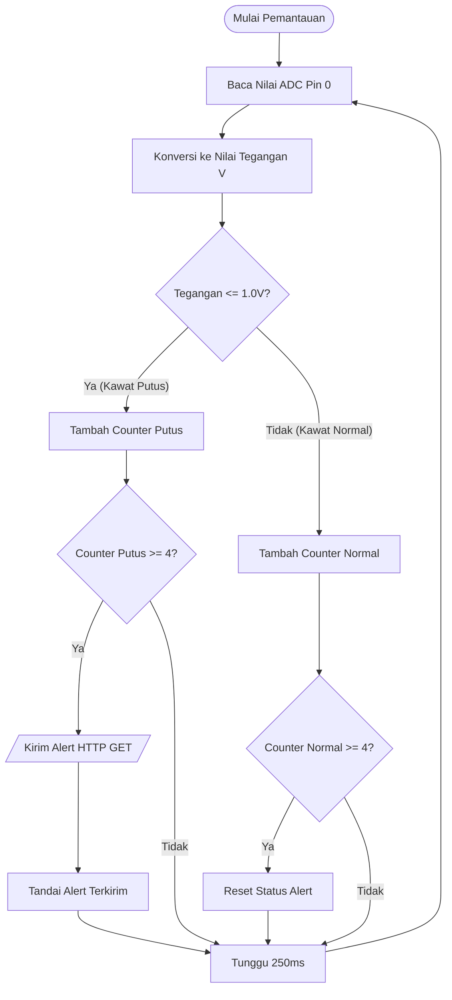
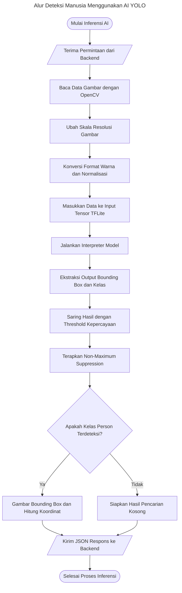

BUKU CAPSTONE DESIGN

<figure>

<figcaption aria-hidden="true">A picture containing text, clipart,
tableware, plate Description automatically generated</figcaption>
</figure>

**SISTEM KEAMANAN PETERNAKAN AYAM BERBIAYA RENDAH BERBASIS ESP32**

Oleh :

**Muhammad Afandi Harahap/1103223023**

**Muhammad Harits/1103223159**

**Bayu Setyo Prajuritno/1103223229**

**PRODI S1 TEKNIK KOMPUTER**

**FAKULTAS TEKNIK ELEKTRO**

**UNIVERSITAS TELKOM**

**BANDUNG**

**2025**

**Lembar Pengesahan Dokumen**

| Judul Capstone Design  | :  | Sistem Keamanan Peternakan Ayam Berbiaya Rendah Berbasis Esp32 |
|:---|:---|:---|
| Jenis Dokumen  | :  | Buku Capstone Design |
| Nomor Dokumen  | :  | FTE-CD-GAB  |
| Nomor Revisi  | :  |  |
| Tanggal Pengesahan  | :  |  |
| Fakultas  | :  | Fakultas Teknik Elektro  |
| Program Studi  | :  | S1 Teknik Komputer |
| Jumlah Halaman  | :  |  |

<table style="width:99%;">
<colgroup>
<col style="width: 9%" />
<col style="width: 9%" />
<col style="width: 10%" />
<col style="width: 9%" />
<col style="width: 60%" />
</colgroup>
<thead>
<tr>
<th colspan="5" style="text-align: left;">Data Pemeriksaan dan
Persetujuan</th>
</tr>
</thead>
<tbody>
<tr>
<td rowspan="6" style="text-align: left;">Ditulis Oleh</td>
<td style="text-align: left;">Nama</td>
<td style="text-align: left;">: Muhammad Afandi Harahap</td>
<td style="text-align: left;">Jabatan</td>
<td style="text-align: left;">: Mahasiswa</td>
</tr>
<tr>
<td style="text-align: left;">NIM</td>
<td style="text-align: left;">:  1103223023</td>
<td style="text-align: left;">Tanda Tangan</td>
<td style="text-align: left;"> </td>
</tr>
<tr>
<td style="text-align: left;">Nama</td>
<td style="text-align: left;">: Muhammad Harits</td>
<td style="text-align: left;">Jabatan</td>
<td style="text-align: left;">: Mahasiswa</td>
</tr>
<tr>
<td style="text-align: left;">NIM</td>
<td style="text-align: left;">: 1103223159</td>
<td style="text-align: left;">Tanda Tangan</td>
<td style="text-align: left;"> </td>
</tr>
<tr>
<td style="text-align: left;">Nama</td>
<td style="text-align: left;">: Bayu Setyo Prajuritno</td>
<td style="text-align: left;">Jabatan</td>
<td style="text-align: left;">: Mahasiswa</td>
</tr>
<tr>
<td style="text-align: left;">NIM</td>
<td style="text-align: left;">: 1103223229</td>
<td style="text-align: left;">Tanda Tangan</td>
<td style="text-align: left;"> </td>
</tr>
<tr>
<td rowspan="4" style="text-align: left;">Disetujui Oleh</td>
<td style="text-align: left;">Nama</td>
<td style="text-align: left;">:  Ir. Burhanuddin Dirgantoro, M.T.</td>
<td style="text-align: left;">Jabatan</td>
<td style="text-align: left;">: Pembimbing 1</td>
</tr>
<tr>
<td style="text-align: left;">Tanggal</td>
<td style="text-align: left;">:</td>
<td style="text-align: left;">Tanda Tangan</td>
<td style="text-align: left;"></td>
</tr>
<tr>
<td style="text-align: left;">Nama</td>
<td style="text-align: left;">: Muhammad Faris Ruriawan, S.T., M.T.</td>
<td style="text-align: left;">Jabatan</td>
<td style="text-align: left;">: Pembimbing 2</td>
</tr>
<tr>
<td style="text-align: left;">Tanggal</td>
<td style="text-align: left;">:</td>
<td style="text-align: left;">Tanda Tangan</td>
<td style="text-align: left;"></td>
</tr>
</tbody>
</table>

**\
Timeline Revisi Dokumen**

<table style="width:98%;">
<colgroup>
<col style="width: 15%" />
<col style="width: 30%" />
<col style="width: 31%" />
<col style="width: 21%" />
</colgroup>
<thead>
<tr>
<th style="text-align: left;"><strong>Versi, Tanggal</strong></th>
<th style="text-align: left;"><strong>Revisi</strong></th>
<th><strong>Perbaikan yang dilakukan</strong></th>
<th style="text-align: left;"><strong>Halaman Revisi</strong></th>
</tr>
</thead>
<tbody>
<tr>
<td style="text-align: left;">22 September 2025</td>
<td style="text-align: left;">Pengenalan terhadap topik</td>
<td><ol type="1">
<li><p>Pembahasan teknis tentang lokasi mitra</p></li>
<li><p>Identifikasi batasan batasan yang berlaku</p></li>
<li><p>Menyelaraskan pemahaman mengenai masalah yang dihadapi dan
menghilangkan asumsi</p></li>
</ol></td>
<td style="text-align: left;">1,2,3</td>
</tr>
<tr>
<td style="text-align: left;">1 Oktober 2025</td>
<td style="text-align: left;">Analisa Masalah</td>
<td><ol type="1">
<li><p>Penjabaran aspek permasalahan dijabarkan lebih
menyeluruh</p></li>
<li><p>Penambahan gambar denah kasar lahan</p></li>
<li><p>Penambahan gambar kondisi geologis lahan</p></li>
</ol></td>
<td style="text-align: left;"><p>3,4,5,6,7,8,9,</p>
<p>10</p></td>
</tr>
<tr>
<td style="text-align: left;">10 Oktober 2025</td>
<td style="text-align: left;">Keseluruhan</td>
<td><ol type="1">
<li><p>Penjabaran Analisa solusi yang sudah ada dengan beberapa metrik
yang relevan</p></li>
<li><p>Melengkapi beberapa bagian yang kurang bukti ilmiah atau
penelitian</p></li>
<li><p>Menambah penjabaran tentang dampaknya pada aspek sosial pada
Analisa masalah</p></li>
</ol></td>
<td style="text-align: left;">10,11,12,13</td>
</tr>
<tr>
<td style="text-align: left;">14 Oktober 2025</td>
<td style="text-align: left;">Perbaikan Penulisan dan Penyesuaian dengan
Format</td>
<td><ol type="1">
<li><p>Perbaikan margin dokumen</p></li>
<li><p>Perbanyak referensi untuk setiap aspek permasalahan</p></li>
<li><p>Daftar Pustaka untuk harga tidak perlu menggunakan referensi dari
<em>e-commerce</em>, melainkan dari website resmi</p></li>
<li><p>Google maps tidak perlu dijadikan referensi latar tempat
penelitian / observasi permasalahan</p></li>
<li><p>Perbanyak referensi jurnal untuk permasalahan</p></li>
</ol></td>
<td style="text-align: left;">14, 15</td>
</tr>
<tr>
<td style="text-align: left;">11 November 2025</td>
<td style="text-align: left;">Metode Verifikasi</td>
<td>Menambah variasi metode pengujian yang menyesuaikan dengan kondisi
lapangan</td>
<td style="text-align: left;">10, 11, 12, 13, 14, 15, 16, 17, 18,
19</td>
</tr>
<tr>
<td style="text-align: left;">14 November 2025</td>
<td style="text-align: left;">Dasar Spesifikasi, Pengukuran/Verifikasi
Spesifikasi</td>
<td><ol type="1">
<li><p>Penjelasan mendalam pada bagian dasar spesifikasi</p></li>
<li><p>Perbaikan Tabel</p></li>
<li><p>Penjelasan teori nilai persentase kategori</p></li>
</ol>
<p>Penjelasan lebih mendalam mengenai pertimbangan lapangan dan
biaya</p></td>
<td style="text-align: left;">3, 10, 11, 12, 13, 14, 15, 16, 17, 18, 19,
20</td>
</tr>
<tr>
<td style="text-align: left;">18 November 2025</td>
<td style="text-align: left;">Dasar Spesifikasi, Metode Verifikasi,
Daftar Pustaka</td>
<td><ol type="1">
<li><p>Perbaikan dan penjelasan pada persentase metode
verifikasi</p></li>
<li><p>Penambahan judul tabel</p></li>
<li><p>Melampirkan transkip wawancara pada daftar pustaka</p></li>
</ol>
<p>Penambahan riwayat wawancara sebagai daftar pustaka dan dasar
penentuan spesifikasi</p></td>
<td style="text-align: left;">2, 6, 7, 8, 10, 11, 12, 13, 14, 15, 16,
17, 18, 19, 21</td>
</tr>
<tr>
<td style="text-align: left;">20 Desember 2025</td>
<td style="text-align: left;">Desain Solusi Terpilih</td>
<td><ol type="1">
<li><p>wire break menggunakan sensor acs712 saja.</p></li>
<li><p>Protokol komunikasi dapat menggunakan rest api,</p></li>
</ol>
<p>Penambahan desain pcb, protocol, dan workflow diagram
terbaru.</p></td>
<td style="text-align: left;">12, 13, 14, 20, 21, 23</td>
</tr>
<tr>
<td style="text-align: left;">22 Desember 2025</td>
<td style="text-align: left;">Kelengkapan Penjabaran Sistem</td>
<td><ol type="1">
<li><p>Melengkapi diagram seperti sequence diagram, data flow diagram,
memperbaiki flowchart.</p></li>
<li><p>Memperbaiki format penomoran tabel dan gambar.</p></li>
<li><p>Memperbaiki kesimpulan agar lebih padat</p></li>
</ol></td>
<td style="text-align: left;">5, 6, 8, 9, 10, 11, 12, 13, 17, 18, 20,
21, 22, 23, 24, 25, 26, 27, 28, 29, 30, 33</td>
</tr>
<tr>
<td style="text-align: left;"></td>
<td style="text-align: left;"></td>
<td></td>
<td style="text-align: left;"></td>
</tr>
<tr>
<td style="text-align: left;"></td>
<td style="text-align: left;"></td>
<td></td>
<td style="text-align: left;"></td>
</tr>
<tr>
<td style="text-align: left;"></td>
<td style="text-align: left;"></td>
<td></td>
<td style="text-align: left;"></td>
</tr>
<tr>
<td style="text-align: left;"></td>
<td style="text-align: left;"></td>
<td></td>
<td style="text-align: left;"></td>
</tr>
<tr>
<td style="text-align: left;"></td>
<td style="text-align: left;"></td>
<td></td>
<td style="text-align: left;"></td>
</tr>
<tr>
<td style="text-align: left;"></td>
<td style="text-align: left;"></td>
<td></td>
<td style="text-align: left;"></td>
</tr>
<tr>
<td style="text-align: left;"></td>
<td style="text-align: left;"></td>
<td></td>
<td style="text-align: left;"></td>
</tr>
<tr>
<td style="text-align: left;"></td>
<td style="text-align: left;"></td>
<td></td>
<td style="text-align: left;"></td>
</tr>
<tr>
<td style="text-align: left;"></td>
<td style="text-align: left;"></td>
<td></td>
<td style="text-align: left;"></td>
</tr>
</tbody>
</table>

\*\*\*\*

**DAFTAR TABEL**

\*\*\*\*

**DAFTAR GAMBAR**

# BAB I PENDAHULUAN

> **Catatan revisi (hapus sebelum submit):**
> - Bagian bertanda `[ISI: ...]` wajib diisi dengan data asli sebelum dokumen ini difinalisasi.
> - Nomor sitasi [1]-[12] mengikuti dokumen asli sebagai acuan sementara — cek ulang urutan sitasi sesuai format IEEE setelah restrukturisasi ini selesai, karena beberapa bagian dipindah antar sub-bab.
> - Tabel harga CCTV yang tadinya panjang (26 baris) sudah diringkas jadi 3-4 kalimat dan dipindah ke 1.3.2 (Analisa Solusi), sesuai aturan template bahwa 1.2 hanya membahas masalah, bukan solusi.

## 1.1 Deskripsi Umum Masalah dan Kebutuhan

Sistem monitoring pada sektor pertanian dan peternakan merupakan instrumen krusial untuk meminimalkan risiko kerugian finansial akibat tindakan pencurian atau intrusi liar. Saat ini, solusi pengawasan yang umum diterapkan di lapangan didominasi oleh perangkat CCTV (*Closed-Circuit Television*) berbasis IoT (*Internet of Things*) komersial. Namun, efektivitas operasional dari sistem komersial ini sering terganggu oleh tingginya frekuensi alarm palsu (*false positive*) dalam mengidentifikasi ancaman manusia, karena algoritma bawaan sistem umumnya belum mampu membedakan secara presisi antara pergerakan intrusi nyata dengan gangguan lingkungan alami seperti pergerakan dedaunan, perubahan intensitas cahaya, atau aktivitas hewan ternak di sekitar lahan.

Sebagai alternatif penanganan, terdapat tren pengembangan sistem pemantauan kustom yang mengintegrasikan kamera, unit pemroses lokal, dan algoritma deteksi objek berbasis kecerdasan buatan seperti YOLO (*You Only Look Once*). Pendekatan ini pernah diterapkan secara langsung pada lahan mitra oleh tim capstone sebelumnya, menggunakan konfigurasi Raspberry Pi 4 sebagai unit pemroses, webcam sebagai node kamera, dan layanan VPS (*Virtual Private Server*) berbasis cloud untuk menjalankan inferensi deteksi manusia. Sistem tersebut telah dioperasikan pada lahan mitra selama **[ISI: durasi pemakaian, misal "kurang lebih 8 bulan"]**. Setelah periode pemakaian tersebut, mitra mulai keberatan menanggung biaya langganan VPS bulanan sebesar **[ISI: nominal biaya VPS per bulan, misal "Rp150.000–Rp300.000"]**, karena dianggap sebagai beban operasional berkelanjutan yang tidak sebanding dengan skala usaha UMKM yang dijalankan. Keluhan mitra inilah yang menjadi titik tolak langsung dari permasalahan yang diangkat pada proyek ini: bagaimana merancang sistem monitoring yang mempertahankan kemampuan deteksi objek berbasis AI, namun menghilangkan ketergantungan pada biaya komputasi cloud berulang.

Kelemahan lain yang melingkupi pendekatan berbasis cloud ini adalah rendahnya rasio efisiensi antara biaya investasi dengan luas cakupan pemantauan (*underwhelming cost-to-coverage ratio*). Mengingat lahan agraris memiliki karakteristik area terbuka yang sangat luas, penggunaan kamera dengan sudut pandang statis memaksa pengguna melipatgandakan jumlah perangkat demi memperoleh cakupan pengawasan yang komprehensif, sehingga biaya pengadaan dan pemeliharaan sistem membengkak secara eksponensial. Ditambah lagi, ketergantungan sistem pengawasan pada konektivitas internet aktif dan server eksternal menjadi kendala kritis bagi wilayah yang memiliki keterbatasan aksesibilitas jaringan telekomunikasi, sehingga operasional sistem menjadi tidak andal (*unreliable*) bagi pelaku usaha sektor agraris skala UMKM (Usaha Mikro, Kecil, dan Menengah).

Oleh karena itu, diperlukan sebuah alternatif perancangan sistem monitoring cerdas yang mampu menekan biaya operasional melalui penggunaan unit pemroses pusat yang mengolah algoritma deteksi objek secara lokal secara mandiri, tanpa ketergantungan pada server eksternal berbayar. Unit pemroses pusat ini harus dirancang terpisah dari node penangkap gambar, serta mendukung integrasi dengan beberapa unit kamera dedikasi (ESP32-CAM) secara skalabel yang dapat ditambahkan sesuai kebutuhan lahan tanpa memicu pembengkakan biaya investasi yang signifikan. Setiap unit kamera dedikasi tersebut juga dilengkapi dengan mekanisme kontrol gerak kamera (pan-tilt) secara dinamis untuk memperluas cakupan area pantau dan mengurangi jumlah titik buta pada lahan terbuka.

Permasalahan ini semakin relevan apabila dikaitkan dengan tingginya angka kriminalitas di sektor properti dan aset produksi. Berdasarkan data Pemerintah Provinsi Jawa Barat tahun 2019–2021, sebanyak 14 dari 19 kabupaten/kota tercatat mengalami kasus pencurian, dengan total 9.452 desa terdampak dalam kurun tiga tahun, seperti terlihat dalam grafik berikut [1][2].

<figure>

<figcaption>Gambar 1.1.1 Grafik Kasus Pencurian Tahun 2019–2021</figcaption>
</figure>

Pencurian termasuk dalam permasalahan umum yang sering dialami dalam usaha peternakan secara khusus [3]. Pencurian dapat mempengaruhi aset biologis dan produk peternakan, seperti ayam dan telur. Selain itu, gangguan hama seperti ular, kucing, anjing liar, dan tikus juga termasuk risiko keamanan yang berkontribusi pada berkurangnya aset biologis atau produk peternakan. Tanpa adanya sistem *monitoring* untuk mendeteksi hal-hal tersebut, dampak yang timbul antara lain [3][4]:

1. **Mengurangi Output Produksi** — berkurangnya aset biologis (ayam) secara langsung menurunkan volume produk yang dihasilkan, baik telur maupun ayam potong.
2. **Mengganggu Proses Produksi** — kerusakan fasilitas akibat usaha pengambilan paksa menimbulkan biaya tambahan untuk perbaikan kandang atau alat produksi.

Berangkat dari kondisi tersebut, diperlukan solusi monitoring keamanan lahan yang murah, mandiri, dan tidak bergantung pada biaya berlangganan berkelanjutan. Kebutuhan ini semakin spesifik pada studi kasus peternakan ayam milik mitra, yang memiliki pagar utama sepanjang 35 meter dan area titik buta berbentuk "L" seluas 3×10 m dan 4×10 m. Lokasi hanya memiliki akses listrik tanpa koneksi internet kabel yang stabil, sehingga penggunaan sistem keamanan berbasis *cloud* tidak memungkinkan secara berkelanjutan.

Berdasarkan keterangan dari pemilik lahan, dibutuhkan sistem yang mampu:

- Memberikan notifikasi visual (foto) secara *real-time* melalui aplikasi Telegram saat terdeteksi penyusup.
- Memungkinkan kontrol gerak kamera jarak jauh tanpa harus berlangganan layanan *cloud*.
- Beroperasi secara mandiri dengan biaya operasional berulang mendekati nol.

Dengan demikian, inti dari masalah pada judul *"Tingginya Biaya Operasional pada Monitoring Lahan Peternakan Ayam"* adalah kebutuhan akan sistem keamanan alternatif yang hemat biaya, tidak bergantung pada layanan komputasi cloud berbayar, namun tetap responsif dan fungsional dalam mendeteksi ancaman keamanan.

Permasalahan ini juga memenuhi kriteria *complex engineering problem* pada beberapa aspek berikut: (1) penyelesaiannya memerlukan pengetahuan mendalam yang mengintegrasikan sistem tertanam, komunikasi nirkabel, sensor-aktuator, dan rekayasa perangkat lunak edge AI; (2) melibatkan isu lintas bidang yang saling bersinggungan — teknis, ekonomi, dan keamanan — bukan sekadar masalah rekayasa tunggal; dan (3) melibatkan pemangku kepentingan yang beragam, yaitu pemilik peternakan, pemilik lahan, pemilik rumah, dan penjaga lahan, yang masing-masing memiliki kebutuhan berbeda terhadap sistem yang dirancang.

## 1.2 Analisa Masalah

Masalah yang diangkat menyangkut multi-aspek, yaitu teknis, ekonomi, dan fungsionalitas-keamanan. Berikut penjelasan tiap aspek yang terpengaruh.

### 1.2.1 Aspek Teknis

- **Ketergantungan pada Komputasi Eksternal Berbayar**: Hambatan utama sistem sebelumnya adalah kebutuhan komputasi inferensi AI yang cukup berat untuk dijalankan pada perangkat tunggal berdaya rendah secara real-time, sehingga tim sebelumnya memilih menyewa layanan VPS eksternal. Solusi ini secara fungsional berhasil, tetapi menimbulkan biaya berulang yang dianggap tidak berkelanjutan oleh mitra. Oleh karena itu, arsitektur sistem yang diusulkan perlu memindahkan seluruh proses inferensi ke unit pemroses lokal (PC) yang berada pada satu kali biaya investasi (*one-time cost*), tanpa biaya langganan bulanan apa pun.

- **Efisiensi Bandwidth dan Kemandirian Jaringan**: Ketergantungan pada transmisi video langsung berkapasitas besar ke server eksternal boros bandwidth dan tidak praktis pada wilayah dengan kestabilan jaringan yang sering berfluktuasi. Oleh karena itu, arsitektur komunikasi sistem dirancang mandiri menggunakan jaringan lokal (intranet); seluruh lalu lintas data visual dari kamera ke unit pemroses diisolasi secara lokal melalui access point internal, dan koneksi internet luar hanya digunakan secara minimal untuk mengirimkan notifikasi teks/foto ringan via Telegram saat terdeteksi intrusi.

- **Jangkauan Area dan Titik Buta**: Luasnya area (pagar 35 m) dan adanya area titik buta berbentuk "L" tidak memungkinkan diawasi hanya dengan satu kamera statis. Berdasarkan observasi langsung terhadap denah lahan (Gambar 1.2.1), teridentifikasi sejumlah titik rawan dan titik buta, baik di dalam maupun di sekitar area yang akan dipantau — terutama pada area belakang (pencahayaan minim), area teras (terhalang pagar dan struktur bangunan), serta area tengah dan depan lahan yang terhalang oleh rumah kaca, pepohonan, dan kolam. Kondisi ini menegaskan kebutuhan akan kamera dengan kontrol gerak (pan-tilt) dinamis dan kemungkinan penambahan unit kamera secara skalabel, alih-alih penambahan kamera statis dalam jumlah besar yang membengkakkan biaya.

<figure>

<figcaption>Gambar 1.2.1 Denah Lahan dan Identifikasi Titik Buta</figcaption>
</figure>

### 1.2.2 Aspek Ekonomi

- **Biaya Operasional Berkelanjutan**: Solusi kustom berbasis AI yang menggunakan komputasi cloud (seperti sistem sebelumnya) mengenakan biaya operasional bulanan untuk layanan VPS. Sebagaimana disebutkan pada sub-bab 1.1, biaya ini mencapai **[ISI: nominal, misal Rp150.000–Rp300.000/bulan]**, yang dalam jangka panjang terakumulasi menjadi beban finansial signifikan bagi mitra berskala UMKM.

- **Perbandingan Kasar terhadap Solusi Komersial**: Sebagai gambaran awal, survei singkat pada platform e-commerce per 1 Oktober 2025 terhadap tiga brand CCTV populer di Indonesia (IMOU, Ezviz, Uniview) menunjukkan rentang harga per unit antara Rp280.000 hingga Rp1.600.000, dengan rata-rata sekitar Rp760.000 per unit [10][11][12]. Angka ini belum termasuk biaya perekam (DVR/NVR), penyimpanan, maupun instalasi, dan akan dibahas lebih lanjut sebagai pembanding pada sub-bab 1.3 (Analisa Solusi yang Ada).

### 1.2.3 Aspek Fungsionalitas dan Keamanan

- **Potensi Alarm Palsu (*False Alarm*)**: Ketergantungan pada satu jenis sensor, misalnya hanya sensor gerak (PIR) [8], sangat rentan terhadap alarm palsu yang dipicu oleh hewan, pergerakan bayangan, atau perubahan cuaca. Diperlukan pendekatan deteksi berlapis (sensor mekanis + deteksi visual berbasis AI) untuk menekan tingkat kesalahan ini.

- **Keterbatasan Luas Cakupan Pengawasan (Sudut Pandang Statis)**: Perangkat kamera pengawas standar umumnya bekerja dengan sudut pandang (*field of view*) yang statis dan kaku, menyebabkan area titik buta yang luas pada lahan terbuka (lihat 1.2.1), sehingga menurunkan efisiensi fungsional alat dalam memantau area peternakan yang luas secara dinamis.

### 1.2.4 Aspek Sosial

Bagi pemilik lahan dengan mobilitas tinggi, pemantauan berkelanjutan terhadap kondisi lahan menjadi sulit dilakukan secara manual. Berdasarkan keterangan mitra, ketiadaan solusi yang mampu memberikan peringatan dini atas kondisi lahan — terlebih dalam rentang waktu yang lama tanpa pengawasan langsung — menimbulkan rasa tidak aman yang berkelanjutan bagi pemilik maupun penjaga lahan **[ISI: opsional — tambahkan 1 data/sitasi pendukung terkait dampak psikologis atau keresahan pelaku UMKM agraris akibat gangguan keamanan, jika tersedia]**.

## 1.3 Analisa Solusi yang Ada

Analisis ini mengkaji beberapa alternatif solusi pengawasan yang telah tersedia, baik yang pernah diterapkan langsung di lahan mitra maupun yang umum ditemukan di pasaran, guna memvalidasi *research gap* dari sistem yang diusulkan.

### 1.3.1 Sistem Kustom Sebelumnya (Raspberry Pi 4 + Webcam + VPS)

Sistem ini merupakan solusi yang **secara nyata pernah diimplementasikan oleh tim capstone terdahulu pada lahan mitra yang sama**, menggunakan Raspberry Pi 4 sebagai pengendali utama, webcam sebagai node kamera, dan algoritma YOLO yang dijalankan melalui layanan VPS untuk mendeteksi objek manusia. Sistem ini dioperasikan selama **[ISI: durasi]** sebelum akhirnya mitra mengajukan keberatan atas biaya langganan.

- **Kelebihan**: Modularitas pemrograman yang baik, mampu mendeteksi wujud manusia secara presisi, serta mengirimkan notifikasi peringatan langsung ke gawai pemilik lahan saat terjadi intrusi.
- **Keterbatasan**: Kendala teknis dan finansial terbesarnya adalah ketergantungan pada langganan komputasi VPS bulanan sebesar **[ISI: nominal]**, yang dinilai memberatkan mitra dalam jangka panjang. Selain itu, sistem ini menuntut bandwidth internet yang cukup besar untuk mengirim data ke VPS secara berkelanjutan, serta memiliki arah pandang kamera yang statis sehingga menyisakan titik buta yang cukup luas pada area lahan.

### 1.3.2 Sistem CCTV IP Kamera Komersial

Kamera IP nirkabel tunggal (*Smart Home IP Camera*) merupakan perangkat siap pakai yang terhubung langsung ke router Wi-Fi dan merekam data secara lokal ke kartu memori (*MicroSD*) di dalam badan kamera. Survei harga pada platform e-commerce (per 1 Oktober 2025) terhadap tiga brand populer — IMOU, Ezviz, dan Uniview — menunjukkan rentang harga satuan Rp280.000 hingga Rp1.600.000, dengan rata-rata sekitar Rp760.000 per unit untuk kelas CCTV properti pribadi, belum termasuk biaya instalasi maupun penyimpanan tambahan [10][11][12].

- **Kelebihan**: Instalasi praktis (*plug-and-play*), harga satuan relatif murah, serta kemudahan akses pemantauan jarak jauh melalui aplikasi telepon pintar.
- **Keterbatasan**: Untuk konteks peternakan, sistem ini tetap bergantung pada ketersediaan internet untuk akses jarak jauh, dan penyimpanan lokal di kartu memori membuatnya rawan terhadap pencurian fisik — apabila unit kamera dicuri, seluruh rekaman bukti turut hilang. Algoritma deteksi bawaan umumnya hanya menganalisis perubahan piksel, sehingga rawan memicu alarm palsu akibat pergerakan daun atau hewan.

### 1.3.3 Sistem CCTV Berbasis DVR (Analog/HD-TVI/AHD)

Sistem sirkuit tertutup berbasis kabel koaksial dan DVR (*Digital Video Recorder*) merupakan standar industri keamanan konvensional yang mapan, di mana unit kamera dihubungkan melalui kabel fisik menuju mesin DVR terpusat.

- **Kelebihan**: Mampu menyediakan pemantauan pasif yang andal secara kontinu (24/7) secara luring melalui monitor besar berkat antarmuka output langsung (HDMI/VGA), dengan latensi minimal karena transmisi kabel analog murni.
- **Keterbatasan**: Ketergantungan pada kabel fisik menjadi kelemahan krusial di lahan terbuka — membentangkan kabel daya dan koaksial sepanjang puluhan meter memicu pembengkakan biaya infrastruktur dan rawan terputus akibat cuaca ekstrem atau gigitan hama. Fitur deteksi analitik AI pada DVR komersial umumnya hanya tersedia pada model premium dengan harga jauh lebih tinggi, sehingga kurang realistis bagi peternak skala UMKM.

### 1.3.4 Sistem CCTV Wireless Berbasis NVR dengan AI

Solusi ini menggabungkan kamera CCTV nirkabel modern (*Wireless IP Camera*) dengan mesin pusat NVR (*Network Video Recorder*), berkomunikasi melalui jaringan Wi-Fi lokal tanpa harus terkoneksi ke internet publik.

- **Kelebihan**: Mempertahankan keandalan pemantauan luring melalui monitor HDMI dan perekaman stabil di hard disk, dipadukan dengan instalasi nirkabel yang lebih ringkas. Unit kamera kelas menengah-atas bahkan dibekali cip *Edge AI Human Detection* internal untuk mengenali postur manusia secara lokal (*on-device*).
- **Keterbatasan**: Ekosistem tertutup (*vendor lock-in*) menjadi kelemahan fundamental — algoritma AI bawaan tidak dapat dilatih ulang (*retrain*) meskipun sering memicu alarm palsu terhadap karakteristik pohon atau hewan ternak lokal, dan sistem sulit diintegrasikan dengan sensor mekanis eksternal tambahan.
- **Estimasi Biaya**: Untuk konfigurasi kelas menengah (1 unit Wireless NVR 10-channel, 4 unit kamera wireless pendukung AI, dan hard disk surveillance 2TB), estimasi biaya investasi berada di rentang Rp4,8 juta hingga Rp5,2 juta di luar router dan monitor — nominal yang masih cukup membebani permodalan UMKM skala desa.

### Ringkasan Perbandingan

| Solusi | Biaya Berulang | Ketergantungan Internet | Fleksibilitas AI | Cakupan Area |
|---|---|---|---|---|
| Sistem lama (RPi+Webcam+VPS) | Tinggi (langganan VPS) | Tinggi | Tinggi (custom) | Rendah (statis) |
| IP Kamera Komersial | Rendah–sedang | Tinggi (akses jarak jauh) | Rendah | Rendah (statis) |
| DVR Analog | Rendah | Rendah | Sangat rendah/tidak ada | Rendah (statis) |
| Wireless NVR+AI | Rendah | Rendah | Rendah (*locked*) | Rendah (statis) |
| **Sistem diusulkan (ESP32-CAM+PC+YOLO)** | **Sangat rendah (one-time cost)** | **Rendah (intranet lokal)** | **Tinggi (custom, retrainable)** | **Tinggi (pan-tilt, skalabel)** |

## 1.4 Kesimpulan

Berdasarkan analisis yang telah dipaparkan, pengangkatan masalah ini sebagai proyek Capstone Design memiliki urgensi, relevansi, dan nilai kemanfaatan yang tinggi, dirangkum dalam beberapa poin berikut:

1. **Urgensi Pengamanan Lahan Berbiaya Efisien**: Sistem yang sebelumnya digunakan mitra terbukti fungsional secara teknis, namun menimbulkan beban biaya berlangganan VPS bulanan yang pada akhirnya ditolak oleh mitra karena dianggap tidak berkelanjutan bagi skala usaha UMKM.

2. **Kompleksitas Rancangan Multidimensional**: Solusi yang dirancang harus mengintegrasikan aspek perangkat keras dan perangkat lunak secara seimbang — komputasi lokal tanpa biaya berlangganan, arsitektur terpisah dengan unit kamera dedikasi yang skalabel, kontrol gerak kamera dinamis, hingga optimalisasi komunikasi data lokal (intranet) nirkabel.

3. **Kesenjangan Kritis Solusi yang Tersedia**: Sistem CCTV wireless NVR berfitur AI bersifat kaku akibat *vendor lock-in* — algoritma deteksinya tidak dapat dilatih ulang saat sering memicu alarm palsu, dan sulit diintegrasikan dengan sensor keamanan fisik tambahan. Sistem DVR analog terkendala inefisiensi tarikan kabel di lahan terbuka. IP Kamera komersial rawan kehilangan bukti rekaman akibat pencurian fisik kartu memori. Sementara itu, sistem kustom yang pernah diterapkan langsung pada lahan mitra (RPi+Webcam+VPS) justru menjadi bukti paling konkret bahwa pendekatan AI custom secara teknis layak, namun **model biaya berbasis langganan VPS-lah** yang menjadi akar penolakan mitra — bukan kemampuan deteksinya.

4. **Penyediaan Alternatif Sistem Berdaya Guna Tinggi**: Kehadiran sistem pengawasan yang mempertahankan fleksibilitas deteksi AI custom sebagaimana sistem sebelumnya, namun memindahkan seluruh biaya komputasi dari model langganan bulanan menjadi investasi satu kali (*one-time cost*) berbasis PC lokal, menjadi solusi krusial bagi pelaku usaha UMKM agraris untuk menekan biaya operasional bulanan mendekati nol tanpa mengorbankan akurasi maupun fleksibilitas deteksi.

# BAB II SPESIFIKASI SISTEM

## 2.1 Dasar Penentuan Spesifikasi

Spesifikasi sistem dirancang berdasarkan analisis lapangan dan evaluasi
terhadap alternatif komersial pada tahap *Capstone Design* sebelumnya.
Kendala utama mitra tidak hanya terbatas pada tingginya biaya investasi
awal instalasi sistem komersial (seperti NVR atau DVR), tetapi juga pada
mahalnya biaya operasional penyewaan *server cloud* pada sistem kustom
lama, serta tingginya rasio alarm palsu. Lebih jauh lagi, sistem pabrikan
bersifat kaku (*vendor lock-in*), sehingga mustahil diintegrasikan dengan
lapisan sensor fisik tambahan maupun modifikasi model AI. Oleh karena itu,
spesifikasi utama difokuskan pada keterbukaan akses (*full control*)
dengan mengeliminasi ketergantungan infrastruktur *cloud*. Sebagai
solusinya, sistem mendayagunakan komputer pribadi (PC) bekas sebagai unit
*server* komputasi lokal (*edge computing*) serbaguna guna meminimalkan
biaya operasional rutin hingga mendekati 0%, sekaligus memberikan
kebebasan mutlak dalam adaptasi algoritma deteksi.

Untuk mengakomodasi fleksibilitas perangkat keras yang tidak dimiliki
oleh sistem komersial, spesifikasi unit kamera difokuskan pada penggunaan
mikrokontroler ESP32-CAM. Meskipun memiliki keterbatasan resolusi,
komponen ini secara spesifik dipilih karena sangat terjangkau, berdimensi
mungil (mudah disembunyikan), sangat hemat daya, dan memiliki *firmware*
terbuka yang memungkinkan integrasi sensor IoT fisik secara bebas (seperti
*tripwire* kawat pagar dan sensor gerak PIR). Arsitektur fisik antara PC
*server* dan unit kamera ESP32-CAM ini sengaja dipisah secara jaringan
agar sistem bersifat skalabel secara mandiri.

Dalam hal transmisi data, sistem menyajikan visualisasi situasi melalui
dua jalur terisolasi demi menyiasati fluktuasi sinyal internet pedesaan.
Pertama, aliran data video berkapasitas besar diisolasi penuh di dalam
jaringan intranet nirkabel lokal. Hal ini bertujuan mendukung pemantauan
pasif secara kontinu melalui monitor pos penjagaan tanpa memakan
*bandwidth*. Kedua, untuk mobilitas jarak jauh, koneksi internet minimalis
hanya digunakan sesekali untuk menembakkan notifikasi peringatan dini
(teks dan foto) ke ponsel pengguna secara eksklusif saat terjadi intrusi.

Kondisi fisik lahan mitra juga mendasari penentuan spesifikasi tata
letak fisik perangkat. Hambatan visual berupa vegetasi rimbun berketinggian
4 hingga 5 meter dan pagar pembatas sepanjang 35 meter yang tertutup
banyak objek menciptakan area titik buta yang rawan. Faktor lingkungan
inilah yang mewajibkan spesifikasi mekanisme kontrol gerak aktif pada
setiap unit ESP32-CAM untuk menyapu sudut pandang secara dinamis, sehingga
mampu menutupi kelemahan cakupan arah pandang statis yang jamak ditemui
pada kamera komersial murah.

### 2.1.1 Kebutuhan Fungsional

> Hasil akhir sistem diharapkan mampu:

1.  Melakukan deteksi keberadaan objek atau aktivitas mencurigakan pada
    area pemantauan secara otomatis menggunakan sensor fisik.
2.  Mengambil dokumentasi visual berupa foto sebagai bukti autentik jika
    terdeteksi aktivitas intrusi.
3.  Mengirimkan notifikasi peringatan dini secara waktu nyata ke ponsel
    pengguna saat terjadi pemutusan kawat pagar atau saat terdeteksi
    adanya pergerakan.

4.  Mengaktifkan sistem alarm suara di area monitoring untuk menjadi
    sistem alarm bagi pemilik lahan.

5.  Mengendalikan posisi sudut kamera secara aktif (pan-tilt) melalui
    instruksi yang dikirimkan via mobile application.

| **Kriteria Kinerja** | **Spesifikasi dan Batasan Sistem** |
|:---|:---|
| **Cakupan Area** | Penempatan kamera secara strategis dikombinasikan dengan kontrol gerak aktif untuk memaksimalkan area pantau dan meminimalkan titik buta (*blind spot*). |
| **Akurasi Deteksi** | Sistem harus mampu mengidentifikasi pergerakan relevan (manusia atau objek besar) dengan akurasi tinggi dan meminimalkan pemicu tidak valid (*false positive*) akibat gangguan lingkungan alami (hewan kecil, daun tertiup angin, motor, dsb). |
| **Reliabilitas** | Sistem mampu beroperasi secara kontinu dalam jangka waktu panjang tanpa memerlukan intervensi manual. |
| **Response Time** | Latensi antara deteksi intrusi fisik hingga pengiriman notifikasi ke *mobile application* seminimal mungkin. |
| **Durabilitas** | Selubung luar perangkat tahan terhadap cuaca ekstrem untuk penempatan luar ruangan (*outdoor*). |
| **Ekonomi** | Total pengadaan dan biaya operasional jauh lebih ekonomis dibandingkan sistem komersial dengan mengoptimalkan rasio cakupan terhadap biaya (cost-to-coverage ratio). |
| **Keamanan Data** | Transmisi data internet menggunakan enkripsi untuk melindungi privasi serta mencegah akses tidak sah. |

Tabel 2. 1 Kebutuhan Non-Fungsional (Non-Functional Requirements)

### 2.1.2 Parameter Penilaian Kinerja

Untuk mengevaluasi efektivitas arsitektur sistem yang diusulkan
berdasarkan keinginan mitra, ditetapkan parameter penilaian kinerja
kuantitatif sebagai berikut:

- **Akurasi Deteksi Aktivitas:** Tingkat keberhasilan identifikasi
  aktivitas atau pergerakan objek pada area pemantauan wajib mencapai
  minimal 85% dari total percobaan.

- **Tingkat Alarm Palsu (False Positive Rate):** Toleransi kesalahan
  deteksi akibat dinamika lingkungan (hewan kecil, perubahan cahaya,
  atau pergerakan daun) dibatasi maksimal 15%.

- **Kecepatan Respons (Response Time):** Latensi pengiriman notifikasi
  dari saat deteksi fisik hingga diterima di mobile application tidak
  boleh melebihi 10 detik.

- **Stabilitas Visualisasi:** Transmisi visual wajib mempertahankan
  kelancaran visualisasi tanpa adanya tampilan yang terputus atau
  bergejolak.

### 2.1.3 Pertimbangan Konteks Lapangan

Penentuan spesifikasi teknis dan penempatan kamera sangat dipengaruhi
oleh karakteristik fisik peternakan mitra:

- **Geometri Lahan Irregular:** Area berbentuk huruf "L" dan sekat fisik
  menghalangi garis pandang lurus, mewajibkan penempatan unit kamera
  pada titik sudut verteks untuk memaksimalkan sudut sapuan.

- **Titik Infiltrasi Rawan:** Area pagar sepanjang 35 meter dan dinding
  tinggi membutuhkan pengawasan perimeter ketat melalui penempatan
  kamera yang sejajar dengan garis batas lahan.

- **Hambatan Visual Vegetasi:** Rimbunnya vegetasi setinggi 4 s.d. 5
  meter menghalangi sudut pandang atas, menuntut penempatan kamera di
  ketinggian menengah dengan sudut hadap dinamis agar tetap memperoleh
  pandangan bebas hambatan.

- **Kondisi Pencahayaan:** Ketiadaan fitur penglihatan malam (night
  vision) pada unit kamera diatasi melalui pemanfaatan sensor fisik
  aktif (sensor gerak dan sensor kawat pagar) sebagai sistem cadangan
  (fallback system). Sistem cadangan ini bekerja secara optimal untuk
  mendeteksi ancaman dan memicu alarm peringatan dini secara mandiri
  saat visibilitas kamera menurun drastis pada malam hari.

### 2.1.4 Pertimbangan Biaya dan Value

Sistem dirancang untuk memaksimalkan rasio efisiensi biaya terhadap area
cakupan sebagai berikut:

- Biaya kapital yang kompetitif jika dibandingkan dengan sistem CCTV
  komersial atau Solusis sistem kustom versi lama dengan cakupan area
  yang sama atau lebih.

- Batasan Biaya Operasional (*Operational Cost*): Pemrosesan logika
  secara lokal dan penggunaan jaringan intranet menekan pengeluaran sewa
  server cloud hingga Rp 0,00 (nol rupiah).

- Optimalisasi Nilai Guna (Value): Memberikan pengawasan perimeter yang
  andal dan mencakup seluruh area rawan tanpa mengorbankan kelayakan
  finansial bagi pelaku usaha skala UMKM.

## 2.2 Batasan dan Spesifikasi

Berdasarkan observasi, analisis, dan wawancara yang telah dilakukan,
mitra membutuhkan sistem monitoring dengan harga terjangkau tanpa
mengurangi fitur yang dapat disediakan oleh perangkat penyusunnya.
Adapun beberapa batasan dari sistem monitoring tersebut adalah sebagai
berikut.

### 2.2.1 Batasan Wilayah

Seluruh perangkat sistem monitoring akan dipasang hanya dalam batas
wilayah lahan milik mitra. Pembatasan ini dimaksudkan untuk memberikan
perlindungan terhadap lahan dari berbagai risiko eksternal, terutama
ancaman pencurian yang menjadi permasalahan utama. Mitra menyampaikan
bahwa pada beberapa kesempatan sebelumnya telah terjadi kehilangan aset
biologis maupun peralatan yang berada di dalam area lahan dan merupakan
milik mitra. Pada kejadian tersebut, mitra tidak dapat mengidentifikasi
pelaku pencurian. Melalui instalasi sistem monitoring, diharapkan
potensi terulangnya insiden serupa dapat diminimalkan, sekaligus
memungkinkan identifikasi pelaku apabila kasus tersebut kembali terjadi.

### 2.2.2 Batasan Biaya

> Berbagai opsi perangkat untuk sistem monitoring masih dievaluasi
> dengan mempertimbangkan efisiensi biaya serta kebutuhan operasional
> jangka panjang. Perangkat input maupun aktuator yang tidak memerlukan
> biaya operasional berkelanjutan dan memiliki harga relatif rendah
> menjadi salah satu alternatif yang sedang dipertimbangkan, terutama
> jika dibandingkan dengan solusi komersial seperti instalasi CCTV dari
> vendor tertentu atau penggunaan *AI model* dengan *framework* khusus
> untuk deteksi objek.
>
> Metode deteksi berbasis *AI* pada umumnya membutuhkan dukungan *cloud
> service* agar *framework* tersebut dapat berjalan dan terintegrasi
> sepenuhnya dengan sistem monitoring. Ketergantungan pada *cloud
> service* berpotensi menimbulkan biaya operasional tambahan bagi mitra.
> Oleh karena itu, tim masih mempertimbangkan opsi lain yang dapat
> mengurangi biaya dan kompleksitas sistem, misalnya dengan memanfaatkan
> sensor sebagai mekanisme pendeteksi ancaman tanpa harus menggunakan
> pemrosesan berbasis *cloud*.
>
> Tujuan utama dari pengembangan sistem monitoring lahan adalah memenuhi
> kebutuhan pemilik lahan yang memiliki tingkat mobilisasi tinggi.
> Dengan adanya sistem monitoring, pemilik lahan maupun pemilik
> peternakan dapat memperoleh rasa aman karena kondisi lahan dapat
> dipantau dari jarak jauh. Selain itu, sistem monitoring juga perlu
> dilengkapi dengan fitur peringatan dini dan alarm. Namun, integrasi
> fitur tersebut sering kali membutuhkan layanan tambahan yang berbiaya
> cukup besar. Oleh karena itu, diperlukan alternatif yang mampu menekan
> biaya operasional jangka panjang sekaligus menghindari biaya instalasi
> awal yang terlalu tinggi.

Pengembangan sistem monitoring ini utamanya ditujukan untuk digunakan
oleh pemilik lahan. Selain itu, beberapa pihak lain seperti pengurus
lahan dan pengurus peternakan ayam juga dapat mengakses sistem
monitoring tersebut. Ketiga pengguna ini masing-masing akan memperoleh
wewenang untuk mengatur sudut kamera melalui perintah (*command*) yang
dikirimkan melalui aplikasi pesan.

Aplikasi pesan tersebut tidak hanya berfungsi sebagai remote control,
tetapi juga digunakan sebagai platform untuk sistem peringatan dini dan
alarm. Mekanisme peringatan dini dilakukan dengan cara mengambil gambar
kondisi terkini di lahan, kemudian mengirimkannya kepada ketiga pengguna
melalui satu nomor telepon seluler yang terhubung ke aplikasi pesan.
Pendekatan ini memungkinkan penekanan biaya untuk penyediaan fitur
peringatan dini dan alarm, serta meningkatkan efektivitas sistem secara
keseluruhan \[3\]\[4\]\[5\]\[6\].

Tabel 2. 2 Batasan Spesifikasi

<table>
<colgroup>
<col style="width: 42%" />
<col style="width: 57%" />
</colgroup>
<thead>
<tr>
<th colspan="2"><strong>Batasan</strong></th>
</tr>
</thead>
<tbody>
<tr>
<td><strong>Tujuan</strong></td>
<td>Sistem monitoring lahan dengan fitur peringatan dini dan remote
control via Messanging app</td>
</tr>
<tr>
<td><strong>Target Pengguna</strong></td>
<td>Pemilik Lahan, Pengurus Lahan, dan Pengurus Peternakan Ayam</td>
</tr>
<tr>
<td><strong>Alat dan <em>Software</em></strong></td>
<td><em>Low-cost</em> camera, sensor, dan <em>messaging app</em></td>
</tr>
</tbody>
</table>

### 2.2.3 Spesifikasi Kebutuhan Fungsional

Spesifikasi kebutuhan fungsional mendeskripsikan layanan, fitur, dan
respons aktif yang wajib disediakan oleh sistem untuk merespons kondisi
lingkungan fisik serta instruksi dari pengguna. Berdasarkan hasil
diskusi dan analisis kebutuhan bersama mitra, berikut adalah rincian
spesifikasi kebutuhan fungsional yang akan diimplementasikan:

1.  **Deteksi Gerakan Multi-arah (Sensor Inframerah)**

> Fitur ini merupakan gerbang utama penginderaan sistem untuk memantau
> keamanan perimeter lahan peternakan secara waktu nyata (real-time).

| **Parameter** | **Spesifikasi Fungsional** |
|:---|:---|
| **Deskripsi** | Sistem melakukan pemindaian area perimeter secara aktif menggunakan tiga sensor deteksi gerak yang ditempatkan secara spasial pada sektor Kiri, Tengah, dan Kanan. |
| **Fungsi** | Mengidentifikasi pergerakan objek secara dini secara spasial dan mengirimkan sinyal interupsi ke unit pengontrol. |
| **Komponen Aktif** | Tiga unit sensor Passive Infrared (PIR). |
| **Input** | Radiasi inframerah dari pergerakan objek dalam jangkauan sensor sebesar . |

Tabel 2. 3 Deteksi Aktivitas/Gerakan dengan Sensor

\*\*\*\*

2.  **Penyelarasan Arah Kamera Otomatis (Motor Penggerak)**

> Fitur ini dirancang untuk mengarahkan modul penangkap gambar secara
> otomatis ke titik terjadinya deteksi gerakan guna mengeliminasi area
> titik buta.

| **Parameter** | **Spesifikasi Fungsional** |
|:---|:---|
| **Deskripsi** | Memutar modul penangkap gambar secara mekanis mengarah secara presisi ke zona sensor yang mendeteksi adanya aktivitas. |
| **Fungsi** | Mengarahkan lensa kamera secara cepat ke sektor spasial target (sudut , , atau ) tanpa memerlukan intervensi manual. |
| **Komponen Aktif** | Motor servo penyesuai sudut. |
| **Input** | Perintah parameter sudut dari unit pengontrol berdasarkan zona pemicuan sensor. |

3.  **Analisis Citra AI dan Pengenalan Manusia (Server AI)**

> Fitur ini mengintegrasikan penginderaan fisik dengan kecerdasan buatan
> lokal untuk memverifikasi jenis objek yang memicu sensor.

| **Parameter** | **Spesifikasi Fungsional** |
|:---|:---|
| **Deskripsi** | Memproses gambar tangkapan kamera secara lokal menggunakan model klasifikasi kecerdasan buatan untuk mengidentifikasi keberadaan manusia. |
| **Fungsi** | Meminimalkan kesalahan deteksi (false alarm) dengan cara membuat kotak pembatas (bounding box) hanya jika objek terverifikasi sebagai manusia. |
| **Komponen Aktif** | Server pemroses kecerdasan buatan lokal. |
| **Input** | File gambar biner resolusi tinggi dari server backend. |

4.  **Pelacakan Objek Dinamis (Object Tracking)**

> Fitur ini diimplementasikan untuk melakukan pemantauan aktif secara
> berkelanjutan mengikuti pergerakan target.

| **Parameter** | **Spesifikasi Fungsional** |
|:---|:---|
| **Deskripsi** | Menggerakkan posisi hadap kamera secara dinamis mengikuti arah pergerakan manusia agar objek target selalu berada di tengah frame visual. |
| **Fungsi** | Mempertahankan fokus pengawasan visual secara otomatis selama objek manusia terdeteksi di area pemantauan. |
| **Komponen Aktif** | Motor servo penyesuai sudut dan server pengolah data koordinat. |
| **Input** | Koordinat bounding box objek manusia dari server kecerdasan buatan secara terus-menerus. |

5.  **Pengiriman Notifikasi Peringatan Instan (Platform Pesan)**

> Fitur ini memfasilitasi kebutuhan pengiriman bukti visual ancaman
> kepada pemilik lahan peternakan secara instan.

| **Parameter** | **Spesifikasi Fungsional** |
|:---|:---|
| **Deskripsi** | Mengirimkan snapshot kejadian yang dilengkapi garis bounding box hasil deteksi kecerdasan buatan langsung ke perangkat pengguna melalui aplikasi pesan instan. |
| **Fungsi** | Menyediakan notifikasi peringatan dini (early warning) instan ke perangkat seluler pengguna dari jarak jauh. |
| **Komponen Aktif** | Server pengontrol utama dan platform komunikasi pesan instan. |
| **Input** | File citra beranotasi bounding box dari server pengontrol. |

6.  **Perekaman Video Kejadian Otomatis (Sistem Perekaman)**

> Fitur ini didedikasikan untuk mendokumentasikan rentetan peristiwa
> intrusi dalam bentuk video utuh.

| **Parameter** | **Spesifikasi Fungsional** |
|:---|:---|
| **Deskripsi** | Merekam aliran frame kejadian secara asinkron dari awal pemicuan sensor hingga masa tenggang berakhir, merendernya, dan mengirimkannya ke perangkat pengguna. |
| **Fungsi** | Menyediakan bukti dokumentasi video kejadian intrusi yang lengkap sebagai arsip digital. |
| **Komponen Aktif** | Server pengontrol utama dan pustaka pengolah video. |
| **Input** | Aliran frame gambar selama sesi deteksi aktif. |
| **Output** | File rekaman video berformat standar yang dikirim ke pengguna dan disimpan ke sistem penyimpanan lokal. |

7.  **Pemantauan Langsung dan Kontrol Parameter Lokal (Dasbor
    Pemantau)**

> Fitur ini memenuhi kebutuhan pemantauan pasif yang terus-menerus di
> pos penjagaan atau rumah pemilik secara lokal.

| **Parameter** | **Spesifikasi Fungsional** |
|:---|:---|
| **Deskripsi** | Menyediakan antarmuka visual lokal untuk menampilkan streaming video lokal, mengontrol sudut kamera secara manual, dan menyesuaikan parameter gambar secara lokal. |
| **Fungsi** | Menyediakan visualisasi situasi langsung tanpa membebani bandwidth internet serta memungkinkan konfigurasi sensor secara real-time. |
| **Komponen Aktif** | Dasbor antarmuka pengguna lokal dan server pengontrol utama. |
| **Input** | Aliran video dan interaksi tombol kontrol dari pengguna. |
| **Output** | Tampilan siaran langsung yang lancar, penyesuaian parameter kamera (kecerahan, kontras, saturasi), dan kontrol sudut manual. |

> **Tambahan :** Keseluruhan spesifikasi kebutuhan fungsional merupakan
> permintaan dari mitra setelah melalui proses diskusi secara
> langsung\[1\]\[11\].

### 2.2.4 Spesifikasi Kebutuhan Non-Fungsional

> Kebutuhan non-fungsional dirancang untuk menetapkan standar kualitas
> operasional, keandalan transmisi, serta batasan ekonomi agar sistem
> dapat bekerja secara optimal di lingkungan luar ruangan berdasarkan
> analisis konteks lapangan Bab I.

| **Kriteria Kinerja** | **Spesifikasi Teknis dan Batasan Operasional** |
|:---|:---|
| **Akurasi Deteksi** | Model kecerdasan buatan lokal wajib mengidentifikasi objek manusia dengan tingkat akurasi minimal 85% serta meminimalkan pemicu tidak valid (false positive) akibat perubahan cahaya, pergerakan daun, atau hewan di bawah 15%. |
| **Response Time** | Latensi pengiriman notifikasi dari pemicuan sensor awal hingga pesan peringatan diterima pengguna tidak boleh melebihi 10 detik. Latensi video streaming lokal pada dasbor pemantau lokal wajib berada di bawah 1000 ms. |
| **Resiliensi Jaringan** | Sistem harus mendukung fitur penyesuaian resolusi dinamis untuk menyesuaikan kualitas gambar dan laju streaming berdasarkan kekuatan sinyal jaringan nirkabel lokal guna mencegah penumpukan data (buffering). |
| **Reliabilitas** | Sistem wajib beroperasi secara kontinu selama 24 jam penuh. Layanan pemantauan langsung lokal (live stream) dan kontrol manual pada dasbor pemantau lokal harus tetap berjalan 100% stabil meskipun koneksi internet publik (WAN) luar terputus. |
| **Keamanan Data** | Seluruh komunikasi data lokal wajib diamankan dengan protokol enkripsi standar industri pada port aman. Kredensial keamanan dan token akses harus disimpan secara terenkripsi dalam memori perangkat. |
| **Durabilitas** | Selubung pelindung luar (outdoor enclosure) wajib menggunakan material sintetis yang tahan radiasi UV, air hujan, debu, dan cuaca ekstrem. Selubung dalam menggunakan material standard yang kokoh. |
| **Ekonomi** | Total biaya pengadaan komponen (capital cost) harus kompetitif jika dibandingkan dengan pengadaan beberapa unit CCTV komersil standar maupun solusi kustom berbasis komputer papan tunggal (SBC) versi sebelumnya untuk cakupan area setara, serta mengeliminasi biaya rutin bulanan sewa server cloud pihak ketiga sehingga biaya operasional rutin tetap sebesar Rp 0.00. |

> **Tambahan :** Keseluruhan spesifikasi kebutuhan non-fungsional
> merupakan permintaan dari mitra setelah melalui proses diskusi secara
> langsung\[1\]\[11\].

## 2.3 Pengukuran/Verifikasi Spesifikasi

Metode pengukuran dan verifikasi digunakan untuk memastikan bahwa
purwarupa sistem yang dikembangkan memenuhi seluruh spesifikasi
fungsional dan non-fungsional yang telah ditetapkan pada sub-bab
sebelumnya. Parameter pengujian ini didasarkan pada hasil analisis
kebutuhan serta target performa dari mitra. Mitra menetapkan standar
keberhasilan sistem minimal sebesar 85% untuk tingkat akurasi deteksi,
dengan latensi respons yang rendah, serta stabilitas transmisi data yang
lancar tanpa kehilangan bingkai visual (frame) yang bergejolak di layar
dasbor pemantau lokal.

### 2.3.1 Pengujian Keandalan Operasional Sistem Kontinu

Pengujian performa kontinu dilakukan untuk memastikan sistem dapat
beroperasi secara stabil dalam durasi yang panjang tanpa mengalami
penurunan waktu respons atau kegagalan sistem (crash). Kestabilan
transmisi data visual dari modul kamera menuju dasbor pemantau lokal
juga dipantau secara pasif untuk memastikan kelancaran visualisasi
situasi di area lahan terbuka. Skenario pengujian keandalan sistem
dibagi berdasarkan segmentasi waktu transisi pencahayaan alami
lingkungan luar ruangan.

<table style="width:99%;">
<colgroup>
<col style="width: 25%" />
<col style="width: 27%" />
<col style="width: 45%" />
</colgroup>
<thead>
<tr>
<th><strong>Jangka Waktu Pengujian</strong></th>
<th><strong>Checkpoint Pengujian</strong></th>
<th><strong>Hasil yang Diharapkan</strong></th>
</tr>
</thead>
<tbody>
<tr>
<td rowspan="3">Sistem dinyalakan secara kontinu selama penuh</td>
<td>Pengambilan sampel gambar tampilan dasbor pemantau lokal pada waktu
siang hari</td>
<td>Dasbor lokal dapat menampilkan situasi lahan dan streaming video
secara lancar tanpa indikasi crash atau penurunan performa sistem</td>
</tr>
<tr>
<td>Pengambilan sampel gambar tampilan dasbor pemantau lokal pada waktu
sore hari</td>
<td>Dasbor lokal dapat menampilkan situasi lahan dan streaming video
secara lancar tanpa indikasi crash atau penurunan performa sistem</td>
</tr>
<tr>
<td>Pengambilan sampel gambar tampilan dasbor pemantau lokal pada waktu
malam hari</td>
<td>Dasbor lokal dapat menampilkan situasi lahan dan streaming video
secara lancar tanpa indikasi crash atau penurunan performa sistem</td>
</tr>
</tbody>
</table>

### 2.3.2 Pengujian Akurasi Deteksi Manusia

Pengujian akurasi deteksi dilakukan untuk menguji keandalan model
kecerdasan buatan lokal dalam membedakan objek manusia dari objek
non-manusia guna meminimalkan munculnya alarm palsu (false alarm) akibat
dinamika lingkungan alam peternakan. Pengujian ini menggunakan skenario
simulasi objek nyata yang melintasi area perimeter pengawasan.

<table style="width:99%;">
<colgroup>
<col style="width: 31%" />
<col style="width: 31%" />
<col style="width: 36%" />
</colgroup>
<thead>
<tr>
<th colspan="3" style="text-align: center;"><strong>Skenario
Pengujian</strong></th>
</tr>
</thead>
<tbody>
<tr>
<td style="text-align: center;"><strong>Kategori Objek</strong></td>
<td style="text-align: center;"><strong>Skenario Kondisi
Objek</strong></td>
<td style="text-align: center;"><strong>Hasil yang
Diharapkan</strong></td>
</tr>
<tr>
<td style="text-align: center;">Objek Manusia</td>
<td style="text-align: center;"><p>1. Manusia dalam posisi duduk di area
perimeter</p>
<p>2. Manusia berjalan melintasi area perimeter</p>
<p>3. Manusia berlari di area perimeter</p></td>
<td style="text-align: center;">Sistem berhasil memverifikasi objek
sebagai manusia, membuat kotak pembatas (bounding box), memicu alarm
lokal, dan mengirimkan pesan notifikasi visual ke pengguna</td>
</tr>
<tr>
<td style="text-align: center;">Objek Non-manusia</td>
<td style="text-align: center;"><p>1. Pergerakan hewan (kucing/anjing
liar)</p>
<p>2. Pergerakan kendaraan (motor/mobil)</p>
<p>3. Pergerakan vegetasi ditiup angin</p></td>
<td style="text-align: center;">Sistem tidak mendeteksi objek sebagai
manusia, tidak memicu alarm lokal, dan tidak mengirimkan pesan
notifikasi ke pengguna</td>
</tr>
</tbody>
</table>

Selanjutnya pengujian akan dilakukan dengan beberapa iterasi percobaan,
lalu akan dilakukan penghitungan hasil pengujian dengan fomula seperti
berikut.

<table>
<colgroup>
<col style="width: 60%" />
<col style="width: 39%" />
</colgroup>
<thead>
<tr>
<th><p>Formula.</p>
<p><span class="math display">$$Persentase = \ \frac{n - \Sigma x}{n}\
100\%$$</span></p></th>
<th><p>Keterangan.</p>
<p><span
class="math display"><em>x</em> = <em>j</em><em>u</em><em>m</em><em>l</em><em>a</em><em>h</em> <em>f</em><em>a</em><em>l</em><em>s</em><em>e</em> <em>a</em><em>l</em><em>a</em><em>r</em><em>m</em></span></p>
<p><span
class="math display"><em>n</em> = <em>j</em><em>u</em><em>m</em><em>l</em><em>a</em><em>h</em> <em>t</em><em>o</em><em>t</em><em>a</em><em>l</em> <em>i</em><em>t</em><em>e</em><em>r</em><em>a</em><em>s</em><em>i</em></span></p></th>
</tr>
</thead>
<tbody>
</tbody>
</table>

lalu akan di tentukan tindakan lanjutan untuk menanggapi hasil dari
pengujian, Tindakan tersebut akan di tentukan dengan tabel tingkat
akurasi alarm berikut\[1\]\[7\].

<table style="width:99%;">
<caption><strong>Tabel 2. 4 Tingkat Akurasi Alarm</strong></caption>
<colgroup>
<col style="width: 29%" />
<col style="width: 29%" />
<col style="width: 40%" />
</colgroup>
<thead>
<tr>
<th colspan="3" style="text-align: center;"><strong>Tingkat Akurasi
Alarm</strong></th>
</tr>
</thead>
<tbody>
<tr>
<td style="text-align: center;"><strong>Kategori</strong></td>
<td style="text-align: center;"><strong>Batasan Persentase</strong></td>
<td style="text-align: center;"><strong>Tindakan Lanjutan</strong></td>
</tr>
<tr>
<td style="text-align: center;">Gagal</td>
<td style="text-align: center;">0% s.d. 84,99%</td>
<td style="text-align: center;">Melakukan proses kalibrasi ulang
sensitivitas sensor deteksi, debugging baris kode model klasifikasi AI,
serta pemeriksaan kembali terhadap sirkuit fisik rangkaian elektronik
sebelum melakukan pengujian ulang</td>
</tr>
<tr>
<td style="text-align: center;">Berhasil</td>
<td style="text-align: center;">85% s.d. 100%</td>
<td style="text-align: center;">Melakukan optimalisasi minor pada
parameter ambang batas (threshold) algoritma klasifikasi untuk
mempertahankan tingkat akurasi minimum sebesar 85%</td>
</tr>
</tbody>
</table>

### 2.3.3 Pengujian Penyelarasan Arah Kamera dan Pelacakan Objek Dinamis

Pengujian ini bertujuan untuk memvalidasi performa mekanis dari motor
servo dalam menyelaraskan arah fokus hadap kamera secara otomatis ke
titik zona sensor yang terpicu, serta mengevaluasi responsivitas gerakan
kamera dalam mengikuti (tracking) objek manusia secara dinamis. Skenario
pengujian ini dirancang untuk memastikan sistem dapat mengarahkan sudut
hadap kamera ke koordinat derajat yang ditentukan secara presisi tanpa
mengalami keterlambatan (delay) yang signifikan.

<table style="width:99%;">
<caption>Tabel 2. 5 Jenis Threat</caption>
<colgroup>
<col style="width: 32%" />
<col style="width: 34%" />
<col style="width: 32%" />
</colgroup>
<thead>
<tr>
<th colspan="3" style="text-align: center;"><strong>Jenis
Threat</strong></th>
</tr>
</thead>
<tbody>
<tr>
<td style="text-align: center;"><strong>Keadaan Sensor</strong></td>
<td style="text-align: center;"><strong>Pergerakan Objek</strong></td>
<td style="text-align: center;"><strong>Hasil yang
Diharapkan</strong></td>
</tr>
<tr>
<td style="text-align: center;">Salah satu dari tiga sensor deteksi
gerak terpicu</td>
<td style="text-align: center;">Objek diam di dalam zona sensor yang
aktif</td>
<td style="text-align: center;">Motor servo berputar secara presisi
mengarahkan modul kamera ke zona pemicuan (sudut , , atau )</td>
</tr>
<tr>
<td style="text-align: center;">Terverifikasi sebagai manusia oleh
server AI</td>
<td style="text-align: center;">Objek manusia bergerak melintasi batas
antar zona sensor secara kontinu</td>
<td style="text-align: center;">Motor servo bergerak secara dinamis dan
adaptif mengikuti arah pergeseran koordinat objek agar posisi manusia
tetap berada di tengah frame visual</td>
</tr>
</tbody>
</table>

### 2.3.4 Pengujian Kualitas Gambar Tangkapan Kamera Berdasarkan Waktu

Pengujian ini dirancang untuk mengevaluasi kualitas dokumentasi visual
yang dihasilkan oleh modul kamera di bawah intensitas cahaya lingkungan
yang bervariasi pada area luar ruangan peternakan mitra. Hasil pengujian
digunakan untuk menentukan batas visibilitas dan menguji efektivitas
sensor fisik sebagai mekanisme cadangan (fallback system) ketika
pencahayaan lingkungan menurun drastis.

<table style="width:98%;">
<colgroup>
<col style="width: 24%" />
<col style="width: 24%" />
<col style="width: 24%" />
<col style="width: 24%" />
</colgroup>
<thead>
<tr>
<th colspan="4" style="text-align: center;"><strong>Skenario
Kondisi</strong></th>
</tr>
</thead>
<tbody>
<tr>
<td style="text-align: center;"><strong>Tingkat Kecerahan</strong></td>
<td style="text-align: center;"><strong>Skenario Waktu</strong></td>
<td style="text-align: center;"><strong>Tindakan</strong></td>
<td style="text-align: center;"><strong>Hasil yang
Diharapkan</strong></td>
</tr>
<tr>
<td style="text-align: center;">Kecerahan Tinggi</td>
<td style="text-align: center;">Pagi hingga Sore Hari (08.00 s.d.
17.00)</td>
<td style="text-align: center;">Pemotretan gambar situasi lahan secara
berkala di bawah cahaya matahari langsung</td>
<td style="text-align: center;">Objek fisik dan detail perimeter lahan
dalam gambar dapat diidentifikasi secara jelas oleh pengguna</td>
</tr>
<tr>
<td style="text-align: center;">Kecerahan Rendah</td>
<td style="text-align: center;">Malam Hari (18.00 s.d. 23.59)</td>
<td style="text-align: center;">Pemotretan gambar situasi lahan dalam
kondisi gelap tanpa bantuan lampu sorot</td>
<td style="text-align: center;">Area perimeter tidak terlihat jelas oleh
kamera, namun sensor gerak fisik tetap aktif memicu bunyi alarm lokal
secara mandiri sebagai sistem cadangan</td>
</tr>
</tbody>
</table>

### 2.3.5 Pengujian Jangkauan dan Sudut Deteksi Sensor Gerak

Pengujian jangkauan deteksi fisik dilakukan untuk memastikan seluruh
garis pagar perimeter utama sepanjang 35 meter dapat tertutup secara
kontinu oleh sapuan area deteksi sensor. Dua parameter utama yang diukur
dalam pengujian ini adalah jarak jangkauan deteksi efektif dan lebar
sudut pandang sensor (field of view/FoV) berdasarkan kategori tingkat
keberhasilan.

<table style="width:99%;">
<colgroup>
<col style="width: 26%" />
<col style="width: 26%" />
<col style="width: 45%" />
</colgroup>
<thead>
<tr>
<th colspan="3"
style="text-align: center;"><strong>Jangkauan</strong></th>
</tr>
</thead>
<tbody>
<tr>
<td style="text-align: center;"><strong>Kategori</strong></td>
<td style="text-align: center;"><strong>Jangkauan dan
Sudut</strong></td>
<td style="text-align: center;"><strong>Tindakan Lanjutan</strong></td>
</tr>
<tr>
<td style="text-align: center;">Rendah</td>
<td style="text-align: center;">Jarak deteksi &lt; 3 meter atau sudut
pandang &lt; 60</td>
<td style="text-align: center;">Sensitivitas sensor fisik harus
ditingkatkan untuk memperluas jarak penginderaan. Jika celah deteksi
(blind spot) masih terbentuk akibat sudut yang terlalu sempit, maka
perlu dilakukan penyesuaian posisi spasial atau penambahan jumlah sensor
fisik di titik-titik krusial</td>
</tr>
<tr>
<td style="text-align: center;">Sedang</td>
<td style="text-align: center;">Jarak deteksi 3 s.d. 5 meter atau sudut
pandang 60° s.d. 90°</td>
<td style="text-align: center;">Sistem telah memenuhi target spesifikasi
standar. Fokus diarahkan pada optimalisasi penyaringan sinyal masukan
(background filtering) untuk mengurangi munculnya pemicu tidak valid
(false positive)</td>
</tr>
<tr>
<td style="text-align: center;">Tinggi</td>
<td style="text-align: center;">Jarak deteksi 5 s.d. 7 meter atau sudut
pandang 90° s.d. 120°</td>
<td style="text-align: center;">Sistem bekerja pada kapasitas maksimum.
Konfigurasi spasial sensor dapat dievaluasi kembali untuk memperlebar
jarak interval pemasangan antar sensor guna menghemat kebutuhan jumlah
perangkat tanpa mengurangi kontinuitas area pemantauan</td>
</tr>
</tbody>
</table>

## 2.4 Kesimpulan

Dokumen Dokumen spesifikasi kebutuhan sistem (CD-2) ini telah merumuskan
standarisasi spesifikasi yang komprehensif dan terukur untuk pembangunan
purwarupa sistem monitoring keamanan lahan peternakan ayam milik mitra.
Seluruh parameter kebutuhan dirancang secara terarah untuk menjawab
kendala operasional yang dihadapi mitra pada CD-1, yaitu tingginya biaya
investasi awal perangkat CCTV komersial, tingginya biaya operasional
bulanan sewa server cloud untuk pemrosesan AI, serta keterbatasan luas
cakupan pemantauan akibat adanya area titik buta (blind spot) berbentuk
huruf L di lahan terbuka sepanjang 35 meter.

Dari aspek fungsionalitas, spesifikasi menetapkan bahwa sistem harus
mampu mendeteksi keberadaan pergerakan objek secara dini melalui sensor
fisik aktif, menyelaraskan sudut hadap kamera secara otomatis
menggunakan motor penggerak mekanis ke arah zona deteksi, serta
mengirimkan aliran data gambar resolusi tinggi menuju server lokal.
Server lokal kemudian mengeksekusi model klasifikasi kecerdasan buatan
(AI) secara lokal untuk memverifikasi keabsahan objek manusia, melakukan
pelacakan objek secara dinamis (motion tracking), memicu bunyi alarm
lokal di lokasi kejadian, serta mentransmisikan notifikasi visual instan
secara langsung ke perangkat pengguna. Selain itu, sistem harus mampu
menyediakan visualisasi situasi secara kontinu pada layar dasbor
pemantau lokal di pos penjagaan tanpa membebani bandwidth internet luar.

Dari aspek non-fungsional, sistem ditargetkan mencapai tingkat akurasi
deteksi manusia minimal sebesar 85% dengan toleransi tingkat alarm palsu
maksimal 15%, serta memiliki latensi pengiriman pesan notifikasi di
bawah 10 detik. Seluruh logika pemrosesan citra AI dan manajemen aliran
video lokal diisolasi sepenuhnya di dalam jaringan intranet lokal agar
sistem dapat beroperasi secara mandiri dengan biaya operasional rutin
sebesar Rp 0,00, sekaligus menjamin fungsi pengawasan dan alarm lokal
tetap berjalan stabil 100% meskipun jaringan internet luar (WAN)
terputus.

Melalui perumusan spesifikasi yang jelas, terstruktur, dan objektif ini,
tahap perancangan solusi pada dokumen CD-3 memiliki landasan yang kokoh.
Hal ini memastikan bahwa purwarupa sistem keamanan yang dibangun
nantinya tidak hanya andal dan responsif dalam mencegah tindak
kriminalitas pencurian, tetapi juga sangat ekonomis dan bernilai guna
tinggi bagi pelaku usaha skala UMKM agraris.

# BAB III DESAIN SOLUSI

## 3.1 Alternatif Usulan Solusi

Sistem pengawasan keamanan sangat penting untuk mencegah kehilangan aset
di area peternakan mitra. Mengingat pemilik lahan memiliki mobilitas
tinggi dan peternakan berada di area dengan hambatan infrastruktur internet
serta keterbatasan anggaran, dirancang tiga pilihan solusi teknis
berikut:

1.  **Solusi A: Sistem Monitoring Cerdas ESP32-CAM dengan Sensor PIR & Pemutus Kawat, Gateway Node.js, dan Server PC Lokal Serbaguna**

> Solusi ini menggunakan modul kamera nirkabel berbiaya sangat rendah
> (ESP32-CAM) dengan *firmware* terbuka. Kamera ini
> dipasang pada aktuator motor servo dan dibantu oleh gabungan sensor
> gerak (PIR) multi-arah serta sensor mekanis pemutus kawat pagar
> (*wire-break*). Ketika gerakan atau intrusi fisik terdeteksi, kamera
> otomatis berputar ke arah ancaman. Aliran gambar dikirim murni melalui
> jaringan Wi-Fi intranet lokal ke *Server Gateway* (Node.js), lalu
> diteruskan ke *Server* AI (Python) pada PC lokal untuk mendeteksi
> keberadaan manusia menggunakan algoritma YOLO secara *real-time*.
>
> Walaupun pengadaan PC *Server* lokal membutuhkan biaya investasi awal,
> pendekatan ini memberikan kompromi yang sangat menguntungkan. PC
> *Server* memiliki kekuatan pemrosesan AI tangguh untuk memproses YOLO
> secara lokal penuh tanpa penundaan, memangkas biaya langganan VPS
> bulanan hingga menjadi Rp 0,00. Lebih jauh, PC ini dapat difungsikan
> ganda secara bersamaan (*multitasking*) oleh pemilik lahan untuk keperluan administrasi.
> Saat mendeteksi ancaman, sistem mampu melacak objek secara aktif,
> mengirimkan foto bukti ke Telegram, merekam kejadian ke format MP4,
> dan menayangkan video langsung pada dasbor lokal di pos penjagaan
> secara mandiri tanpa membebani internet publik.

2.  **Solusi B: Pengolahan Citra Webcam Beresolusi Tinggi Menggunakan
    Komputer Papan Tunggal (SBC) Secara Lokal**

> Solusi kedua menggunakan kamera standar (*webcam*) beresolusi tinggi
> yang dihubungkan dengan kabel USB ke komputer papan tunggal (SBC)
> seperti Raspberry Pi di setiap titik pemantauan. Proses deteksi
> manusia dengan algoritma YOLO dijalankan sepenuhnya secara lokal pada
> memori SBC tersebut, menghasilkan kualitas gambar yang sangat jernih
> tanpa memakan *bandwidth* internet.
>
> Sayangnya, solusi ini membawa batasan perangkat keras yang fatal.
> Ketergantungan pada transmisi kabel USB menjadikan instalasi fisik di
> lahan luas sangat kaku dan tidak praktis. Harga pengadaan satu unit
> SBC untuk tiap *webcam* juga melambungkan anggaran secara tidak wajar.
> Masalah paling kritis adalah keterbatasan cip prosesor SBC yang berdaya
> rendah; prosesor ini umumnya tidak sanggup memproses beban YOLO secara
> *real-time*, sehingga berisiko tinggi menyebabkan penundaan jeda video
> yang parah hingga memicu sistem gagal (*crash*) akibat kehabisan memori.

3.  **Solusi C: Kamera CCTV IP Komersial dengan Integrasi Mikrokontroler
    Alarm Sirine Eksternal**

> Solusi ketiga menggunakan produk pabrikan berupa CCTV IP komersial siap
> pakai yang dipasang permanen di sudut pagar. Karena kamera CCTV standar
> umumnya hanya bersifat pasif tanpa peringatan instan seketika, sistem
> ini diakali dengan menambahkan sirkuit mikrokontroler eksternal dan
> sirine alarm keras yang dipicu melalui *output relay* CCTV.
>
> Keunggulan solusi ini terletak pada durabilitas fisiknya (sertifikasi
> tahan cuaca) dan kualitas penglihatan malam inframerah bawaan pabrik.
> Akan tetapi, solusi ini terbelenggu oleh sifatnya yang tertutup
> (*vendor lock-in*). Deteksi gerakannya sangat sederhana (berbasis analisis
> piksel) sehingga sangat rawan memicu alarm palsu akibat gerakan daun atau hewan.
> Lebih fatal lagi, fungsionalitas pemantauan jarak jauhnya diikat erat
> dengan layanan *cloud* pabrikan; memaksa pengguna bergantung pada
> koneksi internet stabil dan membayar biaya langganan operasional bulanan
> demi membuka fitur penyimpanan atau analitik lanjut.

### 3.1.1 Perbandingan Analisis Solusi

Berikut adalah tabel komparasi parameter dari ketiga alternatif sistem
yang diusulkan untuk mempermudah evaluasi:

| **Parameter Evaluasi** | **Solusi A (ESP32-CAM + PC Server AI)** | **Solusi B (Webcam + SBC + YOLO)** | **Solusi C (CCTV IP Komersial + Sirine)** |
|:---|:---|:---|:---|
| **Biaya Instalasi Awal** | Sedang-Tinggi; memerlukan PC Server lokal, namun komponen kamera tepi sangat murah. | Tinggi; memerlukan pengadaan satu unit SBC mahal untuk setiap satu unit webcam. | Sedang-Rendah; paket komersial sangat murah karena diproduksi massal di pabrik. |
| **Biaya Operasional Rutin** | Rp 0.00; seluruh pemrosesan AI berjalan penuh di jaringan lokal tanpa sewa cloud. | Sedang-Tinggi; berisiko membutuhkan bantuan cloud jika processing power lokal SBC tidak mencukupi. | Sedang; memerlukan biaya sewa cloud bulanan jika ingin menggunakan penyimpanan dan fitur pintar dari produsen. |
| **Kekuatan Pemrosesan AI** | Sangat Kuat; PC Server lokal memiliki processing power tinggi untuk eksekusi YOLO real-time. | Terbatas; spesifikasi SBC tidak kuat untuk mengolah YOLO secara lokal tanpa lag atau delay. | Rendah; hanya berbasis deteksi gerakan pixel sederhana tanpa klasifikasi tipe objek. |
| **Akurasi & Alarm Palsu** | Sangat Tinggi; verifikasi manusia diproses oleh PC Server AI lokal secara akurat. | Terbatas; akurasi menurun akibat lag pemrosesan pada SBC yang menyebabkan frame terlewat. | Rendah; sering terjadi alarm palsu akibat gerakan daun, bayangan, atau hewan ternak. |
| **Fleksibilitas Jaringan** | Sangat Baik; transmisi video dari kamera tepi dikirim secara nirkabel via Wi-Fi lokal. | Sangat Kaku; webcam bergantung penuh pada koneksi fisik kabel USB dengan batas jarak pendek. | Baik; mendukung kabel ethernet PoE atau Wi-Fi komersial yang stabil namun bersifat tertutup. |
| **Durabilitas Jangka Panjang** | Sedang; pemeliharaan mandiri sangat murah namun mekanik servo metal lebih tangguh dibanding varian plastik terhadap cuaca luar. | Sedang-Rendah; risiko kerusakan hardware SBC akibat beban kerja komputasi AI yang dipaksakan. | Sangat Baik; ekosistem komersial pabrikan dengan sertifikasi IP66 yang sangat tangguh terhadap cuaca luar ruangan. |

### 3.1.2 Skor Penjabaran Analisis Solusi

Berdasarkan parameter analisis pembanding, dilakukan pembobotan nilai
kelayakan menggunakan skala penilaian kuantitatif 1 s.d. 10 (nilai 10
menunjukkan kondisi terbaik bagi pemenuhan kebutuhan mitra) seperti yang
dijabarkan pada Tabel .…

| **Parameter Penilaian (1 - 10)** | **Solusi A (ESP32-CAM + PC Server AI)** | **Solusi B (Webcam + SBC + YOLO)** | **Solusi C (CCTV IP Komersial + Sirine)** |
|:---|:---|:---|:---|
| **Biaya Instalasi Awal** | 5 | 4 | 7 |
| **Biaya Operasional Bulanan** | 10 | 6 | 5 |
| **Kekuatan Pemrosesan AI** | 10 | 4 | 3 |
| **Akurasi & Filter Alarm Palsu** | 8 | 5 | 4 |
| **Fleksibilitas Jaringan & Jangkauan** | 8 | 3 | 7 |
| **Keandalan Jaringan (Offline)** | 9 | 8 | 6 |
| **Durabilitas Jangka Panjang** | 7 | 5 | 9 |
| **Skor Total Akhir** | **57 / 70 (81.4%)** | **35 / 70 (50.0%)** | **41 / 70 (58.5%)** |

## 3.2 Analisis dan Pemilihan Solusi

Berdasarkan hasil perhitungan skor pada Tabel 3.2, Solusi A ditetapkan
sebagai pilihan terbaik dengan perolehan skor tertinggi sebesar 80.0%.
Keputusan ini didasarkan pada pertimbangan analisis yang adil dan
objektif berikut:

- Justifikasi PC Server Lokal atas Biaya Awal: Dari aspek finansial
  awal, Solusi C (CCTV Komersial) sebenarnya jauh lebih unggul (skor 7)
  dibanding Solusi A (skor 5) karena harga paket pabrikan yang sangat
  murah. Namun, investasi awal yang lebih tinggi pada Solusi A sangat
  dapat dijustifikasi. PC Server menyediakan kekuatan pemrosesan
  (processing power) yang sangat kuat untuk mengolah model YOLO secara
  lokal penuh tanpa penurunan frame rate. Hal ini menjamin akurasi
  deteksi tetap tinggi (skor 8) dan memangkas biaya operasional bulanan
  hingga menjadi Rp 0.00 (skor 10) karena tidak memerlukan sewa cloud.

- Durabilitas Fisik vs Kemandirian Sistem: Solusi C memiliki keunggulan
  mutlak pada durabilitas jangka panjang (skor 9) karena memiliki
  sertifikasi ketahanan cuaca IP66 standar pabrik. Sementara itu, Solusi
  A memiliki kelemahan pada durabilitas perangkat fisik (skor 7) karena
  menggunakan casing custom cetak 3D mandiri berbahan PLA murah,
  meskipun keandalannya telah ditingkatkan menggunakan servo mikro
  beroda gigi logam MG90S yang didukung bantalan peluru (bearing)
  eksternal berukuran *Inner Diameter* 25mm x *outer diameter* 37mm x
  tinggi 7mm di bagian kaki dudukan servo. Bearing ini berfungsi
  menyerap gaya goyangan dari gerakan rotasi cepat dan dinamis,
  melindunginya dari stres mekanis berlebih pada poros servo. Kelemahan
  fisik ini berhasil diimbangi oleh kemandirian jaringan (offline
  capability) Solusi A yang sangat tinggi skor 9 Isolasi data pada
  jaringan intranet lokal memastikan sistem tetap dapat melakukan fungsi
  pengawasan, perekaman kejadian, alarm lokal, dan visualisasi siaran
  langsung pada dasbor secara stabil 100% meskipun jaringan internet
  luar terputus sepenuhnya.

- Kegagalan Pemrosesan Lokal pada SBC (Solusi B): Solusi B ditolak
  secara mutlak karena memiliki keterbatasan ganda. Selain biaya awal
  yang mahal karena membutuhkan satu unit SBC per webcam, jangkauan
  fisiknya sangat kaku akibat batas transmisi kabel USB (skor 3).
  Masalah utama lainnya adalah keterbatasan hardware SBC yang tidak
  real-time, sehingga berisiko tinggi memicu kelebihan beban kerja dan
  kegagalan memori.

Menjawab berbagai keterbatasan teknis dan permodalan dari seluruh alternatif solusi komersial di atas, pengembangan perangkat kustom berbasis mikrokontroler hemat daya ESP32-CAM (Solusi A) dipastikan sebagai pendekatan terpadu yang paling menjanjikan. Arsitektur solusi ini mengintegrasikan aktuasi spasial sensor PIR, node mekanis pendeteksi pemutusan kabel pagar (*Wire-break*), serta pemrosesan cerdas berarsitektur YOLO (*Object Detection*) pada server komputasi lokal.

*Research gap* utama yang dijembatani oleh usulan ini bukan semata-mata soal rasionalisasi penekanan anggaran (dengan memanfaatkan komponen elektronika murah dan PC bekas), melainkan pada tingkat **fleksibilitas integrasi perangkat keras (IoT)** dan **keterbukaan adaptasi algoritma**. Sistem ini mendobrak kelemahan perangkat komersial pabrikan dengan menyajikan sarana mutlak untuk mengakomodasi lapisan sensor keamanan mekanis tanpa batasan (seperti pendeteksi potong pagar), sekaligus memberikan kebebasan mutlak kepada pengembang untuk memodifikasi dan merampingkan (*fine-tuning*) pemrosesan AI agar benar-benar akurat mengenali profil ancaman pada kondisi lingkungan yang nyata.

Secara objektif, pemilihan modul kamera ESP32-CAM pada sistem ini merupakan sebuah kompromi rekayasa (*engineering trade-off*) yang sangat rasional dan dapat ditoleransi. Walaupun modul mikro ini tidak menawarkan kualitas ketajaman resolusi gambar setinggi kamera CCTV komersial modern, harga komponennya yang sangat murah dipadukan dengan kebebasan akses penuh (*full control*) terhadap level *firmware*-nya memberikan keuntungan strategis yang signifikan. Kebebasan *firmware* inilah yang menjadi kunci utama agar sistem dapat senantiasa dikembangkan dan disesuaikan fungsionalitasnya secara spesifik (*custom-tailored*) demi menjawab dinamika kebutuhan unik dari mitra pemilik lahan peternakan.

Lebih jauh lagi, pemanfaatan komputer pribadi (PC) bekas sebagai *server* komputasi lokal dalam arsitektur ini memberikan nilai tambah fungsional (bonus) yang sangat menguntungkan bagi mitra. Berbeda dengan mesin NVR atau DVR komersial yang dirancang eksklusif dan kaku hanya untuk sistem keamanan, PC *server* kustom ini tetap mempertahankan kapabilitas aslinya sebagai komputer serbaguna. Artinya, pemilik peternakan masih dapat menggunakan layar dan komputer yang sama secara bersamaan (*multitasking*) untuk kegiatan produktif sehari-hari—seperti pembukuan keuangan, pencatatan administrasi, hingga mengakses internet—sehingga melipatgandakan efisiensi dan nilai guna (*value for money*) dari anggaran operasional yang dikeluarkan.

## 3.3 Desain Solusi Terpilih

Arsitektur Solusi A yang terpilih dirancang menggunakan pendekatan
sistem terdistribusi nirkabel yang memisahkan bagian pengambilan data di
lapangan dengan bagian pengolahan data pusat.

### 3.3.1 Diagram Blok Sistem Secara Keseluruhan

<table style="width:96%;">
<colgroup>
<col style="width: 95%" />
</colgroup>
<thead>
<tr>
<th><p></p>
<p>Gambar 3.16 Diagram Blok Keseluruhan Sistem</p>
<p>Berdasarkan visualisasi diagram blok pada Gambar 3.16, sistem ini
memisahkan fungsionalitas fisik di Lahan Peternakan dengan pusat
koordinasi lokal:</p>
<ul>
<li><p><strong>Alur Deteksi Gerak Fisik (Sisi Kiri/Kanan):</strong> Node
Kamera mengintegrasikan tiga sensor PIR spasial untuk mendeteksi radiasi
inframerah dari pergerakan objek biologis, motor servo metal MG90S
sebagai aktuator pemutar horizontal, dan modul ESP32-CAM sebagai modul
pengambil gambar. Sinyal pemicu dari PIR akan memutar servo secara
instan, dan citra lingkungan dikirimkan ke Router Wi-Fi lokal.</p></li>
<li><p><strong>Pusat Orkestrasi Lokal (Sisi Bawah):</strong> Seluruh
data telemetri dari node nirkabel diterima oleh Kiosk Monitoring &amp;
Server Gateway (Mini PC/PC Server) untuk diolah secara lokal. Jika
terjadi intrusi, PC Server akan memproses deteksi AI, memicu bunyi alarm
lokal, dan menampilkan visualisasi streaming langsung pada monitor pos
penjagaan.</p></li>
<li><p><strong>Pusat Peringatan Jarak Jauh (Sisi Atas):</strong> Server
Gateway merutekan paket data bahaya ke internet melalui Router Wi-Fi
untuk dikirimkan ke layanan cloud Telegram (Bot API), sehingga snapshot
hasil deteksi dengan bounding box dapat diterima oleh perangkat seluler
pengguna dari jarak jauh secara instan.</p></li>
</ul></th>
</tr>
</thead>
<tbody>
</tbody>
</table>


Secara struktural, arsitektur fisik implementasi sistem menggambarkan bagaimana aliran data berjalan dari lapisan sensor paling luar (*physical layer*) hingga ke lapisan antarmuka pengguna (*application layer*). Seluruh proses pemrosesan data sensitif seperti inferensi citra kecerdasan buatan, rendering video dengan FFmpeg, dan pencatatan riwayat kejadian dilakukan secara lokal pada server gateway. Hal ini menjamin privasi data internal peternakan tetap terjaga dengan aman dan latensi transmisi data tetap berada di bawah ambang batas kritis responsif sistem keamanan.



### 3.3.2 Desain Arsitektur Jaringan

Untuk menjamin kelancaran visualisasi video berkapasitas besar tanpa
membebani kuota data internet luar di area rural-suburban, dirancang
konfigurasi pembagian zona jaringan fisik yang terstruktur seperti pada
Gambar 3.17.

|                                                    |
|:--------------------------------------------------:|
| {width=“5.991303587051618in”            |
|           height=“2.8520833333333333in”}           |
| Gambar 3.17 Desain Arsitektur Jaringan             |

------------------------------------------------------------------------

Berdasarkan Gambar 3.17, sistem ini secara cerdas mengisolasi lalu lintas
data nirkabel ke dalam dua wilayah geografis utama:

- Zona Lahan Peternakan (Sisi Transmisi Lokal): Area ini diisi oleh
  beberapa kamera nirkabel (hingga 3 unit kamera ESP32-CAM) yang
  menangkap gambar dari berbagai sudut kritis. Seluruh data aliran video
  dikirimkan secara langsung menuju Router AP (Access Point) yang
  dipasang khusus di area kandang. Router AP ini berfungsi sebagai
  jembatan lokal (wireless bridge) yang mengonsolidasikan data dari
  kamera sebelum ditransmisikan ke rumah pemilik.

- Zona Rumah Pemilik Mitra (Sisi Pemrosesan Pusat): Sinyal nirkabel dari
  Router AP ditangkap oleh Router Utama yang berada di rumah pemilik.
  Router Utama ini dihubungkan langsung ke MiniPC Host Server (PC
  Server) yang bertindak sebagai otak komputasi lokal.

- Mekanisme Hemat Bandwidth (WAN): Karena seluruh lalu lintas data video
  MJPEG yang sangat besar diisolasi sepenuhnya di dalam jaringan lokal
  (intranet nirkabel), sistem tidak membebani koneksi internet WAN luar
  sama sekali (0% bandwidth internet WAN) untuk kebutuhan siaran
  langsung (live streaming) harian. Koneksi internet publik (WWW)
  melalui Router Utama hanya digunakan secara intermiten (saat diakses)
  dan asinkron untuk mengirim pesan notifikasi instan dan memantau
  status dasbor web secara intermiten dari luar area peternakan.

### 3.3.3 Desain Aliran Data dan Integrasi Sistem

Untuk memberikan gambaran mengenai bagaimana data bergerak dan diproses di dalam sistem, aliran data dan integrasi antar komponen diilustrasikan secara rinci pada Gambar 3.18.

|                                                    |
|:--------------------------------------------------:|
| {width=“6.098097112860892in”            |
|           height=“3.1199879702537183in”}           |
| Gambar 3.18 Desain Aliran Data dan Integrasi Sistem|

------------------------------------------------------------------------

Merujuk pada arsitektur perangkat lunak pada Gambar 3.18, aliran data
sistem dirancang agar berjalan sangat cepat dan aman melalui mekanisme
integrasi berikut:

- **Pengiriman Citra Lokal:** Kamera ESP32-CAM mengirimkan biner frame
  gambar JPEG secara asinkron ke server Backend (Node.js/Express) di
  dalam jaringan lokal.

- **Pipeline Deteksi Kecerdasan Buatan:** Begitu frame diterima, Backend
  meneruskan data gambar ke server detektor lokal berbasis Ultralytics
  YOLO26 via TCP socket. Model klasifikasi mendeteksi keberadaan objek
  manusia menggunakan daya pemrosesan PC Server lokal yang tinggi. Jika
  bernilai positif, model mengembalikan koordinat pembatas (bounding
  box) ke Backend untuk memicu fungsi pelacakan aktif servo dan
  pengiriman alarm.

- **Penyimpanan Log Kejadian:** Backend secara otomatis menyimpan
  snapshot kejadian, koordinat koordinasi, dan metadata waktu ke dalam
  Database lokal untuk kebutuhan audit keamanan di masa mendatang.

- **Gerbang Akses Reverse Proxy Nginx:** Untuk menyajikan antarmuka
  visual kepada pengguna, server web Nginx dikonfigurasi sebagai Reverse
  Proxy di depan server Backend dan dasbor Frontend Vue.js. Nginx
  bertindak sebagai pengatur jalur request data sekaligus pelindung
  endpoint lokal.

- **Jaringan Mesh Virtual Terenkripsi (Tailscale VPN):** Guna
  memfasilitasi akses monitoring dari luar jaringan lokal (WWW) secara
  aman dan intermiten tanpa perlu membeli alamat IP publik statis atau
  melakukan konfigurasi port forwarding router yang rumit, sistem
  mengintegrasikan Tailscale. Tailscale membentuk terowongan VPN mesh
  terenkripsi (secure overlay network) langsung dari Mini PC ke jaringan
  internet global, sehingga pengguna dapat memantau visualisasi dasbor
  web dari luar peternakan secara aman dan intermiten.

- **Aliran Notifikasi Cloud (Telegram):** Jika verifikasi manusia sukses
  dilakukan oleh model YOLO, Backend akan langsung memicu request HTTPS
  POST ke server Telegram API melalui koneksi WAN untuk mengirimkan
  pesan peringatan dan snapshot beranotasi bounding box secara instan
  kepada pemilik lahan.


Aliran data (*data flow*) pada arsitektur perangkat lunak ini direpresentasikan melalui **Data Flow Diagram (DFD) Tingkat 1** (*Level 1*). Diagram ini memecah sistem pusat menjadi 4 sub-proses untuk memetakan transformasi data secara logis dari luar sistem (*External Entity*) menuju ke dalam bentuk keluaran akhir dan penyimpanan (*Data Store*).



Berdasarkan diagram DFD Level 1 di atas, **Proses 1** bertugas menghimpun data mentah dari perangkat keras *edge* (kamera dan *tripwire*). Data gambar tersebut kemudian diumpankan ke **Proses 2** untuk menghasilkan abstraksi data koordinat manusia (*bounding box*). Keseluruhan data pengenalan tersebut disinkronisasikan oleh **Proses 3** yang bereaksi dengan mengirimkan balik instruksi penyesuaian posisi servo ke kamera, serta mendistribusikan aliran data tampilan (video) ke Dasbor Lokal. Jika bahaya terkonfirmasi valid, **Proses 4** akan dipicu untuk mencatatkan data riwayat kejadian ke dalam *Data Store* lokal (berupa tabel log dan arsip file media MP4) sembari mengekstrak data menjadi pesan peringatan untuk dikirimkan ke platform eksternal Telegram.

Interaksi dinamis yang menunjukkan urutan waktu pengiriman pesan antar-komponen dijabarkan pada Sequence Diagram di bawah ini. Diagram ini menggambarkan proses deteksi dimulai dari sensor PIR pada perangkat keras edge, dilanjutkan ke gateway server lokal, divalidasi oleh AI server, hingga menghasilkan instruksi umpan balik pelacakan objek serta pengiriman notifikasi instan kepada pemilik peternakan.





Diagram aliran di atas menjelaskan proses utama dari deteksi perimeter awal oleh sensor hingga pelacakan subjek oleh kamera. Setiap kali ancaman terdeteksi, sistem secara berurutan akan menyimpan rekaman kejadian, memberitahu pengguna via Telegram, dan terus melacak pergerakan intrusi.

### 3.3.4 Node Kamera

Node Kamera bertindak sebagai unit penginderaan fisik dan aktuasi
mekanis di area luar ruangan peternakan. Unit ini mengintegrasikan
komponen perangkat keras berikut:

- **Unit Pemroses Utama ESP32-S:** Bertindak sebagai pengendali utama
  node kamera, mengelola pembacaan sensor fisik, mengontrol modul
  nirkabel Wi-Fi internal pada frekuensi 2.4GHz serta mengeksekusi
  perintah pergerakan servo melalui sinyal PWM.

- **Modul Kamera OV2640:** Sensor citra CMOS beresolusi Megapiksel yang
  dioptimalkan untuk menangkap gambar secara real-time dan
  mentransmisikannya dalam bentuk aliran biner (binary frame stream)
  dengan resolusi SVGA 800x600 piksel guna menjaga kestabilan aliran
  video pada jaringan Wi-Fi lokal.

- **Sensor Gerak Passive Infrared (PIR) Multi-arah:** Sebanyak tiga unit
  sensor PIR dipasang secara spasial untuk menutupi sektor Kiri, Tengah,
  dan Kanan. Sensor ini bekerja dengan membaca radiasi inframerah dari
  pergerakan objek biologis bersuhu tubuh manusia dalam jangkauan 3 s.d.
  7 meter. Sinyal dari ketiga sensor ini dibaca oleh ESP32-S melalui pin
  GPIO digital untuk menentukan letak sektor terjadinya intrusi.

- **Motor Servo MG90S 9g (Metal Gear):** Aktuator mikro beroda gigi
  logam yang dikendalikan oleh sinyal PWM dari ESP32-S untuk memutar
  lensa kamera ke arah sudut sensor PIR yang terpicu secara dinamis
  (sudut 25 untuk sektor Kanan, 90° untuk sektor Tengah, dan 155° untuk
  sektor Kiri). Sendi kaki pada casing didesain untuk mengakomodasi
  lahar (bearing) berukuran *Inner Diameter* 25mm x *outer diameter*
  37mm x tinggi 7mm guna menyerap gaya radial dan aksial akibat
  pergerakan cepat, meminimalkan stres mekanis langsung pada as besi
  servo, sehingga konstruksi kaki tetap kokoh, awet, dan tahan terhadap
  goyangan dinamik di sepanjang garis perimeter pagar peternakan.

<table style="width:96%;">
<colgroup>
<col style="width: 95%" />
</colgroup>
<thead>
<tr>
<th><p></p>
<p>Gambar 3.1 Skematik Rangkaian Node Kamera</p></th>
</tr>
</thead>
<tbody>
</tbody>
</table>

**Desain Enclosure Tahan Cuaca (Outdoor Enclosure)**

Selubung pelindung luar (*enclosure*) dirancang menggunakan perangkat lunak 3D FreeCAD dan dicetak dari material plastik PLA (*Polylactic Acid*) yang ekonomis namun kokoh untuk lingkungan luar ruangan. Desain mekanis ini mengutamakan kepraktisan dan ketahanan melalui rel penyangga internal (*guide rail*) untuk pemasangan modul ESP32-CAM secara *plug-and-play* tanpa sekrup, serta integrasi kaca pelindung lensa 4cm di ruang depan yang menjaga pantauan sensor OV2640 bebas distorsi sekaligus kedap air (*waterproof*) dari cuaca ekstrem. Selain itu, untuk meredam stres mekanis dinamis akibat rotasi pelacakan cepat, bagian bawah *enclosure* dilengkapi bantalan lahar (*bearing* tipe 6805) yang menyerap gaya radial maupun aksial secara merata; konfigurasi ini memastikan beban berat pelindung tidak langsung bertumpu pada as kecil motor servo MG90S, menjadikan konstruksi sendi dudukan sangat kokoh dan stabil menahan goyangan hembusan angin.

<table style="width:96%;">
<colgroup>
<col style="width: 95%" />
</colgroup>
<thead>
<tr>
<th><p></p>
<p>Gambar 3.2 Desain Enclosure Tahan Cuaca Node Kamera</p></th>
</tr>
</thead>
<tbody>
</tbody>
</table>


Flowchart di atas menggambarkan alur kerja *firmware* ESP32-CAM yang dimulai dari inisialisasi perangkat keras hingga proses pencarian alamat server secara dinamis melalui metode UDP. Setelah terhubung dengan mulus ke WebSocket, sistem secara berkesinambungan mengevaluasi flag interupsi untuk memicu pengiriman peringatan dini ke server, kemudian selalu dilanjutkan dengan pengiriman aliran frame gambar dan penyesuaian posisi servo.

### 3.3.5 Node Kawat Pagar (Wire-break)

Untuk memaksimalkan perimeter keamanan, sistem menerapkan Node Wire Break independen berbasis mikrokontroler hemat daya ESP32-C3 SuperMini (RISC-V 32-bit). Pemilihan ESP32-C3 didasarkan pada efisiensi daya dan biaya untuk beban kerja ringan (*edge device*) namun tetap dilengkapi konektivitas Wi-Fi untuk transmisi telemetri ke *gateway*.

Penginderaan dilakukan menggunakan prinsip pembagi tegangan (*voltage divider*) murni (resistor 10kΩ dan 2kΩ) yang dihubungkan ke ADC ESP32-C3 dan diseri dengan kawat pagar. Saat kawat utuh, tegangan terbaca stabil; saat kawat putus (sabotase), tegangan ADC berfluktuasi drastis. Deteksi anomali ambang batas (*threshold*) ini memicu ESP32-C3 untuk segera mentransmisikan sinyal peringatan secara nirkabel ke Node Gateway. Mekanisme ini dilengkapi fitur pengulangan pengiriman (*retry*) otomatis hingga mendapat konfirmasi penerimaan yang sukses dari *gateway*, menjadikan sistem sangat efisien, andal, dan minim risiko kerusakan perangkat keras eksternal.

<table style="width:96%;">
<colgroup>
<col style="width: 95%" />
</colgroup>
<thead>
<tr>
<th><p></p>
<p>Gambar 3.9 Skematik Rangkaian Node Wire Break</p></th>
</tr>
</thead>
<tbody>
</tbody>
</table>


Berikut adalah alur logika (*flowchart*) dari mekanisme pembacaan sensor kawat pengaman pada ESP32-C3:



### 3.3.6 Server Gateway Utama (Local Backend Server)

Server Gateway diimplementasikan menggunakan perangkat komputer mini
(Mini PC/PC Server) yang menjalankan aplikasi backend berbasis Node.js.
Server ini ditempatkan secara aman di area rumah pemilik peternakan dan
berfungsi sebagai pusat koordinasi sistem:

- **Manajemen Koneksi Kamera via WebSocket:** Gateway menyediakan server
  WebSocket lokal untuk menerima aliran data gambar secara asinkron dari
  Node Kamera dengan latensi rendah di bawah 500 milidetik.

- **Pengendali Aliran Citra dan Inferensi AI:** Mengatur alur pengiriman
  gambar dari antrean lokal menuju Server AI melalui koneksi TCP Socket
  lokal berkecepatan tinggi.

- **Integrasi Bot Telegram & Cloud Alert:** Bertindak sebagai jembatan
  komunikasi internet. Ketika menerima sinyal deteksi terverifikasi
  manusia dari Server AI, Gateway memicu pengiriman pesan peringatan
  beserta foto hasil deteksi (snapshot dengan bounding box) secara
  instan ke bot Telegram pemilik peternakan.

- **Perekaman Video & Render Asinkron FFmpeg:** Gateway melakukan
  penyimpanan sementara frame gambar selama sesi intrusi aktif. Begitu
  pergerakan objek berhenti, pustaka FFmpeg dipicu secara asinkron untuk
  merender kumpulan frame tersebut menjadi file video rekaman digital
  berformat MP4 (.mp4), yang selanjutnya dikirim ke Telegram pengguna
  sebagai bukti dokumentasi kejadian.


Diagram ini menggambarkan logika pengendalian umpan balik untuk mempertahankan subjek manusia di tengah area tangkapan kamera. Sistem menghitung seberapa jauh deviasi posisi subjek, lalu mengalkulasi koreksi sudut proporsional apabila pergerakan melewati batas toleransi (*deadzone*).


Bagan di atas merangkum proses delegasi tugas pengiriman notifikasi ke platform Telegram berdasarkan tipe peristiwa yang terjadi. Pengguna akan menerima jenis pesan yang relevan secara kontekstual beserta penyediaan tombol aksi cepat (*inline keyboard*) guna mempermudah pemberian respons darurat.

### 3.3.7 Server Deteksi Kecerdasan Buatan (Local AI Detector Server)

Server AI lokal dibangun menggunakan modul pemrograman Python yang
berjalan langsung pada PC Server lokal, mengintegrasikan framework
OpenCV dan interpreter TensorFlow Lite (TFLite) untuk melakukan
pengolahan citra pintar secara mandiri tanpa ketergantungan pada server
eksternal:

- **Proses Inferensi Model TFLite:** Server AI menerima data gambar
  mentah dari Server Gateway melalui koneksi TCP socket lokal. Gambar
  tersebut langsung diolah menggunakan model deteksi objek teroptimasi
  (yolo11n_float32.tflite) yang berjalan secara efisien memanfaatkan
  core processing power PC Server yang melimpah.

- **Klasifikasi & Lokalisasi Target:** Model melakukan klasifikasi citra
  secara real-time untuk membedakan tipe objek manusia dari gangguan
  non-manusia. Jika terdeteksi manusia dengan nilai probabilitas di atas
  ambang batas (\>50%), Server AI akan menghitung koordinat berupa kotak
  pembatas (bounding box) manusia (x, y, w, h) dan mengirimkannya
  kembali ke Server Gateway untuk kebutuhan pelacakan aktif (Object
  Tracking).




Flowchart ini merincikan langkah-langkah pemrosesan gambar oleh model YOLO mulai dari prapemrosesan hingga ekstraksi fitur spasial. Jika objek manusia ditemukan dengan tingkat kepercayaan di atas ambang batas, koordinat letak objek tersebut akan dikalkulasi dan diserahkan kembali kepada *backend* untuk tindak lanjut.

### 3.3.8 Dasbor Pemantau Lokal (Local Vue Kiosk Dashboard)

Dasbor pemantau lokal dirancang menggunakan framework Vue.js sebagai
antarmuka visual utama bagi petugas keamanan di pos penjagaan
peternakan. Dasbor ini disajikan pada monitor layar besar yang terhubung
langsung ke Mini PC lokal:

- **Streaming Video MJPEG Real-time:** Menampilkan siaran langsung dari
  kamera peternakan secara kontinu dengan latensi rendah tanpa
  menggunakan kuota data internet publik karena lalu lintas data
  diisolasi penuh di dalam jaringan intranet Wi-Fi lokal.

- **Kontrol Parameter & Gerak Manual:** Dasbor menyediakan antarmuka
  interaktif yang memungkinkan petugas mengontrol posisi sudut kamera
  secara manual melalui slider, serta menyesuaikan parameter sensor
  kamera (kecerahan, kontras, saturasi, dll.).

### 3.3.9 Denah Pantauan Kamera

Dalam tahap perencanaan awal, penempatan setiap unit kamera dipetakan secara strategis berdasarkan analisis topologi lahan peternakan. Tujuannya adalah untuk mendistribusikan sudut pengawasan agar dapat mencakup seluruh area kritis (seperti jalur masuk utama, area kandang, dan batas terluar di belakang rumah) secara efisien dan meminimalkan area titik buta (*blindspot*). Berikut adalah hasil pemetaan denah tata letak pantauan kamera di lokasi:

|                                                    |
|:--------------------------------------------------:|
| {width=“5.5in” height=“5.5in”}          |
| Gambar 3.10 Denah Pantauan Kamera                  |

Berdasarkan Gambar 3.10, berikut adalah penjabaran detail dari representasi warna pada denah pengawasan:
- **Titik Merah (Node Kamera)**: Menandakan letak fisik pemasangan unit kamera. Panah kecil berwarna hitam menunjukkan sudut pandang utama (arah hadap) dari setiap kamera.
- **Area Hijau Muda (Area Belakang Rumah)**: Menunjukkan wilayah bagian belakang rumah mitra. Kamera di area ini difokuskan untuk mengawasi akses masuk dari arah belakang.
- **Area Kuning (Area Teras dan Kolam Depan)**: Mewakili zona transisi yang mencakup teras rumah dan area sekitar kolam. Kamera pada area ini ditempatkan menyudut untuk memantau pergerakan di dekat bangunan.
- **Area Biru Muda (Area Kandang Ayam)**: Menandakan lokasi aset biologis utama, yaitu kandang ayam. Kamera ditempatkan secara khusus untuk memantau keamanan di sekeliling area kandang.
- **Area Biru Tua (Area Jalan Masuk dan Kolam Depan Gerbang)**: Menunjukkan jalur akses utama menuju lahan peternakan. Area ini diawasi oleh kamera yang menghadap langsung ke arah jalan masuk.
- **Area Hitam (Blindspot / Halangan Objek)**: Mengindikasikan titik buta (*blindspot*) yang tidak terjangkau oleh pandangan kamera akibat terhalang rintangan fisik.
- **Area Ungu (Gerbang Masuk)**: Menandakan letak fisik dari pintu gerbang utama lahan peternakan.

### 3.3.10 Alat dan Bahan Implementasi

1. **Perangkat Keras (*Hardware*):**
   - Modul ESP32-CAM (OV2640)
   - Mikrokontroler ESP32-C3
   - Modul Sensor PIR (Passive Infrared) 3 Buah
   - Motor Servo Pan-Tilt (MG90S)
   - Kawat Konduktor (Tripwire) dan Resistor (10kΩ & 2kΩ)
   - Mini-PC / Server Lokal
   - Catu Daya (Adaptor 12V dan Step-down)
   - Komponen Elektronika Pendukung (Kabel jumper, PCB Baseboard)
2. **Perangkat Lunak (*Software* & Lingkungan Pengembangan):**
   - Sistem Operasi Linux (Ubuntu/Debian) pada Gateway Server
   - Arduino IDE (C++) untuk Firmware ESP32
   - Node.js & Express.js untuk Server Backend
   - Vue.js untuk Dasbor Kiosk Frontend
   - Python 3 & OpenCV untuk Server AI
   - Model Kecerdasan Buatan YOLOv11-Tiny (TFLite)
   - Database SQLite (better-sqlite3)
   - NGINX Reverse Proxy dan Tailscale VPN
   - API Bot Telegram

------------------------------------------------------------------------

## 3.4 Jadwal Dan Anggaran

Berikut adalah rencana jadwal pelaksanaan, anggaran, serta pembagian
porsi tugas yang dirancang untuk mendukung jalannya proses pengembangan
solusi terpilih. Jadwal yang disertakan berdasarkan tahapan kegiatan
yang telah disusun secara sistematis dan anggaran disusun dengan
mempertimbangkan kebutuan setiap aktivitas untuk memastikan efisiensi
waktu serta optimalisasi penggunaan sumber daya yang terbatas. Berikut
adalah rincian jadwal dan anggaran dalam tabel.

Keterangan:

- **Hijau** **:** Sudah Terlaksana

- **Kuning** **:** Sedang Dikerjakan

- **Biru** **:** Akan Dikerjakan

<table style="width:96%;">
<caption>Tabel 3. 3 Rancangan Jadwal Tahun 2025</caption>
<colgroup>
<col style="width: 5%" />
<col style="width: 5%" />
<col style="width: 5%" />
<col style="width: 5%" />
<col style="width: 5%" />
<col style="width: 5%" />
<col style="width: 5%" />
<col style="width: 5%" />
<col style="width: 5%" />
<col style="width: 5%" />
<col style="width: 5%" />
<col style="width: 5%" />
<col style="width: 5%" />
<col style="width: 5%" />
<col style="width: 5%" />
<col style="width: 5%" />
<col style="width: 5%" />
<col style="width: 5%" />
</colgroup>
<thead>
<tr>
<th rowspan="4"
style="text-align: center;"><strong>Kegiatan</strong></th>
<th colspan="17" style="text-align: center;"><strong>Waktu</strong></th>
</tr>
<tr>
<th colspan="17" style="text-align: center;"><strong>Tahun
2025</strong></th>
</tr>
<tr>
<th style="text-align: center;"><strong>Bulan</strong></th>
<th colspan="4"
style="text-align: center;"><strong>September</strong></th>
<th colspan="4"
style="text-align: center;"><strong>Oktober</strong></th>
<th colspan="4"
style="text-align: center;"><strong>November</strong></th>
<th colspan="4"
style="text-align: center;"><strong>Desember</strong></th>
</tr>
<tr>
<th style="text-align: center;"><strong>Minggu</strong></th>
<th style="text-align: center;"><strong>1</strong></th>
<th style="text-align: center;"><strong>2</strong></th>
<th style="text-align: center;"><strong>3</strong></th>
<th style="text-align: center;"><strong>4</strong></th>
<th style="text-align: center;"><strong>1</strong></th>
<th style="text-align: center;"><strong>2</strong></th>
<th style="text-align: center;"><strong>3</strong></th>
<th style="text-align: center;"><strong>4</strong></th>
<th style="text-align: center;"><strong>1</strong></th>
<th style="text-align: center;"><strong>2</strong></th>
<th style="text-align: center;"><strong>3</strong></th>
<th style="text-align: center;"><strong>4</strong></th>
<th style="text-align: center;"><strong>1</strong></th>
<th style="text-align: center;"><strong>2</strong></th>
<th style="text-align: center;"><strong>3</strong></th>
<th style="text-align: center;"><strong>4</strong></th>
</tr>
</thead>
<tbody>
<tr>
<td colspan="18"
style="text-align: center;"><strong>Persiapan</strong></td>
</tr>
<tr>
<td style="text-align: center;">Penentuan Masalah</td>
<td style="text-align: center;"></td>
<td style="text-align: center;"></td>
<td style="text-align: center;"></td>
<td style="text-align: center;"></td>
<td style="text-align: center;"></td>
<td style="text-align: center;"></td>
<td style="text-align: center;"></td>
<td style="text-align: center;"></td>
<td style="text-align: center;"></td>
<td style="text-align: center;"></td>
<td style="text-align: center;"></td>
<td style="text-align: center;"></td>
<td style="text-align: center;"></td>
<td style="text-align: center;"></td>
<td style="text-align: center;"></td>
<td style="text-align: center;"></td>
<td style="text-align: center;"></td>
</tr>
<tr>
<td style="text-align: center;">Permohonan Mitra</td>
<td style="text-align: center;"></td>
<td style="text-align: center;"></td>
<td style="text-align: center;"></td>
<td style="text-align: center;"></td>
<td style="text-align: center;"></td>
<td style="text-align: center;"></td>
<td style="text-align: center;"></td>
<td style="text-align: center;"></td>
<td style="text-align: center;"></td>
<td style="text-align: center;"></td>
<td style="text-align: center;"></td>
<td style="text-align: center;"></td>
<td style="text-align: center;"></td>
<td style="text-align: center;"></td>
<td style="text-align: center;"></td>
<td style="text-align: center;"></td>
<td style="text-align: center;"></td>
</tr>
<tr>
<td style="text-align: center;">Penyusunan CD 1</td>
<td style="text-align: center;"></td>
<td style="text-align: center;"></td>
<td style="text-align: center;"></td>
<td style="text-align: center;"></td>
<td style="text-align: center;"></td>
<td style="text-align: center;"></td>
<td style="text-align: center;"></td>
<td style="text-align: center;"></td>
<td style="text-align: center;"></td>
<td style="text-align: center;"></td>
<td style="text-align: center;"></td>
<td style="text-align: center;"></td>
<td style="text-align: center;"></td>
<td style="text-align: center;"></td>
<td style="text-align: center;"></td>
<td style="text-align: center;"></td>
<td style="text-align: center;"></td>
</tr>
<tr>
<td style="text-align: center;">Survei dan Wawancara</td>
<td style="text-align: center;"></td>
<td style="text-align: center;"></td>
<td style="text-align: center;"></td>
<td style="text-align: center;"></td>
<td style="text-align: center;"></td>
<td style="text-align: center;"></td>
<td style="text-align: center;"></td>
<td style="text-align: center;"></td>
<td style="text-align: center;"></td>
<td style="text-align: center;"></td>
<td style="text-align: center;"></td>
<td style="text-align: center;"></td>
<td style="text-align: center;"></td>
<td style="text-align: center;"></td>
<td style="text-align: center;"></td>
<td style="text-align: center;"></td>
<td style="text-align: center;"></td>
</tr>
<tr>
<td style="text-align: center;">Penyusunan CD 2</td>
<td style="text-align: center;"></td>
<td style="text-align: center;"></td>
<td style="text-align: center;"></td>
<td style="text-align: center;"></td>
<td style="text-align: center;"></td>
<td style="text-align: center;"></td>
<td style="text-align: center;"></td>
<td style="text-align: center;"></td>
<td style="text-align: center;"></td>
<td style="text-align: center;"></td>
<td style="text-align: center;"></td>
<td style="text-align: center;"></td>
<td style="text-align: center;"></td>
<td style="text-align: center;"></td>
<td style="text-align: center;"></td>
<td style="text-align: center;"></td>
<td style="text-align: center;"></td>
</tr>
<tr>
<td style="text-align: center;">Penyusunan CD 3</td>
<td style="text-align: center;"></td>
<td style="text-align: center;"></td>
<td style="text-align: center;"></td>
<td style="text-align: center;"></td>
<td style="text-align: center;"></td>
<td style="text-align: center;"></td>
<td style="text-align: center;"></td>
<td style="text-align: center;"></td>
<td style="text-align: center;"></td>
<td style="text-align: center;"></td>
<td style="text-align: center;"></td>
<td style="text-align: center;"></td>
<td style="text-align: center;"></td>
<td style="text-align: center;"></td>
<td style="text-align: center;"></td>
<td style="text-align: center;"></td>
<td style="text-align: center;"></td>
</tr>
<tr>
<td colspan="18"
style="text-align: center;"><strong>Prototyping</strong></td>
</tr>
<tr>
<td style="text-align: center;">Pembelian Komponen</td>
<td style="text-align: center;"></td>
<td style="text-align: center;"></td>
<td style="text-align: center;"></td>
<td style="text-align: center;"></td>
<td style="text-align: center;"></td>
<td style="text-align: center;"></td>
<td style="text-align: center;"></td>
<td style="text-align: center;"></td>
<td style="text-align: center;"></td>
<td style="text-align: center;"></td>
<td style="text-align: center;"></td>
<td style="text-align: center;"></td>
<td style="text-align: center;"></td>
<td style="text-align: center;"></td>
<td style="text-align: center;"></td>
<td style="text-align: center;"></td>
<td style="text-align: center;"></td>
</tr>
<tr>
<td style="text-align: center;">Pembuatan Rangkaian Komponen</td>
<td style="text-align: center;"></td>
<td style="text-align: center;"></td>
<td style="text-align: center;"></td>
<td style="text-align: center;"></td>
<td style="text-align: center;"></td>
<td style="text-align: center;"></td>
<td style="text-align: center;"></td>
<td style="text-align: center;"></td>
<td style="text-align: center;"></td>
<td style="text-align: center;"></td>
<td style="text-align: center;"></td>
<td style="text-align: center;"></td>
<td style="text-align: center;"></td>
<td style="text-align: center;"></td>
<td style="text-align: center;"></td>
<td style="text-align: center;"></td>
<td style="text-align: center;"></td>
</tr>
<tr>
<td style="text-align: center;">Tuning per Komponen</td>
<td style="text-align: center;"></td>
<td style="text-align: center;"></td>
<td style="text-align: center;"></td>
<td style="text-align: center;"></td>
<td style="text-align: center;"></td>
<td style="text-align: center;"></td>
<td style="text-align: center;"></td>
<td style="text-align: center;"></td>
<td style="text-align: center;"></td>
<td style="text-align: center;"></td>
<td style="text-align: center;"></td>
<td style="text-align: center;"></td>
<td style="text-align: center;"></td>
<td style="text-align: center;"></td>
<td style="text-align: center;"></td>
<td style="text-align: center;"></td>
<td style="text-align: center;"></td>
</tr>
<tr>
<td style="text-align: center;">Kode per Komponen</td>
<td style="text-align: center;"></td>
<td style="text-align: center;"></td>
<td style="text-align: center;"></td>
<td style="text-align: center;"></td>
<td style="text-align: center;"></td>
<td style="text-align: center;"></td>
<td style="text-align: center;"></td>
<td style="text-align: center;"></td>
<td style="text-align: center;"></td>
<td style="text-align: center;"></td>
<td style="text-align: center;"></td>
<td style="text-align: center;"></td>
<td style="text-align: center;"></td>
<td style="text-align: center;"></td>
<td style="text-align: center;"></td>
<td style="text-align: center;"></td>
<td style="text-align: center;"></td>
</tr>
<tr>
<td style="text-align: center;">Penggabungan Kode Program</td>
<td style="text-align: center;"></td>
<td style="text-align: center;"></td>
<td style="text-align: center;"></td>
<td style="text-align: center;"></td>
<td style="text-align: center;"></td>
<td style="text-align: center;"></td>
<td style="text-align: center;"></td>
<td style="text-align: center;"></td>
<td style="text-align: center;"></td>
<td style="text-align: center;"></td>
<td style="text-align: center;"></td>
<td style="text-align: center;"></td>
<td style="text-align: center;"></td>
<td style="text-align: center;"></td>
<td style="text-align: center;"></td>
<td style="text-align: center;"></td>
<td style="text-align: center;"></td>
</tr>
<tr>
<td colspan="18"
style="text-align: center;"><strong>Implementasi</strong></td>
</tr>
<tr>
<td style="text-align: center;">Survey Lokasi</td>
<td style="text-align: center;"></td>
<td style="text-align: center;"></td>
<td style="text-align: center;"></td>
<td style="text-align: center;"></td>
<td style="text-align: center;"></td>
<td style="text-align: center;"></td>
<td style="text-align: center;"></td>
<td style="text-align: center;"></td>
<td style="text-align: center;"></td>
<td style="text-align: center;"></td>
<td style="text-align: center;"></td>
<td style="text-align: center;"></td>
<td style="text-align: center;"></td>
<td style="text-align: center;"></td>
<td style="text-align: center;"></td>
<td style="text-align: center;"></td>
<td style="text-align: center;"></td>
</tr>
<tr>
<td style="text-align: center;">Installasi Area Depan</td>
<td style="text-align: center;"></td>
<td style="text-align: center;"></td>
<td style="text-align: center;"></td>
<td style="text-align: center;"></td>
<td style="text-align: center;"></td>
<td style="text-align: center;"></td>
<td style="text-align: center;"></td>
<td style="text-align: center;"></td>
<td style="text-align: center;"></td>
<td style="text-align: center;"></td>
<td style="text-align: center;"></td>
<td style="text-align: center;"></td>
<td style="text-align: center;"></td>
<td style="text-align: center;"></td>
<td style="text-align: center;"></td>
<td style="text-align: center;"></td>
<td style="text-align: center;"></td>
</tr>
<tr>
<td style="text-align: center;">Installasi Area Tengah</td>
<td style="text-align: center;"></td>
<td style="text-align: center;"></td>
<td style="text-align: center;"></td>
<td style="text-align: center;"></td>
<td style="text-align: center;"></td>
<td style="text-align: center;"></td>
<td style="text-align: center;"></td>
<td style="text-align: center;"></td>
<td style="text-align: center;"></td>
<td style="text-align: center;"></td>
<td style="text-align: center;"></td>
<td style="text-align: center;"></td>
<td style="text-align: center;"></td>
<td style="text-align: center;"></td>
<td style="text-align: center;"></td>
<td style="text-align: center;"></td>
<td style="text-align: center;"></td>
</tr>
<tr>
<td style="text-align: center;">Installasi Area Belakang</td>
<td style="text-align: center;"></td>
<td style="text-align: center;"></td>
<td style="text-align: center;"></td>
<td style="text-align: center;"></td>
<td style="text-align: center;"></td>
<td style="text-align: center;"></td>
<td style="text-align: center;"></td>
<td style="text-align: center;"></td>
<td style="text-align: center;"></td>
<td style="text-align: center;"></td>
<td style="text-align: center;"></td>
<td style="text-align: center;"></td>
<td style="text-align: center;"></td>
<td style="text-align: center;"></td>
<td style="text-align: center;"></td>
<td style="text-align: center;"></td>
<td style="text-align: center;"></td>
</tr>
</tbody>
</table>

<table style="width:96%;">
<caption>Tabel 3. 4 Rancangan Jadwal Tahun 2026</caption>
<colgroup>
<col style="width: 5%" />
<col style="width: 5%" />
<col style="width: 5%" />
<col style="width: 5%" />
<col style="width: 5%" />
<col style="width: 5%" />
<col style="width: 5%" />
<col style="width: 5%" />
<col style="width: 5%" />
<col style="width: 5%" />
<col style="width: 5%" />
<col style="width: 5%" />
<col style="width: 5%" />
<col style="width: 5%" />
<col style="width: 5%" />
<col style="width: 5%" />
<col style="width: 5%" />
<col style="width: 5%" />
</colgroup>
<thead>
<tr>
<th rowspan="4"
style="text-align: center;"><strong>Kegiatan</strong></th>
<th colspan="17" style="text-align: center;"><strong>Waktu</strong></th>
</tr>
<tr>
<th colspan="17" style="text-align: center;"><strong>Tahun
2026</strong></th>
</tr>
<tr>
<th style="text-align: center;"><strong>Bulan</strong></th>
<th colspan="4"
style="text-align: center;"><strong>Januari</strong></th>
<th colspan="4"
style="text-align: center;"><strong>Februari</strong></th>
<th colspan="4" style="text-align: center;"><strong>Maret</strong></th>
<th colspan="4" style="text-align: center;"><strong>April</strong></th>
</tr>
<tr>
<th style="text-align: center;"><strong>Minggu</strong></th>
<th style="text-align: center;"><strong>1</strong></th>
<th style="text-align: center;"><strong>2</strong></th>
<th style="text-align: center;"><strong>3</strong></th>
<th style="text-align: center;"><strong>4</strong></th>
<th style="text-align: center;"><strong>1</strong></th>
<th style="text-align: center;"><strong>2</strong></th>
<th style="text-align: center;"><strong>3</strong></th>
<th style="text-align: center;"><strong>4</strong></th>
<th style="text-align: center;"><strong>1</strong></th>
<th style="text-align: center;"><strong>2</strong></th>
<th style="text-align: center;"><strong>3</strong></th>
<th style="text-align: center;"><strong>4</strong></th>
<th style="text-align: center;"><strong>1</strong></th>
<th style="text-align: center;"><strong>2</strong></th>
<th style="text-align: center;"><strong>3</strong></th>
<th style="text-align: center;"><strong>4</strong></th>
</tr>
</thead>
<tbody>
<tr>
<td colspan="18"
style="text-align: center;"><strong>Pengujian</strong></td>
</tr>
<tr>
<td style="text-align: center;">Pengujian Performa</td>
<td style="text-align: center;"></td>
<td style="text-align: center;"></td>
<td style="text-align: center;"></td>
<td style="text-align: center;"></td>
<td style="text-align: center;"></td>
<td style="text-align: center;"></td>
<td style="text-align: center;"></td>
<td style="text-align: center;"></td>
<td style="text-align: center;"></td>
<td style="text-align: center;"></td>
<td style="text-align: center;"></td>
<td style="text-align: center;"></td>
<td style="text-align: center;"></td>
<td style="text-align: center;"></td>
<td style="text-align: center;"></td>
<td style="text-align: center;"></td>
<td style="text-align: center;"></td>
</tr>
<tr>
<td style="text-align: center;">Pengujian Akurasi Deteksi</td>
<td style="text-align: center;"></td>
<td style="text-align: center;"></td>
<td style="text-align: center;"></td>
<td style="text-align: center;"></td>
<td style="text-align: center;"></td>
<td style="text-align: center;"></td>
<td style="text-align: center;"></td>
<td style="text-align: center;"></td>
<td style="text-align: center;"></td>
<td style="text-align: center;"></td>
<td style="text-align: center;"></td>
<td style="text-align: center;"></td>
<td style="text-align: center;"></td>
<td style="text-align: center;"></td>
<td style="text-align: center;"></td>
<td style="text-align: center;"></td>
<td style="text-align: center;"></td>
</tr>
<tr>
<td style="text-align: center;">Pengujian Akurasi Alarm</td>
<td style="text-align: center;"></td>
<td style="text-align: center;"></td>
<td style="text-align: center;"></td>
<td style="text-align: center;"></td>
<td style="text-align: center;"></td>
<td style="text-align: center;"></td>
<td style="text-align: center;"></td>
<td style="text-align: center;"></td>
<td style="text-align: center;"></td>
<td style="text-align: center;"></td>
<td style="text-align: center;"></td>
<td style="text-align: center;"></td>
<td style="text-align: center;"></td>
<td style="text-align: center;"></td>
<td style="text-align: center;"></td>
<td style="text-align: center;"></td>
<td style="text-align: center;"></td>
</tr>
<tr>
<td style="text-align: center;">Pengujian Kualitas Gambar</td>
<td style="text-align: center;"></td>
<td style="text-align: center;"></td>
<td style="text-align: center;"></td>
<td style="text-align: center;"></td>
<td style="text-align: center;"></td>
<td style="text-align: center;"></td>
<td style="text-align: center;"></td>
<td style="text-align: center;"></td>
<td style="text-align: center;"></td>
<td style="text-align: center;"></td>
<td style="text-align: center;"></td>
<td style="text-align: center;"></td>
<td style="text-align: center;"></td>
<td style="text-align: center;"></td>
<td style="text-align: center;"></td>
<td style="text-align: center;"></td>
<td style="text-align: center;"></td>
</tr>
<tr>
<td style="text-align: center;">Pengujian Jangkauan Sensor</td>
<td style="text-align: center;"></td>
<td style="text-align: center;"></td>
<td style="text-align: center;"></td>
<td style="text-align: center;"></td>
<td style="text-align: center;"></td>
<td style="text-align: center;"></td>
<td style="text-align: center;"></td>
<td style="text-align: center;"></td>
<td style="text-align: center;"></td>
<td style="text-align: center;"></td>
<td style="text-align: center;"></td>
<td style="text-align: center;"></td>
<td style="text-align: center;"></td>
<td style="text-align: center;"></td>
<td style="text-align: center;"></td>
<td style="text-align: center;"></td>
<td style="text-align: center;"></td>
</tr>
<tr>
<td style="text-align: center;">Pengujian Stabilitas Koneksi</td>
<td style="text-align: center;"></td>
<td style="text-align: center;"></td>
<td style="text-align: center;"></td>
<td style="text-align: center;"></td>
<td style="text-align: center;"></td>
<td style="text-align: center;"></td>
<td style="text-align: center;"></td>
<td style="text-align: center;"></td>
<td style="text-align: center;"></td>
<td style="text-align: center;"></td>
<td style="text-align: center;"></td>
<td style="text-align: center;"></td>
<td style="text-align: center;"></td>
<td style="text-align: center;"></td>
<td style="text-align: center;"></td>
<td style="text-align: center;"></td>
<td style="text-align: center;"></td>
</tr>
<tr>
<td style="text-align: center;">Komparasi Biaya Awal dan Akhir</td>
<td style="text-align: center;"></td>
<td style="text-align: center;"></td>
<td style="text-align: center;"></td>
<td style="text-align: center;"></td>
<td style="text-align: center;"></td>
<td style="text-align: center;"></td>
<td style="text-align: center;"></td>
<td style="text-align: center;"></td>
<td style="text-align: center;"></td>
<td style="text-align: center;"></td>
<td style="text-align: center;"></td>
<td style="text-align: center;"></td>
<td style="text-align: center;"></td>
<td style="text-align: center;"></td>
<td style="text-align: center;"></td>
<td style="text-align: center;"></td>
<td style="text-align: center;"></td>
</tr>
</tbody>
</table>

<table style="width:100%;">
<caption>Tabel 3. 5 Rancangan Anggaran</caption>
<colgroup>
<col style="width: 5%" />
<col style="width: 45%" />
<col style="width: 15%" />
<col style="width: 15%" />
<col style="width: 20%" />
</colgroup>
<thead>
<tr>
<th><strong>No</strong></th>
<th><strong>Nama Perangkat / Komponen</strong></th>
<th><strong>Jumlah</strong></th>
<th><strong>Harga Satuan</strong></th>
<th><strong>Total Harga</strong></th>
</tr>
</thead>
<tbody>
<tr>
<td>1</td>
<td>esp32 cam</td>
<td>4</td>
<td>Rp 109.900</td>
<td>Rp 439.600</td>
</tr>
<tr>
<td>2</td>
<td>esp32 c3</td>
<td>1</td>
<td>Rp 38.900</td>
<td>Rp 38.900</td>
</tr>
<tr>
<td>3</td>
<td>motor servo mg90s full metal</td>
<td>1</td>
<td>Rp 41.900</td>
<td>Rp 41.900</td>
</tr>
<tr>
<td>4</td>
<td>motor servo mg90s half metal</td>
<td>3</td>
<td>Rp 29.500</td>
<td>Rp 88.500</td>
</tr>
<tr>
<td>5</td>
<td>pcb lubang 4x6 fr4</td>
<td>4</td>
<td>Rp 4.900</td>
<td>Rp 19.600</td>
</tr>
<tr>
<td>6</td>
<td>case kamera kustom</td>
<td>4</td>
<td>Rp 55.000</td>
<td>Rp 220.000</td>
</tr>
<tr>
<td>7</td>
<td>baut 10 pcs 3x25 mm</td>
<td>3</td>
<td>Rp 2.500</td>
<td>Rp 7.500</td>
</tr>
<tr>
<td>8</td>
<td>kaca bulat polos 4cm</td>
<td>4</td>
<td>Rp 1.777</td>
<td>Rp 7.108</td>
</tr>
<tr>
<td>9</td>
<td>bearing laher 6805 id 25mm,od37mm,t7mm</td>
<td>4</td>
<td>Rp 17.248</td>
<td>Rp 68.992</td>
</tr>
<tr>
<td>10</td>
<td>case sensor pir</td>
<td>6</td>
<td>Rp 11.900</td>
<td>Rp 71.400</td>
</tr>
<tr>
<td>11</td>
<td>antena wifi 2,4ghz sma</td>
<td>4</td>
<td>Rp 11.900</td>
<td>Rp 47.600</td>
</tr>
<tr>
<td>12</td>
<td>pin header female</td>
<td>6</td>
<td>Rp 1.900</td>
<td>Rp 11.400</td>
</tr>
<tr>
<td>13</td>
<td>usb type c female breakout</td>
<td>4</td>
<td>Rp 2.990</td>
<td>Rp 11.960</td>
</tr>
<tr>
<td>14</td>
<td>pir sensor hcsr501</td>
<td>6</td>
<td>Rp 8.900</td>
<td>Rp 53.400</td>
</tr>
<tr>
<td>15</td>
<td>resistor 2w metalfilm 1k1 ohm 10pcs</td>
<td>1</td>
<td>Rp 3.000</td>
<td>Rp 3.000</td>
</tr>
<tr>
<td>16</td>
<td>resistor 2w metalfilm 10k ohm 10pcs</td>
<td>1</td>
<td>Rp 3.000</td>
<td>Rp 3.000</td>
</tr>
<tr>
<td>17</td>
<td>jst connector 3 pin</td>
<td>12</td>
<td>Rp 1.500</td>
<td>Rp 18.000</td>
</tr>
<tr>
<td>18</td>
<td>blitz adaptor charger usb + kabel type c</td>
<td>4</td>
<td>Rp 35.000</td>
<td>Rp 140.000</td>
</tr>
<tr>
<td>19</td>
<td>dioda schottky 40v 1A 10pcs</td>
<td>5</td>
<td>Rp 2.000</td>
<td>Rp 10.000</td>
</tr>
<tr>
<td>20</td>
<td>Kabel ethernet rj45 40m</td>
<td>1</td>
<td>Rp 52.000</td>
<td>Rp 52.000</td>
</tr>
<tr>
<td>21</td>
<td>barrel penyambung rj45</td>
<td>1</td>
<td>Rp 3.700</td>
<td>Rp 3.700</td>
</tr>
<tr>
<td>22</td>
<td>konektor rj45</td>
<td>5</td>
<td>Rp 1.500</td>
<td>Rp 7.500</td>
</tr>
<tr>
<td>23</td>
<td>mini pc asus chrome box i7 8550u</td>
<td>1</td>
<td>Rp 1.880.000</td>
<td>Rp 1.880.000</td>
</tr>
<tr>
<td colspan="4"><strong>Total Akhir</strong></td>
<td><strong>Rp 3.245.060</strong></td>
</tr>
</tbody>
</table>

<table style="width:98%;">
<caption>Tabel 3. 6 Rancangan Pembagian Tugas</caption>
<colgroup>
<col style="width: 11%" />
<col style="width: 16%" />
<col style="width: 16%" />
<col style="width: 53%" />
</colgroup>
<thead>
<tr>
<th style="text-align: center;"><strong>No</strong></th>
<th style="text-align: left;"><strong>Nama</strong></th>
<th style="text-align: center;"><strong>Bagian</strong></th>
<th><strong>Pembagian Tugas</strong></th>
</tr>
</thead>
<tbody>
<tr>
<td style="text-align: center;">1</td>
<td style="text-align: left;">Muhammad Afandi Harahap</td>
<td style="text-align: center;">Hardware</td>
<td><p><strong>Rekayasa Perangkat Keras &amp; Integrasi Sistem
(<em>Hardware Engineering</em>)</strong></p>
<ul>
<li><p>Merancang dan merakit sirkuit (PCB) kustom untuk integrasi
mikrokontroler dengan modul kamera (OV2640), sensor gerak (PIR), dan
aktuator (Servo).</p></li>
<li><p>Melakukan manajemen daya dan pengkabelan (<em>wiring</em>)
komponen untuk memastikan stabilitas perangkat keras.</p></li>
</ul>
<p><strong>Pengembangan Firmware &amp; Logika Cerdas (<em>Embedded
Software Development</em>)</strong></p>
<ul>
<li>Mengembangkan algoritma untuk pembacaan sensor presisi (reduksi
<em>noise</em>), kendali pergerakan kamera otomatis (tracking), dan
kompresi citra.</li>
</ul>
<p><strong>Implementasi &amp; Pengujian Lapangan (<em>Deployment &amp;
Commissioning</em>)</strong></p>
<ul>
<li><p>Melakukan instalasi fisik perangkat di lokasi lahan dengan
memperhitungkan jangkauan pandang dan ketahanan lingkungan.</p></li>
<li><p>Melakukan kalibrasi sensor dan uji fungsi sistem secara
menyeluruh (<em>User Acceptance Test</em>) untuk memastikan akurasi
deteksi dan pelaporan.</p></li>
</ul></td>
</tr>
<tr>
<td style="text-align: center;">2</td>
<td style="text-align: left;">Muhammad Harits</td>
<td style="text-align: center;">Keamanan Sistem Fisik dan Digital, dan
API</td>
<td><p><strong>Perancangan Keamanan Siber &amp; Proteksi Data
(<em>Digital &amp; Physical Security &amp; Data
Protection</em>)</strong></p>
<ul>
<li><p>Mengimplementasikan protokol enkripsi (SSL/TLS) pada jalur
komunikasi data HTTP untuk menjamin kerahasiaan token API dan integritas
informasi visual yang dikirimkan ke server.</p></li>
<li><p>Merancang mekanisme manajemen kredensial yang aman (<em>secure
credential storage</em>) pada firmware untuk mencegah kebocoran akses
terhadap jaringan WiFi maupun otorisasi kontrol Telegram Bot.</p></li>
</ul>
<blockquote>
<p><strong>Perancangan Proteksi Mekanikal &amp; Ketahanan Lingkungan
(<em>Physical Security &amp; Environmental Hardening</em>)</strong></p>
</blockquote>
<ul>
<li><p>Mendesain <em>enclosure</em> (pelindung) perangkat dengan standar
ketahanan terhadap air dan debu (IP Rating) yang memadai guna melindungi
komponen elektronik dari kondisi cuaca ekstrem di lahan
terbuka.</p></li>
<li><p>Mengembangkan metode instalasi mekanis yang kokoh
(<em>tamper-proof mounting</em>) serta proteksi jalur pengkabelan untuk
meminimalisir risiko sabotase fisik, vandalisme, atau pencurian
perangkat di lokasi.</p></li>
</ul>
<blockquote>
<p><strong>Implementasi &amp; Pengujian Lapangan (<em>Deployment &amp;
Commissioning</em>)</strong></p>
</blockquote>
<ul>
<li><p>Melakukan instalasi fisik perangkat di lokasi lahan dengan
memperhitungkan jangkauan pandang dan ketahanan lingkungan.</p></li>
<li><p>Melakukan kalibrasi sensor dan uji fungsi sistem secara
menyeluruh (<em>User Acceptance Test</em>) untuk memastikan akurasi
deteksi dan pelaporan</p></li>
</ul></td>
</tr>
<tr>
<td style="text-align: center;">3</td>
<td style="text-align: left;">Bayu Setyo Prajuritno</td>
<td style="text-align: center;">Keamanan Ssitem Digital, Node, dan
API</td>
<td><p><strong>Perancangan Keamanan Siber &amp; Proteksi Data
(<em>Digital Security &amp; Data Protection</em>)</strong></p>
<ul>
<li><p>Mengimplementasikan protokol enkripsi (SSL/TLS) pada jalur
komunikasi data HTTP untuk menjamin kerahasiaan token API dan integritas
informasi visual yang dikirimkan ke server.</p></li>
<li><p>Merancang mekanisme manajemen kredensial yang aman (<em>secure
credential storage</em>) pada firmware untuk mencegah kebocoran akses
terhadap jaringan WiFi maupun otorisasi kontrol Telegram Bot.</p></li>
</ul>
<p><strong>Integrasi Perangkat Keras &amp; Arsitektur Komunikasi
(<em>Hardware Interfacing &amp; Communication
Architecture</em>)</strong></p>
<ul>
<li>Membangun jembatan komunikasi data berbasis API (Application
Programming Interface) untuk menghubungkan logika pemrosesan lokal (edge
processing) dengan server Telegram guna memungkinkan pengiriman
notifikasi status secara waktu nyata (real-time).</li>
</ul>
<blockquote>
<p><strong>Implementasi &amp; Pengujian Lapangan (<em>Deployment &amp;
Commissioning</em>)</strong></p>
</blockquote>
<ul>
<li><p>Melakukan instalasi fisik perangkat di lokasi lahan dengan
memperhitungkan jangkauan pandang dan ketahanan lingkungan.</p></li>
<li><p>Melakukan kalibrasi sensor dan uji fungsi sistem secara
menyeluruh (<em>User Acceptance Test</em>) untuk memastikan akurasi
deteksi dan pelaporan.</p></li>
</ul></td>
</tr>
</tbody>
</table>

## 3.5 Kesimpulan

Perancangan sistem keamanan terdistribusi ini menghadirkan solusi

# BAB IV IMPLEMENTASI SISTEM


## 4.1 Diskripsi Umum Implementasi

Jenis solusi yang diimplementasikan pada proyek Capstone Design ini adalah sistem **gabungan perangkat keras (*hardware*) dan perangkat lunak (*software*)** berupa Sistem Keamanan Peternakan Ayam Berbiaya Rendah Berbasis ESP32. Implementasi sistem merupakan tahap penerjemahan spesifikasi dan desain rancangan yang telah ditentukan pada tahap Capstone Design 3 (CD3) ke dalam bentuk fisik perangkat keras dan modul-modul program perangkat lunak. Tujuan utama dari implementasi sistem ini adalah mewujudkan sistem keamanan peternakan ayam berbiaya rendah yang tangguh, mandiri, dan efisien secara operasional. Dengan memfokuskan pemrosesan pada arsitektur *edge computing* lokal, sistem ini dirancang untuk dapat beroperasi secara penuh di dalam jaringan intranet tanpa bergantung pada konektivitas internet luar, sehingga meminimalisasi biaya langganan layanan *cloud* dan menghindari risiko kegagalan sistem akibat hilangnya koneksi internet publik.

Arsitektur sistem ini mengintegrasikan komponen perangkat keras (*hardware*) dan perangkat lunak (*software*) secara terdistribusi. Sektor perangkat keras diposisikan di perimeter luar peternakan (*edge nodes*) menggunakan mikrokontroler ESP32-CAM yang dilengkapi dengan sensor *Passive Infrared* (PIR) tiga arah dan sensor kawat pengaman (*wire break* / *tripwire*). Sektor perangkat lunak dipusatkan pada komputer server lokal (*gateway server*) yang menjalankan aplikasi backend berbasis Node.js dan pemrosesan kecerdasan buatan (*Artificial Intelligence*) berbasis Python. Hubungan antara perangkat keras dan perangkat lunak ini dijembatani oleh protokol komunikasi jaringan lokal nirkabel (Wi-Fi) berbasis TCP/IP melalui soket WebSocket biner untuk pengiriman aliran gambar secara *real-time* dan protokol HTTP REST untuk pertukaran perintah serta konfigurasi sistem.

Alur kerja (*workflow*) implementasi sistem dimulai dari pengenalan aktivitas oleh sensor fisik di perimeter luar. Tiga sensor PIR yang diletakkan pada posisi kiri, tengah, dan kanan bertugas mendeteksi perubahan radiasi inframerah akibat adanya pergerakan makhluk hidup. Sinyal perubahan logika tegangan dari sensor PIR dibaca oleh pin GPIO input pada ESP32-CAM. Ketika gerakan terdeteksi, firmware ESP32-CAM akan mengeksekusi interupsi untuk memutar motor servo pan-tilt ke sudut deteksi yang sesuai (kiri, tengah, atau kanan) dan secara simultan mengirimkan notifikasi *event* serta mulai mengalirkan frame-frame gambar JPEG ke backend Node.js melalui koneksi WebSocket.

Setelah menerima data frame gambar, backend server Node.js akan bertindak sebagai *orchestrator* dengan menyangga (*buffering*) gambar tersebut dan secara asinkron meneruskannya ke modul deteksi manusia berbasis AI (*AI Human Detection*) di server Python. Server Python yang memuat model pembelajaran mesin ringan (YOLO) akan mengevaluasi gambar untuk memverifikasi apakah objek yang terdeteksi merupakan manusia. Jika AI memverifikasi keberadaan manusia dengan tingkat kepercayaan di atas ambang batas (*threshold*), server AI akan mengembalikan koordinat kotak pembatas (*bounding box*) ke backend Node.js. Koordinat ini selanjutnya digunakan oleh modul *Object Tracking* untuk mengirimkan koreksi sudut pergerakan servo secara dinamis ke ESP32-CAM agar kamera terus mengikuti pergerakan manusia tersebut. Pada saat yang bersamaan, sistem akan memicu alarm lokal, merekam klip kejadian, dan mengirimkan pesan peringatan berupa foto cuplikan ber-*bounding box* serta video rekaman kejadian ke Telegram Bot pemilik peternakan.


## 4.2 Detil Implementasi

### 4.2.1 Umum

Implementasi arsitektur perangkat lunak pada sistem keamanan peternakan ayam ini dirancang menggunakan pendekatan modular yang memisahkan tanggung jawab fungsional ke dalam komponen-komponen independen. Dengan membagi sistem ke dalam modul-modul yang spesifik, proses pengembangan, pengujian, dan pemeliharaan kode program dapat dilakukan secara lebih terstruktur dan meminimalkan ketergantungan antar-modul (*loose coupling*). Modul utama perangkat lunak dibagi menjadi empat domain besar, yaitu modul firmware ESP32-CAM (C++ Arduino), modul backend server (Node.js Express), modul AI deteksi objek (Python PyTorch/TFLite), dan modul antarmuka pemantau (Vue Kiosk UI).

Komunikasi antar-modul dilakukan secara asinkron menggunakan protokol komunikasi yang bervariasi sesuai dengan karakteristik data yang dikirimkan. Untuk pengiriman aliran video (*video streaming*) dengan latensi rendah dari ESP32-CAM ke backend server, digunakan protokol komunikasi WebSocket biner melalui porta 3000. Data dikirimkan dalam bentuk larik biner (*binary array*) JPEG mentah sehingga tidak membebani prosesor ESP32 dengan proses enkoding video yang berat. Sedangkan untuk pengiriman data konfigurasi, perubahan sudut servo, status sinyal, dan pembacaan sensor PIR, digunakan pesan berbasis format JSON (*JavaScript Object Notation*) yang ditransmisikan melalui saluran WebSocket yang sama secara bolak-balik.


Secara modular, struktur perangkat lunak backend Node.js disusun sedemikian rupa untuk mendukung performa tinggi dalam menangani koneksi I/O asinkronous. Kode program diorganisasikan ke dalam berkas-berkas pengelola yang spesifik seperti pengelola status perangkat (*state.js*), konfigurasi sistem (*configManager.js*), kontroler interupsi sensor PIR (*pirHandler.js*), penghitung koordinat gerakan pelacakan (*objectFollower.js*), dan pembuat format video (.mp4) menggunakan pemanggilan utilitas sistem FFmpeg (*videoRenderer.js*). Struktur modular ini menjamin setiap komponen dapat diuji secara terisolasi tanpa harus menjalankan keseluruhan sistem.

#### 4.2.1.1 Spesifikasi Payload Komunikasi

Pertukaran data *real-time* di dalam sistem arsitektur difasilitasi oleh struktur payload yang disepakati antar-modul, mencakup transmisi data biner untuk gambar, serta format JSON (*JavaScript Object Notation*) untuk perintah dan pembaruan status. Berikut adalah jabaran spesifikasinya:

1. **Komunikasi ESP32-CAM ↔ Backend Node.js (WebSocket / HTTP)**
   - **Kamera ke Backend (Upstream - Binary):** Aliran frame gambar JPEG mentah yang ditangkap oleh modul OV2640 dikirimkan langsung melalui soket biner WebSocket.
   - **Kamera ke Backend (Upstream - JSON):** Pesan pembaruan status yang dikirimkan secara sekuensial berupa *event* diskret, seperti deteksi gerakan, status perangkat, dan indikator sinyal.
     ```
     {"type":"motion","sensor":"left"}
     {"type":"signal","rssi":-65}
     ```
   - **Backend ke Kamera (Downstream - JSON):** Pesan instruksi dari Node.js yang memerintahkan ESP32 untuk memutar posisi servo atau mengubah parameter konfigurasi sistem.
     ```
     {
       "type": "servo_control",
       "value": 90
     }
     ```

2. **Komunikasi Backend Node.js ↔ Frontend Vue Kiosk (WebSocket)**
   - **Backend ke Frontend (Downstream - Binary):** Penerusan (*relay*) paket blob biner JPEG dari kamera untuk di-render langsung ke dalam elemen UI HTML5 Canvas / Img.
   - **Backend ke Frontend (Downstream - JSON):** Pembaruan (*broadcast*) dari status perangkat keras serta hasil analitik dikirim sebagai sekumpulan *event* spesifik untuk memperbarui *state* Vue.js.
     ```
     {"type": "motion_event", "sensor": "left", "location": "Kandang_1"}
     {"type": "stream_boxes", "boxes": [...]}
     {"type": "ai_enabled_updated", "enabled": true}
     ```
   - **Frontend ke Backend (Upstream - JSON):** Sinyal aksi kendali manual jarak jauh dari pengguna via antarmuka UI.
     ```json
     {
       "type": "servo_control",
       "deviceId": "ESP32_MAC_ADDR",
       "value": 120
     }
     ```
     ```json
     {
       "type": "camera_action",
       "direction": "right"
     }
     ```

3. **Komunikasi Backend Node.js ↔ Python AI Server (WebSocket Biner)**
   - **Backend ke Python (Upstream - Biner):** Pengiriman *frame* untuk inferensi tidak menggunakan teks JSON, melainkan protokol paket biner murni yang berisi *Request ID* (4 *bytes*), *Flag* konfigurasi (1 *byte*), yang langsung diikuti oleh *buffer* JPEG *raw*.
     ```
     [ UInt32BE RequestID ] + [ UInt8 Flag ] + [ ... Raw JPEG Buffer ... ]
     ```
   - **Python ke Backend (Response - Biner):** Hasil evaluasi dikembalikan dalam bentuk *frame* biner yang memuat panjang JSON, JSON String koordinat objek, serta tambahan *buffer* citra JPEG hasil anotasi model.
     ```
     [ UInt32BE RequestID ] + [ UInt32BE JsonLength ] + [ JSON String ] + [ Base64 Annotated Image ]
     ```


### 4.2.2 Pemasangan PC Server dan Monitor Kiosk di Rumah Mitra

Pada tahap ini dilakukan pemasangan PC server lokal yang berfungsi sebagai pusat komputasi dan monitor untuk menampilkan antarmuka dasbor pemantauan secara real-time. Antarmuka dijalankan dalam mode kiosk agar membatasi interaksi pengguna pada fungsi-fungsi sistem keamanan saja.

<div align="center">[PLACEHOLDER GAMBAR: Pemasangan PC Server Lokal dan Monitor Kiosk]</div>


### 4.2.3 ESP32 CAM

Implementasi firmware pada modul kamera ESP32-CAM ditulis menggunakan bahasa C++ dengan memanfaatkan kerangka kerja Arduino Core untuk ESP32. Tugas utama dari firmware ini adalah mengelola inisialisasi modul kamera OV2640, mengatur parameter Wi-Fi agar terhubung ke jaringan intranet secara stabil, membaca input digital dari sensor PIR secara responsif, mengendalikan motor servo pan-tilt, serta mengirimkan aliran data gambar menggunakan protokol WebSocket. Pemanfaatan FreeRTOS pada ESP32 digunakan untuk membagi eksekusi program ke dalam beberapa tugas (*tasks*) yang berjalan secara paralel dan memiliki prioritas berbeda guna menghindari terjadinya pemblokiran pemrosesan (*blocking*).

Pembacaan sensor PIR (Kiri, Tengah, Kanan) diimplementasikan dengan memanfaatkan interupsi eksternal (*external hardware interrupts*). Ketika sensor PIR mendeteksi pergerakan, tegangan pada pin sensor akan berubah dari logika rendah (0V) ke logika tinggi (3.3V). Sinyal transisi naik (*rising edge*) ini akan memicu fungsi pelayanan interupsi (*Interrupt Service Routine* / ISR) yang telah didaftarkan pada GPIO 13 (PIR Kiri), GPIO 15 (PIR Tengah), dan GPIO 14 (PIR Kanan). Di dalam fungsi ISR, firmware hanya akan mengubah status variabel bendera (*volatile boolean flags*) dan segera keluar agar tidak menunda tugas kritis lainnya. Pemrosesan logika deteksi dan perubahan sudut servo dilakukan di dalam *task* terpisah yang secara berkala memeriksa kondisi bendera tersebut.

Kontrol motor servo pan-tilt diimplementasikan menggunakan sinyal PWM (*Pulse Width Modulation*) melalui periferal LEDC (*LED Control*) bawaan mikrokontroler ESP32 pada GPIO 12. Pilihan penggunaan LEDC dibandingkan pustaka servo standar adalah untuk memastikan kestabilan frekuensi sinyal pada 50Hz (periode 20ms) dengan resolusi 12-bit tanpa terjadi gangguan *jittering* akibat pemakaian timer hardware oleh subsistem Wi-Fi dan Bluetooth. Pengaturan lebar pulsa PWM disesuaikan dengan spesifikasi servo MG90S (full metal gear) atau sejenisnya, di mana pulsa 0.5 ms merepresentasikan sudut 0 derajat dan pulsa 2.5 ms merepresentasikan sudut 180 derajat. 

Hubungan matematis untuk mengonversi target sudut derajat ($\theta$) menjadi nilai *duty cycle* PWM digital pada periferal LEDC dengan resolusi 12-bit ($2^{12} = 4096$ tingkat nilai) dirumuskan sebagai berikut:

$$\text{Duty}(\theta) = \text{Duty}_{\text{min}} + \left( \frac{\theta}{\theta_{\text{max}}} \times (\text{Duty}_{\text{max}} - \text{Duty}_{\text{min}}) \right)$$

Di mana konstanta yang digunakan didapatkan dari spesifikasi fisik motor servo MG90S full metal gear pada frekuensi kerja 50 Hz (periode 20 ms):
- $\theta_{\text{max}} = 180^\circ$ (Sudut putar maksimal servo)
- $\text{Duty}_{\text{min}} = \frac{0.5\text{ ms}}{20\text{ ms}} \times 4096 = 102.4 \approx 102$ (Lebar pulsa minimum pada $0^\circ$)
- $\text{Duty}_{\text{max}} = \frac{2.5\text{ ms}}{20\text{ ms}} \times 4096 = 512$ (Lebar pulsa maksimum pada $180^\circ$)

Sehingga formulasi penyetelan register LEDC menjadi:

$$\text{Duty}(\theta) = 102 + \left( \frac{\theta}{180} \times 410 \right)$$

Protokol komunikasi WebSocket diimplementasikan menggunakan pustaka WebSocketsClient.h. Aliran gambar dari kamera dikonfigurasikan agar dikirim dalam bentuk paket biner (*binary frame*) secara asinkron ke server backend Node.js. Ketika ESP32-CAM berhasil tersambung ke titik akses Wi-Fi yang dikonfigurasi melalui WiFiManager.h, sistem akan mencari dan mendeteksi alamat IP server backend secara otomatis menggunakan protokol UDP Discovery pada port 3005. Proses pencarian ini dieksekusi secara asinkron dalam tiga tingkatan (*3-Tier Scan*): pertama dengan melakukan broadcast paket *discovery ping* ke alamat *255.255.255.255*, kedua dengan memindai segmen alamat IP pada subnet lokal secara dinamis, dan ketiga memindai segmen subnet khusus. Setelah server backend membalas dengan paket *discovery ack*, alamat IP yang didapat akan disimpan ke dalam variabel serverIP dan digunakan sebagai tujuan jabat tangan (*handshake*) WebSocket. Jika koneksi WebSocket terputus, firmware dirancang untuk melakukan pemindaian ulang IP server dan melakukan penanganan pemulihan koneksi (*auto-reconnect*) secara berkala.


Pustaka utama yang digunakan dalam implementasi firmware ini meliputi:
- <WiFi.h>: Pustaka inti untuk mengelola perangkat keras Wi-Fi ESP32.
- <WebSocketsClient.h>: Pustaka klien WebSocket untuk mentransmisikan data JSON dan frame biner.
- <HTTPClient.h>: Pustaka klien HTTP untuk melakukan request POST foto FHD ke server.
- "esp_camera.h": Pustaka resmi Espressif untuk inisialisasi dan pengaturan sensor citra OV2640.
- <WiFiManager.h>: Pustaka untuk mengelola konfigurasi Wi-Fi secara dinamis via Captive Portal.
- <Preferences.h>: Pustaka untuk menyimpan parameter setelan non-volatile pada memori flash internal.

Berikut adalah cuplikan kode program utama implementasi inisialisasi Wi-Fi, pembacaan sensor PIR dengan interupsi, kontrol servo via LEDC, serta pengiriman foto beresolusi tinggi menggunakan request HTTP POST:

```
#include <WiFi.h>
#include <HTTPClient.h>
#include <WebSocketsClient.h>
#include "esp_camera.h"

#define PIR_KIRI_PIN 13
#define PIR_TENGAH_PIN 15
#define PIR_KANAN_PIN 14
#define SERVO_PIN 12

#define LEDC_TIMER_12_BIT  12
#define LEDC_BASE_FREQ     50
#define LEDC_CHANNEL_SERVO 1

volatile bool pirKiriTerdeteksi = false;
IPAddress serverIP;
const char* apiKey = "momo_gemoy_api_key_123";

void IRAM_ATTR isrPirKiri() {
    pirKiriTerdeteksi = true;
}

void inisialisasiServo() {
    ledcSetup(LEDC_CHANNEL_SERVO, LEDC_BASE_FREQ, LEDC_TIMER_12_BIT);
    ledcAttachPin(SERVO_PIN, LEDC_CHANNEL_SERVO);
}

void gerakServo(int sudut) {
    int duty = map(sudut, 0, 180, 102, 512);
    ledcWrite(LEDC_CHANNEL_SERVO, duty);
}

void hubungkanWiFi() {
    WiFi.mode(WIFI_STA);
    WiFi.begin("KandangAyam_Intranet", "kandang12345");
    while (WiFi.status() != WL_CONNECTED) {
        delay(500);
    }
}

void captureAndUpload(String label) {
    // Override resolusi ke UXGA/FHD
    camera_fb_t * fb = esp_camera_fb_get();
    if (!fb) return;
    
    if (WiFi.status() == WL_CONNECTED) {
        WiFiClient client;
        HTTPClient http;
        String uploadUrl = "http://" + serverIP.toString() + ":3000/upload?sensor=" + label + "&ip=" + WiFi.localIP().toString();
        http.begin(client, uploadUrl);
        http.addHeader("Content-Type", "image/jpeg");
        int httpResponseCode = http.POST(fb->buf, fb->len);
        http.end();
    }
    esp_camera_fb_return(fb);
}
```

<div align="center">
[SCREENSHOT: foto tampilan luar casing sistem ESP32-CAM terpasang]<br>
Gambar 4.1. Tampilan fisik luar (enclosure) node kamera ESP32
</div>

<div align="center">
[SCREENSHOT: komponen dalam dan PCB Baseboard ESP32-CAM]<br>
Gambar 4.2. Tata letak komponen dalam dan PCB rancangan sendiri
</div>

### 4.2.4 Tripwire ESP32-C3

Implementasi sensor kawat pengaman (*tripwire*) dikembangkan sebagai simpul pengawas independen menggunakan mikrokontroler ESP32-C3. Sistem ini beroperasi dengan memanfaatkan prinsip rangkaian pembagi tegangan (*voltage divider*) untuk memonitor integritas fisik kawat yang dibentangkan mengelilingi perimeter peternakan.

Secara perangkat keras, kawat pengaman diumpankan dengan sumber tegangan masukan (*input*) sebesar 12V. Pada ujung akhir kawat tersebut, dipasang sebuah rangkaian pembagi tegangan yang terdiri atas dua buah resistor, yaitu resistor pertama (R1) bernilai 10 kΩ dan resistor kedua (R2) bernilai 2 kΩ. Berdasarkan formulasi pembagi tegangan, titik tengah (*midpoint*) dari rangkaian ini akan menghasilkan tegangan keluaran ukur sekitar 2V pada kondisi kawat utuh tertutup (*normally closed*). 

Nilai tegangan 2V ini dihubungkan langsung dan dipantau secara konstan oleh pin *Analog-to-Digital Converter* (ADC) 0 pada modul ESP32-C3. Apabila terjadi penyusupan yang menyebabkan kawat perimeter terputus, aliran tegangan 12V akan seketika terhenti. Hal ini mengakibatkan hilangnya beda potensial sehingga pembacaan nilai tegangan pada pin ADC 0 akan anjlok drastis ke level 0V. Ketika penurunan tegangan ekstrem ini terdeteksi, *firmware* ESP32-C3 akan secara langsung mendeklarasikan status bahaya dan mengirimkan *HTTP GET Request* ke server *backend*. *Backend* kemudian akan memproses sinyal tersebut, menyalakan sirine pada antarmuka *frontend*, dan merutekan pesan peringatan sabotase pagar secara *real-time* ke bot Telegram pemilik peternakan.


Untuk merealisasikan logika *debouncing* dan pembacaan ADC tersebut, berikut adalah cuplikan kode C++ pada putaran (*loop*) utama *firmware* ESP32-C3:

```cpp
void loop() {
  int adc0 = analogRead(ADC_PIN);
  float voltage = ((float)adc0 / ADC_MAX) * VREF;

  if (voltage <= CUT_THRESHOLD) { 
    cutCounter++;
    normalCounter = 0; 
    
    if (cutCounter >= REQUIRED_CONSECUTIVE_READS && !alertSent) {
      sendAlert(voltage);
      alertSent = true;
    }
  } else {
    normalCounter++;
    cutCounter = 0; 

    if (normalCounter >= REQUIRED_CONSECUTIVE_NORMAL) {
      if (alertSent) {
        alertSent = false;
      }
      normalCounter = REQUIRED_CONSECUTIVE_NORMAL; 
    }
  }
  delay(250);
}
```

### 4.2.5 Frontend

Antarmuka pengguna (*Frontend*) Kiosk Dasbor dirancang sebagai pusat kendali visual (*visual command center*) yang memungkinkan pengelola peternakan untuk memantau keadaan area secara *real-time* dan interaktif. Dibangun dengan kerangka kerja Vue.js, antarmuka ini me-render aliran data dari backend melalui WebSocket tanpa perlu memuat ulang halaman (*Single Page Application*).

Berikut adalah draf pemaparan untuk elemen-elemen antarmuka utama pada dasbor:

**1. Tampilan Utama Pemantauan (Live Stream & Header Status)**
Elemen ini merupakan fokus utama halaman dasbor. Pemutar video menggunakan elemen Canvas HTML5 untuk menampilkan *frame* JPEG biner serta *bounding box* hasil olahan AI YOLO secara instan dengan latensi sub-detik. Di bagian atas layar (*Header*), terdapat indikator status koneksi WebSocket (*Online* / *Offline*) beserta tingkat persentase kualitas sinyal (RSSI) dari node ESP32-CAM.

<div align="center">
[SCREENSHOT: antarmuka utama Dasbor Kiosk menampilkan aliran video langsung dan status konektivitas]
<br>
Gambar 4.3. Keterangan Gambar: Antarmuka utama Dasbor Kiosk menampilkan aliran video langsung dan status konektivitas
</div>

**2. Panel Pemantauan Sensor (Sensor Grid)**
Panel ini menyajikan status seketika dari seluruh sensor fisik di perimeter. Indikator lampu pada PIR (Sektor Kiri, Tengah, Kanan) serta kawat *Tripwire* akan menunjukkan status Hijau (Aman) pada kondisi normal. Namun, indikator akan seketika berubah warna menjadi Merah dan berkedip saat mendeteksi adanya pergerakan ancaman atau pemutusan kabel.

<div align="center">
[SCREENSHOT: panel indikator status sensor riil]
<br>
Gambar 4.4. Keterangan Gambar: Panel indikator status sensor secara real-time
</div>

**3. Panel Kontrol Servo dan Kualitas Kamera**
Panel kontrol ini memberdayakan pengguna untuk mengambil alih kendali alat dari jarak jauh. Terdapat sebuah penggeser (*slider*) presisi untuk memutar orientasi motor servo pan-tilt secara manual dari sudut 0 hingga 180 derajat. Selain itu, tersedia menu konfigurasi kamera untuk menyesuaikan parameter visibilitas seperti kecerahan (*brightness*), kontras, saturasi, serta mengatur intensitas nyala lampu LED *Flash* (berbasis PWM) untuk pemantauan malam hari.

<div align="center">
[SCREENSHOT: panel kontrol servo dan pengaturan kalibrasi kamera]
<br>
Gambar 4.5. Keterangan Gambar: Panel interaktif untuk pengemudian servo dan kalibrasi parameter kamera
</div>

**4. Panel Riwayat Kejadian (Event Logs)**
Bagian bawah antarmuka diisi oleh tabel atau daftar riwayat aktivitas historis keamanan. Riwayat ini mencatat data spesifik seperti stempel waktu (*timestamp*), titik lokasi deteksi, dan status konfirmasi wujud manusia oleh AI. Tabel ini mempermudah audit keamanan harian serta menyediakan opsi tombol untuk membersihkan (*clear*) log yang sudah usang.

<div align="center">
[SCREENSHOT: daftar tabel riwayat kejadian dan log sistem]
<br>
Gambar 4.6. Keterangan Gambar: Panel daftar riwayat kejadian dan log sistem
</div>

**5. Tampilan Sistem Settings (Pengaturan Sistem)**
Tampilan ini merupakan panel konfigurasi khusus untuk mengelola parameter sistem. Pada halaman pengaturan ini, pengguna dapat menyesuaikan berbagai parameter kunci seperti pengaturan bot Telegram (Token bot, Chat ID), konfigurasi deteksi AI, serta informasi jaringan. Panel ini memberikan fleksibilitas penuh kepada pengelola untuk mengoptimalkan kinerja sistem keamanan secara terpusat tanpa perlu melakukan modifikasi sistem yang rumit.

<div align="center">
[SCREENSHOT: tampilan antarmuka pengaturan sistem]
<br>
Gambar 4.7. Keterangan Gambar: Tampilan antarmuka pengaturan sistem (*Settings*)
</div>


### 4.2.6 Backend

#### 4.2.6.1 Node.js Middleware

Implementasi backend server menggunakan platform Node.js dengan kerangka kerja Express untuk penyediaan layanan REST API serta pustaka ws untuk penanganan protokol WebSocket secara *real-time*. Node.js dipilih karena memiliki karakteristik *non-blocking I/O* dan arsitektur *event-driven* yang sangat efisien dalam menangani banyak koneksi konkuren sekaligus, sangat ideal untuk menjembatani transmisi video dengan latensi rendah dari kamera klien menuju modul AI dan Kiosk Dasbor. Server backend ini beroperasi pada porta 3000 dan menjalankan modul pencarian UDP (*UDP Discovery*) pada port 3005. Layanan ini mendengarkan paket pencarian (*discovery ping*) dari modul kamera klien dan membalasnya dengan paket konfirmasi (*discovery ack*) untuk memberitahukan lokasi alamat IP server backend secara asinkron. Dengan mekanisme pencarian UDP ini, modul ESP32-CAM dapat secara otomatis mendeteksi alamat IP server backend tanpa bergantung pada protokol mDNS (*Multicast DNS*) yang seringkali tidak didukung secara stabil di beberapa router Wi-Fi lokal, serta menghindari kebutuhan melakukan *hardcoding* alamat IP pada firmware.

Fungsi utama dari backend server adalah sebagai *middleware* pengontrol data (*data orchestrator*). Modul-modul utama backend dibagi secara sistematis berdasarkan fungsinya. Penanganan koneksi WebSocket diimplementasikan di dalam src/websocket.js, yang secara otomatis membedakan identitas klien yang terhubung apakah berupa kamera (*Cam Client*) atau berupa dasbor Kiosk (*Vue Dashboard*). Modul src/websocket/aiWorker.js bertugas mengantrekan frame-frame gambar dari kamera untuk dianalisis oleh server AI Python, sementara src/services/videoRenderer.js bertanggung jawab mengonversikan sekumpulan gambar JPEG dalam *buffer buffer buffer* menjadi berkas video MP4 secara asinkron menggunakan pemanggilan perangkat lunak FFmpeg sistem operasi.

REST API pada backend server disediakan secara sekunder untuk memfasilitasi integrasi eksternal. Untuk penyimpanan foto saat sensor PIR terpicu, kini proses tersebut **sepenuhnya ditangani di sisi server** (*server-side buffering*). Backend secara otomatis menciduk *frame* biner terakhir dari aliran WebSocket saat menerima JSON *event motion*, sehingga mengeliminasi kewajiban ESP32 mengirim HTTP POST. Rute API `/upload` hanya dipertahankan sebagai fasilitas pendukung untuk fitur pengambilan gambar secara disengaja (*on-demand capture*) melalui Telegram.

- **Endpoint:** `/upload`
  - **Method:** POST
  - **Fungsi:** Menerima unggahan foto JPEG resolusi tinggi dari ESP32 hanya pada saat mode *on-demand capture*.
  - **Autentikasi:** Tanpa Autentikasi Tambahan (mengandalkan validasi IP lokal)

- **Endpoint:** `/api/tripwire`
  - **Method:** GET
  - **Fungsi:** Melaporkan insiden terputusnya kawat pengaman dari node ESP32-C3
  - **Autentikasi:** Tanpa Autentikasi Tambahan (mengandalkan validasi IP lokal)

- **Endpoint:** `/api/logs`
  - **Method:** GET
  - **Fungsi:** Mengambil daftar riwayat kejadian keamanan dari database lokal JSON
  - **Autentikasi:** Session Cookie / Token

- **Endpoint:** `/api/logs`
  - **Method:** DELETE
  - **Fungsi:** Menghapus riwayat log kejadian keamanan secara tunggal atau massal
  - **Autentikasi:** Session Cookie / Token

Ketika ESP32 mengirimkan request unggahan foto secara *on-demand* pada endpoint `/upload`, *middleware* Express.js yang dikonfigurasikan khusus dengan `express.raw` akan menyalin *buffer* gambar biner tersebut dan menuliskannya secara lokal ke disk. Berkas baru ini kemudian dipublikasikan untuk segera dikirimkan ke Telegram pemilik tanpa perlu melewati rantai deteksi AI panjang, mengingat *event* ini murni merupakan permintaan manual dari pengguna.

Berikut adalah cuplikan kode program utama backend server Node.js yang menunjukkan inisialisasi server Express, konfigurasi WebSocket server untuk menerima stream video, serta penanganan rute REST API /upload:

```
const express = require('express');
const http = require('http');
const WebSocket = require('ws');
const path = require('path');
const fs = require('fs');

const app = express();
const server = http.createServer(app);
const wss = new WebSocket.Server({ server });

app.use(express.raw({ type: 'image/jpeg', limit: '10mb' }));
app.use('/storage', express.static(path.join(__dirname, 'storage')));

const clients = { cameras: new Map(), kiosks: new Set() };

wss.on('connection', (ws, req) => {
    const urlParams = new URLSearchParams(req.url.split('?')[1]);
    const clientType = urlParams.get('type');

    if (clientType === 'camera') {
        const camId = urlParams.get('id') || 'cam_01';
        clients.cameras.set(camId, ws);

        ws.on('message', (message) => {
            clients.kiosks.forEach(kiosk => {
                if (kiosk.readyState === WebSocket.OPEN) {
                    kiosk.send(message);
                }
            });
        });

        ws.on('close', () => clients.cameras.delete(camId));
    } else if (clientType === 'kiosk') {
        clients.kiosks.add(ws);
        ws.on('close', () => clients.kiosks.delete(ws));
    }
});

app.post('/upload', express.raw({ limit: '10mb', type: 'image/jpeg' }), (req, res) => {
    const sensor = req.query.sensor;
    
    if (sensor === 'capture') {
        // Simpan foto dari request on-demand (contoh: via Telegram)
        fs.writeFileSync(filepath, req.body);
        notifyCaptureResult(filename);
        return res.send('Uploaded (Capture)');
    }
    res.send('Uploaded');
});


```
#### 4.2.6.2 AI Human Detection

Implementasi modul kecerdasan buatan (*AI Human Detection*) difokuskan pada deteksi keberadaan manusia di sekitar perimeter peternakan. Modul ini dikembangkan menggunakan bahasa Python dengan memanfaatkan pustaka OpenCV untuk manipulasi citra dan pustaka TensorFlow Lite (TFLite) Interpreter untuk menjalankan model pembelajaran mesin secara efisien. Model arsitektur kecerdasan buatan yang digunakan adalah YOLOv26-Nano [SUMBER: Dokumentasi Ultralytics YOLOv11] yang dieksekusi dalam format presisi *floating point* 32-bit (*Float32*) dengan nama berkas `yolo26n_float32.tflite`. Penggunaan arsitektur berukuran *nano* ini krusial untuk menurunkan konsumsi memori dan mempercepat waktu eksekusi inferensi pada *server gateway* berbiaya rendah dengan spesifikasi terbatas, tanpa mengorbankan akurasi deteksi secara berlebihan akibat hilangnya presisi angka di proses kuantisasi.

Alur inferensi dimulai ketika server Python menerima jalur berkas gambar (*image path*) atau data citra mentah dari backend Node.js melalui koneksi soket TCP lokal pada porta 5000. Data citra tersebut kemudian melewati tahapan prapemrosesan (*preprocessing*) sebelum dimasukkan ke dalam input tensor model. Prapemrosesan meliputi pembacaan gambar menggunakan OpenCV, pengubahan resolusi gambar dari resolusi asli menjadi resolusi input matriks model YOLO, dan konversi rentang piksel warna dari 0-255 menjadi representasi nilai rasional *float32* yang ternormalisasi.

Secara matematis, proses penyesuaian nilai piksel citra masukan model Float32 dirumuskan dengan pembagian sederhana:

$$x_{\text{norm}} = \frac{x_{\text{pixel}}}{255.0}$$

Di mana $x_{\text{pixel}}$ mewakili nilai intensitas warna RGB asli pada setiap piksel ($0 - 255$), sedangkan $x_{\text{norm}}$ mewakili nilai keluaran ternormalisasi dalam rentang desimal $0.0 - 1.0$ yang akan diumpankan langsung ke dalam tensor input model `yolo26n_float32.tflite`.


Setelah tahap persiapan input selesai, interpreter TFLite dipicu menggunakan pemanggilan metode interpreter.invoke(). Operasi ini akan memproses data input melalui lapisan jaringan saraf konvolusional YOLO dan menghasilkan data output tensor. Data output ini diekstraksi untuk mendapatkan koordinat kotak pembatas (*bounding box*), skor tingkat kepercayaan (*confidence score*), dan indeks kelas objek yang terdeteksi. Hasil deteksi kemudian disaring kembali dengan ambang batas keakuratan (*confidence threshold*) sebesar 0.50 (50%). Jika skor kepercayaan deteksi objek berada di bawah nilai batas ini, objek akan diabaikan untuk menekan angka kesalahan deteksi positif palsu (*false positive*) yang disebabkan oleh faktor lingkungan seperti bayangan pohon atau hewan ternak.

Objek manusia yang terdeteksi dengan skor kepercayaan yang memadai disaring menggunakan metode *Non-Maximum Suppression* (NMS) untuk meminimalisasi tumpang tindihnya kotak pembatas pada objek yang sama. Apabila objek terdeteksi memiliki indeks kelas bernilai 0 (yang merepresentasikan objek "manusia" / *person* dalam dataset COCO), sistem AI akan menghitung ulang koordinat relatif kotak pembatas tersebut ke dalam ukuran resolusi gambar asli. Gambar asli tersebut kemudian digambar kotak pembatas menggunakan fungsi cv2.rectangle() dan informasi koordinat dikirimkan kembali ke server Node.js dalam format respons JSON.

Berikut adalah cuplikan kode program utama pemrosesan deteksi manusia menggunakan Python dan model YOLO TFLite:

```
import numpy as np
import cv2
import tensorflow as tf

class YOLOInterpreter:
    def __init__(self, model_path="yolo11n_int8.tflite"):
        self.interpreter = tf.lite.Interpreter(model_path=model_path)
        self.interpreter.allocate_tensors()
        
        self.input_details = self.interpreter.get_input_details()
        self.output_details = self.interpreter.get_output_details()
        self.input_shape = self.input_details[0]['shape']

    def detect_human(self, image_path, conf_threshold=0.5):
        img = cv2.imread(image_path)
        h_orig, w_orig, _ = img.shape
        
        img_resized = cv2.resize(img, (self.input_shape[1], self.input_shape[2]))
        img_rgb = cv2.cvtColor(img_resized, cv2.COLOR_BGR2RGB)
        
        if self.input_details[0]['dtype'] == np.int8:
            scale, zero_point = self.input_details[0]['quantization']
            img_input = (img_rgb / scale) + zero_point
            img_input = np.expand_dims(img_input.astype(np.int8), axis=0)
        else:
            img_input = np.expand_dims(img_rgb.astype(np.float32) / 255.0, axis=0)

        self.interpreter.set_tensor(self.input_details[0]['index'], img_input)
        self.interpreter.invoke()

        output_data = self.interpreter.get_tensor(self.output_details[0]['index'])
        output_data = np.squeeze(output_data)
        
        detected_boxes = []
        scores = []
        
        for i in range(output_data.shape[1]):
            person_score = output_data[4, i] 
            if person_score > conf_threshold:
                x_center, y_center, w_box, h_box = output_data[0:4, i]
                
                x_min = int((x_center - w_box/2) * w_orig / 640)
                y_min = int((y_center - h_box/2) * h_orig / 640)
                w_orig_box = int(w_box * w_orig / 640)
                h_orig_box = int(h_box * h_orig / 640)

                detected_boxes.append([x_min, y_min, w_orig_box, h_orig_box])
                scores.append(float(person_score))

        indices = cv2.dnn.NMSBoxes(detected_boxes, scores, conf_threshold, 0.4)
        
        results = []
        if len(indices) > 0:
            for idx in indices.flatten():
                box = detected_boxes[idx]
                results.append({
                    "box": box,
                    "confidence": scores[idx]
                })
                x, y, w, h = box
                cv2.rectangle(img, (x, y), (x + w, y + h), (0, 255, 0), 2)
                cv2.putText(img, f"Manusia: {scores[idx]:.2f}", (x, y - 10),
                            cv2.FONT_HERSHEY_SIMPLEX, 0.5, (0, 255, 0), 2)
            
            cv2.imwrite(image_path, img)

        return results
```
#### 4.2.6.3 Object Tracking

Implementasi pelacakan objek (*Object Tracking*) dirancang untuk menjaga target (manusia yang terdeteksi) tetap berada di tengah jangkauan pandangan kamera secara dinamis. Pelacakan ini direalisasikan dengan mengoordinasikan umpan balik koordinat hasil analisis gambar dari modul AI dengan gerakan fisik servo pan-tilt. Mekanisme ini bekerja secara aktif selama sesi *live streaming* ketika status AI terpicu. Pengolahan posisi koordinat diselesaikan oleh modul backend Node.js (objectFollower.js) yang kemudian meneruskan perintah penyesuaian sudut servo ke firmware ESP32-CAM via koneksi WebSocket JSON.

Proses pelacakan dimulai dengan membaca koordinat pojok kiri atas dan ukuran kotak pembatas yang dikembalikan oleh modul AI, yaitu $x_{min}$, $y_{min}$, $width$, dan $height$. Dari parameter ini, dihitung nilai titik pusat objek secara horizontal menggunakan persamaan:

$$x_{center} = x_{min} + \frac{width}{2}$$

Nilai $x_{center}$ kemudian dikonversikan menjadi rasio normalisasi ($x_{\text{norm}}$) terhadap lebar total gambar ($W_{\text{frame}}$) (misal lebar resolusi streaming 640 piksel), sehingga diperoleh nilai titik pusat objek dengan rentang nilai $[0.0, 1.0]$:

$$x_{\text{norm}} = \frac{x_{center}}{W_{\text{frame}}}$$

Nilai rasio tengah gambar ideal didefinisikan pada angka $0.50$ (tepat di sumbu simetri kamera).


Untuk mencegah motor servo bergerak secara berlebihan akibat fluktuasi kecil koordinat (*jitter*), diimplementasikan zona mati (*deadzone*) dengan rentang $\pm 0.05$ (dari rujukan nilai tengah $0.50$). Jika nilai normalisasi $x_{\text{norm}}$ berada di antara rentang $0.45$ hingga $0.55$, sistem menganggap objek telah berada di posisi tengah dan mengabaikan koreksi gerakan servo. Namun, jika objek bergeser di luar batas zona mati tersebut, dihitung nilai deviasi (*offset*) $Offset_x$:

$$Offset_x = x_{\text{norm}} - 0.50$$

Koreksi perubahan sudut dihitung menggunakan algoritma Proporsional (kontroler P sederhana) dengan mengalikan nilai *offset* dengan koefisien penguatan kontroler (*Proportional Gain* / $K_p$). Secara matematis, perubahan sudut servo ($\Delta\theta$) diformulasikan sebagai berikut:

$$\Delta\theta = \begin{cases} -K_p \times Offset_x \times 180^\circ, & \text{jika } |Offset_x| > \text{Deadzone} \ 0, & \text{jika } |Offset_x| \le \text{Deadzone} \end{cases}$$

Nilai penguatan $K_p$ disetel secara empiris pada kisaran $0.15$ untuk menghasilkan transisi pergerakan servo yang mulus dan menghindari gerakan yang terlalu agresif (*overshoot*). Sudut target baru ($\theta_{\text{target}}$) dihitung dengan menjumlahkan sudut servo saat ini ($\theta_{\text{current}}$) dengan $\Delta\theta$. Terakhir, sebelum sudut baru dikirim ke ESP32-CAM, dilakukan pembatasan nilai (*saturation clamping*) agar sudut target tetap berada pada rentang kerja fisik servo yang aman, yaitu antara $\theta_{\text{min}} = 0^\circ$ hingga $\theta_{\text{max}} = 180^\circ$:

$$\theta_{\text{target}} = \max\left(\theta_{\text{min}}, \min\left(\theta_{\text{max}}, \theta_{\text{current}} + \Delta\theta\right)\right)$$

Berikut adalah cuplikan kode program implementasi perhitungan pelacakan sudut servo pada file src/services/objectFollower.js backend Node.js:

```
const KP = 0.15;
const DEADZONE = 0.05;
const IMAGE_WIDTH = 640;

let currentServoAngle = 90;

function hitungPelacakanServo(boundingBox) {
    if (!boundingBox) return null;

    const [xMin, yMin, width, height] = boundingBox;
    
    const xCenter = xMin + (width / 2);
    
    const normalizedX = xCenter / IMAGE_WIDTH;
    
    const offset = normalizedX - 0.5;
    
    if (Math.abs(offset) > DEADZONE) {
        const angleChange = Math.round(-1 * KP * offset * 180);
        
        let targetAngle = currentServoAngle + angleChange;
        
        targetAngle = Math.max(0, Math.min(180, targetAngle));
        
        if (targetAngle !== currentServoAngle) {
            currentServoAngle = targetAngle;
            return {
                command: "MOVE_SERVO",
                angle: currentServoAngle
            };
        }
    }
    
    return null;
}

module.exports = { hitungPelacakanServo };
```

##### Mode Patroli Otomatis (Auto-Sweep)

Selain melacak pergerakan secara aktif ketika objek manusia terdeteksi, sistem juga dilengkapi dengan mekanisme Mode Patroli Otomatis (*Auto-Sweep*) yang diimplementasikan pada modul sweepManager.js. Fitur ini berfungsi ketika tidak ada aktivitas mencurigakan dan status perangkat sedang *idle*. Motor servo akan secara otomatis memutar arah pandangan kamera untuk menyapu area sekitar berdasarkan interval patroli yang dapat dikonfigurasi melalui dasbor (misalnya setiap 15 detik, 30 detik, 1 menit, atau 5 menit).

Mekanisme ini dirancang secara cerdas (*Smart Sweep*) untuk menunda jadwal patroli (me-reset *timer*) apabila kamera sedang sibuk merekam (*isRecordingAi*) atau ketika sensor PIR baru saja terpicu. Dengan adanya mode Auto-Sweep ini, area titik buta (*blind spot*) kamera dapat diminimalisasi secara drastis karena kamera akan terus berpatroli memantau seluruh sektor peternakan secara berkala.

#### 4.2.6.4 Telegram Bot

Implementasi Telegram Bot berperan sebagai gerbang utama pengiriman notifikasi bahaya jarak jauh secara instan ke ponsel pemilik peternakan. Bot dikembangkan menggunakan API Telegram resmi dengan memanfaatkan pustaka Telegraf.js pada Node.js. Pustaka pendukung bot ini diimplementasikan menggunakan Telegraf.js [SUMBER: Dokumentasi Telegraf.js]. Pustaka ini mempermudah proses penanganan *routing* perintah teks, pembuatan tombol interaktif (*inline keyboards*), dan manajemen antrean pesan media. Karena server gateway beroperasi di dalam jaringan lokal (intranet), bot dikonfigurasikan agar memaksa penggunaan alamat IPv4 saat berkomunikasi dengan server Telegram global untuk mencegah terjadinya gangguan resolusi DNS pada koneksi lokal.

Alur notifikasi bot Telegram dirancang secara berlapis berdasarkan tingkat keparahan kejadian. Ketika sensor PIR mendeteksi pergerakan, sistem akan mengirimkan notifikasi teks awal secara cepat untuk memberitahu sektor kandang yang terpicu. Secara pararel, setelah modul AI memverifikasi target berupa manusia, server backend akan memicu fungsi pengiriman foto cuplikan (*photo snapshot*) beresolusi tinggi (FHD) yang telah dilengkapi dengan *bounding box* hasil analisis model YOLO. Apabila kejadian gerakan tersebut selesai (sensor tidak lagi aktif), sistem akan merender rekaman video berformat MP4 menggunakan FFmpeg dan mengirimkannya sebagai rangkuman bukti visual kejadian keamanan yang lengkap.


Untuk menjamin keamanan bot dari akses pengguna tidak sah, diimplementasikan mekanisme autentikasi internal menggunakan token sandi (*access token password*). Ketika pengguna mencari bot di Telegram dan menekan tombol /start, bot akan mengirimkan balasan yang meminta kata sandi autentikasi yang telah ditentukan pada berkas rahasia lingkungan konfigurasi .env. Jika kata sandi yang dikirimkan cocok, nomor ID obrolan (*chat ID*) pengguna tersebut akan disimpan ke dalam berkas konfigurasi database lokal data/registered_users.json dan berhak menerima seluruh notifikasi alarm keamanan sistem peternakan.

Berikut adalah contoh implementasi program Node.js menggunakan pustaka Telegraf untuk menginisialisasi bot, memproses autentikasi pengguna baru, serta mengeksekusi pengiriman foto snapshot FHD dan video hasil rekaman FFmpeg:

```
const { Telegraf } = require('telegraf');
const fs = require('fs');
const path = require('path');

const BOT_TOKEN = process.env.TELEGRAM_BOT_TOKEN || '712345678:AAF-dummy-token';
const AUTH_PASSWORD = process.env.TELEGRAM_AUTH_PASSWORD || '123123';
const bot = new Telegraf(BOT_TOKEN);

const registeredUsersFile = path.join(__dirname, '..', 'data', 'registered_users.json');
let registeredChatIds = new Set();

if (fs.existsSync(registeredUsersFile)) {
    const data = JSON.parse(fs.readFileSync(registeredUsersFile, 'utf8'));
    registeredChatIds = new Set(data.chatIds || []);
}

bot.start((ctx) => {
    ctx.reply('Selamat datang di Bot Keamanan Peternakan. Silakan kirimkan password autentikasi.');
});

bot.on('text', (ctx) => {
    const chatId = ctx.chat.id;
    if (registeredChatIds.has(chatId)) {
        return ctx.reply('Perangkat Anda sudah terdaftar untuk menerima alarm keamanan.');
    }

    if (ctx.message.text === AUTH_PASSWORD) {
        registeredChatIds.add(chatId);
        fs.writeFileSync(registeredUsersFile, JSON.stringify({ chatIds: Array.from(registeredChatIds) }));
        ctx.reply('Autentikasi berhasil! Anda kini terdaftar sebagai penerima notifikasi keamanan.');
    } else {
        ctx.reply('Password salah. Akses ditolak.');
    }
});

function kirimAlertFoto(imagePath, captionText) {
    registeredChatIds.forEach(chatId => {
        bot.telegram.sendPhoto(chatId, { source: imagePath }, { caption: captionText })
            .catch(err => console.error(`Gagal mengirim foto ke ${chatId}:`, err));
    });
}

function kirimAlertVideo(videoPath, captionText) {
    registeredChatIds.forEach(chatId => {
        bot.telegram.sendVideo(chatId, { source: videoPath }, { caption: captionText })
            .catch(err => console.error(`Gagal mengirim video ke ${chatId}:`, err));
    });
}

bot.launch();
```
#### 4.2.6.5 Penyimpanan Data

Implementasi penyimpanan data pada sistem ini mengandalkan struktur penyimpanan lokal pada komputer server gateway. Alih-alih menggunakan JSON datar (*flat-file*) biasa yang rentan korup saat konkurensi tinggi, sistem ini menggunakan pustaka **SQLite** (better-sqlite3) yang berperforma tinggi dan beroperasi di dalam satu berkas lokal tanpa memerlukan server database SQL eksternal, sehingga tetap hemat RAM dan *overhead*. Seluruh berkas media berupa foto snapshot dan rekaman video kejadian diorganisasikan ke dalam direktori terstruktur di bawah folder utama /storage, sementara catatan transaksional disimpan secara terstruktur di dalam tabel SQLite.

Struktur direktori penyimpanan didefinisikan sebagai berikut:
- /storage/image/: Menyimpan semua berkas foto cuplikan kejadian berformat JPEG (.jpg). Foto resolusi tinggi (FHD) hasil tangkapan sensor PIR dan foto ber-bounding box AI diletakkan pada folder ini dengan penamaan berbasis stempel waktu Unix (*epoch timestamp*) untuk mencegah penimpaan data.
- /storage/video/: Berisi berkas video rekaman klip kejadian berformat MP4 (.mp4). Kumpulan gambar JPEG yang disimpan sementara di memori cache server dirender secara asinkron ke folder ini menggunakan utilitas FFmpeg dengan kompresi h264.
- /data/logs.db: Berkas basis data relasional SQLite tunggal yang terintegrasi pada modul sqllite_logger.js. Berkas ini mencatat secara sekuensial setiap kejadian peristiwa keamanan (stempel waktu, ID kamera, jenis sensor, tautan file foto/video, serta status keberadaan manusia dari AI).

- **Kategori Data: Foto Snapshot**
  - **Format Berkas:** JPEG (.jpg)
  - **Lokasi Penyimpanan:** `/storage/image/`
  - **Deskripsi Data:** Hasil tangkapan kamera OV2640 resolusi 1920x1080

- **Kategori Data: Video Rekaman**
  - **Format Berkas:** H.264 MP4 (.mp4)
  - **Lokasi Penyimpanan:** `/storage/video/`
  - **Deskripsi Data:** Gabungan frame JPEG yang dirender dengan FFmpeg

- **Kategori Data: Log Transaksional**
  - **Format Berkas:** SQLite (.db)
  - **Lokasi Penyimpanan:** `/data/logs.db`
  - **Deskripsi Data:** Basis data sekuensial riwayat kejadian, tautan media, dan hasil deteksi

- **Kategori Data: Konfigurasi Sistem**
  - **Format Berkas:** JSON (.json)
  - **Lokasi Penyimpanan:** `/data/config.json`
  - **Deskripsi Data:** Parameter setelan kamera, konfigurasi jaringan, dan mode patroli (*sweep*)

Untuk mencegah memori penyimpanan lokal server penuh (*disk overflow*), diimplementasikan sebuah modul pemonitor ruang penyimpanan (storageMonitor.js). Modul ini bekerja di latar belakang secara berkala dengan memeriksa sisa kapasitas penyimpanan pada partisi disk server gateway. Jika persentase kapasitas ruang penyimpanan terpakai menyentuh ambang batas kritis sebesar 90%, sistem secara otomatis akan menjalankan rutinitas pembersihan (*auto-purge routine*). Rutinitas ini akan menjalankan kueri *DELETE* pada database logs.db untuk *event* paling lama, dan kemudian secara fisik menghapus berkas-berkas foto dan video yang bersangkutan hingga kapasitas penyimpanan kembali turun ke batas aman di bawah 80%.

Berikut adalah cuplikan kode program implementasi modul pencatatan database menggunakan pustaka better-sqlite3 pada Node.js:

```
const Database = require('better-sqlite3');
const path = require('path');

const DB_FILE_PATH = path.join(__dirname, '../../../data', 'logs.db');
const db = new Database(DB_FILE_PATH);

db.exec(`
  CREATE TABLE IF NOT EXISTS logs (
    id INTEGER PRIMARY KEY AUTOINCREMENT,
    type TEXT,
    sensor TEXT,
    location TEXT,
    deviceId TEXT,
    timestamp TEXT,
    imageUrl TEXT,
    videoUrl TEXT,
    humanPresence INTEGER,
    aiDetails TEXT
  )
`);

const insertLogStmt = db.prepare(`
  INSERT INTO logs (type, sensor, location, deviceId, timestamp, imageUrl, videoUrl, humanPresence, aiDetails)
  VALUES (@type, @sensor, @location, @deviceId, @timestamp, @imageUrl, @videoUrl, @humanPresence, @aiDetails)
`);

function logEvent(eventData) {
  try {
    insertLogStmt.run({
      type: eventData.type || null,
      sensor: eventData.sensor || null,
      location: eventData.location || null,
      deviceId: eventData.deviceId || null,
      timestamp: eventData.timestamp || new Date().toISOString(),
      imageUrl: eventData.imageUrl || null,
      videoUrl: eventData.videoUrl || null,
      humanPresence: eventData.humanPresence ? 1 : 0,
      aiDetails: eventData.aiDetails ? JSON.stringify(eventData.aiDetails) : null
    });
  } catch (error) {
    console.error('Error inserting log into SQLite:', error);
  }
}

module.exports = { logEvent };
```

<div align="center">
[SCREENSHOT: struktur tabel SQLite dan relasi dataspace]
<br>
Gambar 4.7. Struktur skema database SQLite
</div>

### 4.2.7 Nginx dan Tailscale Funnel

Implementasi infrastruktur jaringan tambahan di atas sistem operasi *gateway server* dirancang untuk memfasilitasi akses secara aman dan efisien bagi pemilik peternakan dari luar lokasi tanpa memerlukan penyewaan IP Publik Statis. Infrastruktur ini memanfaatkan **NGINX** sebagai *Reverse Proxy* dan **Tailscale** sebagai penyedia layanan *Virtual Private Network* (VPN) berkonsep *mesh*.

**NGINX** bertindak sebagai perantara (*proxy*) lalu lintas jaringan lokal di port 80 (HTTP). Dalam arsitektur sistem ini, antarmuka pengguna SPA (Vue Kiosk) dilayani melalui pelayan pengembangan lokal di port 5173, sementara API Node.js dan pelayan WebSocket beroperasi pada port 3000. Untuk menghindari masalah lintas porta (*Cross-Origin Resource Sharing* / CORS) saat diakses melalui peramban, NGINX dikonfigurasi untuk menyatukan kedua layanan tersebut ke dalam satu antarmuka tunggal. NGINX akan mengarahkan (*routing*) setiap permintaan lalu lintas utama (/) ke port 5173, dan secara spesifik membelokkan semua lalu lintas yang mengarah pada direktori virtual /ws_api/ menuju ke pelayan Node.js di port 3000 dengan pengaturan header HTTP khusus yang mendukung *Upgrade Connection* WebSocket.

Berikut adalah cuplikan blok server pada berkas konfigurasi nginx.conf:

```
    server {
        listen       80;
        server_name  localhost;

        location / {
            proxy_pass http://localhost:5173;
            proxy_http_version 1.1;
            proxy_set_header Upgrade $http_upgrade;
            proxy_set_header Host $host;
            proxy_set_header X-Real-IP $remote_addr;
            proxy_set_header X-Forwarded-For $proxy_add_x_forwarded_for;
            proxy_set_header X-Forwarded-Proto $scheme;
        }

        location /ws_api/ {
            proxy_pass http://localhost:3000/;
            proxy_http_version 1.1;
            proxy_set_header Upgrade $http_upgrade;
            proxy_set_header Connection "upgrade";
            proxy_set_header Host $host;
            proxy_set_header X-Real-IP $remote_addr;
            proxy_set_header X-Forwarded-For $proxy_add_x_forwarded_for;
            proxy_set_header X-Forwarded-Proto $scheme;
        }
    }
```

Sementara itu, untuk kebutuhan akses publik dari luar jaringan lokal (seperti internet) tanpa perlu memasang aplikasi klien VPN di sisi pengguna akhir, diimplementasikan fitur **Tailscale Funnel**. Tailscale Funnel memungkinkan web server internal (yang berjalan di belakang Nginx) diekspos secara publik melalui titik masuk (*ingress*) aman milik jaringan global Tailscale, mengabaikan kerumitan NAT pada router peternakan. Pendekatan ini memastikan kemudahan akses pemantauan secara luas, namun di sisi lain menyebabkan web server rentan karena terekspos ke publik.

### 4.2.8 Mekanisme Keamanan Web dengan JWT (JSON Web Token)

Mengingat web server kini terekspos secara publik melalui jaringan Tailscale Funnel, maka diperlukan lapisan otentikasi yang kuat untuk membatasi akses pada antarmuka *dashboard* dan API server. Mekanisme keamanan ini diimplementasikan menggunakan arsitektur keamanan *JSON Web Token* (JWT). 

Sistem otentikasi diterapkan secara spesifik pada level *middleware* di aplikasi server *backend* (mengacu pada kode `auth.js`) dengan logika pertahanan sebagai berikut:
1. **Otentikasi Bypass untuk Jaringan Lokal**: Sistem memiliki fungsi pengecekan sumber alamat IP klien (`isLocalIP`). Jika pengguna mengakses sistem menggunakan jaringan Wi-Fi lokal di peternakan (memiliki IP intranet seperti `192.168.x.x` atau `10.x.x.x`), maka sistem akan langsung melewati (*bypass*) proses log masuk dan memberikan hak akses `local_admin`. Hal ini menjamin kelancaran pemantauan fisik di pos jaga peternakan tanpa hambatan otentikasi berulang.
2. **Otentikasi Proteksi Jalur HTTP**: Pengguna yang mengakses melalui jaringan publik luar wajib melakukan proses otentikasi berbasis sandi. Sistem kemudian menerbitkan token JWT terenkripsi yang disematkan aman ke dalam *Cookies* sesi dengan bendera perlindungan *HttpOnly* untuk mencegah pencurian token oleh serangan injeksi skrip.
3. ***WebSocket Upgrade Authentication***: Sistem video *streaming* yang menggunakan protokol *WebSocket* (WS) juga diproteksi dengan ketat. Mengingat layanan melewati *Reverse Proxy* Nginx, *middleware* tidak bisa serta-merta membaca IP asli dari soket koneksi. Oleh karenanya, sistem dirancang untuk mengekstrak identitas IP klien yang sebenarnya melalui pembacaan khusus pada *headers* `x-forwarded-for` atau `x-real-ip` yang dikirimkan oleh Nginx. Jika IP tersebut publik, *middleware* akan melakukan *parsing cookies* untuk memvalidasi token JWT secara ketat sebelum koneksi *streaming* diizinkan (*connection upgrade*).

Implementasi fungsional dari logika pertahanan JWT dan validasi alamat IP lokal tersebut didokumentasikan pada potongan skrip `auth.js` berikut ini:

```javascript
// ... setup konfigurasi awal ...
const JWT_SECRET = process.env.JWT_SECRET; // Mengambil secret dari env variable

// Fungsi untuk memvalidasi apakah klien berasal dari jaringan lokal (intranet)
function isLocalIP(ip) {
  if (!ip) return false;
  const cleanIp = ip.replace('::ffff:', '');
  
  if (cleanIp === '127.0.0.1' || cleanIp === '::1') return true; // Localhost
  if (cleanIp.startsWith('10.')) return true; // Intranet Kelas A
  if (cleanIp.startsWith('192.168.')) return true; // Intranet Kelas C
  return false;
}

// ... (logika bypass HTTP middleware disembunyikan) ...

// Middleware otentikasi eskalasi WebSocket
function authenticateWs(req, cb) {
  // 1. Mengekstrak Real-IP dari Header Reverse Proxy Nginx
  let clientIp = req.headers['x-forwarded-for'] || req.headers['x-real-ip'] || req.socket.remoteAddress;
  
  // 2. Mengizinkan Bypass tanpa JWT jika klien berasal dari IP lokal
  if (isLocalIP(clientIp)) {
    return cb(null, { username: 'local_admin' });
  }
  
  // 3. Jika IP Publik, validasi keberadaan HTTP Cookies
  const cookieHeader = req.headers.cookie;
  if (!cookieHeader) return cb(new Error('Unauthorized'));
  
  // (logika parsing string cookie disembunyikan)
  const token = cookies['kiosk_token']; // Mengekstrak token JWT
  
  // 4. Verifikasi Validitas Kriptografi Token JWT
  try {
    const decoded = jwt.verify(token, JWT_SECRET);
    return cb(null, decoded); // Lolos verifikasi
  } catch (err) {
    return cb(new Error('Unauthorized')); // Gagal, koneksi diputus
  }
}
```

Integrasi sistem keamanan otentikasi JWT yang komprehensif ini sukses menjawab tantangan keamanan akibat pengeksposan server secara publik melalui *Tailscale Funnel*.


### 4.2.9 Analisis Hasil Implementasi

Analisis hasil implementasi merupakan tahap penilaian akhir terhadap sistem keamanan peternakan ayam berbiaya rendah berbasis ESP32 yang telah selesai dibangun. Hasil pengujian menunjukkan bahwa sistem telah berhasil memenuhi spesifikasi kebutuhan dasar (*base requirements*) yang ditetapkan pada CD3. Sistem mampu mendeteksi gerakan perimeter melalui interupsi hardware PIR tiga arah, memutar sudut kamera secara presisi ke titik kejadian, membedakan kehadiran manusia dari gangguan lingkungan menggunakan model YOLO TFLite lokal, melacak pergerakan target secara horizontal, serta mengabarkan situasi darurat secara lengkap ke bot Telegram pengguna tanpa memerlukan ketergantungan pada server *cloud* berbayar.

Kelebihan utama dari hasil implementasi sistem ini terletak pada efisiensi biaya operasional dan kecepatan respon lokal. Dengan menerapkan komputasi tepi (*edge computing*) di mana seluruh proses inferensi AI dan database log berjalan lokal pada server gateway, latency pengiriman frame gambar dari kamera ke AI berkurang drastis jika dibandingkan dengan mengirimkan data ke API cloud luar. Penerapan algoritma *Dynamic Resolution Scaling* berbasis indikator kekuatan sinyal (RSSI) juga terbukti efektif mempertahankan kelancaran transmisi streaming video nirkabel meskipun terhambat jarak bangunan kandang ayam yang luas. Selain itu, pemanfaatan database lokal berbasis SQLite yang andal dan ringan menjaga kebutuhan spesifikasi perangkat keras server tetap rendah, sehingga sistem ini dapat dijalankan pada mini-PC berbiaya murah tanpa mengorbankan integritas data saat diakses secara konkuren.

Namun demikian, terdapat beberapa keterbatasan teknis dalam implementasi sistem saat ini. Penggunaan model deteksi objek YOLO11-Tiny yang dikuantisasi menjadi 8-bit (int8) di satu sisi mempercepat inferensi, tetapi di sisi lain sedikit menurunkan sensitivitas deteksi pada kondisi pencahayaan yang sangat redup (malam hari tanpa lampu bantuan). Keterbatasan fisik motor servo MG90S (full metal gear) yang memiliki kecepatan putar terbatas juga menyebabkan kamera kadang terlambat mengikuti pergerakan objek jika target manusia berlari dengan cepat di dekat jangkauan kamera. Selain itu, ketergantungan sistem pada jaringan intranet nirkabel (Wi-Fi lokal) rentan terhadap interferensi frekuensi jika di peternakan terdapat banyak perangkat elektronik lain yang beroperasi pada frekuensi 2.4 GHz.

Untuk pengembangan sistem di masa mendatang, direkomendasikan beberapa poin peningkatan fitur demi meningkatkan keandalan sistem keamanan ini:
- **Penambahan Fitur Night Vision:** Mengganti modul kamera OV2640 standar dengan versi OV2640 yang mendukung inframerah (IR-cut camera) beserta lampu iluminator IR eksternal agar akurasi deteksi manusia di malam hari tetap optimal tanpa mengganggu kenyamanan tidur ayam ternak.
- **Implementasi Sistem Daya Cadangan (UPS):** Menambahkan unit catu daya cadangan (*Uninterruptible Power Supply*) atau modul baterai lithium mini pada ESP32-CAM dan server lokal agar sistem keamanan tetap beroperasi aktif meskipun terjadi pemadaman listrik PLN secara tiba-tiba.
- **Peningkatan Algoritma Pelacakan (PID Controller):** Mengganti algoritma kontrol proporsional (P) sederhana pada modul tracking objek menjadi algoritma kontrol PID (*Proportional-Integral-Derivative*) penuh untuk menghilangkan fenomena gerakan servo yang tersendat-sendat (*damping adjustment*) dan mempercepat akselerasi putar servo.
- **Integrasi Catu Daya Tenaga Surya (Solar Panel):** Merancang skema catu daya mandiri berbasis sel surya (*solar panel*) berdaya kecil yang dilengkapi pengontrol pengisian daya baterai (*solar charge controller*) pada modul ESP32-CAM perimeter luar, sehingga memudahkan pemasangan perangkat di area sudut kandang yang tidak terjangkau kabel instalasi listrik utama.


## 4.3 Prosedur Pengoperasian

Untuk panduan lengkap mengenai langkah-langkah instalasi, konfigurasi perangkat keras, hingga pengoperasian *server gateway* dan AI secara menyeluruh, pembaca dapat merujuk langsung ke dokumentasi pada repositori GitHub resmi proyek ini melalui tautan berikut: 
[https://github.com/afandihrp/Sistem-Monitoring-Lahan-berbasis-ESP32CAM-relatif-murah](https://github.com/afandihrp/Sistem-Monitoring-Lahan-berbasis-ESP32CAM-relatif-murah)


# DAFTAR PUSTAKA

[1] Ultralytics, "YOLOv11 Documentation," Ultralytics Docs, 2026. [Online]. Available: https://docs.ultralytics.com. [Accessed: 07-Jul-2026].
[2] Telegraf, "Telegraf.js Modern Telegram Bot Framework for Node.js," npmjs, 2026. [Online]. Available: https://telegraf.js.org. [Accessed: 07-Jul-2026].
[3] Vue.js Core Team, "Vue.js: The Progressive JavaScript Framework," Vue.js, 2026. [Online]. Available: https://vuejs.org. [Accessed: 07-Jul-2026].
[4] Espressif Systems, "ESP32-CAM Documentation," Espressif, 2026. [Online]. Available: https://docs.espressif.com. [Accessed: 07-Jul-2026].
